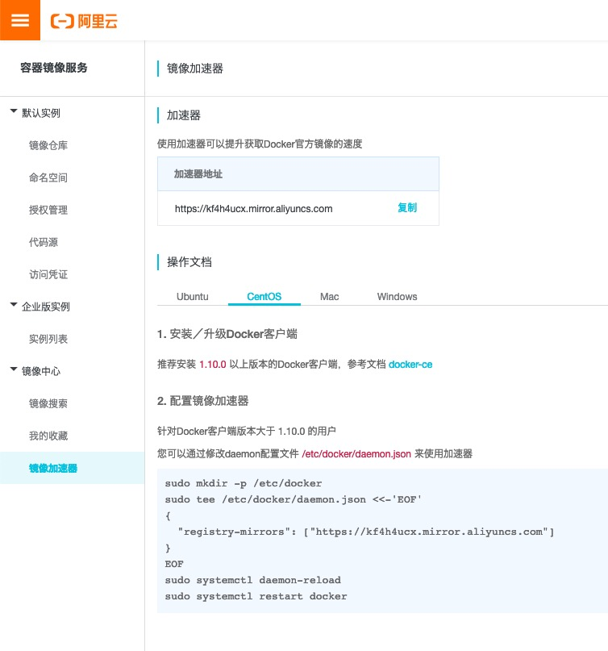
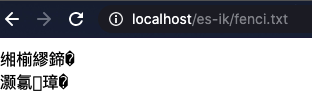
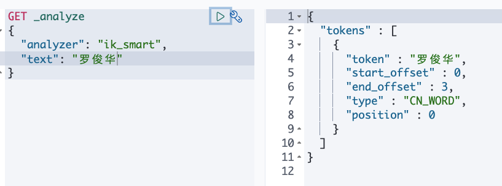
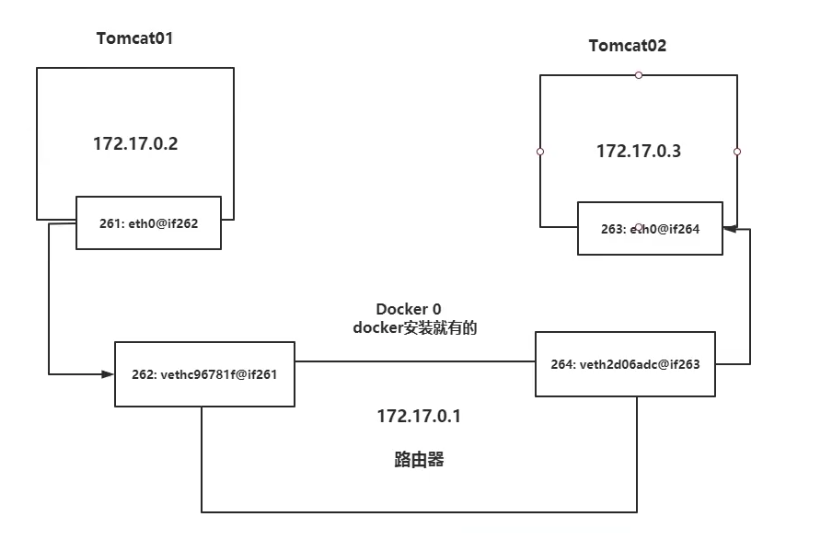
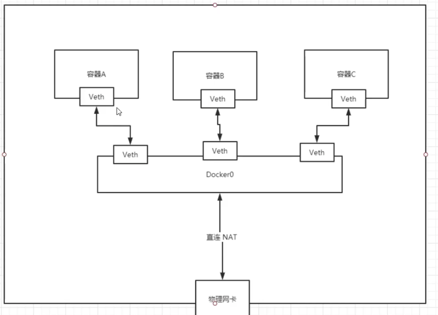
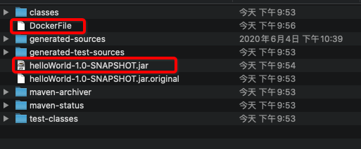
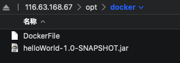
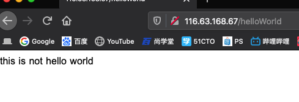

# Docker

### 1. 安装

[docker官方下载地址 ](https://download.docker.com/linux/static/stable/x86_64/ )

[Docker Engine - CentOS(Community)](https://hub.docker.com/editions/community/docker-ce-server-centos)

[官方安装教程（我用的是二进制安装）](https://docs.docker.com/engine/install/binaries/)

下载名称类似于docker-19.03.9.tgz （弃用）

```shell
[root@cent-luo docker]# yum install -y containerd.io
[root@cent-luo docker]# yum install docker-ce-cli
[root@cent-luo docker]# yum install docker-ce
```

错误解决

[docker的所有rpm包都在这里](https://download.docker.com/linux/centos/7/x86_64/stable/Packages/)

[rpm包的根目录，可以手动找](https://download.docker.com/)

```shell

[root@cent-luo docker]# yum install docker-ce                                         
Repository AppStream is listed more than once in the configuration
Repository extras is listed more than once in the configuration
Repository PowerTools is listed more than once in the configuration
Repository centosplus is listed more than once in the configuration
Last metadata expiration check: 0:03:11 ago on Sat 18 Jul 2020 03:05:46 AM CST.
Error: 	# 安装时containerd.io版本过低
 Problem: package docker-ce-3:19.03.12-3.el7.x86_64 requires containerd.io >= 1.2.2-3,
 but none of the providers can be installed
  - cannot install the best candidate for the job
  - package containerd.io-1.2.10-3.2.el7.x86_64 is filtered out by modular filtering
  - package containerd.io-1.2.13-3.1.el7.x86_64 is filtered out by modular filtering
  - package containerd.io-1.2.13-3.2.el7.x86_64 is filtered out by modular filtering
  - package containerd.io-1.2.2-3.3.el7.x86_64 is filtered out by modular filtering
  - package containerd.io-1.2.2-3.el7.x86_64 is filtered out by modular filtering
  - package containerd.io-1.2.4-3.1.el7.x86_64 is filtered out by modular filtering
  - package containerd.io-1.2.5-3.1.el7.x86_64 is filtered out by modular filtering
  - package containerd.io-1.2.6-3.3.el7.x86_64 is filtered out by modular filtering
  - package containerd.io-1.2.11-3.2.el7.x86_64 is filtered out by modular filtering
  - package containerd.io-1.2.12-3.1.el7.x86_64 is filtered out by modular filtering
  - package containerd.io-1.2.6-3.2.el7.x86_64 is filtered out by modular filtering
(try to add '--skip-broken' to skip uninstallable packages or '--nobest' to use not on
ly best candidate packages)

# 先查询
[root@cent-luo docker]# rpm -qa containerd.io                                         
containerd.io-1.2.0-3.el7.x86_64 # 的确是版本太低

#卸载
[root@cent-luo docker]# rpm -e containerd.io 

# 发现是阿里yum的containerd.io版本太低
[root@cent-luo docker]# yum list |grep containerd.io                                  
Repository AppStream is listed more than once in the configuration                    
Repository extras is listed more than once in the configuration
Repository PowerTools is listed more than once in the configuration
Repository centosplus is listed more than once in the configuration
containerd.io.x86_64                                 1.2.0-3.el7                      
                docker-ce-stable 
containerd.io.x86_64                                 1.2.0-3.el7                      
                docker-ce-test  

# 手动安装高版本containerd.io
yum install https://download.docker.com/linux/fedora/30/x86_64/stable/Packages/containerd.io-1.2.6-3.3.fc30.x86_64.rpm                
```

https://download.docker.com/linux/fedora/30/x86_64/stable/Packages/ 到这里下载三个安装包

**下载完成之后，直接使用yum安装**

```shell
[root@RabbitMQ_1 docker]# yum install -y ./containerd.io-1.2.6-3.3.el7.x86_64.rpm ./docker-ce-19.03.9-3.el7.x86_64.rpm ./docker-ce-cli-19.03.9-3.el7.x86_64.rpm 

# 设置开机启动docker
systemctl enable docker
```


**我的专属镜像加速器地址   https://kf4h4ucx.mirror.aliyuncs.com**

[阿里镜像加速器网址](https://cr.console.aliyun.com/cn-hangzhou/instances/mirrors)




### 2. 设置默认的远程仓库是阿里云

```shell
[root@cent-luo /]# mkdir /etc/docker/
[root@cent-luo /]# vi /etc/docker/daemon.json
[root@cent-luo /]# cat /etc/docker/daemon.json                                        
# 网址是我的私有仓库地址
{
  "registry-mirrors": ["https://kf4h4ucx.mirror.aliyuncs.com"]
}
[root@cent-luo /]# systemctl daemon-reload
[root@cent-luo /]# systemctl restart docker
[root@cent-luo /]# systemctl status docker
● docker.service - Docker Application Container Engine
   Loaded: loaded (/usr/lib/systemd/system/docker.service; disabled; vendor preset: d>
   Active: active (running) since Sat 2020-07-18 03:57:32 CST; 10s ago
     Docs: https://docs.docker.com
 Main PID: 15096 (dockerd)
    Tasks: 13
   Memory: 45.2M
   CGroup: /system.slice/docker.service
           └─15096 /usr/bin/dockerd -H fd:// --containerd=/run/containerd/containerd.>

```

新版本的配置方式

```shell
sudo mkdir -p /etc/docker
sudo tee /etc/docker/daemon.json <<-'EOF'
{
  "registry-mirrors": [
  "https://kf4h4ucx.mirror.aliyuncs.com",
	"http://hub-mirror.c.163.com",
	"https://docker.mirrors.ustc.edu.cn",	
	"https://docker.mirrors.ustc.edu.cn"
]
}
EOF
sudo systemctl daemon-reload
sudo systemctl restart docker
```


### 3. 运行第一个镜像

```shell
[root@cent-luo /]# docker run hello-world                                             
Unable to find image 'hello-world:latest' locally	# 本地没有这个镜像
latest: Pulling from library/hello-world					# 从远程仓库中拉取一个镜像，并在容器中运行
0e03bdcc26d7: Pull complete                                                           
Digest: sha256:49a1c8800c94df04e9658809b006fd8a686cab8028d33cfba2cc049724254202
Status: Downloaded newer image for hello-world:latest

Hello from Docker!
This message shows that your installation appears to be working correctly.

To generate this message, Docker took the following steps:
 1. The Docker client contacted the Docker daemon.
 2. The Docker daemon pulled the "hello-world" image from the Docker Hub.
    (amd64)
 3. The Docker daemon created a new container from that image which runs the
    executable that produces the output you are currently reading.
 4. The Docker daemon streamed that output to the Docker client, which sent it
    to your terminal.

To try something more ambitious, you can run an Ubuntu container with:
 $ docker run -it ubuntu bash

Share images, automate workflows, and more with a free Docker ID:
 https://hub.docker.com/

For more examples and ideas, visit:
 https://docs.docker.com/get-started/

[root@cent-luo /]# 
```

### 4. docker命令

```shell
docker info
docker version

# 列出本地所有的docker镜像
[root@cent-luo ~]# docker images
REPOSITORY          TAG                 IMAGE ID            CREATED             SIZE
hello-world         latest              bf756fb1ae65        6 months ago        13.3kB

# 列出本地所有镜像（含中间镜像层）
[root@cent-luo ~]# docker images -a                                                   
              
# 查询当前镜像的id（可以搭配-a使用 docker images -qa）              
[root@cent-luo ~]# docker images -q                                                   
bf756fb1ae65

# 显示当前镜像的摘要信息
[root@cent-luo ~]# docker images --digests
REPOSITORY          TAG                 DIGEST                                        
                            IMAGE ID            CREATED             SIZE
hello-world         latest              sha256:49a1c8800c94df04e9658809b006fd8a686cab8
028d33cfba2cc049724254202   bf756fb1ae65        6 months ago        13.3kB

# 显示镜像的完整信息
[root@cent-luo ~]# docker images --no-trunc
REPOSITORY          TAG                 IMAGE ID                                      
                            CREATED             SIZE
hello-world         latest              sha256:bf756fb1ae65adf866bd8c456593cd24beb6a0a
061dedf42b26a993176745f6b   6 months ago        13.3kB
```

#### （1）搜索镜像

```shell
# 搜索镜像，相当于在这里进行搜索 https://hub.docker.com/
[root@cent-luo ~]# docker search tomcat                                                                                     
NAME                          DESCRIPTION                                     STARS #（收藏数）               OFFICIAL#(是否为官方镜像)            AUTOMA
TED
tomcat                        Apache Tomcat is an open source implementati…   2780                [OK]                
tomee                         Apache TomEE is an all-Apache Java EE certif…   79                  [OK]                
dordoka/tomcat                Ubuntu 14.04, Oracle JDK 8 and Tomcat 8 base…   54                                      [OK]
bitnami/tomcat                Bitnami Tomcat Docker Image                     35                                      [OK]

# 使用-s参数可以筛选出 收藏数大于30的镜像
[root@cent-luo ~]# docker search -s 30  tomcat

# 显示镜像的完整信息
[root@cent-luo ~]# docker search --no-trunc tomcat

# 只列出automated build 类型的镜像。过滤出-automated=true的镜像（之前已被弃用的命令是docker search --automated tomcat）
[root@cent-luo ~]# docker search --filter=is-automated=true tomcat                                


```

#### （2）拉取镜像（下载）

```shell
# 下载最新镜像 :latest 可以省略，即（docker pull tomcat 等价于 docker pull tomcat:latest）默认下载最新版本
[root@cent-luo ~]# docker pull tomcat:latest

```

#### （3）删除镜像

```shell
# :latest 可以省略，默认删除最新
Error response from daemon: conflict: unable to remove repository reference "hello-world" (must fo
rce) - container bba1f4f75d7f is using its referenced image bf756fb1ae65	# 该镜像被其他镜像依赖，无法删除

# 使用-f参数进行强制删除
[root@cent-luo ~]# docker rmi -f hello-world
Untagged: hello-world:latest
Untagged: hello-world@sha256:49a1c8800c94df04e9658809b006fd8a686cab8028d33cfba2cc049724254202
Deleted: sha256:bf756fb1ae65adf866bd8c456593cd24beb6a0a061dedf42b26a993176745f6b

# 可以同时删除多个镜像
[root@cent-luo ~]# docker rmi -f nginx hello-world                                                

# 删除查询到的镜像（这里是删除所有镜像）,$()中的内容先执行，类似SQL子查询
[root@cent-luo ~]# docker rmi -f $(docker images -qa)                                             

```

#### （4）新建、启动、关闭容器

```shell
# 有镜像才能新建容器
# 先拉取一个centos镜像
[root@cent-luo ~]# docker pull centos                                                                                          

# -i -interactive 以交互的方式运行容器，通常与-t同时使用
# -t -terminal 为容器重新分配一个伪输入端，通常与-i。通常与-i同时使用
# 可以使用镜像的名字运行 docker run -it centos
#  /bin/bash 可以省略
[root@cent-luo ~]# docker run -it 831691599b88 /bin/bash
[root@6983357ab45b /]#		此时已经进入容器的shell终端，但是发现容器的id与镜像的id不一致，可以理解为容器的id是根据镜像生成的一个对象，容器的id就是对象的地址


# --name 为运行的容器重新起一个别名
[root@cent-luo ~]# docker run -it --name myCentOS_002 centos                                                                                     

# 这里就已经显示names，names可以当作container id 来使用
[root@cent-luo ~]# docker ps
CONTAINER ID        IMAGE               COMMAND             CREATED             STATUS              PORTS               NAMES
8986cb4d9879        centos              "/bin/bash"         28 seconds ago      Up 27 seconds                           myCentOS_002

# 退出容器，容器也随之关闭
[root@6983357ab45b /]# exit          

# ctrl + p + q 离开容器的命令行界面，容器继续运行
[root@b3f090844528 /]# [root@cent-luo ~]# 
[root@cent-luo ~]# 

# 启动已经退出的容器
[root@cent-luo ~]# docker ps -n 2                                                                                                                 
CONTAINER ID        IMAGE               COMMAND             CREATED             STATUS                   PORTS               NAMES
b3f090844528        centos              "/bin/bash"         2 minutes ago       Up 2 minutes                                 myC
	#先获取到已经退出的容器的id
8986cb4d9879        centos              "/bin/bash"         4 hours ago         Exited (0) 4 hours ago                       myCentOS_002
#再通过容器的id进行启动
[root@cent-luo ~]# docker start 8986cb4d9879
8986cb4d9879
# 发现刚才已经停止的容器8986cb4d9879，现在又重新进入up状态了
[root@cent-luo ~]# docker ps
CONTAINER ID        IMAGE               COMMAND             CREATED             STATUS              PORTS               NAMES
b3f090844528        centos              "/bin/bash"         4 minutes ago       Up 4 minutes                            myC
8986cb4d9879        centos              "/bin/bash"         4 hours ago         Up 6 seconds                            myCentOS_002

# （温柔）重启容器，通过容器的id来重启
[root@cent-luo ~]# docker restart b3f090844528                                                                                                    

# 正常关闭容器
[root@cent-luo ~]# docker stop 8986cb4d9879                                                                                                       

# 强制关闭容器
[root@cent-luo ~]# docker kill b3f090844528 

# 删除已经停止运行的容器，删除了之后，使用docker ps 也找不到这个运行过的容器了（注意区分：docker rmi containerId 是删除镜像，remove images）
[root@cent-luo ~]# docker rm 8986cb4d9879

# 使用-f 参数强制删除正在运行中的容器
[root@cent-luo ~]# docker rm -f b3f090844528

# 删除docker中的所有容器
# 方法一，使用管道+ xargs 将上一个命令的运行结果作为下一个命令的参数
[root@cent-luo ~]# docker ps -aq | xargs docker rm 
4c1083f353ea
966743ed4cfd
6983357ab45b
bba1f4f75d7f
# 方法二、使用docker自带的表达式
[root@cent-luo ~]# docker rm $(docker ps -aq)


```

#### （5）查看docker中正在运行的容器

```shell
[root@cent-luo ~]# docker ps                                                                                                                      
CONTAINER ID        IMAGE               COMMAND             CREATED             STATUS              PORTS               NAMES
6983357ab45b        centos              "/bin/bash"         11 minutes ago      Up 11 minutes                           crazy_sammet

# 查看上一个最新状态的容器
[root@cent-luo ~]# docker ps -l 

# 列出所有运行过的容器
[root@cent-luo ~]# docker ps -a

# 列出前两次运行过的容器
[root@cent-luo ~]# docker ps -n 2

# 只显示当前正在运行的容器id，可以搭配-a -n -l 等参数使用，搭配后用于只显示容器的id（不管容器是否运行）
[root@cent-luo ~]# docker ps -q

# 不截断输出信息（输出完整的docker容器信息）
[root@cent-luo ~]# docker ps --no-trunc
```

#### （6）重点操作

 ```shell
# 以-d 守护进程的方式启动容器，（这种方式启动之后使用docer ps 命令获取不到容器的id）
# 但使用docker ps -l 却可以发现是刚以守护进程启动的容器，已经退出
[root@cent-luo ~]# docker run -d centos
e65848ea0e968dce3c8b804088e3b2e283f5f9b3155ec06c5c03f827d2396319	# 返回启动容器的id
[root@cent-luo ~]# 

# 因为tomcat一直有任务需要执行，所以即使是守护进程方式启动容器，也依然会后台运行，不会退出
[root@cent-luo ~]# docker run -d tomcat                                                                                    

 ```

**重要：Docker容器后台运行，就必须有一个前台进程**

容器运行的命令如果不是哪些一致挂起的命令，如top tail -f，就是会自动退出的

这个是docker机制的问题，以nginx为例，正常情况下，我们启动服务只需要启动响应的service即可，例如 systemctl start nginx

但是，这样做，nginx为后台进程模式运行，就导致docker前台没有运行的应用。

**这样的容器后台启动后，会立即自杀，因为他觉得他没事可做了**

**所以，最佳的解决方式是，将你要运行的程序以前台进程的形式运行**

#### （7）docker日志

```shell
# -t 加入时间戳
# -f 跟随最新的日志打印（类似 tail -f）
# --tail 数字，显示最后多少条
# 查看tomcat的日志
[root@cent-luo ~]# docker logs -tail 10 -f -t 9578765fd222 

```

我的第一个shell编程

```shell
while true;
do echo hello_1;
sleep 2; # 睡眠2秒
done
```

#### （8）查看容器中的进程

```shell
[root@cent-luo ~]# docker top 9578765fd222
```

#### （9）查看容器ip地址，用json串的形式描述容器

```shell
[root@cent-luo ~]# docker inspect 3de63b827d45
```

#### （10）进入已经在运行的容器

docker attach 直接进入容器并启动命令终端，不会启动新的进程

要做什么必须在新开启的终端中再输入命令，然后执行

```shell
# 首先开启一个交互模式的容器
[root@cent-luo ~]# docker run -it centos
[root@ce7916ee16bb /]# pwd                                                                                                 
/
# ctrl + p + q 暂时退出容器命令行，此时该容器继续正常运行
[root@ce7916ee16bb /]# [root@cent-luo ~]# 

# 进入之前的容器
[root@cent-luo ~]# docker attach ce7916ee16bb
[root@ce7916ee16bb /]#  
```

#### （11）在宿主机发送命令给容器执行

docker exec 是在容器中打开新的终端，并且可以启动新的进程

```shell

[root@cent-luo ~]# docker exec -t ce7916ee16bb ls -al /tmp    
# 这里输出的是容器 ce7916ee16bb 执行 ls -al /tmp 命令后的结果
total 36
drwxrwxrwt 7 root root 4096 Jun 11 02:35 .
drwxr-xr-x 1 root root 4096 Jul 18 13:05 ..
drwxrwxrwt 2 root root 4096 Jun 11 02:35 .ICE-unix
drwxrwxrwt 2 root root 4096 Jun 11 02:35 .Test-unix
drwxrwxrwt 2 root root 4096 Jun 11 02:35 .X11-unix
drwxrwxrwt 2 root root 4096 Jun 11 02:35 .XIM-unix
drwxrwxrwt 2 root root 4096 Jun 11 02:35 .font-unix
-rwx------ 1 root root 1379 Jun 11 02:35 ks-script-585nin8f
-rwx------ 1 root root  671 Jun 11 02:35 ks-script-z6zw_bhq

# 同时docker exec 还支持进入docker命令行（这就是attach的功能）
[root@cent-luo ~]# docker exec -it ce7916ee16bb /bin/bash
[root@ce7916ee16bb /]# 

# 这样少了i 是错误的，进入容器之后不可以交互 -i interactive ；按啥键都没反应 
[root@cent-luo ~]# docker exec -t ce7916ee16bb /bin/bash
```

#### （12）将容器中的数据拷贝到物理机上

```shell
# 将容器ce7916ee16bb 的 /root/data.log 文件拷贝到物理机的 /home 目录下
# docker cp 容器名：要拷贝的文件在容器里面的路径       要拷贝到宿主机的相应路径 
[root@cent-luo ~]# docker cp ce7916ee16bb:/root/data.log /home                                                             
[root@cent-luo ~]# cat /home/data.log  
this is an important data

# 把物理机上的文件拷贝到容器中
# docker cp 要拷贝的文件路径 容器名：要拷贝到容器里面对应的路径
# 这样会把物理机的 mysql/文件夹及其之下的所有文件拷贝到容器的 /etc/目录下
luo@luodeMBP javaEE % docker cp /Volumes/extend/docker_public_file_mapping/cancal/mysql/ mysql-cancal:/etc/
```

#### （13）启动容器的时候进行端口映射

```shell
# -p 物理机端口:容器端口
# 如果不加 -it 交互模式，则无法使用ctrl + p + q 来退出当前容器
[root@cent-luo ~]# docker run -it -p 80:8080 tomcat 

# -P 是随机分配物理机的端口映射tomcat的8080端口
[root@cent-luo ~]# docker run -it -P tomcat
```

#### （14）根据正在运行的容器生成自定义镜像

```shell
# -a="作者"
# -m="镜像说明"
# my-images/first-img:0.0.1 为命名空间:版本
[root@cent-luo ~]# docker commit -a="luoJun" -m="tomcat without docs" 87b66e3d5c82 my-images/first-img:0.0.1

# 运行刚自定义生成的镜像（不能省略版本号，因为docker不知道:latest对应的版本是什么）
[root@cent-luo ~]# docker run -it -P my-images/first-img:0.0.1 
```

#### （15）映射 物理机与容器的文件夹

```shell
# -v 物理机要映射的文件夹:/映射在容器的位置 （中间没有空格）
# -v /my-data-volum:/host-data-mapping 
# 如果物理机没有这个文件夹，则docker会自动创建
[root@cent-luo ~]# docker run -it -v /my-data-volum:/host-data-mapping centos

# 可以使用进行查看
# 新版本的Docker把volumes 信息放在了Mounts的json字符串里
[root@cent-luo my-data-volum]# docker inspect 318f9aa5a0c7
"HostConfig": {
            "Binds": [
                "/my-data-volum:/host-data-mapping"
            ],
            
        "Mounts": [
            {
                "Type": "bind",
                "Source": "/my-data-volum",
                "Destination": "/host-data-mapping",
                "Mode": "",
                "RW": true,		# 可读，可写
                "Propagation": "rprivate"
            }
        ],

# 将容器退出之后	
[root@318f9aa5a0c7 host-data-mapping]# exit                                                                                
exit
[root@cent-luo my-data-volum]# docker ps
CONTAINER ID        IMAGE               COMMAND             CREATED             STATUS              PORTS               NAM
ES
# 再进入容器
[root@cent-luo my-data-volum]# docker start 318f9aa5a0c7
318f9aa5a0c7

# 发现容器映射物理机的文件依然还在
[root@318f9aa5a0c7 host-data-mapping]# ls
publicFile  testFile

# 容器只读物理机文件，容器无法写入文件到物理机
# :ro readOnly
[root@cent-luo my-data-volum]# docker run -it -v /my-data-volum/:/dev/publicFile:ro centos                                 


# 在物理机和容器的路径最后都指定的是文件而不是文件夹，就能只映射这个文件，而忽略该文件夹下的其他文件
luo@luodeMacBook-Pro ~ % docker run -d --name mysql-cancal -v /Volumes/extend/docker_public_file_mapping/cancal/mysql/my.cnf:/etc/mysql/my.cnf:ro -p 12345:3306 -e MYSQL_ROOT_PASSWORD=123456 mysql:5.7
```

#### （16）dockerFile

```shell
# -f 代表，以文件(dockerFile)的形式构建镜像
# -t 代表，生成镜像的命名空间
# ./ 最末尾的./ 代表生成镜像的存放位置
[root@cent-luo opt]# docker build -f ./dockerFile -t my-images/i-build-it ./

# 查看容器数据卷映射到物理机的那一个文件夹中
[root@cent-luo opt]# docker inspect 28995a447a7f
 "Mounts": [
            {
                "Type": "volume",
                "Name": "d9d06944bf2ecd609afce95787eca4f9c35c0aed2c6c2a607171e640f9e8b125",
                # 数据卷映射的物理机位置
                "Source": 	"/var/lib/docker/volumes/d9d06944bf2ecd609afce95787eca4f9c35c0aed2c6c2a607171e640f9e8b125/_data",
                "Destination": "/dataVolumneContainer2",
                "Driver": "local",
                "Mode": "",
                "RW": true,
                "Propagation": ""
            },
            {
                "Type": "volume",
                "Name": "11c12031762cd73036b56aadfcd328cc1a7f8b5ada4d80813ac092589937db77",
                # 数据卷映射的物理机位置
                "Source": "/var/lib/docker/volumes/11c12031762cd73036b56aadfcd328cc1a7f8b5ada4d80813ac092589937db77/_data",
                "Destination": "/dataVolumneContainer1",
                "Driver": "local",
                "Mode": "",
                "RW": true,
                "Propagation": ""
            }
        ],
```

我写的第一dockerFile

```shell
# FROM 当前镜像的父类镜像
FROM centos 
# 因为dockerFile出于移植性考虑，没有像 docker run -v /物理机文件夹:/容器文件夹 containerId 这样映射容器数据卷到特定的物理机文件夹
# 所以只会在容器中创建这两个文件夹，绑定在随机的物理机文件夹中。可以使用docker inspect containerId 查看
VOLUME ["/dataVolumneContainer1","/dataVolumneContainer2"]
CMD echo "finished,-------success1"
CMD /bin/bash

# 上述dockerFile执行之后，相当于在物理机执行了如下命令
# 但是不完全相同，没有绑定文件夹映射
# docker run -v /unknownHostFile1:/dataVolumneContainer1 -v /unknownHostFile2:/dataVolumneContainer2 centos /bin/bash
```

docker挂载主机目录后出现 cannot open diractory .: Permission denied

解决办法：在挂载目录后多加一个 --privileged=true 参数即可

即： **docker run -it --privileged=true customizedCentos**

#### （17）容器之间的数据共享

前提全都是通过同一个镜像生成的容器，这个镜像已经经过自定义，且拥有了数据卷

```shell
# 先创建一个父类容器，这个父类容器是之前自定义的，有两个数据卷，名叫 /dataVolumneContainer1 /dataVolumneContainer2
# 父类容器名为 dc01 ，为了方便
[root@cent-luo _data]# docker run -it --name dc01 my-images/i-build-it                                                     
[root@5fb9fc9a8aa5 /]#

# 可以在父类容器的数据卷中写入数据
[root@5fb9fc9a8aa5 dataVolumneContainer1]# echo update by dc01 >> createdByDc01 

# 创建一个容器，数据卷继承自父类容器dc01
# --volumes-from dc01 继承来自dc01 的数据卷
[root@cent-luo _data]# docker run -it --name dc02 --volumes-from dc01 my-images/i-build-it

# 在dc02 中可以读写dc01的数据
[root@70f06151c5de dataVolumneContainer1]# cat createdByDc01 
update by dc01

# 此时如果创建一个容器数据卷继承自dc01，则dc01 dc02 dc03 之间的数据卷都是共享的
[root@cent-luo _data]# docker run -it --name dc03 --volumes-from dc01 my-images/i-build-it                                 

# 任意父子之间、子子之间数据都是共享的


# 当父容器dc01 关闭
[root@cent-luo _data]# docker attach dc01                                                                                  
[root@5fb9fc9a8aa5 dataVolumneContainer1]# exit                                                                            
exit

# 在dc02中的数据卷中新建文件
[root@70f06151c5de dataVolumneContainer1]# echo hello >> updateByDc02

# 登陆到dc03
[root@cent-luo _data]# docker attach dc03                                                                                  
[root@e433cef75031 dataVolumneContainer1]# ls                                                                              
createdByDc01  createdByDc03  updateByDc02
# 发现dc02更新的数据，已经同步到了dc03中
[root@e433cef75031 dataVolumneContainer1]# cat updateByDc02 
hello
[root@e433cef75031 dataVolumneContainer1]# 

# 使用docker inspect命令查看之后发现两个容器映射的物理机文件位置都一样
[root@cent-luo _data]# docker inspect dc02
        "Mounts": [
            {
                "Type": "volume",
                "Name": "b1004faa2773a94208972806935adf9dd04010f2c4bbff307e00e3687190ec28",
                "Source": "/var/lib/docker/volumes/b1004faa2773a94208972806935adf9dd04010f2c4bbff307e00e3687190ec28/_data",
                "Destination": "/dataVolumneContainer2",
                "Driver": "local",
                "Mode": "",
                "RW": true,
                "Propagation": ""
            },
            {
                "Type": "volume",
                "Name": "8dbcec78d4868a62253d64ed3790f87ceb9652c10ef74e51add36df0c7db7a59",
                "Source": "/var/lib/docker/volumes/8dbcec78d4868a62253d64ed3790f87ceb9652c10ef74e51add36df0c7db7a59/_data",
                "Destination": "/dataVolumneContainer1",
                "Driver": "local",
                "Mode": "",
                "RW": true,
                "Propagation": ""
            }
        ],
[root@cent-luo _data]# docker inspect dc03
        "Mounts": [
            {
                "Type": "volume",
                "Name": "b1004faa2773a94208972806935adf9dd04010f2c4bbff307e00e3687190ec28",
                "Source": "/var/lib/docker/volumes/b1004faa2773a94208972806935adf9dd04010f2c4bbff307e00e3687190ec28/_data",
                "Destination": "/dataVolumneContainer2",
                "Driver": "local",
                "Mode": "",
                "RW": true,
                "Propagation": ""
            },
            {
                "Type": "volume",
                "Name": "8dbcec78d4868a62253d64ed3790f87ceb9652c10ef74e51add36df0c7db7a59",
                "Source": "/var/lib/docker/volumes/8dbcec78d4868a62253d64ed3790f87ceb9652c10ef74e51add36df0c7db7a59/_data",
                "Destination": "/dataVolumneContainer1",
                "Driver": "local",
                "Mode": "",
                "RW": true,
                "Propagation": ""
            }
        ],
```

**结论：因为所有继承自同一父类的所有容器的数据卷映射的物理机位置都一致，所以数据可以在继承中传递，即使只剩一台容器运行，数据卷也依旧存放在物理机上**

**因为共享物理机的映射，所以数据可以传递**

**容器之间的配置信息传递，数据卷的生命周期一直持续到没有容器使用它位置** ，所有的子容器及父容器关闭之后，物理机上的数据卷才会被删除

#### （18）启动docker时，自动启动容器

```shell
docker update mysql_1 --restart=always

# 关闭自动启动
# no -  容器退出时，不重启容器；
# on-failure - 只有在非0状态退出时才从新启动容器；
# always - 无论退出状态是如何，都重启容器；
docker update mysql_1 --restart=no

```

#### （19）Docker将容器打包成镜像

 docker commit :从容器创建一个新的镜像。

```
docker commit [OPTIONS] CONTAINER [REPOSITORY[:TAG]]
1
```

OPTIONS说明：

* -a :提交的镜像作者；
* -c :使用Dockerfile指令来创建镜像；
* -m :提交时的说明文字；
* -p :在commit时，将容器暂停。

例1

```
docker commit -a "runoob.com" -m "my apache" a404c6c174a2  mymysql:v1 
1
```

例2

```
docker commit -m  ""   -a  ""   [CONTAINER ID]  [给新的镜像命名]

docker commit -m  ""   -a  "" aa myelasticsearch:1.0
```


### 5. dockerFile

```shell
# scratch是所有镜像的祖先（类似java中的Object类）
FROM scratch
MAINTAINER The CentOS Project <cloud-ops@centos.org>
ADD c68-docker.tar.xz /
LABEL name="CentOS Base Image" \		# 添加一些标签，说明
    vendor="CentOS" \
    license="GPLv2" \
    build-date="2016-06-02"

# Default command 
CMD ["/bin/bash"] # 有了这个之后 docker run -it centos /bin/bash 的 /bin/bash 就可以省略了

```

####  （1）dockerFile文件编写规则

1. 每条保留字指令必须为全部大写，且后面至少要跟随一个参数
2. 每条指令都会创建一个新的镜像层，并对镜像进行提交

#### （2） docker 执行dockerFile的大致流程

1. docker 从基础镜像运行一个容器（必须有基础镜像容器）
2. 执行一条指令并对容器作出修改
3. 执行类似docker commit 的操作提交一个新的镜像层
4. docker再基于刚才提交的镜像运行一个新的容器
5. 执行dockerFile 中的下一条指令，直到所有的指令执行完成

#### （3）dockerFile的保留字指令

| 指令       | 功能                                                         |
| ---------- | ------------------------------------------------------------ |
| FROM       | 基础镜像。当前新镜像是基于哪一个镜像的                       |
| MAINTAINER | 镜像维护者的姓名和邮箱地址                                   |
| RUN        | 令对Docker容器（ container）造成的改变是会被反映到创建的Docker镜像上的。一个Dockerfile中可以有许多个RUN命令。 |
| EXPOSE     | 当前容器对外暴露出的端口                                     |
| WORKDIR    | 指定在创建容器之后，终端默认登陆的进来的工作目录，一个落脚点（默认是/根目录） |
| ENV        | ENV MY_PATH /usr/mytest 这个环境变量可以在后续的任何RUN指令中使用，这就如同在指令面前制定了环境变量前缀一样；也可以在其他指令中直接使用这些环境变量。比如 WORKDIR $MY_PATH |
| COPY       | 类似ADD，拷贝文件和目录到镜像中，将从构建上下文目录中<源路径>的文件/目录复制到新一层镜像内的<目标路径>位置。COPY srcPath destPath 或者 COPY ['src","dest'] |
| ADD        | 将物理机下的文件拷贝进镜像，且ADD指令会自动处理URL解压tar压缩包 |
| VOLUME     | 容器数据卷，用于数据保存和持久化工作。VOLUME ["/dataVolumneContainer1","/dataVolumneContainer2"] |
|CMD|指定一个容器启动时需要运行的命令。dockerFile中可以有多个CMD指令，但只有最后一个会生效。CMD会被docker run 之后的参数替代。例如 docker run -it centos /bin/bash ，被/bin/bash替代。|
|ENTRYPOINT|指定一个容器启动时需要运行的命令。ENTRYPOINT的目的和CMD一样，都是在指定容器启动程序及参数。但是ENTRYPONIT的后一条命令不会覆盖前一条命令|
|ONBUILD|当构建一个被继承的DockerFile运行指令时，父镜像在被子镜像继承后，父镜像的onbuild触发。一旦有子镜像继承本镜像，则ONBUILD中的指令会被触发|
|USER|指定那个组的那个用户id才能运行这个dockerFile|

**CMD容器启动指令**

CMD指令的格式和RUN相似

| shell格式    | CMD <命令>                                                   |
| ------------ | ------------------------------------------------------------ |
| Exec 格式    | CMD ["可执行文件","参数一","参数二",...]                     |
| 参数列表格式 | CMD ["参数一","参数二",...]，在指定了 ENTRYPOINT 之后，用CMD指定具体的参数 |


#### （4）dockerFile实战

```shell
FROM centos
MAINTAINER luoJunHua<1007052116@qq.com>
ENV myPath /opt
WORKDIR $myPath

RUN yum install -y vim
RUN yum install -y net-tools 
# 支持ifconfig，不加 -y 自动确认，yum会返回代码1，导致docker构建失败

EXPOSE 80
CMD echo $myPath
CMD echo "success        [OK]"
CMD /bin/bash
```

构建镜像

```shell
# 将上面的内容粘贴到 secondDockerFile 中
[root@cent-luo opt]# vi secondDockerFile 

[root@cent-luo opt]# docker build -f ./secondDockerFile -t my-images/centos-with-vim-ifconfig:0.0.1 ./                                                       

# 查看镜像构建的历史
[root@cent-luo opt]# docker history 869ed41e8654
IMAGE               CREATED              CREATED BY                                      SIZE                COMMENT
869ed41e8654        About a minute ago   /bin/sh -c #(nop)  CMD ["/bin/sh" "-c" "/bin…   0B                  
4175efb71b5d        About a minute ago   /bin/sh -c #(nop)  CMD ["/bin/sh" "-c" "echo…   0B                  
f9d655c40ef8        About a minute ago   /bin/sh -c #(nop)  CMD ["/bin/sh" "-c" "echo…   0B                  
b510e5e42ebd        About a minute ago   /bin/sh -c #(nop)  EXPOSE 80                    0B                  
46911201c665        About a minute ago   /bin/sh -c yum install -y net-tools             22.8MB              
7da2c8c87af5        About a minute ago   /bin/sh -c yum install -y vim                   57.2MB              
02617f28b329        2 minutes ago        /bin/sh -c #(nop) WORKDIR /opt                  0B                  
1cdbd667ddf8        2 minutes ago        /bin/sh -c #(nop)  ENV myPath=/opt              0B                  
ff1da29b6bd7        2 minutes ago        /bin/sh -c #(nop)  MAINTAINER luoJunHua<1007…   0B                  
831691599b88        4 weeks ago          /bin/sh -c #(nop)  CMD ["/bin/bash"]            0B                  
<missing>           4 weeks ago          /bin/sh -c #(nop)  LABEL org.label-schema.sc…   0B                  
<missing>           4 weeks ago          /bin/sh -c #(nop) ADD file:84700c11fcc969ac0…   215MB   
```

#### （5）详解CMD指令

```shell
# 这样并不会启动tomcat
[root@cent-luo opt]# docker run -it -p 80:8080 tomcat ls -al                                                                                                 

# 因为tomcat的dockerFile中描述了
FROM openjdk:14-jdk-oracle
ENV CATALINA_HOME /usr/local/tomcat
ENV PATH $CATALINA_HOME/bin:$PATH
RUN mkdir -p "$CATALINA_HOME"
WORKDIR $CATALINA_HOME # 规定工作目录，catalina.sh 可以不添加路径，直接运行
# ...
EXPOSE 8080
CMD ["catalina.sh", "run"]

# ls -al 会将dockerFile中的 CMD ["catalina.sh", "run"] 命令覆盖，所以tomcat不会启动
```

#### （6）详解ENTRYPOINT

**docker run 之后的参数会被当作参数传递给ENTRYPOINT，之后形成新的命令组合**

```shell
FROM centos
RUN yum install -y curl
CMD ["curl","-s","http://www.baidu.com"]  # 注意：命令需要用 双引号括起来，不能使用单引号，不然会提示命令找不到

# 使用CMD构建好镜像之后，容器开启之后自动执行 curl -s http://www.baidu.com
[root@cent-luo opt]# docker run  centos-curl-by-cmd                                                                                                          
<!DOCTYPE html> # 后续结果省略
[root@cent-luo opt]#

# 但是如果想在 curl -s http://www.baidu.com 的基础上添加 -i 参数（-i用于显示返回的 http 的响应头）
# 即 curl -s -i http://www.baidu.com
# 则会报错
[root@cent-luo opt]# docker run  centos-curl-by-cmd -i
ERRO[0000] error waiting for container: context canceled 

# 因为这是使用 CMD ["curl","-s","http://www.baidu.com"] 命令构建的镜像，
# docker run  centos-curl-by-cmd -i 中的 -i 参数会将上面的 CMD命令覆盖
# 也就是说容器指定的命令是只有参数的 -i，当然会报错
```

**使用ENTRYPOINT方式构建镜像**

```shell
FROM centos
RUN yum install -y curl
ENTRYPOINT ["curl","-s","http://www.baidu.com"]

# 构建镜像
[root@cent-luo opt]# docker build -f ./dockerFile-ENTRYPOINT centos-curl-by-entrypoint ./

# 使用ENTRYPOINT 构建的镜像既可以有正常的命令执行
[root@cent-luo opt]# docker run centos-curl-by-entrypoint
<!DOCTYPE html>

# 又能在ENTRYPOINT ["curl","-s","http://www.baidu.com"]的基础上添加 -i 参数
# 最终容器收到的命令时 curl -s -i http://www.baidu.com
[root@cent-luo opt]# docker run centos-curl-by-entrypoint -i
HTTP/1.1 200 OK # -i 参数返回的http响应头
<!DOCTYPE html> # -s 返回的http响应
```

#### （7）ONBUILD 详解

```shell
FROM centos
ONBUILD RUN echo "我是父镜像，我被继承了"

# 构建父容器，父容器的名字时centos-onbuild
[root@cent-luo opt]# docker build -f ./dockerFile-onbuild -t centos-onbuild ./                                                                               
Sending build context to Docker daemon  8.192kB
Step 1/2 : FROM centos
 ---> 831691599b88
Step 2/2 : ONBUILD RUN echo "我是父镜像，我被继承了"	# 只是到这个步骤，但echo命令并未执行
 ---> Running in 90bb69f8dd0f
Removing intermediate container 90bb69f8dd0f
 ---> 73ad3cbfc142
Successfully built 73ad3cbfc142
Successfully tagged centos-onbuild:latest
[root@cent-luo opt]# 

# 查看子镜像的dockerFile
[root@cent-luo opt]# cat dockerFile-onbuild-son 
FROM centos-onbuild # 继承自父镜像

# 用子镜像的dockerFile构建子镜像
[root@cent-luo opt]# docker build -f dockerFile-onbuild-son -t centos-onbuild-con ./                                                                         
Sending build context to Docker daemon  9.216kB
Step 1/1 : FROM centos-onbuild
# Executing 1 build trigger
 ---> Running in 1f52e905d402 
我是父镜像，我被继承了 # 父镜像 centos-onbuild 的ONBUILD被子镜像在构建的时候执行了
Removing intermediate container 1f52e905d402
 ---> b98915afecc1
Successfully built b98915afecc1
Successfully tagged centos-onbuild-con:latest
```

#### （8）ADD与COPY

```shell
FROM centos
MAINTAINER luo<1007052116@qq.com>

# 把物理机当前上下文的 c.txt 拷贝到容器 /usr/local/路径下
COPY c.txt /usr/local/container.txt

# 把 java与tomcat添加到容器中（ADD命令自带解压功能）
ADD jdk-8u251-linux-x64.tar.gz /usr/local/
ADD apache-tomcat-7.0.105.tar.gz /usr/local/

# 安装 vim编辑器
RUN yum install -y vim

# 设置工作访问的时候WORKDIR路径，登陆后的落脚点
ENV myPath /usr/local/
WORKDIR $myPath

# 配置java 与tomcat的环境变量
ENV JAVA_HOME /usr/local/jdk1.8.0_251/
ENV CLASSPATH $JAVA_HOME/lib/dt.jar:$JAVA_HOME/lib/tools.jar

ENV CATALINA_HOME /usr/local/apache-tomcat-7.0.105/
ENV CATALINA_BASE /usr/local/apache-tomcat-7.0.105/

ENV PATH $PATH:$JAVA_HOME/bin:$CATALINA_HOME/lib:$CATALINA_HOME/bin

# 容器运行时监听的端口
EXPOSE 8080

# 启动时运行tomcat
# ENTRYPOINT ["/usr/local/apache-tomcat-7.0.105/bin/startup.sh"]
# CMD ["/usr/local/apache-tomcat-7.0.105/bin/startup.sh", "RUN"]

CMD /usr/local/apache-tomcat-7.0.105/bin/startup.sh && tail -f $CATALINA_HOME/logs/catalina.out

```

#### （9）构建镜像并运行

在Dockerfile同级目录下添加一个 `.dockerignore` 文件。

在 `.dockerignore `中添加需要忽略的文件或者文件夹即可

```shell
[root@cent-luo tomcat]# ll                                                                                                                                   
total 200000
-rw-r--r-- 1 root root   9651307 Jul  2 21:03 apache-tomcat-7.0.105.tar.gz
-rw-r--r-- 1 root root        24 Jul 19 18:34 c.txt
-rw-r--r-- 1 root root      1084 Jul 19 18:37 dockerFile
-rwxr-xr-x 1 root root 195132576 Jul 19 18:24 jdk-8u251-linux-x64.tar.gz
# 构建镜像，注意这会发送当前文件夹下的所有文件到docker daemon
[root@cent-luo tomcat]# docker build -f ./dockerFile -t my-tomcat ./

# 运行，因为是CMD执行命令，所以不可以加/bin/bash，加了，tomcat无法自动启动
[root@cent-luo tomcat]# docker run -it -p 80:8080 -v /opt/webapps:/usr/local/apache-tomcat-7.0.105/webapps/ -v /opt/tomcat-logs:/usr/local/apache-tomcat-7.0.105/logs --privileged=true  my-tomcat

# 文件拷贝正常
[root@852e6b33fa37 local]# cat container.txt 
hello,copy into images.

# 因为做了文件映射，只需要将网页放在物理机的/opt/webapps/ROOT/目录下即可
# 不能直接放在/opt/webapps下
```


### 6. 运行其他镜像

#### （1）运行mysql镜像

```shell
# 运行mysql
# 这里指定了密码之后，就是mysql root账号的登陆密码
# -e MYSQL_ROOT_PASSWORD=123456
[root@cent-luo ~]# docker run -p 12345:3306 --name mysql -v /opt/mysql/conf:/etc/mysql/conf.d -v /opt/mysql/logs:/logs -v /opt/mysql/data:/var/lib/mysql -e MYSQL_ROOT_PASSWORD=123456 -d mysql:5.7

[root@cent-luo ~]# docker exec -it mysql /bin/bash

root@56115c6f5667:/# mysql -uroot -p
# 密码123456

# 导出mysql中的所有数据到物理机的/opt/all-database.sql
# -p"123456" 中间没有空格
[root@cent-luo opt]# docker exec mysql sh -c 'exec mysqldump --all-databases -uroot -p"123456"' > /opt/all-database.sql                                                                                           
mysqldump: [Warning] Using a password on the command line interface can be insecure.
[root@cent-luo opt]# tail all-database.sql 

/*!40101 SET SQL_MODE=@OLD_SQL_MODE */;
/*!40014 SET FOREIGN_KEY_CHECKS=@OLD_FOREIGN_KEY_CHECKS */;
/*!40014 SET UNIQUE_CHECKS=@OLD_UNIQUE_CHECKS */;
/*!40101 SET CHARACTER_SET_CLIENT=@OLD_CHARACTER_SET_CLIENT */;
/*!40101 SET CHARACTER_SET_RESULTS=@OLD_CHARACTER_SET_RESULTS */;
/*!40101 SET COLLATION_CONNECTION=@OLD_COLLATION_CONNECTION */;
/*!40111 SET SQL_NOTES=@OLD_SQL_NOTES */;

-- Dump completed on 2020-07-19 12:55:12
[root@cent-luo opt]# 

```

```shell
# 扩展选项，这里运行的是最新版
[root@cent-luo ~]# docker run -p 12345:3306 --name mysql -v /opt/mysql/conf:/etc/mysql/conf.d -v /opt/mysql/logs:/logs -v /opt/mysql/data:/var/lib/mysql -e MYSQL_ROOT_PASSWORD=123456 -d mysql --character-set-server=utf8mb4 --collation-server=utf8mb4_unicode_ci

# 也可以直接在物理机操作mysql客户端
[root@cent-luo mysql]# docker exec -it mysql mysql -uroot -p 
```

授权`mysql`远程登陆

```shell
use mysql
alter user 'root'@'%' identified by '123456';

# 授权
grant all privileges on *.* to 'root'@'%' identified by '@wjb13191835106';

# 刷新授权
flush privileges; 

# 关闭授权
revoke all on *.* from dba@localhost;
```


#### （2）运行redis镜像

**修改redis.conf**

```shell
注释
# bind 127.0.0.1
protected-mode no

```

```shell
# 先将redis.conf 放入物理机的/opt/redis/conf/中

# --appendonly yes 开启持久化
[root@cent-luo conf]# docker run -p 10000:6379 -v /opt/redis/data:/data -v /opt/redis/conf/:/usr/local/etc/redis/ --name redis -d redis redis-server /usr/local/etc/redis/redis.conf --appendonly yes

# 直接在物理机上就可以使用redis的客户端
[root@cent-luo conf]# docker exec -it redis redis-cli                                                    
127.0.0.1:6379> 
```


#### （3）安装rabbitmq

```shell
# :management 代表是带web管理界面的
luo@luodeMacBook-Pro ~ % docker pull rabbitmq:3.8.5-management

# 运行
luo@luodeMacBook-Pro ~ % docker run  -p 5672:5672 -p 15672:15672 -d --name rabbitmq rabbitmq:3.8.5-management

# 查看配置相关
root@c8f26efd278c:/opt/rabbitmq/sbin# ./rabbitmqctl status

# 配置文件位置
/etc/rabbitmq/rabbitmq.conf
```


#### （4）安装Oracle

```shell
# 拉取镜像
[root@cent-luo ~]# docker pull absolutapps/oracle-12c-ee

# 创建容器
[root@cent-luo ~]# docker create --name oracle -p 1521:1521  absolutapps/oracle-12c-ee                     
# 启动oracle的同时，查看启动日志
# 初始化过程比较慢
[root@cent-luo ~]# docker start oracle & docker logs -f oracle
[1] 2483
oracle


ls: cannot access /u01/app/oracle/oradata/orcl: No such file or directory
No databases found in /u01/app/oracle/oradata/orcl. About to create a new database instance
Starting database listener

LSNRCTL for Linux: Version 12.1.0.2.0 - Production on 25-JUL-2020 13:33:41

Copyright (c) 1991, 2014, Oracle.  All rights reserved.

Starting /u01/app/oracle/product/12.1.0.2/dbhome_1/bin/tnslsnr: please wait...

TNSLSNR for Linux: Version 12.1.0.2.0 - Production
System parameter file is /u01/app/oracle/product/12.1.0.2/dbhome_1/network/admin/listener.ora
Log messages written to /u01/app/oracle/diag/tnslsnr/f2cd5b570b08/listener/alert/log.xml
Listening on: (DESCRIPTION=(ADDRESS=(PROTOCOL=tcp)(HOST=f2cd5b570b08)(PORT=1521)))

Connecting to (DESCRIPTION=(ADDRESS=(PROTOCOL=TCP)(HOST=f2cd5b570b08)(PORT=1521)))
STATUS of the LISTENER
------------------------
Alias                     LISTENER
Version                   TNSLSNR for Linux: Version 12.1.0.2.0 - Production
Start Date                25-JUL-2020 13:33:42
Uptime                    0 days 0 hr. 0 min. 0 sec
Trace Level               off
Security                  ON: Local OS Authentication
SNMP                      OFF
Listener Parameter File   /u01/app/oracle/product/12.1.0.2/dbhome_1/network/admin/listener.ora
Listener Log File         /u01/app/oracle/diag/tnslsnr/f2cd5b570b08/listener/alert/log.xml
Listening Endpoints Summary...
  (DESCRIPTION=(ADDRESS=(PROTOCOL=tcp)(HOST=f2cd5b570b08)(PORT=1521)))
The listener supports no services
The command completed successfully
Copying database files
1% complete
3% complete
11% complete
18% complete
26% complete
37% complete
Creating and starting Oracle instance
40% complete
45% complete
50% complete
55% complete
56% complete
60% complete
62% complete
Completing Database Creation
66% complete
70% complete
73% complete
85% complete
96% complete
100% complete
Look at the log file "/u01/app/oracle/cfgtoollogs/dbca/orcl/orcl.log" for further details.

LSNRCTL for Linux: Version 12.1.0.2.0 - Production on 25-JUL-2020 13:38:32

Copyright (c) 1991, 2014, Oracle.  All rights reserved.

Connecting to (DESCRIPTION=(ADDRESS=(PROTOCOL=TCP)(HOST=f2cd5b570b08)(PORT=1521)))
The command completed successfully
Database has been created in /u01/app/oracle/oradata/orcl
SYS and SYSTEM passwords are set to [oracle]
Setting HTTP port to 8080

PL/SQL procedure successfully completed.

Please login to http://<ip_address>:8080/em to use enterprise manager
User: sys; Password oracle; Sysdba: true # 不是用户名 密码
Fixing permissions...
Running init scripts...
Init scripts in /oracle.init.d/: Ignoring /oracle.init.d/*

Done with scripts we are ready to go
# 用户名 system 
# 密码 oracle

```

#### （5）安装mycat

```shell

docker pull longhronshens/mycat-docker

luo@luodeMacBook-Pro conf % docker create -p 8066:8066 -p 9066:9066 --name mycat -v /Volumes/OS/javaEE/jar/mycat/conf:/usr/local/mycat/conf longhronshens/mycat-docker
```

#### （6）安装zookeeper集群

```shell
luo@luodeMacBook-Pro zookeeperColony % docker create --name zoo1 -v /Volumes/extend/docker_public_file_mapping/zookeeper_1/:/opt -p 2181:2181 --net myNet --ip 192.168.10.11 zookeeper

luo@luodeMacBook-Pro zookeeperColony % docker create --name zoo2 -v /Volumes/extend/docker_public_file_mapping/zookeeper_1/:/opt -p 2182:2181 --net myNet --ip 192.168.10.12 zookeeper

luo@luodeMacBook-Pro zookeeperColony % docker create --name zoo3 -v /Volumes/extend/docker_public_file_mapping/zookeeper_1/:/opt -p 2183:2181 --net myNet --ip 192.168.10.13 zookeeper
```

全部共用一个zoo.cfg

```shell
# The number of milliseconds of each tick
tickTime=2000
# The number of ticks that the initial 
# synchronization phase can take
initLimit=10
# The number of ticks that can pass between 
# sending a request and getting an acknowledgement
syncLimit=5
# the directory where the snapshot is stored.
# do not use /tmp for storage, /tmp here is just 
# example sakes.
dataDir=/data/
# the port at which the clients will connect
clientPort=2181
server.1=192.168.10.11:2881:3881
server.2=192.168.10.12:2881:3881
server.3=192.168.10.13:2881:3881
```

记得配置/data/myid

```shell
# 容器内测试连接
root@a0c7c0f73858:/apache-zookeeper-3.6.1-bin# zkCli.sh -server 192.168.10.11:2181

root@a0c7c0f73858:/apache-zookeeper-3.6.1-bin# zkCli.sh -server 192.168.10.12:2181

root@a0c7c0f73858:/apache-zookeeper-3.6.1-bin# zkCli.sh -server 192.168.10.13:2181
```

此时的zookeeper是无法与物理机连接的，需要把zoo1,zoo2,zoo3 再连接到docker的默认网卡 bridge 上

```shell
# 这相当于给 zookeeper 所在的 192.168.10.0/24 网段，给所有的zookeeper容器都添加了docker的默认网卡 bridge，因为zookeeper是对容器本机的所有网卡暴露 2181端口提供服务的，物理机就能通过bridge网卡（172.17.0.0/16网段）连接zookeeper容器
docker network connect bridge zoo1
docker network connect bridge zoo2
docker network connect bridge zoo3

# 查看zoo1连接了几张网卡
docker inspect zoo1

```

这样就能使用物理机的客户端工具连接zookeeper了

```shell

luo@luodeMacBook-Pro bin % ./zkCli.sh -server 127.0.0.1:2182
```

#### （7）安装mysql+java+canal

```dockerfile
FROM mysql:5.7
MAINTAINER luo<1007052116@qq.com>

# 把 java与tomcat添加到容器中（ADD命令自带解压功能）
ADD jdk-8u251-linux-x64.tar.gz /usr/local/
ADD canal.deployer-1.1.4.tar.gz /opt/canal/

COPY my.cnf /etc/mysql

# 修改 my.cnf 的权限，如果全局可写，mysql将会忽略这个文件中的配置
RUN ["/bin/bash","-c","chmod 744 /etc/mysql/my.cnf"]

# 设置工作访问的时候WORKDIR路径，登陆后的落脚点
ENV myPath /opt/canal/bin
WORKDIR $myPath

# 配置java 与tomcat的环境变量
ENV JAVA_HOME /usr/local/jdk1.8.0_251/
ENV CLASSPATH $JAVA_HOME/lib/dt.jar:$JAVA_HOME/lib/tools.jar

ENV PATH $PATH:$JAVA_HOME/bin

# 容器运行时监听的端口
EXPOSE 3306 11111

# 启动时运行mysql，可以不写
# CMD ["mysqld"]

```

```shell
# -v 映射 my.cnf 文件可以省略
luo@luodeMacBook-Pro cancal % docker run -d --name canal  -v /Volumes/extend/docker_public_file_mapping/cancal/mysql/my.cnf:/opt/my.cnf -p 12345:3306 -p 11111:11111 -e MYSQL_ROOT_PASSWORD=123456 canal
```


#### （8）安装ElasticSearch

>   不能在mac的exfat分区上运行

```shell
luo@luodeMacBook-Pro vue-temp % docker pull elasticsearch:7.9.2

# 允许任意主机访问es
luo@luodeMacBook-Pro ~ % echo "http.host: 0.0.0.0" >>/Volumes/extend/docker_public_file_mapping/elastic_search/config/elasticsearch.yml

# 更改权限
chmod -R 777 /Volumes/extend/docker_public_file_mapping/elastic_search

luo@luodeMacBook-Pro config % docker run --name es -p 10200:9200 -p 9300:10300 \
-e "discovery.type=single-node" \
-e ES_JAVA_OPS="-Xms512m -Xmx=800m" \
-v /Volumes/extend/docker_public_file_mapping/elastic_search/config/elasticsearch.yml:/usr/share/elasticsearch/config/elasticsearch.yml \
-v /Volumes/extend/docker_public_file_mapping/elastic_search/data:/usr/share/elasticsearch/data \
-v /Volumes/extend/docker_public_file_mapping/elastic_search/plugins:/usr/share/elasticsearch/plugins \
-d elasticsearch:7.9.2

# 安装kibana
docker run --name kibana -e ELASTICSEARCH_HOSTS=http://xxx.xxx.xxx.xxx:9200 -p 5601:5601 -d kibana:7.9.2
```

linux 版本

```shell
docker run --name es -p 9200:9200 -p 9300:9300 \
-e "discovery.type=single-node" \
-e ES_JAVA_OPS="-Xms512m -Xmx=800m" \
-v /opt/elasticsearch/config/elasticsearch.yml \
-v /opt/elasticsearch/data:/usr/share/elasticsearch/data \
-v /opt/elasticsearch/plugins:/usr/share/elasticsearch/plugins \
-d elasticsearch:7.9.3
```


#### （9）安装nginx并反向代理elastic search 分词器


```shell
docker run -p 80:80 --name nginx \
> -v ~/docker/nginx-iwmake/conf:/etc/nginx \
> -v ~/docker/nginx-iwmake/html:/usr/share/nginx/html \
> -v ~/docker/nginx-iwmake/logs/:/var/logs/nginx -d nginx
```


```shell
# 运行一个临时容器
docker run --name nginx-temp -p 80:80 -d  nginx

# 将临时容器的配置文件拷贝到物理机上
docker cp nginx-temp:/etc/nginx /Volumes/extend/docker_public_file_mapping/guli_shop/nginx/

docker stop nginx-temp

docker rm nginx-temp

cd /Volumes/extend/docker_public_file_mapping/guli_shop/nginx/

docker run -p 80:80 --name nginx-mall \
-v /Volumes/extend/docker_public_file_mapping/guli_shop/nginx/html:/usr/share/nginx/html \
-v /Volumes/extend/docker_public_file_mapping/guli_shop/nginx/conf:/etc/nginx \
-v /Volumes/extend/docker_public_file_mapping/guli_shop/nginx/logs:/var/log/nginx -d nginx

docker run --name nginx -p 80:80 -v /opt/nginx/conf/:/etc/nginx -v /opt/nginx/html:/usr/share/nginx/html -v /opt/nginx/logs:/var/log/nginx -d nginx

# 访问时，若出现 403 禁止，是因为 /usr/share/nginx/html 下没有文件

# 在nginx的html目录下 为es的ik分词器创建自定义词典
luo@luodeMacBook-Pro es-ik % pwd
/Volumes/extend/docker_public_file_mapping/guli_shop/nginx/html/es-ik

# 创建自定义词典
luo@luodeMacBook-Pro es-ik % tail fenci.txt
罗俊华
尚硅谷
```


浏览器访问



设置`elastic search`中的`ik`分词器远程词典的位置

```shell
luo@luodeMacBook-Pro config % vi /Volumes/OS/environment/elasticsearch-7.9.2/plugins/ik/config/IKAnalyzer.cfg.xml
```


```xml
<?xml version="1.0" encoding="UTF-8"?>
<!DOCTYPE properties SYSTEM "http://java.sun.com/dtd/properties.dtd">
<properties>
        <comment>IK Analyzer 扩展配置</comment>
        <!--用户可以在这里配置自己的扩展字典 -->

        <entry key="ext_dict">kuangshen.dic</entry>
         <!--用户可以在这里配置自己的扩展停止词字典-->
        <entry key="ext_stopwords"></entry>
        <!--用户可以在这里配置远程扩展字典 -->
        <entry key="remote_ext_dict">http://localhost/es-ik/fenci.txt</entry>
        <!--用户可以在这里配置远程扩展停止词字典-->
        <!-- <entry key="remote_ext_stopwords">words_location</entry> -->
</properties>
```

重启`es`

```shell
# 分词信息已经加载
[2020-10-09T09:25:19,933][INFO ][o.w.a.d.Dictionary       ] [luodeMacBook-Pro.local] 罗俊华
[2020-10-09T09:25:19,933][INFO ][o.w.a.d.Dictionary       ] [luodeMacBook-Pro.local] 尚硅谷
```

分词效果



但是只有在`es`启动的时候才会加载远程词库


#### （10）安装mongoDB 和 mongo-express

> https://registry.hub.docker.com/_/mongo-express
>
> https://registry.hub.docker.com/_/mongo

```shell
# 创建一个网卡
docker network create --driver bridge --subnet 192.168.10.0/24 --gateway 192.168.10.254 myNet

# 不设置密码
# 如果要设置账号密码，可以加入以下变量
# MONGO_INITDB_ROOT_USERNAME: root
# MONGO_INITDB_ROOT_PASSWORD: example
docker run --name mongo -p 27017:27017 -d --net myNet --ip 192.168.10.10  mongo


# 其中 mongoDB的ip地址是使用 
docker inspect mongo # 看出的，以及可以看到 mongo 使用的网卡类型位 bridge
# 连接mongoDB 时也不用设置密码
docker run --net myNet --ip 192.168.10.20 -e ME_CONFIG_MONGODB_SERVER=192.168.10.10 -e MONGO_INITDB_ROOT_USERNAME='' -e MONGO_INITDB_ROOT_PASSWORD=''  -p 8081:8081 -d --name mongo-express mongo-express
Welcome to mongo-express
```


#### （11）运行jekins

```shell
sudo docker run --name jekins  -p 8080:8080 -p 50000:50000 -v jenkins_home:/var/jenkins_home jenkins/jenkins:lts-jdk11
```

#### （12）gitlab

> https://docs.gitlab.com/ee/install/docker.html

```shell
docker pull gitlab/gitlab-ce
```


### 7. 上传镜像

提交容器，生成镜像

```shell
[root@cent-luo data]# docker commit -a "luo,1007052116@qq.com" -m "redis-centos" 2c2b4c53c5c1 redis-centos:1.1 
```

[阿里云容器镜像操作步骤](https://cr.console.aliyun.com/repository/cn-qingdao/luo-centos/my-centos/details)

```shell
# 将镜像推送到Registry
# 密码是淘宝账号密码
$ sudo docker login --username=燃樱99 registry.cn-qingdao.aliyuncs.com
$ sudo docker tag [ImageId] registry.cn-qingdao.aliyuncs.com/luo-centos/my-centos:[镜像版本号]
$ sudo docker push registry.cn-qingdao.aliyuncs.com/luo-centos/my-centos:[镜像版本号]
```

```shell
[root@cent-luo data]# docker login --username=燃樱99 registry.cn-qingdao.aliyuncs.com                    
Password:                                                                                                
WARNING! Your password will be stored unencrypted in /root/.docker/config.json.
Configure a credential helper to remove this warning. See
https://docs.docker.com/engine/reference/commandline/login/#credentials-store

Login Succeeded
[root@cent-luo data]# docker images
REPOSITORY                           TAG                 IMAGE ID            CREATED             SIZE
redis-centos                         1.1                 fa9602eebc9e        16 minutes ago      104MB

[root@cent-luo data]# docker tag redis-centos:1.1 registry.cn-qingdao.aliyuncs.com/luo-centos/my-centos:1.1

[root@cent-luo data]# docker push registry.cn-qingdao.aliyuncs.com/luo-centos/my-centos:1.1
The push refers to repository [registry.cn-qingdao.aliyuncs.com/luo-centos/my-centos]

# 拉取镜像
[root@cent-luo data]# docker pull registry.cn-qingdao.aliyuncs.com/luo-centos/my-centos:1.1                                                      
1.1: Pulling from luo-centos/my-centos
```

### 8. Linux查看版本当前操作系统发行版信息            

```shell
cat /etc/issue 
# 或者
cat /etc/redhat-release  
```

### 9. 已经启动的 Docker 容器如何挂载目录？

```shell
# 修改运行容器的端口映射、文件映射
# docker默认没提供这个功能.
# 但是可以先把容器停掉, 用docker commit 创建一个新的image, 然后在运行新的image时挂载

docker stop 容器名
docker commit 容器名 新的镜像名
docker run -v "挂载" 新的镜像名

# mysql_2是一个正在运行的容器
luo@luodeMacBook-Pro ~ % docker commit -m "测试提交mysql_2" mysql_2 mysql_2_test

# 此时之前的mysql_2 容器已经被删除
luo@luodeMacBook-Pro ~ %  docker create -p 3302:3306 --name mysql_2  -v /Volumes/extend/temp/mysql_2/conf:/etc/mysql  mysql_2_test

# 因为映射之后，容器该文件夹下的内容就没有了，所以从另外一太mysql拷贝来再做修改
luo@luodeMacBook-Pro ~ % docker cp mysql_1:/etc/mysql/ /Volumes/extend/temp/mysql_2/conf
```

### 10.网络模块

```shell
# 列出所有网卡
luo@luodeMacBook-Pro ~ % docker network ls
NETWORK ID          NAME                DRIVER              SCOPE
7bcb2a586f5a        bridge              bridge              local
f3b034f1425d        host                host                local
48508a0bf3a1        none                null                local

# 查看虚拟网卡的信息
# bridge 就是默认的网卡
luo@luodeMacBook-Pro ~ % docker network inspect bridge

docker network create --subnet=192.168.1.0/24 myNetwork

# 创建docker的时候指定ip地址
luo@luodeMacBook-Pro ~ % docker create -p 3310:3306 --name mysql_10 --net myNetwork --ip 192.168.1.10 -v /Volumes/extend/temp/mysql_1/conf:/opt/ -e MYSQL_ROOT_PASSWORD=123456 mysql:5.7

# 这样指定的ip，物理机无法访问
docker network connect bridge mysql
```

### （1）容器开启时就被分配到ip

```shell
# 查看容器内部网络地址，发现启动的时候会有一个 eth0@if5 的网卡，docker为其自动分配一个ip地址
[root@cent-luo ~]# docker exec -it tomcat0 ip addr                            
1: lo: <LOOPBACK,UP,LOWER_UP> mtu 65536 qdisc noqueue state UNKNOWN group default qlen 1000
    link/loopback 00:00:00:00:00:00 brd 00:00:00:00:00:00
    inet 127.0.0.1/8 scope host lo
       valid_lft forever preferred_lft forever
4: eth0@if5: <BROADCAST,MULTICAST,UP,LOWER_UP> mtu 1500 qdisc noqueue state UP group default 
    link/ether 02:42:ac:11:00:02 brd ff:ff:ff:ff:ff:ff link-netnsid 0
    inet 172.17.0.2/16 brd 172.17.255.255 scope global eth0
       valid_lft forever preferred_lft forever
```

### （2）原理

我们每启动一个docker容器，docker就会给docker容器分配一个ip，我们只要安装了docker，就会有一个docker0桥接模式，使用的是evth-pair 技术

```shell
# 新启动一个容器之后，查看物理机的ip addr

[root@cent-luo ~]# ip addr
1: lo: <LOOPBACK,UP,LOWER_UP> mtu 65536 qdisc noqueue state UNKNOWN group default qlen 1000
    link/loopback 00:00:00:00:00:00 brd 00:00:00:00:00:00
    inet 127.0.0.1/8 scope host lo
       valid_lft forever preferred_lft forever
    inet6 ::1/128 scope host 
       valid_lft forever preferred_lft forever
2: eth0: <BROADCAST,MULTICAST,UP,LOWER_UP> mtu 1500 qdisc mq state UP group default qlen 1000
    link/ether fa:16:3e:f5:21:62 brd ff:ff:ff:ff:ff:ff
    inet 192.168.0.10/24 brd 192.168.0.255 scope global dynamic noprefixroute eth0
       valid_lft 85717sec preferred_lft 85717sec
    inet6 fe80::f816:3eff:fef5:2162/64 scope link 
       valid_lft forever preferred_lft forever
3: docker0: <BROADCAST,MULTICAST,UP,LOWER_UP> mtu 1500 qdisc noqueue state UP group default 
    link/ether 02:42:04:2b:38:b6 brd ff:ff:ff:ff:ff:ff
    inet 172.17.0.1/16 brd 172.17.255.255 scope global docker0
       valid_lft forever preferred_lft forever
    inet6 fe80::42:4ff:fe2b:38b6/64 scope link 
       valid_lft forever preferred_lft forever
# 此时多了一张网卡
5: vethc4cccbd@if4: <BROADCAST,MULTICAST,UP,LOWER_UP> mtu 1500 qdisc noqueue master docker0 state UP group default 
    link/ether a6:7d:34:a2:31:f9 brd ff:ff:ff:ff:ff:ff link-netnsid 0
    inet6 fe80::a47d:34ff:fea2:31f9/64 scope link 
       valid_lft forever preferred_lft forever
```

继续启动新容器发现，每启动一个新容器，物理机就会多出一张 veth 的网卡，都是一对对出现的

veth-pair 就是一对虚拟设备接口，他们都是成对出现的，一端连着协议，一段彼此相连

正是因为有这个特性，veth-pair 充当一个桥梁，专门连接虚拟网络设备



结论：tomcat0 ，tomcat1共用的是一个路由器，也就是docker0，所有容器不指定网络的情况下，都是由docker0进行路由的。docker会给我们的容器分配一个默认可用的ip



### （3）同一网络使用域名连接

1. 默认情况下不能使用容器名作为域名ping另一个容器

```shell
[root@cent-luo ~]# docker run -d --name tomcat1 tomcat
ac1baa9af234a17804e35e42e22503c0e7bf45f64c9a6cb940d13291b95b9e38
[root@cent-luo ~]# docker run -d --name tomcat2 tomcat            
487bd6edd0be851e6649cc90154b39388cd31b013e10d336f080c4b65f1264b3

# 默认情况下无法使用域名
[root@cent-luo ~]# docker exec -it tomcat2 ping tomcat1     
ping: tomcat1: Name or service not known
```

2. 使用 --link 连接两个容器

   不建议使用这种方式

```shell
[root@cent-luo ~]# docker run -d --name tomcat3 --link tomcat1 tomcat
8341117438c62270206cab977afcd8e27bec7606865803c1e0ec5a2bff728826

[root@cent-luo ~]# docker exec -it tomcat3 ping tomcat1
PING tomcat1 (172.17.0.2) 56(84) bytes of data.
64 bytes from tomcat1 (172.17.0.2): icmp_seq=1 ttl=64 time=0.072 ms
64 bytes from tomcat1 (172.17.0.2): icmp_seq=2 ttl=64 time=0.055 ms

# 但是不能反向ping通
[root@cent-luo ~]# docker exec -it tomcat1 ping tomcat3     
ping: tomcat3: Name or service not known

# 查看配置
[root@cent-luo ~]# docker inspect tomcat3
"HostConfig": {

            "Links": [
                "/tomcat1:/tomcat3/tomcat1"
            ],

[root@cent-luo ~]# docker inspect tomcat1
        "HostConfig": {
            "Links": null,
            
# 查看 tomcat3 的 hosts文件            
[root@cent-luo ~]# docker exec -it tomcat3 tail /etc/hosts                            
127.0.0.1       localhost
::1     localhost ip6-localhost ip6-loopback
fe00::0 ip6-localnet
ff00::0 ip6-mcastprefix
ff02::1 ip6-allnodes
ff02::2 ip6-allrouters
172.17.0.2      tomcat1 ac1baa9af234	# 有到tomcat1 的域名解析
172.17.0.4      8341117438c6	

# 但是tomcat1的hosts文件却没有指向tomcat3的域名解析
[root@cent-luo ~]# docker exec -it tomcat1 tail /etc/hosts
127.0.0.1       localhost
::1     localhost ip6-localhost ip6-loopback
fe00::0 ip6-localnet
ff00::0 ip6-mcastprefix
ff02::1 ip6-allnodes
ff02::2 ip6-allrouters
172.17.0.2      ac1baa9af234
```

结论：使用 --link 创建容器，其实就是在 /etc/hosts 文件下添加了到指定容器的映射

3. 使用自定义网络实现容器互联

```shell
# 查看所有的docker网络
[root@cent-luo ~]# docker network ls
NETWORK ID          NAME                DRIVER              SCOPE
5bb7e729b6ea        bridge              bridge              local
0d9e7d8d18e1        host                host                local
86fa9dc0fc0f        none                null                local
```

网络模式：

* bridge：桥接模式，docker0默认
* none：不配置网络
* host：和宿主机共享网络

```shell
# 创建容器时，默认是有 --net bridge 参数的
[root@cent-luo ~]# docker run -d --name tomcat1 --net bridge -P tomcat   

# docker0 特点：默认，域名不能访问，使用--link可以打通连接

# 我们可以自定义一个网络
# --driver bridge 是默认，可以省略
[root@cent-luo ~]# docker network create --driver bridge --subnet 192.168.10.0/24 --gateway 192.168.10.254 myNet

# 查看刚创建的网络
[root@cent-luo ~]# docker network inspect myNet  

# 启动一个容器，放入自定义容器
[root@cent-luo ~]# docker run -d -P --net myNet --ip 192.168.10.1 --name tomcat1 tomcat

[root@cent-luo ~]# docker run -d -P --net myNet --ip 192.168.10.2 --name tomcat2 tomcat

# 发现可以直接ping通容器的名字，而不用修改hosts文件
[root@cent-luo ~]# docker exec -it tomcat1 ping tomcat2                               
PING tomcat2 (192.168.10.2) 56(84) bytes of data.
64 bytes from tomcat2.myNet (192.168.10.2): icmp_seq=1 ttl=64 time=0.071 ms
64 bytes from tomcat2.myNet (192.168.10.2): icmp_seq=2 ttl=64 time=0.051 ms

# 反向也能ping通
[root@cent-luo ~]# docker exec -it tomcat2 ping tomcat1                               
PING tomcat1 (192.168.10.1) 56(84) bytes of data.
64 bytes from tomcat1.myNet (192.168.10.1): icmp_seq=1 ttl=64 time=0.045 ms
64 bytes from tomcat1.myNet (192.168.10.1): icmp_seq=2 ttl=64 time=0.046 ms

[root@cent-luo ~]# docker exec -it tomcat1 tail /etc/hosts                            
127.0.0.1       localhost
::1     localhost ip6-localhost ip6-loopback
fe00::0 ip6-localnet
ff00::0 ip6-mcastprefix
ff02::1 ip6-allnodes
ff02::2 ip6-allrouters
192.168.10.1    67d94dc326c2
```

我们自定义的网络，docker都已经帮我们维护好了对应的关系

* 不同的集群使用不同的网络，保证集群是安全健康的
  * mysql集群使用 192.168.10.0/24 网络
  * redis集群使用 192.168.20.0/24 网络

4. 容器的跨网络访问

```shell
# 创建一个容器，放在 docker 0 网络中 172.17.0.2
# tomcat1 和 tomcat2 都在 myNet 网络中 192.168.10.0/24
[root@cent-luo ~]# docker run -d --name mysql_1 --net bridge mysql 

# 此时发现网络 myNet 中的容器 不可以ping 通docker0中的容器
[root@cent-luo ~]# docker exec -it tomcat1 ping 172.17.0.2      
PING 172.17.0.2 (172.17.0.2) 56(84) bytes of data.

# 将容器 tomcat1 连通 docker0 （bridge）网络，发现tomcat可以ping通
[root@cent-luo ~]# docker network connect bridge  tomcat1

# 连接后不能使用容器名作为域名
[root@cent-luo ~]# docker exec -it tomcat1 ping mysql_1       
ping: mysql_1: Name or service not known

# 但是可以通过ip，来ping
[root@cent-luo ~]# docker exec -it tomcat1 ping 172.17.0.2            
PING 172.17.0.2 (172.17.0.2) 56(84) bytes of data.
64 bytes from 172.17.0.2: icmp_seq=1 ttl=64 time=0.084 ms
```

docker network connect 本质

```shell
# 本质是在容器tomcat1上添加一块网卡，这个网卡接在docker0（bridge）上，并且拥有docker0网络的ip
# 也就是说，docker0网络的主机也可以通过 这个ip（tomcat1容器bridge网卡的ip）来 ping tomcat1
[root@cent-luo ~]# docker inspect tomcat1
"Networks": {
                "bridge": {					
                    "IPAMConfig": {},
                    "Links": null,
                    "Aliases": [],
                    "NetworkID": "5bb7e729b6ea2229d288a3995df5eeeca26f4aa6000970d53013903ac9122277",
                    "EndpointID": "7324a8cced2c2903a8614c8a28cd59c82c7ecc5d60233706e464fa4e7b34c6cc",
                    "Gateway": "172.17.0.1",
                    "IPAddress": "172.17.0.3",
                    "IPPrefixLen": 16,
                    "IPv6Gateway": "",
                    "GlobalIPv6Address": "",
                    "GlobalIPv6PrefixLen": 0,
                    "MacAddress": "02:42:ac:11:00:03",
                    "DriverOpts": {}
                },
                "myNet": {
                    "IPAMConfig": {
                        "IPv4Address": "192.168.10.1"
                    },
                    "Links": null,
                    "Aliases": [
                        "67d94dc326c2"
                    ],
                    "NetworkID": "8eef3c57d5206641aab8ca7c01cfece0711080fb124cf957ae1b8528c703d3c8",
                    "EndpointID": "5d2caa04b61d648d17053775ddff443cd2154b9b583414f11959e172ce3245fe",
                    "Gateway": "192.168.10.254",
                    "IPAddress": "192.168.10.1",
                    "IPPrefixLen": 24,
                    "IPv6Gateway": "",
                    "GlobalIPv6Address": "",
                    "GlobalIPv6PrefixLen": 0,
                    "MacAddress": "02:42:c0:a8:0a:01",
                    "DriverOpts": null
                }
            }

# 因为mysql容器没有ping命令，所以创建一个容器tomcat_docker0，放在docker0网络中             
[root@cent-luo ~]# docker run -d --name tomcat_docker0 tomcat        
[root@cent-luo ~]# docker exec -it tomcat_docker0 ping 172.17.0.3        
PING 172.17.0.3 (172.17.0.3) 56(84) bytes of data.
64 bytes from 172.17.0.3: icmp_seq=1 ttl=64 time=0.083 ms
64 bytes from 172.17.0.3: icmp_seq=2 ttl=64 time=0.057 ms     

# 不可以ping 通 tomcat1容器在myNet网络中的网卡
[root@cent-luo ~]# docker exec -it tomcat_docker0 ping 192.168.10.1   
PING 192.168.10.1 (192.168.10.1) 56(84) bytes of data.

# 但是可以ping通 tomcat1 容器所在网络 myNet 的网关
[root@cent-luo ~]# docker exec -it tomcat_docker0 ping 192.168.10.254      
PING 192.168.10.254 (192.168.10.254) 56(84) bytes of data.
64 bytes from 192.168.10.254: icmp_seq=1 ttl=64 time=0.048 ms
64 bytes from 192.168.10.254: icmp_seq=2 ttl=64 time=0.041 ms
```

### （4）redis集群实战

```shell
# 1. 创建一个redis的网络
[root@cent-luo ~]# docker network create --subnet 192.168.10.0/24 --gateway 192.168.10.254 redis-net

```

```shell
# 执行脚本
# centOS下 要将取变量值 $(port) 改为 ${port} 否则无法执行
for port in $(seq 1 6); \
do \
mkdir -p /data/redis/node-${port}/conf
touch /data/redis/node-${port}/conf/redis.conf
cat << EOF > /data/redis/node-${port}/conf/redis.conf
bind 0.0.0.0
port 6379
cluster-enabled yes
cluster-config-file nodes.conf
cluster-node-timeout 5000
cluster-announce-ip 192.168.10.${port}
cluster-announce-port 6379
cluster-announce-bus-port 16379
appendonly yes
EOF
done
```

```shell
for port in $(seq 1 6);
do
docker run -p 637${port}:6379 -p 1637${port}:16379 --name redis-${port} \
-v /data/redis/node-${port}/data:/data \
-v /data/redis/node-${port}/conf/redis.conf:/etc/redis/redis.conf \
-d --net redis-net \
--ip 192.168.10.${port} \
redis:5.0.9-alpine3.11 redis-server /etc/redis/redis.conf 
done
```

```shell
# 使用redis 客户端创建 redis集群
# redis 容器没有 bash 只有 sh
[root@cent-luo opt]# docker exec -it redis-1 /bin/sh 

/data # redis-cli --cluster create 192.168.10.1:6379 192.168.10.2:6379 192.168.10.3:6379 192.168.10.4:6379 192.168.10.5:6379 192.168.1
0.6:6379 --cluster-replicas 1  

# 带上 -c参数才是连接集群
/data # redis-cli -c  

# 查看集群信息
127.0.0.1:6379> redis info 

# 查看集群节点信息
127.0.0.1:6379> cluster nodes                       
bdb8d44fd723b11d2cac82b100e24bf7f7945364 192.168.10.3:6379@16379 master - 0 1596115636960 3 connected 10923-16383
6f02c7dde919639d669c6d5f7d976e7172cb7bc3 192.168.10.6:6379@16379 slave 9cd6fbb23ee80f227b1317200d455c1d30539eb3 0 1596115635000 6 connected
a95af13e0b5f28de74098f03bc2ad3a3d4c87a3c 192.168.10.5:6379@16379 slave cc1ffb72a98f4c6f053815400fa98c93d882a499 0 1596115635557 5 connected
9cd6fbb23ee80f227b1317200d455c1d30539eb3 192.168.10.2:6379@16379 master - 0 1596115636559 2 connected 5461-10922
6846466620468d2eb7e526b952a9685c78696496 192.168.10.4:6379@16379 slave bdb8d44fd723b11d2cac82b100e24bf7f7945364 0 1596115636000 4 connected
cc1ffb72a98f4c6f053815400fa98c93d882a499 192.168.10.1:6379@16379 myself,master - 0 1596115636000 1 connected 0-5460

# 存储key-value 到集群
127.0.0.1:6379> set a luo                             
-> Redirected to slot [15495] located at 192.168.10.3:6379 # 存放到的节点
OK

# 停止该节点
[root@cent-luo opt]# docker stop redis-3                               
redis-3

# 节点down之后，缓存依然存在
127.0.0.1:6379> get a                           
-> Redirected to slot [15495] located at 192.168.10.4:6379 # 从备用节点获取数据
"luo"

192.168.10.4:6379> cluster nodes                                                                                                               
cc1ffb72a98f4c6f053815400fa98c93d882a499 192.168.10.1:6379@16379 master - 0 1596116042562 1 connected 0-5460
# 该节点fail
bdb8d44fd723b11d2cac82b100e24bf7f7945364 192.168.10.3:6379@16379 master,fail - 1596115811019 1596115810000 3 connected
a95af13e0b5f28de74098f03bc2ad3a3d4c87a3c 192.168.10.5:6379@16379 slave cc1ffb72a98f4c6f053815400fa98c93d882a499 0 1596116043064 5 connected
6846466620468d2eb7e526b952a9685c78696496 192.168.10.4:6379@16379 myself,master - 0 1596116042000 7 connected 10923-16383
9cd6fbb23ee80f227b1317200d455c1d30539eb3 192.168.10.2:6379@16379 master - 0 1596116042060 2 connected 5461-10922
6f02c7dde919639d669c6d5f7d976e7172cb7bc3 192.168.10.6:6379@16379 slave 9cd6fbb23ee80f227b1317200d455c1d30539eb3 0 1596116043000 6 connected
```

### 11. Spring Cloud 微服务 打包

在IDEA的target 目录下创建DockerFile



DockerFile 的内容

```dockerfile
FROM java:8

COPY target/*.jar /opt/app.jar

CMD ["--server.port=8080"]

EXPOSE 8080

ENTRYPOINT ["java","-jar","/opt/app.jar"]
```

将DockerFile和 spring boot打包好的jar包，上传到linux中



部署
```shell
# 切换到上传文件夹
[root@cent-luo docker]# ll
total 16084
-rw-r--r-- 1 root root      120 Jul 30 21:57 DockerFile
-rw-r--r-- 1 root root 16462170 Jul 30 21:57 helloWorld-1.0-SNAPSHOT.jar

# build 镜像
[root@cent-luo docker]# docker build -f DockerFile -t my-first-docker-spring-boot ./                                                           
Sending build context to Docker daemon  16.46MB
Step 1/5 : FROM java:8
8: Pulling from library/java
5040bd298390: Pull complete                                                                                                                    
fce5728aad85: Pull complete                                                                                                                    
76610ec20bf5: Pull complete                                                                                                                    
60170fec2151: Pull complete                                                                                                                    
e98f73de8f0d: Pull complete                                                                                                                    
11f7af24ed9c: Pull complete                                                                                                                    
49e2d6393f32: Pull complete                                                                                                                    
bb9cdec9c7f3: Pull complete                                                                                                                    
Digest: sha256:c1ff613e8ba25833d2e1940da0940c3824f03f802c449f3d1815a66b7f8c0e9d
Status: Downloaded newer image for java:8
 ---> d23bdf5b1b1b
Step 2/5 : COPY *.jar /opt/app.jar
 ---> e39291b29dc9
Step 3/5 : CMD ["--server.port=8080"]
 ---> Running in 2adba1a41e53
Removing intermediate container 2adba1a41e53
 ---> 06986898c2e5
Step 4/5 : EXPOSE 8080
 ---> Running in 798e8ea5aac0
Removing intermediate container 798e8ea5aac0
 ---> cb7653165927
Step 5/5 : ENTRYPOINT ["java","-jar","/opt/app.jar"]
 ---> Running in 7822c92c8cf9
Removing intermediate container 7822c92c8cf9
 ---> 938cadc359d4
Successfully built 938cadc359d4
Successfully tagged my-first-docker-spring-boot:latest

# 镜像已创建
[root@cent-luo docker]# docker images
REPOSITORY                    TAG                 IMAGE ID            CREATED             SIZE
my-first-docker-spring-boot   latest              938cadc359d4        7 seconds ago       660MB
tomcat                        latest              9a9ad4f631f8        35 hours ago        647MB
mysql                         5.7                 8679ced16d20        7 days ago          448MB
mysql                         latest              6e447ce4863d        2 weeks ago         544MB
oraclelinux                   latest              d788eca028a0        7 weeks ago         235MB
redis                         5.0.9-alpine3.11    3661c84ee9d0        3 months ago        29.8MB
sath89/oracle-12c             latest              ee3351d51185        24 months ago       5.7GB
java                          8                   d23bdf5b1b1b        3 years ago         643MB
absolutapps/oracle-12c-ee     latest              ad9bdfc002e7        4 years ago         6.12GB

# 运行容器
[root@cent-luo docker]# docker run -d -p 80:8080 --name spring-boot my-first-docker-spring-boot                                                
6086433b4cc7abec79624669fb1c7e943cb0f84db2c5f399b54c6f30d7baaf08
[root@cent-luo docker]# 
```
成功访问



### 12. 迁移docker镜像到另外一台物理机linux

将本机（192.168.137.10）`docker`中的`mysql_1`容器迁移到（192.168.137.20）linux中的`docker`中，并运行

```shell

# 将已经运行的容器打包成镜像
docker commit mysql_1 mysql_1_mac

# 将镜像保存到物理磁盘，镜像文件叫 mysql_1_mac.tar
luo@luodeMacBook-Pro temp % docker save mysql_1_mac -o /Volumes/extend/temp/mysql_1_mac.tar

# 将打包好的镜像文件 mysql_1_mac 通过scp通道，拷贝到目标物理机
luo@luodeMacBook-Pro temp % scp ./mysql_1_mac.tar root@192.168.137.20:/opt
The authenticity of host '192.168.137.20 (192.168.137.20)' can't be established.
ECDSA key fingerprint is SHA256:PqSeRVmu2qFkLd7XDtW5rwY17WmnCqXUg4uu2HeFW0E.
Are you sure you want to continue connecting (yes/no)? yes
Warning: Permanently added '192.168.137.20' (ECDSA) to the list of known hosts.
root@192.168.137.20's password:
mysql_1_mac.tar                               100%  433MB 512.8KB/s   14:24

# 在本台服务器中要查看另外一台服务器上的文件内容，可以使用ssh通道
luo@luodeMacBook-Pro ~ % ssh 192.168.137.20

# 此时已经将192.168.137.10 服务器上面得文件拷贝到了192.168.137.20服务器中，在192.168.137.20服务器中运行 
[root@localhost opt]# docker load < /opt/mysql_1_mac.tar


```

**运行 mysql_1_mac 容器发现数据库没有一并的拷贝过来**

```shell
# 查看数据保存的位置（192.168.137.10）
luo@luodeMacBook-Pro temp % docker inspect --format='{{.Mounts}}' mysql_1
[{bind  /Volumes/extend/docker_public_file_mapping/guli_shop/mysql_1/conf /opt/mysql_conf   true rprivate} {volume 73edd30ba834e74b9d9d327efb4c17f3902ae78437a6dccfc73589024d96b50a /var/lib/docker/volumes/73edd30ba834e74b9d9d327efb4c17f3902ae78437a6dccfc73589024d96b50a/_data /var/lib/mysql local  true } {bind  /Volumes/extend/docker_public_file_mapping/guli_shop/mysql_1/log /var/log/mysql   true rprivate}] 
```

> 容器路径为：
>
> /var/lib/mysql
>
> 宿主机物理机数据保存在: 
>
> /var/lib/docker/volumes/73edd30ba834e74b9d9d327efb4c17f3902ae78437a6dccfc73589024d96b50a/_data

```shell
# 将（192.168.137.10）容器mysql_1中的数据库文件拷贝到（192.168.137.10）的物理机上
luo@luodeMacBook-Pro temp % docker cp mysql_1:/var/lib/mysql /Volumes/extend/temp/mysql_1_mac_data

# 压缩数据库文件
luo@luodeMacBook-Pro temp % tar -zcvf mysql_data.tar.gz ./mysql_1_mac_data

# 发送压缩好的数据库文件到目标linux
luo@luodeMacBook-Pro temp % scp ./mysql_data.tar.gz root@192.168.137.20:/opt

# 在 192.168.137.20 上解压数据库
[root@localhost mysql_1_mac_data]# tar zxf mysql_data.tar.gz ./mysql_1_mac_data/                                  
# 再将数据库拷贝到容器中
[root@localhost mysql_1_mac_data]# docker cp ./mysql/ mysql_1:/var/lib                
# 重启即可
docker restart mysql_1
```

### 13.设置容器在docker启动时，自动运行

```shell
docker update --restart=always mysql
```


| Flag | Description |
| ---- | ----------- |
| no | 不自动重启容器. (默认value) |
|on-failure|容器发生error而退出(容器退出状态不为0)重启容器|
|unless-stopped|在容器已经stop掉或Docker stoped/restarted的时候才重启容器|
|always|在容器已经stop掉或Docker stoped/restarted的时候才重启容器|

### 14.查看容器的内存使用情况

```shell
# 注意拼写
docker stats	
```

## 二、高级操作

### 1.将物理机上mysql的数据迁移到容器中（失败）

> 注意：两个`mysql`之间的版本号

（1）在源mysql的物理机上使用root账户，将 mysql 的 data 文件夹压缩

```shell
sh-3.2# tar czf  /Volumes/extend/temp/mysql_data-2.tar.gz ./data/
```

（2）将压缩好的`mysql_data-2.tar.gz`，拷贝到目标物理机上

（3）切换到目标物理机

```shell
# 新建一个mysql容器，将数据库映射到物理机上（此时物理机的/opt/mysql/data下为空）
[root@cent-luo ~]# docker run -p 3306:3306 --name mysql -v /opt/mysql/conf:/etc/mysql/conf.d -v /opt/mysql/logs:/logs -v /opt/mysql/data:/var/lib/mysql -e MYSQL_ROOT_PASSWORD=123456 -d mysql:8.0.19

# 此时 /opt/mysql/data 下就有了mysql基础的4张表，还有其他专属配置文件

# 解压接收到的数据库文件
tar zxf mysql_data-2.tar.gz 

# 将数据库文件拷贝到新建的 mysql 容器的数据库映射文件下，
# 核心：不要替换容器原有的配置文件以及基础表
[root@iZ2ze8vj2il5rawecvg57nZ data]# mv ./* /opt/mysql/data/
mv: overwrite '/opt/mysql/data/auto.cnf'? n
mv: overwrite '/opt/mysql/data/ca-key.pem'? n
mv: overwrite '/opt/mysql/data/ca.pem'? n
mv: overwrite '/opt/mysql/data/client-cert.pem'? n
mv: overwrite '/opt/mysql/data/client-key.pem'? n
mv: overwrite '/opt/mysql/data/ib_buffer_pool'? n
mv: overwrite '/opt/mysql/data/ibdata1'? n
mv: overwrite '/opt/mysql/data/ib_logfile0'? n
mv: overwrite '/opt/mysql/data/ib_logfile1'? n
mv: overwrite '/opt/mysql/data/ibtmp1'? n
mv: overwrite '/opt/mysql/data/mysql'? n
mv: overwrite '/opt/mysql/data/performance_schema'? n
mv: overwrite '/opt/mysql/data/private_key.pem'? n
mv: overwrite '/opt/mysql/data/public_key.pem'? n
mv: overwrite '/opt/mysql/data/server-cert.pem'? n
mv: overwrite '/opt/mysql/data/server-key.pem'? n
mv: overwrite '/opt/mysql/data/sys'? n

cd /opt/mysql/data/

# 将新移动过来的数据库文件设置所属用户以及用户组
chown -R systemd-coredump:input /opt/mysql/data/                                           
chmod -R 770 /opt/mysql/data/ 

# 重启容器

docker restart mysql

# 成功
mysql>  show databases;
+-----------------------+
| Database              |
+-----------------------+
| information_schema    |
| #mysql50##innodb_temp |
| cloud                 |
| guli                  |
| gulimall_wms          |
| home                  |
| mall_member           |
| mall_pms              |
| mall_sms              |
| mysql                 |
| nacos_config          |
| performance_schema    |
| pms_category          |
| renren_fast           |
| seata                 |
| seata_account         |
| seata_order           |
| seata_storage         |
| sys                   |
| xmall                 |
+-----------------------+
```

### 2.迁移docker容器镜像目录

```shell
luo@luo-virtual-machine:/etc/docker$ cat /etc/docker/daemon.json
{
 "insecure-registries": ["harbor.luo.com"],
  "registry-mirrors": [
    "https://kf4h4ucx.mirror.aliyuncs.com"
  ],
   "data-root": "/mnt/docker-home"   # 配置的数据目录
}
```

