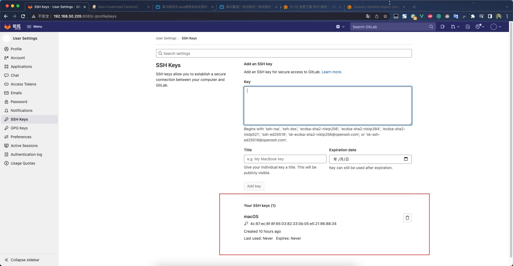
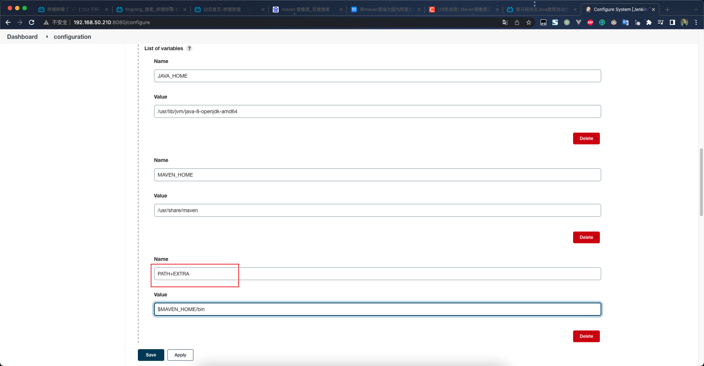

# Jenkins

## 一、安装`gitlab`

> https://docs.gitlab.cn/jh/install/docker.html

```shell
export GITLAB_HOME=/usr/local/gitlab

sudo docker run --detach \
  --hostname gitlab.example.com \
  --publish 443:443 --publish 80:80 --publish 22:22 \
  --name gitlab \
  --restart always \
  --volume $GITLAB_HOME/config:/etc/gitlab \
  --volume $GITLAB_HOME/logs:/var/log/gitlab \
  --volume $GITLAB_HOME/data:/var/opt/gitlab \
  --shm-size 256m \
  gitlab-jh.tencentcloudcr.com/omnibus/gitlab-jh:latest
  

# 查看 root 账号的密码
sudo docker exec -it gitlab grep 'Password:' /etc/gitlab/initial_root_password

luo@ubuntu:~$ sudo docker exec -it gitlab grep 'Password:' /etc/gitlab/initial_root_password

Password: FUDo+ogqUgFdR4Tp11Q/WI5zGwltlQ7PbfdEe0js7OU=

```

### 1、更改`gitlab`的外部访问地址

```shell

root@gitlab:/etc/gitlab# pwd
/etc/gitlab
root@gitlab:/etc/gitlab# vi gitlab.rb

# 搜索这一行
registry_external_url 'https://192.168.50.205:8080'
```


## 二、安装`jenkins`

> 参考：`https://www.jenkins.io/download/`
>
> `https://www.jenkins.io/doc/book/installing/docker/`
>
> 使用`docker`安装比较麻烦，推荐直接使用`apt`安装
>
> 参考：`https://www.jenkins.io/doc/book/installing/linux/`

```shell
curl -fsSL https://pkg.jenkins.io/debian-stable/jenkins.io.key | sudo tee \
  /usr/share/keyrings/jenkins-keyring.asc > /dev/null
echo deb [signed-by=/usr/share/keyrings/jenkins-keyring.asc] \
  https://pkg.jenkins.io/debian-stable binary/ | sudo tee \
  /etc/apt/sources.list.d/jenkins.list > /dev/null
sudo apt-get update
sudo apt-get install jenkins

# 查看初始密码
luo@ubuntu:~$ sudo cat /var/lib/jenkins/secrets/initialAdminPassword
0b378400ec3c4f6fa3c4a84d2ac39aaa

# 访问 http://ip:8080
# 不要安装任何插件，因为会从外网下载
```

### 1、进入插件管理中心

[Advanced Settings - Plugin Manager [Jenkins\]](http://192.168.50.210:8080/pluginManager/advanced)

先不要更改`Update Site`，需要先通过此地址把插件下载地址下载到本地

[Available Plugins - Plugin Manager [Jenkins\]](http://192.168.50.210:8080/pluginManager/available)

加载完成之后


```shell
luo@ubuntu:/var/lib/jenkins/updates$ ll
total 2556
drwxr-xr-x  2 jenkins jenkins    4096 Mar 25 07:47 ./
drwxr-xr-x 11 jenkins jenkins    4096 Mar 25 07:54 ../
# 此文件记录了插件的下载地址
-rw-r--r--  1 jenkins jenkins 2599935 Mar 25 07:46 default.json
-rw-r--r--  1 jenkins jenkins    6040 Mar 25 07:47 hudson.tasks.Maven.MavenInstaller
```

### 2、直接更改下载地址

> 需要特别注意对应`jenkins`的版本
>
> 清华：`https://mirrors.tuna.tsinghua.edu.cn/jenkins/updates/`
>
> 华为云：`https://mirrors.huaweicloud.com/jenkins/updates/`
>
> 阿里云：`https://mirrors.aliyun.com/jenkins/updates/`
>
> https://mirrors.tuna.tsinghua.edu.cn/jenkins/updates/dynamic-stable-2.332.1/update-center.json

复制这个文件的地址


粘贴到


### 3、安装RBAC插件

> 插件地址：`https://plugins.jenkins.io/role-strategy/`
>
> The Role Strategy plugin can be installed from any Jenkins installation connected to the Internet using the **Plugin Manager** screen. Activate the Role-Based Strategy by using the standard *Manage Jenkins > Manage Global Security* screen:


启用`RBAC`插件


看到这个，说明插件已启用


### 4、安装凭证管理插件`Credentials Binding`


装好了，在这个位置


新增凭证


#### （1）gitlab配置ssh免密登录

> 这里配置的是`RSA`公钥



#### （2）jenkins配置`RSA`私钥


#### （3）配置成功，但没有用，后续再研究

> 没成功最大的原因可能是`gitlab`装在了`docker`里面


### 5、安装git插件


#### （1）给jenkins项目配置git

> 请注意：`git`还要配置相关的分支名称，`jenkins`默认`git`的分支名称是`master`，但是`gitlab`默认创建的分支是`main`，开始的时候容易错误


```shell
# 点击构建之后，jenkins 会把项目的源码拉取到这个位置
luo@ubuntu:/var/lib/jenkins/workspace/demo.web.git$ ll
total 28
drwxr-xr-x 4 jenkins jenkins 4096 Mar 25 19:00 ./
drwxr-xr-x 4 jenkins jenkins 4096 Mar 25 18:49 ../
drwxr-xr-x 8 jenkins jenkins 4096 Mar 25 19:00 .git/
-rw-r--r-- 1 jenkins jenkins 2213 Mar 25 19:00 pom.xml
-rw-r--r-- 1 jenkins jenkins 6248 Mar 25 19:00 README.md
drwxr-xr-x 4 jenkins jenkins 4096 Mar 25 19:00 src/
```

### 6、maven

> `Manage Jenkins`>`Global Tool Configuration`


后面还有相应的`maven`配置

在`jenkins`中配置三个全局变量



> 这里的`PATH+EXTRA`是固定写死的，类似`linux`中的
>
> ```shell
> export PATH=$PATH:$MAVEN_HOME/bin
> ```
>
> 

### 7、使用maven进行构建打包

通过执行 shell 脚本的方式


## 三、部署maven项目

### 1、安装`maven`插件`Maven Integration`


### 2、使用`maven`命令进行构建


## 四、gitalb触发构建


此时能配置`gitlab`触发`jenkins`构建

> 最好再点开高级，然后生成一个token，将此token拷贝到`gitlab`中，因为`jenkins`默认不允许匿名触发构建


> 在`gitlab`中配置钩子
>
> `http://192.168.50.210:8080/project/demo.web.git`

### 1、允许`gitlab`向`jenkins`发出web请求(root权限)


### 2、如果不使用token方式，也可以在jenkins中配置gitlab的认证信息


