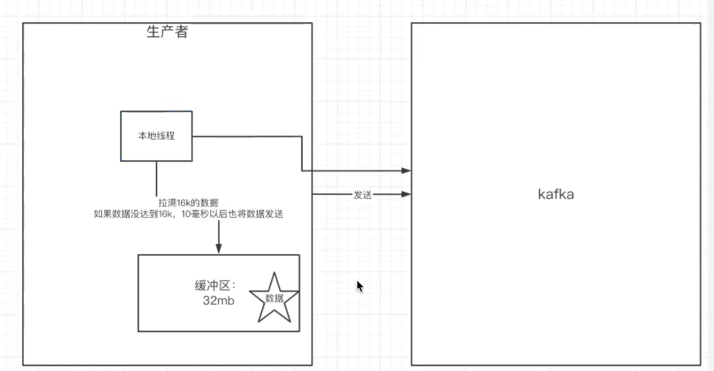

# Kafka

### 1、更改配置文件

```shell
[luo@localhost config]$ cat server.properties

############################# Server Basics #############################

# The id of the broker. This must be set to a unique integer for each broker.
broker.id=0   # 配置kafka的brokerId全局唯一

# Switch to enable topic deletion or not, default value is false
delete.topic.enable=true  # 可以删除 topic


############################# Log Basics #############################

# A comma seperated list of directories under which to store log files
log.dirs=/tmp/kafka-logs   # 配置kafka的数据文件存放目录

# The default number of log partitions per topic. More partitions allow greater
# parallelism for consumption, but this will also result in more files across
# the brokers.
num.partitions=1

# The number of threads per data directory to be used for log recovery at startup and flushing at shutdown.
# This value is recommended to be increased for installations with data dirs located in RAID array.
num.recovery.threads.per.data.dir=1

############################# Internal Topic Settings  #############################
# The replication factor for the group metadata internal topics "__consumer_offsets" and "__transaction_state"
# For anything other than development testing, a value greater than 1 is recommended for to ensure availability such as 3.
offsets.topic.replication.factor=1
transaction.state.log.replication.factor=1
transaction.state.log.min.isr=1

############################# Log Flush Policy #############################

# Messages are immediately written to the filesystem but by default we only fsync() to sync
# the OS cache lazily. The following configurations control the flush of data to disk.
# There are a few important trade-offs here:
#    1. Durability: Unflushed data may be lost if you are not using replication.
#    2. Latency: Very large flush intervals may lead to latency spikes when the flush does occur as there will be a lot of data to flush.
#    3. Throughput: The flush is generally the most expensive operation, and a small flush interval may lead to exceessive seeks.
# The settings below allow one to configure the flush policy to flush data after a period of time or
# every N messages (or both). This can be done globally and overridden on a per-topic basis.

# The number of messages to accept before forcing a flush of data to disk
#log.flush.interval.messages=10000

# The maximum amount of time a message can sit in a log before we force a flush
#log.flush.interval.ms=1000

############################# Log Retention Policy #############################

# The following configurations control the disposal of log segments. The policy can
# be set to delete segments after a period of time, or after a given size has accumulated.
# A segment will be deleted whenever *either* of these criteria are met. Deletion always happens
# from the end of the log.

# The minimum age of a log file to be eligible for deletion due to age
log.retention.hours=168  # 消息（日志、数据）的存储时长

# A size-based retention policy for logs. Segments are pruned from the log as long as the remaining
# segments don't drop below log.retention.bytes. Functions independently of log.retention.hours.
#log.retention.bytes=1073741824

# The maximum size of a log segment file. When this size is reached a new log segment will be created.
log.segment.bytes=1073741824

# The interval at which log segments are checked to see if they can be deleted according
# to the retention policies
log.retention.check.interval.ms=300000

############################# Zookeeper #############################

# Zookeeper connection string (see zookeeper docs for details).
# This is a comma separated host:port pairs, each corresponding to a zk
# server. e.g. "127.0.0.1:3000,127.0.0.1:3001,127.0.0.1:3002".
# You can also append an optional chroot string to the urls to specify the
# root directory for all kafka znodes.
zookeeper.connect=localhost:2181   # zookeeper的地址

# Timeout in ms for connecting to zookeeper
zookeeper.connection.timeout.ms=6000


############################# Group Coordinator Settings #############################

# The following configuration specifies the time, in milliseconds, that the GroupCoordinator will delay the initial consumer rebalance.
# The rebalance will be further delayed by the value of group.initial.rebalance.delay.ms as new members join the group, up to a maximum of max.poll.interval.ms.
# The default value for this is 3 seconds.
# We override this to 0 here as it makes for a better out-of-the-box experience for development and testing.
# However, in production environments the default value of 3 seconds is more suitable as this will help to avoid unnecessary, and potentially expensive, rebalances during application startup.
group.initial.rebalance.delay.ms=0
```

### 2、命令行操作

先添加kafka的脚本到系统环境变量中

```shell
[luo@localhost ~]$ cat ~/.bash_profile
# .bash_profile

# Get the aliases and functions
if [ -f ~/.bashrc ]; then
	. ~/.bashrc
fi

# User specific environment and startup programs

export PATH=$PATH:/home/luo/kafka_2.12-0.11.0.3/bin
```


```shell
# 列出当前kafka中的所有topic
[luo@localhost ~]$ kafka-topics.sh --zookeeper localhost:2181 --list
```

### 3、搭建集群

```shell
# 这三个属性都不一致就能在一台机器上搭建多台kafka集群
luo@ubuntu:~/kafka_2.13-2.4.1$ cat config/server.properties

broker.id=0
listeners=PLAINTEXT://192.168.50.201:9090
log.dirs=/tmp/kafka-logs-0
```

```shell
# 有多个 brokerId 代表集群搭建成功
[zk: localhost:2181(CONNECTED) 2] ls /brokers/ids
[0, 1, 2]
```

### 4、创建多分区的topic

```shell
luo@ubuntu:~/kafka_2.13-2.4.1/bin$ ./kafka-topics.sh  --bootstrap-server 192.168.50.201:9090  --create --topic multipl-partition-topic  --partitions 3

# 查看 topic 的信息
luo@ubuntu:~/kafka_2.13-2.4.1/bin$ ./kafka-topics.sh  --bootstrap-server 192.168.50.201:9090  --describe  --topic multipl-partition-topic
Topic: multipl-partition-topic	PartitionCount: 3	ReplicationFactor: 1	Configs: segment.bytes=1073741824
	Topic: multipl-partition-topic	Partition: 0	Leader: 0	Replicas: 0	Isr: 0
	Topic: multipl-partition-topic	Partition: 1	Leader: 2	Replicas: 2	Isr: 2
	Topic: multipl-partition-topic	Partition: 2	Leader: 1	Replicas: 1	Isr: 1
```

### 5、创建多分区多副本的topic

> 注意：只有 leader 才能进行读写；fllower 只是备份

```shell
# 创建一个 3 个分区、两个副本的 topic
luo@ubuntu:~/kafka_2.13-2.4.1/bin$ ./kafka-topics.sh  --bootstrap-server 192.168.50.201:9090  --create --topic multipl-partition-replication-topic  --partitions 3 --replication-factor 2

# Leader 对应的是 kafka 的 brokerId
# Replicas 代表的是：此分区的副本分别在那几个 brokerId 节点上
# Isr 可以同步的 副本 的 brokerId 和已同步的副本的 brokerId，如果一个副本太久未与 leader 同步，则该 副本会被从 Isr 中剔除
# 当 Leader 宕机之后，新的 leader 将从 Isr 中进行选举
luo@ubuntu:~/kafka_2.13-2.4.1/bin$ ./kafka-topics.sh  --bootstrap-server 192.168.50.201:9090  --describe  --topic multipl-partition-replication-topic
Topic: multipl-partition-replication-topic	PartitionCount: 3	ReplicationFactor: 2	Configs: segment.bytes=1073741824
	Topic: multipl-partition-replication-topic	Partition: 0	Leader: 2	Replicas: 2,0	Isr: 2,0
	Topic: multipl-partition-replication-topic	Partition: 1	Leader: 1	Replicas: 1,2	Isr: 1,2
	Topic: multipl-partition-replication-topic	Partition: 2	Leader: 0	Replicas: 0,1	Isr: 0,1
	
# 配置的 	kafka-logs-0 是 brokerId = 0 的日志存放目录
# 根据 topic 描述信息做推断
# multipl-partition-replication-topic 的 分区2的 Leader 
# multipl-partition-replication-topic 的 分区0的 副本
luo@ubuntu:/tmp/kafka-logs-2$ ll /tmp/kafka-logs-0/
total 40
drwxrwxr-x  5 luo  luo  4096 Dec 14 01:54 ./
drwxrwxrwt 21 root root 4096 Dec 14 01:53 ../
-rw-rw-r--  1 luo  luo     4 Dec 14 01:28 cleaner-offset-checkpoint
-rw-rw-r--  1 luo  luo     0 Dec 14 01:18 .lock
-rw-rw-r--  1 luo  luo     4 Dec 14 01:53 log-start-offset-checkpoint
-rw-rw-r--  1 luo  luo    88 Dec 14 01:18 meta.properties
drwxrwxr-x  2 luo  luo  4096 Dec 14 01:34 multipl-partition-replication-topic-0/
drwxrwxr-x  2 luo  luo  4096 Dec 14 01:34 multipl-partition-replication-topic-2/
drwxrwxr-x  2 luo  luo  4096 Dec 14 01:28 multipl-partition-topic-0/
-rw-rw-r--  1 luo  luo   112 Dec 14 01:53 recovery-point-offset-checkpoint
-rw-rw-r--  1 luo  luo   112 Dec 14 01:54 replication-offset-checkpoint	
```

### 6、往集群发送消息

```shell
# 生产者
./kafka-console-producer.sh  --broker-list 192.168.50.201:9090,192.168.50.201:9091,192.168.50.201:9092 --topic multipl-partition-replication-topic


# 消费者（不指明消费组，全量消费）
luo@ubuntu:~/kafka_2.13-2.4.1/bin$ ./kafka-console-consumer.sh  --topic multipl-partition-replication-topic --bootstrap-server 192.168.50.201:9090,192.168.50.201:9091,192.168.50.201:9092 --from-beginning
```

指明消费组

```shell
# 一个分区中的消息最多只能发送到同一个消费组中的一个消费者消费
# 并且自带负载均衡的效果
./kafka-console-consumer.sh  --topic multipl-partition-replication-topic --bootstrap-server 192.168.50.201:9090,192.168.50.201:9091,192.168.50.201:9092 --from-beginning --group group1


```


* `partition`的数量决定了同一个消费组中消费者的数量，建议同一个消费组中消费者的数量不要超过`partition`的数量，否则过多的消费者将消费不到消息。`Consumer Group B`中即使再增加消费者也不能再订阅`partition`了。
* 同一个`partition`中的消息只能被消费者组中的一个消费者进行消费，目的是为了保证`partition`下的消费的顺序性。如果要保证全局消息的顺序性，后续介绍。
* 如果消费者挂了，会触发`rebalance`机制，会让其他消费者来消费该分区

### 7、producer同步发送消息

如果生产者发送的消息没有收到`ack`，生产者会阻塞，阻塞到`3s`的时间，如果还没有收到消息，会进行重试。重试的次数为`3`次。


#### （1）ack的三种模式

* ack=0:当消息抵达`kafka-cluster(kafka集群)`的时候，不需要任何的`broker`收到消息，就返回`ack`。性能最高、最不安全，最容易丢失消息。

* ack=1:（默认）消息必须发送给`leader`，并且`leader`将该消息持久化到磁盘之后，才会回复`ack `。均衡性能和安全性。

* ack=-1/all:里面有默认配置`min.insync.replicas`（默认为1，推荐配置大于等于2。如果为1则和`ack = 1`的情况一致，`leader`持久化之后就返回`ack`）。消息发送到`leader`之后，必须等`min.insync.replicas`台 `fllower`同步之后，`leader`才返回`ack`。最安全，但性能最差

  > 当`ack=-1`且`min.insync.replicas=2`时，代表需要一个`leader`和一个`follower`同步持久化之后，才返回`ack`给生产者（此时集群中已有两个`broker`已完成数据的持久化）

#### （2）重试

发送失败会重试，默认重试间隔为`100ms`，重试能保证消息发送的可靠性，但是也可能造成消息重复发送，比如网络抖动。

所以需要在消费者那边做好幂等性处理

```java
        properties.put(ProducerConfig.RETRIES_CONFIG, 3);

        properties.put(ProducerConfig.RECONNECT_BACKOFF_MS_CONFIG, 300);
```

#### （3）发送缓冲区

```java

//        设置发送消息的本地缓冲区，如果设置了该缓冲区，消息会先发送到本地缓冲区，可以提高消息发送的性能
//        默认为33554432，即32MB
        properties.put(ProducerConfig.BUFFER_MEMORY_CONFIG, 33554432);

//        kafka 本地线程会从缓冲区读取数据，批量发送到broker
//        设置线程批量发送消息的大小，默认是16384，即16kb
//        也就是说，缓冲区中要发送的消息满了16kb就一次发送出去
        properties.put(ProducerConfig.BATCH_SIZE_CONFIG, 16384);

//      默认值是0，代表：消息必须立即被发送，但这样会影响性能
//        一般设置10ms左右，就是说，这个消息发送完之后会进入本地的一个batch
//        如果 10ms 以内这个 batch 满了 16kb 就会随 batch 一起被提前发送出去
//        如果 10ms 以内，batch没满，那么也必须把消息发送出去，不能让消息发送的延迟时间过长
        properties.put(ProducerConfig.LINGER_MS_CONFIG, 10);
```




### 8、consumer消费消息

#### （1）消费者offset的提交方式


##### 【1】自动提交

消费者一旦`poll`到消息之后，消费者就向`broker`的`_consumer_offsets`主题提交当前主题-分区消费的偏移量，即自动提交`offset`。

自动提交可能会丢失消息：因为消费者在消费消息之前自动提交`offset`，有可能刚提交之后，消费者就挂了，来不及消费已经提交了的消息


##### 【2】手动提交


设置为手动提交

```java
        //        是否自动提交 offset，默认就是 true
        properties.put(ConsumerConfig.ENABLE_AUTO_COMMIT_CONFIG, "false");

//        自动提交 offset 的 时间间隔
        properties.put(ConsumerConfig.AUTO_COMMIT_INTERVAL_MS_CONFIG,"1000");
```

* 手动同步提交

  ```java
                  log.info("执行手动同步提交");
                  // 在消息消费完之后调用同步提交的方法，集群返回ack之前就一直阻塞
  //                  返回 ack 之后表示提交成功
                  // 手动提交 offset，当前线程会被阻塞，直到 offset 提交成功
                  consumer.commitSync();
  ```

* 手动异步提交

  ```java
  
  //                手动异步提交：在消息消费完之后提交，不需要等待集群的ack
  //                直接执行之后的逻辑，供集群调用
                  log.info("执行消息异步手动提交");
                  consumer.commitAsync((Map<TopicPartition, OffsetAndMetadata> offsets, Exception exception)->{
  
                      if(exception!=null){
                          log.error("异步手动提交失败",exception);
                      }
  
                      offsets.entrySet().forEach((Map.Entry<TopicPartition, OffsetAndMetadata> entry)->{
  
                          TopicPartition key = entry.getKey();
                          OffsetAndMetadata value = entry.getValue();
                          log.info("主题：{}，分区：{}，offset：{}，metadata：{}", key.topic(),key.partition(),value.offset(),value.metadata());
                      });
                  });
  ```

  

#### （2）消费者提交offset中的内容

消费者无论是自动提交还是手动提交，都需要把当前消费者所属的消费组、消费的某个主题、消费的某个分区、消费的偏移量，提交到集群的`_consumer_offsets`主题里面

#### （3）轮询poll消息

默认情况下：消费者一次`poll`会拉取`500`条消息

```java
      // 一次 poll 最多拉取消息的条数，可以根据消费的速度来设置
        properties.put(ConsumerConfig.MAX_POLL_RECORDS_CONFIG,500);

//          如果两次 poll 的时间超过了 30s ，kafka 会认为其消费能力过弱
//        将其踢出消费者组。将分区分配给其他消费者
//        会执行 rebalance
        properties.put(ConsumerConfig.MAX_POLL_INTERVAL_MS_CONFIG,30*1000);
```

拉取消息时，设置的轮询时间为`10s`

```java
        for (;;){

            //
            ConsumerRecords<String, String> poll = consumer.poll(Duration.ofSeconds(10));

            log.info("收到{}条批量消息",poll.count());

        }
```

* 如果一次`poll`没有拉取到`500`条消息，且时间还没有到`10s`，那么此时还不开始消费，继续下一次`poll`，直到消息条数累加到`500`条、或者超过`10s`，才开始消费消息。
* 如果一次`poll`就获取到`500`条消息，那么直接执行后续消息的消费，无需等待`10s`的轮询周期

#### （4）消费者的心跳检查

```java
//        consumer 给 broker 发送心跳的间隔时间
        properties.put(ConsumerConfig.HEARTBEAT_INTERVAL_MS_CONFIG,1000);

//        kafka 如果超过 10s 都没有收到消费者的心跳，则会把消费者踢出消费者组
//        进入 rebalance，把分区分配给其他消费者
        properties.put(ConsumerConfig.SESSION_TIMEOUT_MS_CONFIG,10*1000);

```

#### （5）消费者订阅

```java
//        消费者订阅的主题列表
        consumer.subscribe(Collections.singletonList(TOPIC_NAME));
        
```

消息的回溯消费

```java
//        2、消费者指定分区进行消费
        consumer.assign(Collections.singletonList(new TopicPartition(TOPIC_NAME,1)));
//        // 从分区的起点，开始消费 （可选）
        consumer.seekToBeginning(Collections.singletonList(new TopicPartition(TOPIC_NAME,1)));

```

指定 offset 消费

```java
//        3、指定 offset 消费
        consumer.assign(Collections.singletonList(new TopicPartition(TOPIC_NAME,0)));
//        // 指定分区的offset，开始消费 （可选）
        consumer.seek(new TopicPartition(TOPIC_NAME,0),5);

```

指定时间消费

* 根据指定的时间去所有的 partition 中确定该时间对应的 offset 

* 然后去对应的 partition 中找到该 offset 及其之后的消息  

* 然后开始消费

```java
    KafkaConsumer<String, String> consumer = prepareConsumer(true);

//          4、从指定的时间点开始消费
//        获取到该 topic 下的所有分区
        List<PartitionInfo> partitionInfos = consumer.partitionsFor(TOPIC_NAME);

//        从1小时前开始消费
        long fetchDateTime = new Date().getTime() - 1000*60*60;

        Map<TopicPartition, Long> topicPartitionMap = partitionInfos.stream().collect(Collectors.toMap((PartitionInfo partitionInfo) -> {
            return new TopicPartition(partitionInfo.topic(), partitionInfo.partition());
        }, (PartitionInfo partitionInfo) -> {
            return fetchDateTime;
        }));

//      查询每个分区从 fetchDateTime 时间之后的消息的 offset
        Map<TopicPartition, OffsetAndTimestamp> partitionOffsetAndTimestampMap = consumer.offsetsForTimes(topicPartitionMap);

        for (Map.Entry<TopicPartition, OffsetAndTimestamp> entry : partitionOffsetAndTimestampMap.entrySet()) {

            TopicPartition key = entry.getKey();

            OffsetAndTimestamp value = entry.getValue();

            if(key==null||value==null){
                continue;
            }

            long offset = value.offset();

            log.info("从{}主题的{}分区的{}offset开始消费",key.topic(),key.partition(),value.offset());

            consumer.assign(Collections.singletonList(key));
            consumer.seek(key,offset);

        }

        for (;;){


            for (ConsumerRecord<String, String> consumerRecord : consumer.poll(Duration.ofMinutes(1))) {


                log.info("消费：主题：{}分区：{}偏移量：{}，消息的时间戳：{}，消息内容：{}",consumerRecord.topic(),consumerRecord.partition(),consumerRecord.offset(),new Date(consumerRecord.timestamp()),consumerRecord.value());

            }


        }
```

#### （6）新消费组的消费偏移量

新消费组中的消费者在启动以后，默认会从当前分区的最后一条消息的`offset+1`的位置开始消费。（只消费最新的消息）

可以通过设置，实现新消费组的消费者第一次从头开始消费，之后每次启动都从上一次消费完的`offset+1`开始继续向后消费

```java
        /*
         * 当消费此主题的消费者是一个新的消费者组，
         * 或者指定 offset 的消费方式，offset 不存在
         * 那么应该如何消费
         * latest（默认）：只消费自己启动之后，发送到 topic 的消息
         * earliest：第一次从头开始消费，以后按照消费 offset 记录继续向后消费
         *             这个需要区别于 seekToBeginning （每次从头开始消费）
         * */
        properties.put(ConsumerConfig.AUTO_OFFSET_RESET_CONFIG, "earliest");
```

