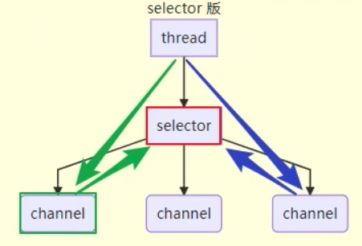

# Netty

## 一、NIO

### 1、三大组件

#### （1）Channel

不同于`InputStream`,`OutputStream`。`Channel`是一个读写数据的双向通道

常见的`Channel`

* `FileChannel`：用于读写文件
* `DatagramChannel`：`UDP`传输数据包所有的`Channel`
* `SocketChannel`：`TCP`传输的通道，客户端、服务端都能用
* `ServerSocketChannel`：`TCP`传输的通道，只能用于服务端

#### （2）Buffer

一个内存缓冲区，可将`Channel`输出的数据进行缓存，反之，如果想向`Channel`中写数据，就必须先将数据写入到`Buffer`中

`Buffer`用来缓冲读写数据

* `ByteBuffer` ：以字节为单位来缓冲数据
  * `MappedByteBuffer`
  * `DirectByteBuffer`
  * `HeapByteBuffer`
* `ShortBuffer`
* `IntBuffer`
* `Longbuffer`
* `FloatBuffer`
* `DoubleBuffer`
* `CharBuffer`

#### （3）Selector

1. 传统的多线程服务器设计：

   为每一个进来的请求为其分配一个线程进行处理

   缺点:

   *  每个线程都会占用一定的内存，最终导致在高并发环境下，内存占用高
   * 线程的上下文切换成本高
   * 只适合连接数较少的场景

2. 线程池版设计

   

   缺点：

   * 阻塞模式下，一个线程仅能处理一个`socket`连接，处于阻塞队列中的`socket`连接必须等待
   * 仅适合短连接场景，例如：适合`http`

3. `selector`版的设计

   `selector`的作用就是配合一个线程来管理多个`channel`，获取这些`channel`上发生的事件，这些`channel`工作在非阻塞模式下，不会让一个线程吊丝在一个`channel`上。适合连接数特别多，但流量低的场景（low traffic）

   调用`selector`的`select()`方法会阻塞，直到`channel`发生了读写就绪的事件，这些事件发生，`select()`就返回这些事件，交给`thread`来处理

   
   
   优点：少量的线程可以配合`selector`去处理多个`channel`上的事件

### 2、ByteBuffer

`bytebuffer`的重要属性

`bytebuffer`刚创建完成时

写模式下，`position`是当前写入的位置，`limit`等于起始容量，下图表示了写入4个字节之后的`bytebuffer`状态

`flip()`方法调用之后，`position`切换为读取位置，`limit`切换为读取限制

读取`4`个字节之后的状态

切换到写模式，方法一：`clean()`方法调用之后，状态

调用之后，从头开始写

切换到写模式，方法二：`compact()`方法调用之后，是把未读完的部分向前压缩，然后切换到写模式

调用之后，从`limit`读取限制之后开始写

