# Rocket MQ

## 一、启动

### 1.启动 nameServer

```shell
[luo@localhost rocketmq-all-4.7.1-bin-release]$ pwd
/opt/rocketmq-all-4.7.1-bin-release

# 1、启动 NameServer
[root@localhost rocketmq-all-4.7.1-bin-release]# nohup ./bin/mqnamesrv &
[1] 2347
[root@localhost rocketmq-all-4.7.1-bin-release]# nohup: 忽略输入并把输出追加到'nohup.out'

# 2、查看启动日志
[root@localhost rocketmq-all-4.7.1-bin-release]# tail -f ~/logs/rocketmqlogs/namesrv.log 
2020-12-12 15:04:09 INFO main - tls.client.keyPassword = null
2020-12-12 15:04:09 INFO main - tls.client.certPath = null
2020-12-12 15:04:09 INFO main - tls.client.authServer = false
2020-12-12 15:04:09 INFO main - tls.client.trustCertPath = null
2020-12-12 15:04:09 INFO main - Using OpenSSL provider
2020-12-12 15:04:09 INFO main - SSLContext created for server
2020-12-12 15:04:09 INFO main - Try to start service thread:FileWatchService started:false lastThread:null
2020-12-12 15:04:10 INFO NettyEventExecutor - NettyEventExecutor service started
2020-12-12 15:04:10 INFO FileWatchService - FileWatchService service started
2020-12-12 15:04:10 INFO main - The Name Server boot success. serializeType=JSON

# 3、启动 broker
[luo@localhost rocketmq-all-4.7.1-bin-release]$ nohup sh ./bin/mqbroker -n localhost:9876 & # 直接启动RocketMQ 失败

```

### 2.jvm典型配置

```shell
java -Xmx3550m -Xms3550m -Xmn2g -Xss128k
-Xmx3550m：设置JVM最大可用内存为3550M。
-Xms3550m：设置JVM促使内存为3550m。此值可以设置与-Xmx相同，以避免每次垃圾回收完成后JVM重新分配内存。
-Xmn2g：设置年轻代大小为2G。整个JVM内存大小=年轻代大小 + 年老代大小 + 持久代大小。持久代一般固定大小为64m，所以增大年轻代后，将会减小年老代大小。此值对系统性能影响较大，Sun官方推荐配置为整个堆的3/8。
-Xss128k：设置每个线程的堆栈大小。JDK5.0以后每个线程堆栈大小为1M，以前每个线程堆栈大小为256K。更具应用的线程所需内存大小进行调整。在相同物理内存下，减小这个值能生成更多的线程。但是操作系统对一个进程内的线程数还是有限制的，不能无限生成，经验值在3000~5000左右。
```

### 3.启动`broker`

```shell

# RocketMQ默认虚拟机内存比较大，启动 broker 如果因为内存不足而失败，需要编辑如下两个配置文件，修改jvm内存大小
[luo@localhost rocketmq-all-4.7.1-bin-release]$ vi bin/runbroker.sh 
JAVA_OPT="${JAVA_OPT} -server -Xms256m -Xmx256m -Xmn128m"

[luo@localhost rocketmq-all-4.7.1-bin-release]$ vi bin/runserver.sh 
JAVA_OPT="${JAVA_OPT} -server -Xms256m -Xmx256m -Xmn128m -XX:MetaspaceSize=128m -XX:MaxMetaspaceSize=320m"

# 重启 nameServer
[luo@localhost rocketmq-all-4.7.1-bin-release]$ ./bin/mqshutdown namesrv

# 重启 broker
[luo@localhost rocketmq-all-4.7.1-bin-release]$ ./bin/mqshutdown broker

# 启动
[luo@localhost rocketmq-all-4.7.1-bin-release]$ nohup ./bin/mqbroker -n localhost:9876 &

# 查看broker日志
[luo@localhost rocketmq-all-4.7.1-bin-release]$ tail -f ~/logs/rocketmqlogs/broker.log 
```

### 4.运行dashbord

>https://github.com/apache/rocketmq-dashboard

```shell
sudo docker run -d --name rocketmq-dashboard -e "JAVA_OPTS=-Drocketmq.namesrv.addr=192.168.1.149:9876" -p 3333:8080 --restart always   -t apacherocketmq/rocketmq-dashboard:latest
```


## 二、测试RocketMQ

### 1.发送消息

```shell
# 1、设置环境变量（环境变量名字不能改动）
[luo@localhost rocketmq-all-4.7.1-bin-release]$ export NAMESRV_ADDR=localhost:9876

# 2、使用安装包的Demo发送消息
[luo@localhost rocketmq-all-4.7.1-bin-release]$ sh bin/tools.sh org.apache.rocketmq.example.quickstart.Producer
```

### 2.接收消息

```shell
# 1、设置环境变量
[luo@localhost rocketmq-all-4.7.1-bin-release]export NAMESRV_ADDR=localhost:9876
# 2、接收消息
[luo@localhost rocketmq-all-4.7.1-bin-release]$ sh bin/tools.sh org.apache.rocketmq.exale.quickstart.Consumer
```

## 三、基本概念

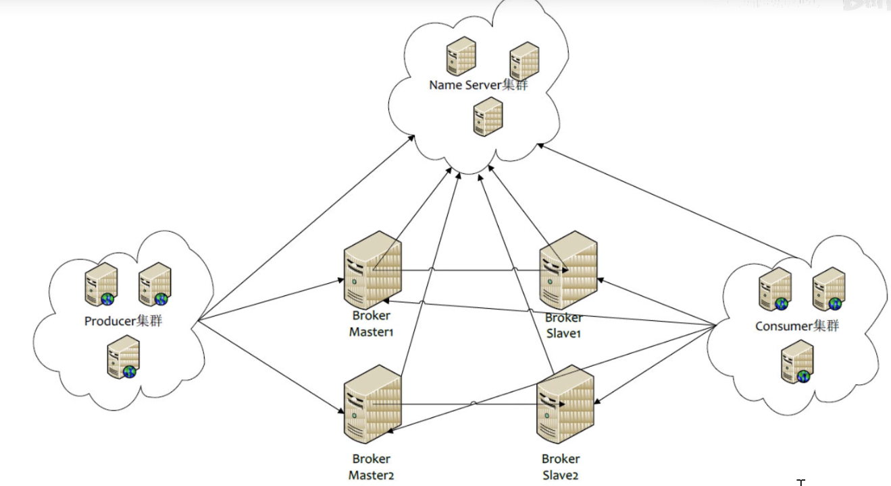

### 1 消息模型（Message Model）

RocketMQ主要由 Producer、Broker、Consumer 三部分组成，其中Producer 负责生产消息，Consumer 负责消费消息，Broker 负责存储消息。Broker 在实际部署过程中对应一台服务器，每个 Broker 可以存储多个Topic的消息，每个Topic的消息也可以分片存储于不同的 Broker。Message Queue 用于存储消息的物理地址，每个Topic中的消息地址存储于多个 Message Queue 中。ConsumerGroup 由多个Consumer 实例构成。

### 2 消息生产者（Producer）

负责生产消息，一般由业务系统负责生产消息。一个消息生产者会把业务应用系统里产生的消息发送到broker服务器。RocketMQ提供多种发送方式，同步发送、异步发送、顺序发送、单向发送。同步和异步方式均需要Broker返回确认信息，单向发送不需要。

### 3 消息消费者（Consumer）

负责消费消息，一般是后台系统负责异步消费。一个消息消费者会从Broker服务器拉取消息、并将其提供给应用程序。从用户应用的角度而言提供了两种消费形式：拉取式消费、推动式消费。

### 4 主题（Topic）

表示一类消息的集合，每个主题包含若干条消息，每条消息只能属于一个主题，是RocketMQ进行消息订阅的基本单位。

### 5 代理服务器（Broker Server）

消息中转角色，负责存储消息、转发消息。代理服务器在RocketMQ系统中负责接收从生产者发送来的消息并存储、同时为消费者的拉取请求作准备。代理服务器也存储消息相关的元数据，包括消费者组、消费进度偏移和主题和队列消息等。

> `Broker`会向每一个`Name Server`注册自己，这样`Name Server`之间就不用做数据交互
>
> `Broker`分为`Master`和`Slave``
>
> * `Master`主节点负责写操作
> * `Slave`从节点服务读操作
> * 主从`Broker`，在同一组内通过`BrokerId`来区分主从，`BrokerId = 0`代表是主节点，`BrokerId = 其他`代表是从节点
> * 一个`Master`可以对应多个`Slave`，但是一个`Slave`只能对应一个`Master`
> * `Master`和`Slave`的对应关系通过制定相同的`BrokerName`，不同的`BrokerId`来定义，`BrokerId = 0`标示`Master`，`BrokerId != 0 `标示`Slave`
> * `Master`也可以部署多个，每个`Broker`和`NameServer`集群中的所有节点建立长连接，定时注册`Topic`信息到所有`NameServer`
> * 

### 6 名字服务（Name Server）

名称服务充当路由消息的提供者。生产者或消费者能够通过名字服务查找各主题相应的Broker IP列表。**多个Namesrv实例组成集群，但相互独立，没有信息交换。**

> `Producer`与`Name Server`集群中的其中一个节点（随机选择）建立长连接，定期从`Name Server`获取`Topic`路由信息，并向提供`Topic`服务的`Master Broker`建立长连接，且定时向`Master`发送心跳。`Producer`完全无状态，可以集群部署
>
> `Consumer`与`Name Server`集群中的其中一个节点（随机选择）建议长连接，定期从`Name Server`获取`Topic`路由信息，并向提供`Topic`的`Master Broker`，`Slave Broker`建立长连接，且定时向`Master Broker`，`Slave Broker`发送心跳。`Consumer`既可以从`Master Broker`订阅信息，也可以从`Slave Broker`订阅信息，订阅规则由`Broker`配置决定

### 7 拉取式消费（Pull Consumer）

Consumer消费的一种类型，应用通常主动调用Consumer的拉消息方法从Broker服务器拉消息、主动权由应用控制。一旦获取了批量消息，应用就会启动消费过程。

### 8 推动式消费（Push Consumer）

Consumer消费的一种类型，该模式下Broker收到数据后会主动推送给消费端，该消费模式一般实时性较高。

### 9 生产者组（Producer Group）

同一类Producer的集合，这类Producer发送同一类`Topic`消息且发送逻辑一致。如果发送的是事务消息且原始生产者在发送之后崩溃，则Broker服务器会联系同一生产者组的其他生产者实例以提交或回溯消费。

一个生产者组可以同时发送多个主题的消息。

使得消费者组在消费消息方面，实现

* 负载均衡：将一个`Topic`中的不同`Queue`平均分配给同一个`Consumer Group`中的不同的`Consumer`
* 容错：一个`Consumer`挂了，该`Consumer Group`中的其他`Consumer`可以接着消费原`Consumer`消费的`Queue`
* 消费者组中`Consumer`的数量应该小于等于订阅`Topic`的`Queue`的数量，如果超出`Queue`的数量，则多出的`Consumer`将不能消费
* 注意：允许一个`Consumer`消费同一个`Topic`下的多个`Queue`

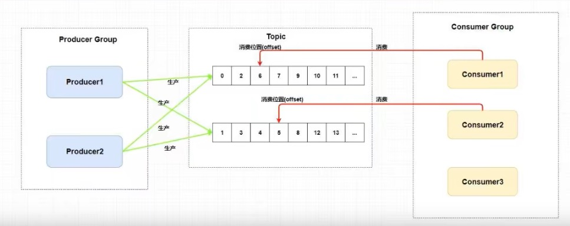

### 10 消费者组（Consumer Group）

同一类Consumer的集合，这类Consumer通常消费同一类`Topic`消息且消费逻辑一致。消费者组使得在消息消费方面，实现负载均衡和容错的目标变得非常容易。要注意的是，消费者组的消费者实例必须订阅完全相同的Topic。RocketMQ 支持两种消息模式：集群消费（Clustering）和广播消费（Broadcasting）。

**一个Topic的Queue中的消息只能被同一个消费者组中的一个消费者消费，一个Queue中的消息不允许同一个消费者组中的多个消费者同时消费**

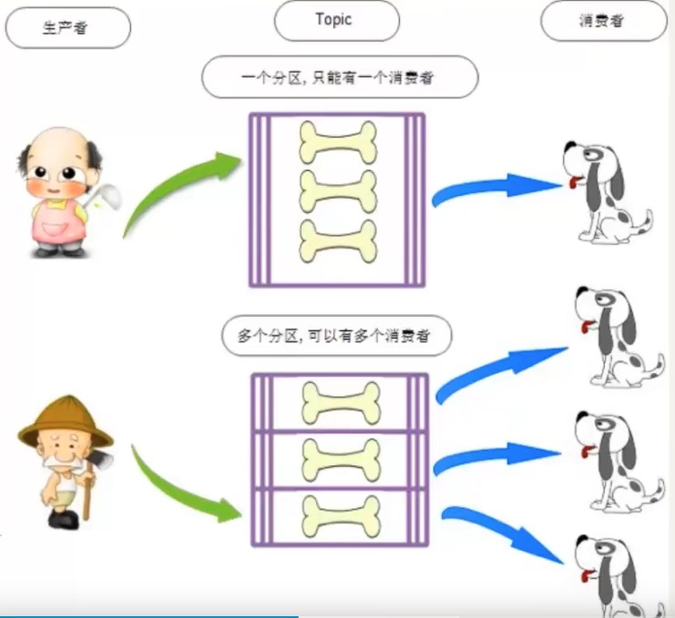

一个`Topic`类型的消息可以被多个消费者组`( Consumer Group )`同时消费

一个消费者组`Consumer Group`中的`Consumer` 必须订阅完全相同的`Topic`

消费者组只能消费一个`Topic`的消息，不能同时消费多个`Topic`的消息

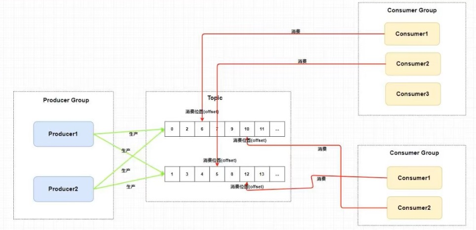

### 11 集群消费（Clustering）

集群消费模式下,相同Consumer Group的每个Consumer实例平均分摊消息。

### 12 广播消费（Broadcasting）

广播消费模式下，相同Consumer Group的每个Consumer实例都接收全量的消息。

### 13 普通顺序消息（Normal Ordered Message）

普通顺序消费模式下，消费者通过同一个消费队列收到的消息是有顺序的，不同消息队列收到的消息则可能是无顺序的。

### 14 严格顺序消息（Strictly Ordered Message）

严格顺序消息模式下，消费者收到的所有消息均是有顺序的。

### 15 消息（Message）

消息系统所传输信息的物理载体，生产和消费数据的最小单位，每条消息必须属于一个主题。RocketMQ中每个消息拥有唯一的Message ID，且可以携带具有业务标识的Key。系统提供了通过Message ID和Key查询消息的功能。注意：`MessageId` 有两个：在生产者调用`send()`方法时会产生一个`MessageId (MsgId)`，当消息到达`Broker`之后，`Broker`会自动生成一个`MessageId (offsetMsgId)`。`MsgId offsetMsgId Key`都被成为消息的标识

* `MsgId`：由生产者生成，其生成规则为：

   producerIp + 进程id + MessageClientIdSetter 类的 ClassLoader 的 hashCode + 当前时间 + AutomicInteger 自增指数器

* `offsetId`：由`broker`端生成，其生成规则为：`BrokerIp` + 物理分区的`offset`

* `key`：用户指定的业务相关的唯一标识

### 16 标签（Tag）

为消息设置的标志，用于同一主题下区分不同类型的消息。来自同一业务单元的消息，可以根据不同业务目的在同一主题下设置不同标签。标签能够有效地保持代码的清晰度和连贯性，并优化RocketMQ提供的查询系统。消费者可以根据Tag实现对不同子主题的不同消费逻辑，实现更好的扩展性。

## 四、架构设计

------

### 1.技术架构

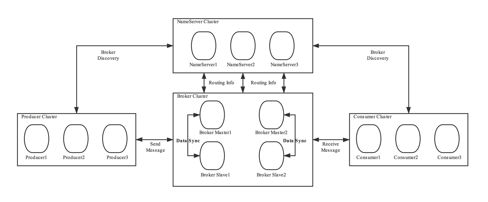

RocketMQ架构上主要分为四部分，如上图所示:

* Producer：消息发布的角色，支持分布式集群方式部署。Producer通过MQ的负载均衡模块选择相应的Broker集群队列进行消息投递，投递的过程支持快速失败并且低延迟。
* Consumer：消息消费的角色，支持分布式集群方式部署。支持以push推，pull拉两种模式对消息进行消费。同时也支持集群方式和广播方式的消费，它提供实时消息订阅机制，可以满足大多数用户的需求。
* NameServer：NameServer是一个非常简单的Topic路由注册中心，其角色类似Dubbo中的zookeeper，支持Broker的动态注册与发现。主要包括两个功能：
  *  Broker管理，NameServer接受Broker集群的注册信息并且保存下来作为路由信息的基本数据。然后提供心跳检测机制，检查Broker是否还存活；
  * 路由信息管理，每个NameServer将保存关于Broker集群的整个路由信息和用于客户端查询的队列信息。然后Producer和Conumser通过NameServer就可以知道整个Broker集群的路由信息，从而进行消息的投递和消费。
  * NameServer通常也是集群的方式部署，各实例间相互不进行信息通讯。Broker是向每一台NameServer注册自己的路由信息，所以每一个NameServer实例上面都保存一份完整的路由信息。当某个NameServer因某种原因下线了，Broker仍然可以向其它NameServer同步其路由信息，Producer,Consumer仍然可以动态感知Broker的路由的信息。
* BrokerServer：Broker主要负责消息的存储、投递和查询以及服务高可用保证，为了实现这些功能，Broker包含了以下几个重要子模块。

1. Remoting Module：整个Broker的实体，负责处理来自clients端的请求。
2. Client Manager：负责管理客户端(Producer/Consumer)和维护Consumer的Topic订阅信息
3. Store Service：提供方便简单的API接口处理消息存储到物理硬盘和查询功能。
4. HA Service：高可用服务，提供Master Broker 和 Slave Broker之间的数据同步功能。
5. Index Service：根据特定的Message key对投递到Broker的消息进行索引服务，以提供消息的快速查询。

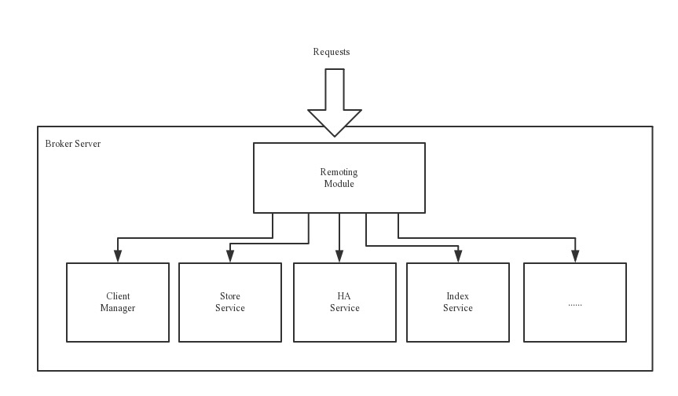

### 2 部署架构

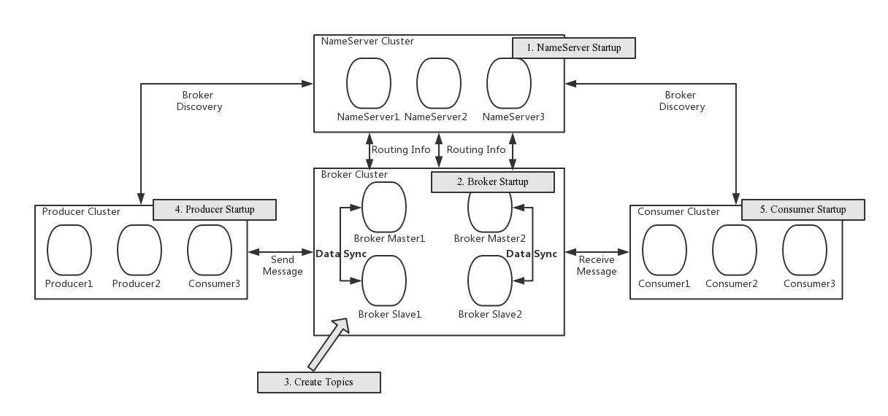

### 3.RocketMQ 网络部署特点

* NameServer是一个几乎无状态节点，可集群部署，节点之间无任何信息同步。
* Broker部署相对复杂，Broker分为Master与Slave，一个Master可以对应多个Slave，但是一个Slave只能对应一个Master，Master与Slave 的对应关系通过指定相同的BrokerName，不同的BrokerId 来定义，BrokerId为0表示Master，非0表示Slave。Master也可以部署多个。每个Broker与NameServer集群中的所有节点建立长连接，定时注册Topic信息到所有NameServer。 注意：当前RocketMQ版本在部署架构上支持一Master多Slave，但只有BrokerId=1的从服务器才会参与消息的读负载。
* Producer与NameServer集群中的其中一个节点（随机选择）建立长连接，定期从NameServer获取Topic路由信息，并向提供Topic 服务的Master建立长连接，且定时向Master发送心跳。Producer完全无状态，可集群部署。
* Consumer与NameServer集群中的其中一个节点（随机选择）建立长连接，定期从NameServer获取Topic路由信息，并向提供Topic服务的Master、Slave建立长连接，且定时向Master、Slave发送心跳。Consumer既可以从Master订阅消息，也可以从Slave订阅消息，消费者在向Master拉取消息时，Master服务器会根据拉取偏移量与最大偏移量的距离（判断是否读老消息，产生读I/O），以及从服务器是否可读等因素建议下一次是从Master还是Slave拉取。

结合部署架构图，描述集群工作流程：

* 启动NameServer，NameServer起来后监听端口，等待Broker、Producer、Consumer连上来，相当于一个路由控制中心。
* Broker启动，跟所有的NameServer保持长连接，定时发送心跳包。心跳包中包含当前Broker信息(IP+端口等)以及存储所有Topic信息。注册成功后，NameServer集群中就有Topic跟Broker的映射关系。
* 收发消息前，先创建Topic，创建Topic时需要指定该Topic要存储在哪些Broker上，也可以在发送消息时自动创建Topic。
* Producer发送消息，启动时先跟NameServer集群中的其中一台建立长连接，并从NameServer中获取当前发送的Topic存在哪些Broker上，轮询从队列列表中选择一个队列，然后与队列所在的Broker建立长连接从而向Broker发消息。
* Consumer跟Producer类似，跟其中一台NameServer建立长连接，获取当前订阅Topic存在哪些Broker上，然后直接跟Broker建立连接通道，开始消费消息。

## 五、集群模式

> 原文地址：https://github.com/apache/rocketmq/blob/master/docs/cn/operation.md

### 1 集群搭建

#### 1.1 单Master模式

这种方式风险较大，一旦Broker重启或者宕机时，会导致整个服务不可用。不建议线上环境使用,可以用于本地测试。

##### 1）启动 NameServer

```shell
### 首先启动Name Server
$ nohup sh mqnamesrv &
 
### 验证Name Server 是否启动成功
$ tail -f ~/logs/rocketmqlogs/namesrv.log
The Name Server boot success...
```

##### 2）启动 Broker

```shell
### 启动Broker
$ nohup sh bin/mqbroker -n localhost:9876 &

### 验证Name Server 是否启动成功，例如Broker的IP为：192.168.1.2，且名称为broker-a
$ tail -f ~/logs/rocketmqlogs/Broker.log 
The broker[broker-a, 192.169.1.2:10911] boot success...
```

#### 1.2 多Master模式

一个集群无Slave，全是Master，例如2个Master或者3个Master，这种模式的优缺点如下：

* 优点：配置简单，单个Master宕机或重启维护对应用无影响，在磁盘配置为RAID10时，即使机器宕机不可恢复情况下，由于RAID10磁盘非常可靠，消息也不会丢（异步刷盘丢失少量消息，同步刷盘一条不丢），性能最高；
* 缺点：单台机器宕机期间，这台机器上未被消费的消息在机器恢复之前不可订阅，消息实时性会受到影响。

##### 1）启动NameServer

NameServer需要先于Broker启动，且如果在生产环境使用，为了保证高可用，建议一般规模的集群启动3个NameServer，各节点的启动命令相同，如下：

```shell
### 首先启动Name Server
$ nohup sh mqnamesrv &
 
### 验证Name Server 是否启动成功
$ tail -f ~/logs/rocketmqlogs/namesrv.log
The Name Server boot success...
```

##### 2）启动Broker集群

```shell
### 在机器A，启动第一个Master，例如NameServer的IP为：192.168.1.1
$ nohup sh mqbroker -n 192.168.1.1:9876 -c $ROCKETMQ_HOME/conf/2m-noslave/broker-a.properties &
 
### 在机器B，启动第二个Master，例如NameServer的IP为：192.168.1.1
$ nohup sh mqbroker -n 192.168.1.1:9876 -c $ROCKETMQ_HOME/conf/2m-noslave/broker-b.properties &

...
```

如上启动命令是在单个NameServer情况下使用的。对于多个NameServer的集群，Broker启动命令中`-n`后面的地址列表用分号隔开即可，例如 `192.168.1.1:9876;192.168.1.2:9876`。

#### 1.3 多Master多Slave模式-异步复制

每个Master配置一个Slave，有多对Master-Slave，HA采用异步复制方式，主备有短暂消息延迟（毫秒级），这种模式的优缺点如下：

* 优点：即使磁盘损坏，消息丢失的非常少，且消息实时性不会受影响，同时Master宕机后，消费者仍然可以从Slave消费，而且此过程对应用透明，不需要人工干预，性能同多Master模式几乎一样；
* 缺点：Master宕机，磁盘损坏情况下会丢失少量消息。

##### 1）启动NameServer

```shell
### 首先启动Name Server
$ nohup sh mqnamesrv &
 
### 验证Name Server 是否启动成功
$ tail -f ~/logs/rocketmqlogs/namesrv.log
The Name Server boot success...
```

##### 2）启动Broker集群

```shell
### 在机器A，启动第一个Master，例如NameServer的IP为：192.168.1.1
$ nohup sh mqbroker -n 192.168.1.1:9876 -c $ROCKETMQ_HOME/conf/2m-2s-async/broker-a.properties &
 
### 在机器B，启动第二个Master，例如NameServer的IP为：192.168.1.1
$ nohup sh mqbroker -n 192.168.1.1:9876 -c $ROCKETMQ_HOME/conf/2m-2s-async/broker-b.properties &
 
### 在机器C，启动第一个Slave，例如NameServer的IP为：192.168.1.1
$ nohup sh mqbroker -n 192.168.1.1:9876 -c $ROCKETMQ_HOME/conf/2m-2s-async/broker-a-s.properties &
 
### 在机器D，启动第二个Slave，例如NameServer的IP为：192.168.1.1
$ nohup sh mqbroker -n 192.168.1.1:9876 -c $ROCKETMQ_HOME/conf/2m-2s-async/broker-b-s.properties &
```

#### 1.4 多Master多Slave模式-同步双写

每个Master配置一个Slave，有多对Master-Slave，HA采用同步双写方式，即只有主备都写成功，才向应用返回成功，这种模式的优缺点如下：

* 优点：数据与服务都无单点故障，Master宕机情况下，消息无延迟，服务可用性与数据可用性都非常高；
* 缺点：性能比异步复制模式略低（大约低10%左右），发送单个消息的RT会略高，且目前版本在主节点宕机后，备机不能自动切换为主机。

##### 1）启动NameServer

```shell
### 首先启动Name Server
$ nohup sh mqnamesrv &
 
### 验证Name Server 是否启动成功
$ tail -f ~/logs/rocketmqlogs/namesrv.log
The Name Server boot success...
```

##### 2）启动Broker集群

```shell
### 在机器A，启动第一个Master，例如NameServer的IP为：192.168.1.1
$ nohup sh mqbroker -n 192.168.1.1:9876 -c $ROCKETMQ_HOME/conf/2m-2s-sync/broker-a.properties &
 
### 在机器B，启动第二个Master，例如NameServer的IP为：192.168.1.1
$ nohup sh mqbroker -n 192.168.1.1:9876 -c $ROCKETMQ_HOME/conf/2m-2s-sync/broker-b.properties &
 
### 在机器C，启动第一个Slave，例如NameServer的IP为：192.168.1.1
$ nohup sh mqbroker -n 192.168.1.1:9876 -c $ROCKETMQ_HOME/conf/2m-2s-sync/broker-a-s.properties &
 
### 在机器D，启动第二个Slave，例如NameServer的IP为：192.168.1.1
$ nohup sh mqbroker -n 192.168.1.1:9876 -c $ROCKETMQ_HOME/conf/2m-2s-sync/broker-b-s.properties &
```

以上Broker与Slave配对是通过指定相同的BrokerName参数来配对，Master的BrokerId必须是0，Slave的BrokerId必须是大于0的数。另外一个Master下面可以挂载多个Slave，同一Master下的多个Slave通过指定不同的BrokerId来区分。$ROCKETMQ_HOME指的RocketMQ安装目录，需要用户自己设置此环境变量。

### 2 mqadmin管理工具

> 注意：
>
> 1. 执行命令方法：`./mqadmin {command} {args}`
> 2. 几乎所有命令都需要配置-n表示NameServer地址，格式为ip:port
> 3. 几乎所有命令都可以通过-h获取帮助
> 4. 如果既有Broker地址（-b）配置项又有clusterName（-c）配置项，则优先以Broker地址执行命令，如果不配置Broker地址，则对集群中所有主机执行命令，只支持一个Broker地址。-b格式为ip:port，port默认是10911
> 5. 在tools下可以看到很多命令，但并不是所有命令都能使用，只有在MQAdminStartup中初始化的命令才能使用，你也可以修改这个类，增加或自定义命令
> 6. 由于版本更新问题，少部分命令可能未及时更新，遇到错误请直接阅读相关命令源码

#### 2.1 Topic相关

| 名称             | 含义                                                         | 命令选项 | 说明                                                         |
| ---------------- | ------------------------------------------------------------ | -------- | ------------------------------------------------------------ |
| updateTopic      | 创建更新Topic配置                                            | -b       | Broker 地址，表示 topic 所在 Broker，只支持单台Broker，地址为ip:port |
| -c               | cluster 名称，表示 topic 所在集群（集群可通过 clusterList 查询） |          |                                                              |
| -h-              | 打印帮助                                                     |          |                                                              |
| -n               | NameServer服务地址，格式 ip:port                             |          |                                                              |
| -p               | 指定新topic的读写权限( W=2\|R=4\|WR=6 )                      |          |                                                              |
| -r               | 可读队列数（默认为 8）                                       |          |                                                              |
| -w               | 可写队列数（默认为 8）                                       |          |                                                              |
| -t               | topic 名称（名称只能使用字符 ^[a-zA-Z0-9_-]+$ ）             |          |                                                              |
| deleteTopic      | 删除Topic                                                    | -c       | cluster 名称，表示删除某集群下的某个 topic （集群 可通过 clusterList 查询） |
| -h               | 打印帮助                                                     |          |                                                              |
| -n               | NameServer 服务地址，格式 ip:port                            |          |                                                              |
| -t               | topic 名称（名称只能使用字符 ^[a-zA-Z0-9_-]+$ ）             |          |                                                              |
| topicList        | 查看 Topic 列表信息                                          | -h       | 打印帮助                                                     |
| -c               | 不配置-c只返回topic列表，增加-c返回clusterName, topic, consumerGroup信息，即topic的所属集群和订阅关系，没有参数 |          |                                                              |
| -n               | NameServer 服务地址，格式 ip:port                            |          |                                                              |
| topicRoute       | 查看 Topic 路由信息                                          | -t       | topic 名称                                                   |
| -h               | 打印帮助                                                     |          |                                                              |
| -n               | NameServer 服务地址，格式 ip:port                            |          |                                                              |
| topicStatus      | 查看 Topic 消息队列offset                                    | -t       | topic 名称                                                   |
| -h               | 打印帮助                                                     |          |                                                              |
| -n               | NameServer 服务地址，格式 ip:port                            |          |                                                              |
| topicClusterList | 查看 Topic 所在集群列表                                      | -t       | topic 名称                                                   |
| -h               | 打印帮助                                                     |          |                                                              |
| -n               | NameServer 服务地址，格式 ip:port                            |          |                                                              |
| updateTopicPerm  | 更新 Topic 读写权限                                          | -t       | topic 名称                                                   |
| -h               | 打印帮助                                                     |          |                                                              |
| -n               | NameServer 服务地址，格式 ip:port                            |          |                                                              |
| -b               | Broker 地址，表示 topic 所在 Broker，只支持单台Broker，地址为ip:port |          |                                                              |
| -p               | 指定新 topic 的读写权限( W=2\|R=4\|WR=6 )                    |          |                                                              |
| -c               | cluster 名称，表示 topic 所在集群（集群可通过 clusterList 查询），-b优先，如果没有-b，则对集群中所有Broker执行命令 |          |                                                              |
| updateOrderConf  | 从NameServer上创建、删除、获取特定命名空间的kv配置，目前还未启用 | -h       | 打印帮助                                                     |
| -n               | NameServer 服务地址，格式 ip:port                            |          |                                                              |
| -t               | topic，键                                                    |          |                                                              |
| -v               | orderConf，值                                                |          |                                                              |
| -m               | method，可选get、put、delete                                 |          |                                                              |
| allocateMQ       | 以平均负载算法计算消费者列表负载消息队列的负载结果           | -t       | topic 名称                                                   |
| -h               | 打印帮助                                                     |          |                                                              |
| -n               | NameServer 服务地址，格式 ip:port                            |          |                                                              |
| -i               | ipList，用逗号分隔，计算这些ip去负载Topic的消息队列          |          |                                                              |
| statsAll         | 打印Topic订阅关系、TPS、积累量、24h读写总量等信息            | -h       | 打印帮助                                                     |
| -n               | NameServer 服务地址，格式 ip:port                            |          |                                                              |
| -a               | 是否只打印活跃topic                                          |          |                                                              |
| -t               | 指定topic                                                    |          |                                                              |

#### 2.2 集群相关

| 名称        | 含义                                                       | 命令选项 | 说明                                                         |
| ----------- | ---------------------------------------------------------- | -------- | ------------------------------------------------------------ |
| clusterList | 查看集群信息，集群、BrokerName、BrokerId、TPS等信息        | -m       | 打印更多信息 (增加打印出如下信息 #InTotalYest, #OutTotalYest, #InTotalToday ,#OutTotalToday) |
| -h          | 打印帮助                                                   |          |                                                              |
| -n          | NameServer 服务地址，格式 ip:port                          |          |                                                              |
| -i          | 打印间隔，单位秒                                           |          |                                                              |
| clusterRT   | 发送消息检测集群各Broker RT。消息发往${BrokerName} Topic。 | -a       | amount，每次探测的总数，RT = 总时间 / amount                 |
| -s          | 消息大小，单位B                                            |          |                                                              |
| -c          | 探测哪个集群                                               |          |                                                              |
| -p          | 是否打印格式化日志，以\|分割，默认不打印                   |          |                                                              |
| -h          | 打印帮助                                                   |          |                                                              |
| -m          | 所属机房，打印使用                                         |          |                                                              |
| -i          | 发送间隔，单位秒                                           |          |                                                              |
| -n          | NameServer 服务地址，格式 ip:port                          |          |                                                              |

#### 2.3 Broker相关

| 名称               | 含义                                                         | 命令选项 | 说明                              |
| ------------------ | ------------------------------------------------------------ | -------- | --------------------------------- |
| updateBrokerConfig | 更新 Broker 配置文件，会修改Broker.conf                      | -b       | Broker 地址，格式为ip:port        |
| -c                 | cluster 名称                                                 |          |                                   |
| -k                 | key 值                                                       |          |                                   |
| -v                 | value 值                                                     |          |                                   |
| -h                 | 打印帮助                                                     |          |                                   |
| -n                 | NameServer 服务地址，格式 ip:port                            |          |                                   |
| brokerStatus       | 查看 Broker 统计信息、运行状态（你想要的信息几乎都在里面）   | -b       | Broker 地址，地址为ip:port        |
| -h                 | 打印帮助                                                     |          |                                   |
| -n                 | NameServer 服务地址，格式 ip:port                            |          |                                   |
| brokerConsumeStats | Broker中各个消费者的消费情况，按Message Queue维度返回Consume Offset，Broker Offset，Diff，TImestamp等信息 | -b       | Broker 地址，地址为ip:port        |
| -t                 | 请求超时时间                                                 |          |                                   |
| -l                 | diff阈值，超过阈值才打印                                     |          |                                   |
| -o                 | 是否为顺序topic，一般为false                                 |          |                                   |
| -h                 | 打印帮助                                                     |          |                                   |
| -n                 | NameServer 服务地址，格式 ip:port                            |          |                                   |
| getBrokerConfig    | 获取Broker配置                                               | -b       | Broker 地址，地址为ip:port        |
| -n                 | NameServer 服务地址，格式 ip:port                            |          |                                   |
| wipeWritePerm      | 从NameServer上清除 Broker写权限                              | -b       | BrokerName                        |
| -n                 | NameServer 服务地址，格式 ip:port                            |          |                                   |
| -h                 | 打印帮助                                                     |          |                                   |
| cleanExpiredCQ     | 清理Broker上过期的Consume Queue，如果手动减少对列数可能产生过期队列 | -n       | NameServer 服务地址，格式 ip:port |
| -h                 | 打印帮助                                                     |          |                                   |
| -b                 | Broker 地址，地址为ip:port                                   |          |                                   |
| -c                 | 集群名称                                                     |          |                                   |
| cleanUnusedTopic   | 清理Broker上不使用的Topic，从内存中释放Topic的Consume Queue，如果手动删除Topic会产生不使用的Topic | -n       | NameServer 服务地址，格式 ip:port |
| -h                 | 打印帮助                                                     |          |                                   |
| -b                 | Broker 地址，地址为ip:port                                   |          |                                   |
| -c                 | 集群名称                                                     |          |                                   |
| sendMsgStatus      | 向Broker发消息，返回发送状态和RT                             | -n       | NameServer 服务地址，格式 ip:port |
| -h                 | 打印帮助                                                     |          |                                   |
| -b                 | BrokerName，注意不同于Broker地址                             |          |                                   |
| -s                 | 消息大小，单位B                                              |          |                                   |
| -c                 | 发送次数                                                     |          |                                   |

#### 2.4 消息相关

| 名称                | 含义                                                         | 命令选项 | 说明                                                         |
| ------------------- | ------------------------------------------------------------ | -------- | ------------------------------------------------------------ |
| queryMsgById        | 根据offsetMsgId查询msg，如果使用开源控制台，应使用offsetMsgId，此命令还有其他参数，具体作用请阅读QueryMsgByIdSubCommand。 | -i       | msgId                                                        |
| -h                  | 打印帮助                                                     |          |                                                              |
| -n                  | NameServer 服务地址，格式 ip:port                            |          |                                                              |
| queryMsgByKey       | 根据消息 Key 查询消息                                        | -k       | msgKey                                                       |
| -t                  | Topic 名称                                                   |          |                                                              |
| -h                  | 打印帮助                                                     |          |                                                              |
| -n                  | NameServer 服务地址，格式 ip:port                            |          |                                                              |
| queryMsgByOffset    | 根据 Offset 查询消息                                         | -b       | Broker 名称，（这里需要注意 填写的是 Broker 的名称，不是 Broker 的地址，Broker 名称可以在 clusterList 查到） |
| -i                  | query 队列 id                                                |          |                                                              |
| -o                  | offset 值                                                    |          |                                                              |
| -t                  | topic 名称                                                   |          |                                                              |
| -h                  | 打印帮助                                                     |          |                                                              |
| -n                  | NameServer 服务地址，格式 ip:port                            |          |                                                              |
| queryMsgByUniqueKey | 根据msgId查询，msgId不同于offsetMsgId，区别详见常见运维问题。-g，-d配合使用，查到消息后尝试让特定的消费者消费消息并返回消费结果 | -h       | 打印帮助                                                     |
| -n                  | NameServer 服务地址，格式 ip:port                            |          |                                                              |
| -i                  | uniqe msg id                                                 |          |                                                              |
| -g                  | consumerGroup                                                |          |                                                              |
| -d                  | clientId                                                     |          |                                                              |
| -t                  | topic名称                                                    |          |                                                              |
| checkMsgSendRT      | 检测向topic发消息的RT，功能类似clusterRT                     | -h       | 打印帮助                                                     |
| -n                  | NameServer 服务地址，格式 ip:port                            |          |                                                              |
| -t                  | topic名称                                                    |          |                                                              |
| -a                  | 探测次数                                                     |          |                                                              |
| -s                  | 消息大小                                                     |          |                                                              |
| sendMessage         | 发送一条消息，可以根据配置发往特定Message Queue，或普通发送。 | -h       | 打印帮助                                                     |
| -n                  | NameServer 服务地址，格式 ip:port                            |          |                                                              |
| -t                  | topic名称                                                    |          |                                                              |
| -p                  | body，消息体                                                 |          |                                                              |
| -k                  | keys                                                         |          |                                                              |
| -c                  | tags                                                         |          |                                                              |
| -b                  | BrokerName                                                   |          |                                                              |
| -i                  | queueId                                                      |          |                                                              |
| consumeMessage      | 消费消息。可以根据offset、开始&结束时间戳、消息队列消费消息，配置不同执行不同消费逻辑，详见ConsumeMessageCommand。 | -h       | 打印帮助                                                     |
| -n                  | NameServer 服务地址，格式 ip:port                            |          |                                                              |
| -t                  | topic名称                                                    |          |                                                              |
| -b                  | BrokerName                                                   |          |                                                              |
| -o                  | 从offset开始消费                                             |          |                                                              |
| -i                  | queueId                                                      |          |                                                              |
| -g                  | 消费者分组                                                   |          |                                                              |
| -s                  | 开始时间戳，格式详见-h                                       |          |                                                              |
| -d                  | 结束时间戳                                                   |          |                                                              |
| -c                  | 消费多少条消息                                               |          |                                                              |
| printMsg            | 从Broker消费消息并打印，可选时间段                           | -h       | 打印帮助                                                     |
| -n                  | NameServer 服务地址，格式 ip:port                            |          |                                                              |
| -t                  | topic名称                                                    |          |                                                              |
| -c                  | 字符集，例如UTF-8                                            |          |                                                              |
| -s                  | subExpress，过滤表达式                                       |          |                                                              |
| -b                  | 开始时间戳，格式参见-h                                       |          |                                                              |
| -e                  | 结束时间戳                                                   |          |                                                              |
| -d                  | 是否打印消息体                                               |          |                                                              |
| printMsgByQueue     | 类似printMsg，但指定Message Queue                            | -h       | 打印帮助                                                     |
| -n                  | NameServer 服务地址，格式 ip:port                            |          |                                                              |
| -t                  | topic名称                                                    |          |                                                              |
| -i                  | queueId                                                      |          |                                                              |
| -a                  | BrokerName                                                   |          |                                                              |
| -c                  | 字符集，例如UTF-8                                            |          |                                                              |
| -s                  | subExpress，过滤表达式                                       |          |                                                              |
| -b                  | 开始时间戳，格式参见-h                                       |          |                                                              |
| -e                  | 结束时间戳                                                   |          |                                                              |
| -p                  | 是否打印消息                                                 |          |                                                              |
| -d                  | 是否打印消息体                                               |          |                                                              |
| -f                  | 是否统计tag数量并打印                                        |          |                                                              |
| resetOffsetByTime   | 按时间戳重置offset，Broker和consumer都会重置                 | -h       | 打印帮助                                                     |
| -n                  | NameServer 服务地址，格式 ip:port                            |          |                                                              |
| -g                  | 消费者分组                                                   |          |                                                              |
| -t                  | topic名称                                                    |          |                                                              |
| -s                  | 重置为此时间戳对应的offset                                   |          |                                                              |
| -f                  | 是否强制重置，如果false，只支持回溯offset，如果true，不管时间戳对应offset与consumeOffset关系 |          |                                                              |
| -c                  | 是否重置c++客户端offset                                      |          |                                                              |

#### 2.5 消费者、消费组相关

| 名称             | 含义                                                         | 命令选项 | 说明                              |
| ---------------- | ------------------------------------------------------------ | -------- | --------------------------------- |
| consumerProgress | 查看订阅组消费状态，可以查看具体的client IP的消息积累量      | -g       | 消费者所属组名                    |
| -s               | 是否打印client IP                                            |          |                                   |
| -h               | 打印帮助                                                     |          |                                   |
| -n               | NameServer 服务地址，格式 ip:port                            |          |                                   |
| consumerStatus   | 查看消费者状态，包括同一个分组中是否都是相同的订阅，分析Process Queue是否堆积，返回消费者jstack结果，内容较多，使用者参见ConsumerStatusSubCommand | -h       | 打印帮助                          |
| -n               | NameServer 服务地址，格式 ip:port                            |          |                                   |
| -g               | consumer group                                               |          |                                   |
| -i               | clientId                                                     |          |                                   |
| -s               | 是否执行jstack                                               |          |                                   |
| updateSubGroup   | 更新或创建订阅关系                                           | -n       | NameServer 服务地址，格式 ip:port |
| -h               | 打印帮助                                                     |          |                                   |
| -b               | Broker地址                                                   |          |                                   |
| -c               | 集群名称                                                     |          |                                   |
| -g               | 消费者分组名称                                               |          |                                   |
| -s               | 分组是否允许消费                                             |          |                                   |
| -m               | 是否从最小offset开始消费                                     |          |                                   |
| -d               | 是否是广播模式                                               |          |                                   |
| -q               | 重试队列数量                                                 |          |                                   |
| -r               | 最大重试次数                                                 |          |                                   |
| -i               | 当slaveReadEnable开启时有效，且还未达到从slave消费时建议从哪个BrokerId消费，可以配置备机id，主动从备机消费 |          |                                   |
| -w               | 如果Broker建议从slave消费，配置决定从哪个slave消费，配置BrokerId，例如1 |          |                                   |
| -a               | 当消费者数量变化时是否通知其他消费者负载均衡                 |          |                                   |
| deleteSubGroup   | 从Broker删除订阅关系                                         | -n       | NameServer 服务地址，格式 ip:port |
| -h               | 打印帮助                                                     |          |                                   |
| -b               | Broker地址                                                   |          |                                   |
| -c               | 集群名称                                                     |          |                                   |
| -g               | 消费者分组名称                                               |          |                                   |
| cloneGroupOffset | 在目标群组中使用源群组的offset                               | -n       | NameServer 服务地址，格式 ip:port |
| -h               | 打印帮助                                                     |          |                                   |
| -s               | 源消费者组                                                   |          |                                   |
| -d               | 目标消费者组                                                 |          |                                   |
| -t               | topic名称                                                    |          |                                   |
| -o               | 暂未使用                                                     |          |                                   |

#### 2.6 连接相关

| 名称               | 含义                              | 命令选项 | 说明           |
| ------------------ | --------------------------------- | -------- | -------------- |
| consumerConnection | 查询 Consumer 的网络连接          | -g       | 消费者所属组名 |
| -n                 | NameServer 服务地址，格式 ip:port |          |                |
| -h                 | 打印帮助                          |          |                |
| producerConnection | 查询 Producer 的网络连接          | -g       | 生产者所属组名 |
| -t                 | 主题名称                          |          |                |
| -n                 | NameServer 服务地址，格式 ip:port |          |                |
| -h                 | 打印帮助                          |          |                |

#### 2.7 NameServer相关

| 名称                | 含义                                 | 命令选项 | 说明                              |
| ------------------- | ------------------------------------ | -------- | --------------------------------- |
| updateKvConfig      | 更新NameServer的kv配置，目前还未使用 | -s       | 命名空间                          |
| -k                  | key                                  |          |                                   |
| -v                  | value                                |          |                                   |
| -n                  | NameServer 服务地址，格式 ip:port    |          |                                   |
| -h                  | 打印帮助                             |          |                                   |
| deleteKvConfig      | 删除NameServer的kv配置               | -s       | 命名空间                          |
| -k                  | key                                  |          |                                   |
| -n                  | NameServer 服务地址，格式 ip:port    |          |                                   |
| -h                  | 打印帮助                             |          |                                   |
| getNamesrvConfig    | 获取NameServer配置                   | -n       | NameServer 服务地址，格式 ip:port |
| -h                  | 打印帮助                             |          |                                   |
| updateNamesrvConfig | 修改NameServer配置                   | -n       | NameServer 服务地址，格式 ip:port |
| -h                  | 打印帮助                             |          |                                   |
| -k                  | key                                  |          |                                   |
| -v                  | value                                |          |                                   |

#### 2.8 其他

| 名称            | 含义                                         | 命令选项 | 说明                              |
| --------------- | -------------------------------------------- | -------- | --------------------------------- |
| startMonitoring | 开启监控进程，监控消息误删、重试队列消息数等 | -n       | NameServer 服务地址，格式 ip:port |
| -h              | 打印帮助                                     |          |                                   |

### 3 rocketMQ-console

（1）先克隆下来

```shell
luo@luodeMacBook-Pro temp % git clone https://github.com/apache/rocketmq-externals.git
```

（2）修改配置文件

```shell
rocketmq-externals/rocketmq-console/src/main/resources/application.properties
```

```properties
rocketmq.config.namesrvAddr=192.168.2.1:9876;192.168.2.10:9876;192.168.2.20:9876 # 配置名称服务器的地址
```

（3）使用`maven`编译

```shell
cd /Volumes/extend/temp/rocketmq-externals/rocketmq-console

/Volumes/OS/javaEE/maven/apache-maven-3.6.3/bin/mvn  clean package -Dmaven.test.skip=true
```


### 4 运维常见问题

4.1 RocketMQ的mqadmin命令报错问题

> 问题描述：有时候在部署完RocketMQ集群后，尝试执行“mqadmin”一些运维命令，会出现下面的异常信息：
>
> ```
> org.apache.rocketmq.remoting.exception.RemotingConnectException: connect to <null> failed
> ```

解决方法：可以在部署RocketMQ集群的虚拟机上执行`export NAMESRV_ADDR=ip:9876`（ip指的是集群中部署NameServer组件的机器ip地址）命令之后再使用“mqadmin”的相关命令进行查询，即可得到结果。

4.2 RocketMQ生产端和消费端版本不一致导致不能正常消费的问题

> 问题描述：同一个生产端发出消息，A消费端可消费，B消费端却无法消费，rocketMQ Console中出现：
>
> ```
> Not found the consumer group consume stats, because return offset table is empty, maybe the consumer not consume any message的异常消息。
> ```

解决方案：RocketMQ 的jar包：rocketmq-client等包应该保持生产端，消费端使用相同的version。

4.3 新增一个topic的消费组时，无法消费历史消息的问题

> 问题描述：当同一个topic的新增消费组启动时，消费的消息是当前的offset的消息，并未获取历史消息。

解决方案：rocketmq默认策略是从消息队列尾部，即跳过历史消息。如果想消费历史消息，则需要设置：`org.apache.rocketmq.client.consumer.DefaultMQPushConsumer#setConsumeFromWhere`。常用的有以下三种配置：

* 默认配置,一个新的订阅组第一次启动从队列的最后位置开始消费，后续再启动接着上次消费的进度开始消费,即跳过历史消息；

```
consumer.setConsumeFromWhere(ConsumeFromWhere.CONSUME_FROM_LAST_OFFSET);
```

* 一个新的订阅组第一次启动从队列的最前位置开始消费，后续再启动接着上次消费的进度开始消费,即消费Broker未过期的历史消息；

```
consumer.setConsumeFromWhere(ConsumeFromWhere.CONSUME_FROM_FIRST_OFFSET);
```

* 一个新的订阅组第一次启动从指定时间点开始消费，后续再启动接着上次消费的进度开始消费，和consumer.setConsumeTimestamp()配合使用，默认是半个小时以前；

```
consumer.setConsumeFromWhere(ConsumeFromWhere.CONSUME_FROM_TIMESTAMP);
```

4.4 如何开启从Slave读数据功能

在某些情况下，Consumer需要将消费位点重置到1-2天前，这时在内存有限的Master Broker上，CommitLog会承载比较重的IO压力，影响到该Broker的其它消息的读与写。可以开启`slaveReadEnable=true`，当Master Broker发现Consumer的消费位点与CommitLog的最新值的差值的容量超过该机器内存的百分比（`accessMessageInMemoryMaxRatio=40%`），会推荐Consumer从Slave Broker中去读取数据，降低Master Broker的IO。

4.5 性能调优问题

异步刷盘建议使用自旋锁，同步刷盘建议使用重入锁，调整Broker配置项`useReentrantLockWhenPutMessage`，默认为false；异步刷盘建议开启`TransientStorePoolEnable`；建议关闭transferMsgByHeap，提高拉消息效率；同步刷盘建议适当增大`sendMessageThreadPoolNums`，具体配置需要经过压测。

4.6 在RocketMQ中msgId和offsetMsgId的含义与区别

使用RocketMQ完成生产者客户端消息发送后，通常会看到如下日志打印信息：

```
SendResult [sendStatus=SEND_OK, msgId=0A42333A0DC818B4AAC246C290FD0000, offsetMsgId=0A42333A00002A9F000000000134F1F5, messageQueue=MessageQueue [topic=topicTest1, BrokerName=mac.local, queueId=3], queueOffset=4]
```

* msgId，对于客户端来说msgId是由客户端producer实例端生成的，具体来说，调用方法`MessageClientIDSetter.createUniqIDBuffer()`生成唯一的Id；
* offsetMsgId，offsetMsgId是由Broker服务端在写入消息时生成的（采用”IP地址+Port端口”与“CommitLog的物理偏移量地址”做了一个字符串拼接），其中offsetMsgId就是在RocketMQ控制台直接输入查询的那个messageId。

## 六、搭建集群

### 1.搭建broker双主双从

> 注意：
>
> ​		关注每台`broker`的`brokerName`，`brokerId`，还有`brokerRole`
>
> ​		**名称服务器的地址 (启动时，要保证名称服务器一定能连上，才能启动)**，`nameServerAddr=192.168.2.10:9876,192.168.2.20:9876`
>
> ​		消息存储路径：当一台物理机上有多个`broker`时，每个`broker`都要有自己独有的消息存放路径，例如：`storePathRootDir=/data/rocketMQ/store_a`

#### （1）先启动两台`Name Server`

​	1、在`192.168.2.10`上启动一台名称服务器

```shell
[root@RabbitMQ_1 bin]# pwd
/opt/rocketmq-all-4.7.1-bin-release/bin

[root@RabbitMQ_1 bin]# nohup ./mqnamesrv &
[1] 6558
```

​	2、在`192.168.2.20`上启动一台名称服务器

```shell
[root@localhost bin]# nohup ./mqnamesrv &
[1] 2914
```

#### （2）创建`broker-a-master`

```shell
# 创建数据（消息）存放目录
mkdir -p /data/rocketMQ/store_a
```

​	1、消息配置文件

```properties
[root@RabbitMQ_1 bin]# mkdir -p /data/rocketMQ/store_a

[root@RabbitMQ_1 bin]# cat ../conf/2m-2s-async/broker-a.properties 

# 所属集群的名字
brokerClusterName=DefaultCluster

# broker的名字，不同的配置文件填写的不一样
brokerName=broker-a

# 0: master ； >0: slave
brokerId=0

# 删除文件的时间点，默认是凌晨4点
deleteWhen=04

# 文件保留时间，默认48小时
fileReservedTime=120


# Broker 的角色
# ASYNC_MASTER 异步复制的 master
# SYNC_MASTER 同步双写的 master
# SLAVE 从节点
brokerRole=ASYNC_MASTER

# 刷盘方式
# ASYNC_FLUSH 异步刷盘
# SYNC_FLUSH 同步刷盘
flushDiskType=ASYNC_FLUSH


# 以下为可选

# 名称服务器的地址 (启动时，要保证名称服务器一定能连上，才能启动)
nameServerAddr=192.168.2.10:9876,192.168.2.20:9876

# 在发送消息时，自动创建服务器不存在的Topic，默认创建的队列数
defaultTopicQueueNums=4

# 是否允许 Broker 自动创建 Topic，建议线下开启，线上关闭
autoCreateTopicEnable=true

# 是否允许 Broker 自动创建 订阅组，建议线下开启，线上关闭
autoCreateSubscriptionGroup=true

# broker 对外服务的监听端口
listenPort=10911

# commitLog 每个文件的大小，默认 1G
mapedFileSizeCommitLog=1073741824

# ConsumerQueue 每个文件默认存储 30W 条，根据业务情况调整
mapedFileSizeConsumeQueue=300000

# 检测物理文件磁盘空间
disMaxUsedSpaceRatio=88

# 存储路径
storePathRootDir=/data/rocketMQ/store_a

# commitLog 存储路径
storePathCommitLog=${storePathRootDir}/commitLog

# 消费队列存储路径
storePathConsumeQueue=${storePathRootDir}/consumerQueue

# 消息索引存储路径
storePathIndex=${storePathRootDir}/index

# 检查点文件存储路径
storeCheckPoint=${storePathRootDir}/checkPoint

# 失败消息存储路径
abortFile=${storePathRootDir}/abort

# 限制消息的大小
maxMessageSize=65536
```

​	2、直接启动

```shell
 nohup ./mqbroker -c ../conf/2m-2s-async/broker-a.properties &
 # 查看日志
 tail nohup.out
 # 发现并没有将本 broker 注册到 名称服务器 
 The broker[broker-a, 192.168.2.20:10911] boot success. serializeType=JSON
 
 # 所以要在启动的时候指定要注册到的名称服务器
 
 [root@localhost bin]# ./mqbroker -h
usage: mqbroker [-c <arg>] [-h] [-m] [-n <arg>] [-p]
 -c,--configFile <arg>       Broker config properties file
 -h,--help                   Print help
 -m,--printImportantConfig   Print important config item
 -n,--namesrvAddr <arg>      Name server address list, eg: 192.168.0.1:9876;192.168.0.2:9876
 -p,--printConfigItem        Print all config item
 
 # 启动的时候指定多台名称服务器，则不能后台运行（原因是linux会把 ; 当作换行，用 '' 将 NameServer 集群的地址括起来就可以了）
[root@localhost bin]# nohup ./mqbroker -c ../conf/2m-2s-async/broker-a.properties -n 192.168.2.10:9876;192.168.2.20:9876 &
nohup: 忽略输入并把输出追加到'nohup.out'

# 启动
nohup ./mqbroker -c ../conf/2m-2s-async/broker-a.properties -n 192.168.2.10:9876 &

# 启动时连接 NameServer 集群
nohup ./mqbroker -c ../conf/2m-2s-async/broker-a.properties -n '192.168.2.10:9876;192.168.2.20:9876' &
```

#### （3）启动`broker-b-slave`

```shell
# 创建数据（消息）存储路径
[root@localhost bin]# mkdir /data/rocketMQ/store_b_s

# 查看配置文件
[root@localhost bin]# cat ../conf/2m-2s-async/broker-b-s.properties 

# 所属集群的名字
brokerClusterName=DefaultCluster

# broker的名字，不同的配置文件填写的不一样
brokerName=broker-b

# 0: master ； >0: slave
brokerId=1

# 删除文件的时间点，默认是凌晨4点
deleteWhen=04

# 文件保留时间，默认48小时
fileReservedTime=120


# Broker 的角色
# ASYNC_MASTER 异步复制的 master
# SYNC_MASTER 同步双写的 master
# SLAVE 从节点
brokerRole=SLAVE

# 刷盘方式
# ASYNC_FLUSH 异步刷盘
# SYNC_FLUSH 同步刷盘
flushDiskType=ASYNC_FLUSH


# 以下为可选

# 名称服务器的地址
nameServerAddr=192.168.2.10:9876;192.168.2.20:9876

# 在发送消息时，自动创建服务器不存在的Topic，默认创建的队列数
defaultTopicQueueNums=4

# 是否允许 Broker 自动创建 Topic，建议线下开启，线上关闭
autoCreateTopicEnable=true

# 是否允许 Broker 自动创建 订阅组，建议线下开启，线上关闭
autoCreateSubscriptionGroup=true

# broker 对外服务的监听端口
listenPort=11911

# commitLog 每个文件的大小，默认 1G
mapedFileSizeCommitLog=1073741824

# ConsumerQueue 每个文件默认存储 30W 条，根据业务情况调整
mapedFileSizeConsumeQueue=300000

# 检测物理文件磁盘空间
disMaxUsedSpaceRatio=88

# 存储路径
storePathRootDir=/data/rocketMQ/store_b_s

# commitLog 存储路径
storePathCommitLog=${storePathRootDir}/commitLog

# 消费队列存储路径
storePathConsumeQueue=${storePathRootDir}/consumerQueue

# 消息索引存储路径
storePathIndex=${storePathRootDir}/index

# 检查点文件存储路径
storeCheckPoint=${storePathRootDir}/checkPoint

# 失败消息存储路径
abortFile=${storePathRootDir}/abort

# 限制消息的大小
maxMessageSize=65536
```

启动

```shell
nohup ./mqbroker -c ../conf/2m-2s-async/broker-b-s.properties -n 192.168.2.10:9876 &
```

#### （4）启动`broker-a-slave`

```shell
[root@localhost bin]# mkdir -p /data/rocketMQ/store_a_s

[root@localhost bin]# cat ../conf/2m-2s-async/broker-a-s.properties 

# 所属集群的名字
brokerClusterName=DefaultCluster

# broker的名字，不同的配置文件填写的不一样
brokerName=broker-a

# 0: master ； >0: slave
brokerId=3

# 删除文件的时间点，默认是凌晨4点
deleteWhen=04

# 文件保留时间，默认48小时
fileReservedTime=120


# Broker 的角色
# ASYNC_MASTER 异步复制的 master
# SYNC_MASTER 同步双写的 master
# SLAVE 从节点
brokerRole=SLAVE

# 刷盘方式
# ASYNC_FLUSH 异步刷盘
# SYNC_FLUSH 同步刷盘
flushDiskType=ASYNC_FLUSH


# 以下为可选

# 名称服务器的地址(要全部都能连接上，才可以启动)
nameServerAddr=192.168.2.10:9876,192.168.2.20:9876

# 在发送消息时，自动创建服务器不存在的Topic，默认创建的队列数
defaultTopicQueueNums=4

# 是否允许 Broker 自动创建 Topic，建议线下开启，线上关闭
autoCreateTopicEnable=true

# 是否允许 Broker 自动创建 订阅组，建议线下开启，线上关闭
autoCreateSubscriptionGroup=true

# broker 对外服务的监听端口
listenPort=12911

# commitLog 每个文件的大小，默认 1G
mapedFileSizeCommitLog=1073741824

# ConsumerQueue 每个文件默认存储 30W 条，根据业务情况调整
mapedFileSizeConsumeQueue=300000

# 检测物理文件磁盘空间
disMaxUsedSpaceRatio=88

# 存储路径
storePathRootDir=/data/rocketMQ/store_a_s

# commitLog 存储路径
storePathCommitLog=${storePathRootDir}/commitLog

# 消费队列存储路径
storePathConsumeQueue=${storePathRootDir}/consumerQueue

# 消息索引存储路径
storePathIndex=${storePathRootDir}/index

# 检查点文件存储路径
storeCheckPoint=${storePathRootDir}/checkPoint

# 失败消息存储路径
abortFile=${storePathRootDir}/abort

# 限制消息的大小
maxMessageSize=65536
```

启动

```shell
nohup ./mqbroker -c ../conf/2m-2s-async/broker-a-s.properties s -n 192.168.2.10:9876 &
```

#### （5）启动`broker-b`

```shell
[root@localhost bin]# mkdir -p /data/rocketMQ/store_b

[root@localhost bin]# cat ../conf/2m-2s-async/broker-b.properties 

# 所属集群的名字
brokerClusterName=DefaultCluster

# broker的名字，不同的配置文件填写的不一样
brokerName=broker-b

# 0: master ； >0: slave
brokerId=0

# 删除文件的时间点，默认是凌晨4点
deleteWhen=04

# 文件保留时间，默认48小时
fileReservedTime=120


# Broker 的角色
# ASYNC_MASTER 异步复制的 master
# SYNC_MASTER 同步双写的 master
# SLAVE 从节点
brokerRole=SYNC_MASTER

# 刷盘方式
# ASYNC_FLUSH 异步刷盘
# SYNC_FLUSH 同步刷盘
flushDiskType=ASYNC_FLUSH


# 以下为可选

# 名称服务器的地址
nameServerAddr=192.168.2.10:9876;192.168.2.20:9876

# 在发送消息时，自动创建服务器不存在的Topic，默认创建的队列数
defaultTopicQueueNums=4

# 是否允许 Broker 自动创建 Topic，建议线下开启，线上关闭
autoCreateTopicEnable=true

# 是否允许 Broker 自动创建 订阅组，建议线下开启，线上关闭
autoCreateSubscriptionGroup=true

# broker 对外服务的监听端口
listenPort=11911

# commitLog 每个文件的大小，默认 1G
mapedFileSizeCommitLog=1073741824

# ConsumerQueue 每个文件默认存储 30W 条，根据业务情况调整
mapedFileSizeConsumeQueue=300000

# 检测物理文件磁盘空间
disMaxUsedSpaceRatio=88

# 存储路径
storePathRootDir=/data/rocketMQ/store_b

# commitLog 存储路径
storePathCommitLog=${storePathRootDir}/commitLog

# 消费队列存储路径
storePathConsumeQueue=${storePathRootDir}/consumerQueue

# 消息索引存储路径
storePathIndex=${storePathRootDir}/index

# 检查点文件存储路径
storeCheckPoint=${storePathRootDir}/checkPoint

# 失败消息存储路径
abortFile=${storePathRootDir}/abort

# 限制消息的大小
maxMessageSize=65536
```

启动

```shell
nohup ./mqbroker -c ../conf/2m-2s-async/broker-b.properties -n 192.168.2.10:9876 &
```

#### （6）搭建完成的效果

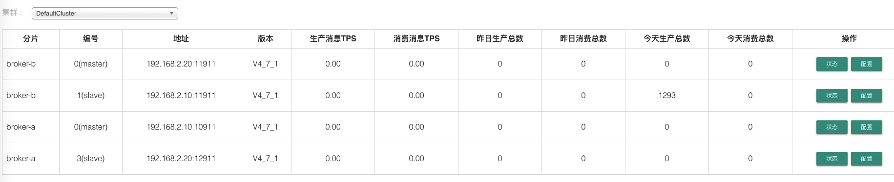

### 2.遇到的问题

> 1、即使配置文件中写了名称服务器的地址，但依然注册不上

```properties
# 名称服务器的地址
nameServerAddr=192.168.2.10:9876,192.168.2.20:9876
```


```shell
tail -f nohup.out 

# 查看日志时，发现启动 broker 时没有注册到 NameServer，即使配置文件中写了
The broker[broker-a, 192.168.2.10:10911] boot success. serializeType=JSON
The broker[broker-a, 192.168.2.10:12911] boot success. serializeType=JSON
```

> 解决办法：启动的时候再指定一遍名称服务器
>
> ```shell
> # 可以同时指定多个名称服务器（注意服务器之间用 ; 来隔开，但是不能后台运行）
> nohup ./mqbroker -c ../conf/2m-2s-async/broker-a-s.properties -n 192.168.2.10:9876;192.168.2.20:9876 &
> 
> # 对应的日志如下（制定了两个名称服务器，但是只会显示一个）
> The broker[broker-a, 192.168.2.20:12911] boot success. serializeType=JSON and name server is 192.168.2.10:9876
> ```
>
> 

```shell
nohup ./mqbroker -c ../conf/2m-2s-async/broker-a.properties -n 192.168.2.10:9876 &
The broker[broker-a, 192.168.2.10:12911] boot success. serializeType=JSON and name server is 192.168.2.10:9876
The broker[broker-a, 192.168.2.10:10911] boot success. serializeType=JSON and name server is 192.168.2.10:9876
```


### 3.不要试图使用docker，问题太多了

> 使用`docker`中的`NameServer`，将找不到`broker`，导致注册失败

```shell
# 获取 nameServer
docker pull rocketmqinc/rocketmq-namesrv:4.5.0-centos

# 获取 broker 镜像
docker pull rocketmqinc/rocketmq-broker:4.5.0-centos

# 启动一个临时 broker
luo@luodeMacBook-Pro ~ % docker run -it --name broker-m-1 rocketmqinc/rocketmq-broker:4.5.0-centos /bin/bash

# 拷贝其配置文件到物理机磁盘
luo@luodeMacBook-Pro bin % docker cp broker-m-1:/home/rocketmq/rocketmq-4.5.0/conf /Volumes/extend/docker_public_file_mapping/rocketMQ_dev

# 查看常量名字
[rocketmq@eed84e8f85cf bin]$ export
declare -x ROCKETMQ_HOME="/home/rocketmq/rocketmq-4.5.0"

# 删除临时 broker
luo@luodeMacBook-Pro ~ % docker rm broker-m-1
# 启动broker
```


```shell
# 启动 broker-a-master
luo@luodeMacBook-Pro bin % docker run -it --name broker-a -v '/Volumes/extend/docker_public_file_mapping/rocketMQ_dev/conf':/home/rocketmq/rocketmq-4.5.0/conf rocketmqinc/rocketmq-broker:4.5.0-centos  sh mqbroker -n 192.168.2.1:9876 -c /home/rocketmq/rocketmq-4.5.0/conf/2m-2s-async/broker-a.properties  
The broker[broker-a, 172.17.0.3:10911] boot success. serializeType=JSON and name server is 192.168.2.1:9876

# 启动 broker-a-slave
luo@luodeMacBook-Pro bin % docker run -it --name broker-a-s -v '/Volumes/extend/docker_public_file_mapping/rocketMQ_dev/conf':/home/rocketmq/rocketmq-4.5.0/conf rocketmqinc/rocketmq-broker:4.5.0-centos  sh mqbroker -n 192.168.2.1:9876 -c /home/rocketmq/rocketmq-4.5.0/conf/2m-2s-async/broker-a-s.properties 
The broker[broker-a, 172.17.0.4:10911] boot success. serializeType=JSON and name server is 192.168.2.1:9876

# 问题，启动另一个 主从 broker 会导致 上一个 主从 broker 结束

# 启动 broker-b-master
luo@luodeMacBook-Pro bin % docker run -it --name broker-b -v '/Volumes/extend/docker_public_file_mapping/rocketMQ_dev/conf':/home/rocketmq/rocketmq-4.5.0/conf rocketmqinc/rocketmq-broker:4.5.0-centos  sh mqbroker -n 192.168.2.1:9876 -c /home/rocketmq/rocketmq-4.5.0/conf/2m-2s-async/broker-b.properties 
The broker[broker-b, 172.17.0.5:10911] boot success. serializeType=JSON and name server is 192.168.2.1:9876

# 启动 broker-b-slave
luo@luodeMacBook-Pro bin % docker run -it --name broker-b-s -v '/Volumes/extend/docker_public_file_mapping/rocketMQ_dev/conf':/home/rocketmq/rocketmq-4.5.0/conf rocketmqinc/rocketmq-broker:4.5.0-centos  sh mqbroker -n 192.168.2.1:9876 -c /home/rocketmq/rocketmq-4.5.0/conf/2m-2s-async/broker-b-s.properties 
The broker[broker-b, 172.17.0.4:10911] boot success. serializeType=JSON and name server is 192.168.2.1:9876

docker run -it --name broker-b -p 13909:10909 -p 13919:10919 -p 13912:10912 -p 13911:10911  -v '/Volumes/extend/docker_public_file_mapping/rocketMQ_dev/conf':/home/rocketmq/rocketmq-4.5.0/conf rocketmqinc/rocketmq-broker:4.5.0-centos  sh mqbroker -n 192.168.2.1:9876 -c /home/rocketmq/rocketmq-4.5.0/conf/2m-2s-async/broker-b.properties
luo@luodeMacBook-Pro bin % 
```


## 七、MQ用法

> [原文地址](https://github.com/apache/rocketmq/blob/master/docs/cn/RocketMQ_Example.md)

### 1 顺序消息样例

消息有序指的是可以按照消息的发送顺序来消费(FIFO)。RocketMQ可以严格的保证消息有序，可以分为分区有序或者全局有序。

顺序消费的原理解析，在默认的情况下消息发送会采取Round Robin轮询方式把消息发送到不同的queue(分区队列)；而消费消息的时候从多个queue上拉取消息，这种情况发送和消费是不能保证顺序。但是如果控制发送的顺序消息只依次发送到同一个queue中，消费的时候只从这个queue上依次拉取，则就保证了顺序。当发送和消费参与的queue只有一个，则是全局有序；如果多个queue参与，则为分区有序，即相对每个queue，消息都是有序的。

下面用订单进行分区有序的示例。一个订单的顺序流程是：创建、付款、推送、完成。订单号相同的消息会被先后发送到同一个队列中，消费时，同一个OrderId获取到的肯定是同一个队列。

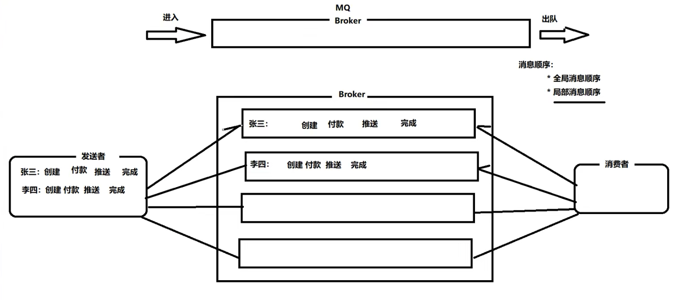

## 八、事务消息

### 1、场景描述

1. 工行系统发送一个给用户B增款一万元的同步消息`M`给`Broker`
2. 消息被`broker`成功接收之后，向工行系统返回发送成功的`ACK`
3. 工行系统收到成功`ACK`之后从用户`A`中扣款一万元
4. 建行系统从`Broker`中获取到消息`M`
5. 建行系统消费消息`M`，即向用户B中增加一万元

> 存在的问题：
>
> 第三步的扣款失败，但是消息已经成功发送到了`Broker`。对于`MQ`来说，只要消息写入成功，那么这个消息就可以被消费。此时建行系统中为B用户增加了一万元。出现了数据不一致的问题

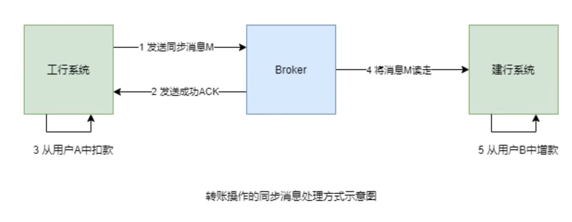

### 2、解决思路

让第1、2、3步具有原子性，要么全部成功，要么全部失败。即消息发送成功之后，必须要保证扣款成功。如果扣款失败，则必须回滚已经发送成功的消息。需要使用`事物消息`

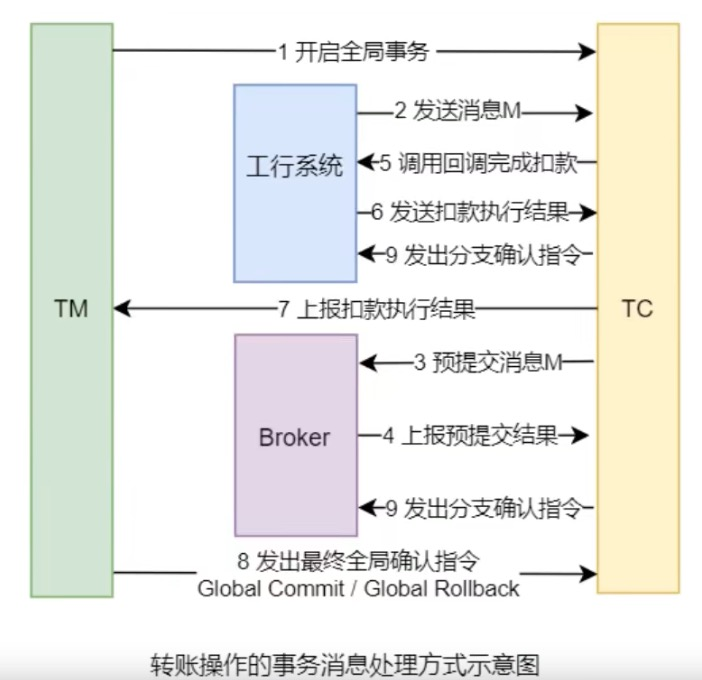

1. 事务管理器`TM`向事务协调器`TC`发起指令，开启全局事务

2. 工行系统发送一个给B增款一万元的事务消息`M`给`TC`

3. `TC`会向`Broker`发送一个半事务消息`prepareHalf`，将消息预提交到`Broker`。此时的建行系统是看不到`Broker`中的消息`M`的

4. `Broker`会将预提交执行结果`Report`给`TC`

5. 如果预提交失败，则`TC`会向`TM`上报预提交失败的响应，全局事务结束。

   如果预提交成功，`TC`会调用工行系统的回调操作，去完成工行用户A的**预扣款**一万元的操作

6. 工行系统会向`TC`发送预扣款执行结果，即本地事务的执行状态

7. `TC`收到预扣款执行结果后，会将结果上报给`TM`

> 预扣款执行结果存在三种状态
>
> Commit_Message：本地事务执行成功
>
> Rollback_Message：本地事务执行失败
>
> Unknow：不确定，表示需要执行回查以确定本地事务的状态

8. `TM`会根据上报结果向`TC`发出不同的确认指令

* 若**`预扣款`**成功（本地事务的状态为`Commit_Message`），则`TM`向`TC`发送`Global Commit`指令

* 若**`预扣款`**失败（本地事务状态为`Rollback_Message`），则会触发工行本系统的本地事务状态**`回查操作`**，回查操作回将回查结果，即`Commit_Message`或`Rollback_Message` `Report`给`TC`。`TC`将结果上报给`TM`，`TM`会再次向`TC`发送最终确认指令`Global_Commit`或`Global_Rollback`
* 若出现**`未知状态`**，本地事务状态为`Unknow`，则会触发工行系统的本地事务状态`回查操作`，回查操作将返回回查的结果，即`Commit_Message`或`Commit_Rollback` `Report`给`TC`。`TC`将结果上报给`TM`，`TM`会再次向`TC`发送最终确认指令`Global_Commit`或`Global_Rollback`指令
9. `TC` 在接收到指令之后会向`Broker`与工行系统发送确认指令

* `TC`接受到的如果是`Global_Commit`指令，则向`Broker`与工行系统发送`Branch Commit`指令。此时`Broker`中的消息`M`才可以被建行系统看到，工行用户`A`中的扣款操作才真正被确认
* `TC`接收到的若是`Global_Rollback`指令，则向`Broker`与工行系统发送`Branch_Rollback`指令。此时`Broker`中的消息`M`将被撤销；工行用户`A`中的扣款操作将被回滚

> 以上方案就是为了确保**`消息投递`**与**`扣款操作`**能够在一个事务中，要么都成功。如果有一个失败就全部回滚
>
> 以上方案并不是一个典型的`XA`模式。因为`XA`模式中的分支事务是异步的

### 3、基础

#### （1）分布式事务

一次操作由若干分支操作组成，这些分支操作隶属于不同的应用，分布在不同的服务器上。分布式事务需要保证这些分支操作要么全部成功，要么全部失败。分布式事务与普通事务一样，都是为了保证操作结果的一致性。

#### （2）事务消息

`Rocket MQ`提供了类似`X/Open ` `XA`的分布式事务的功能，通过事务消息能达到分布式事务的最终一致。`XA`是一种分布式事务解决方案，一种分布式事务处理模式

#### （3）半事务消息

暂不能投递的消息，发送方已经成功的将消息发送到了`Broker`，但是`Broker`未收到最终确认指令，此时该消息被标记成**`暂时不能投递`**状态，即不能被消费者看到。处于这种状态下的消息即为半事务消息

#### （4）半事务状态

`Producer`回调操作执行的结果为本地事务状态，其会发送给`TC`，而`TC`会再次发送给`TM`。`TM`会根据`TC`发送来的本地事务状态来决定全局事务确认指令

### 4、消息回查

重新查询本地事务的执行状态本例子就是重新到DB中查看**`预扣款`**操作是否成功执行

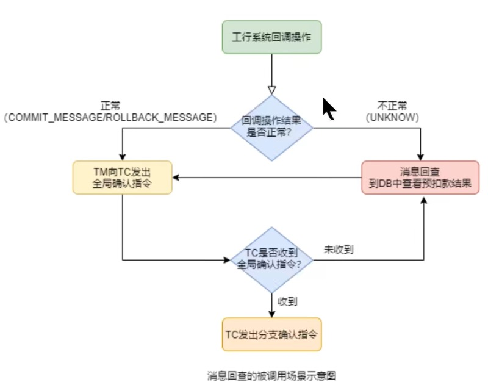

> 注意：
>
> 消息回查不是从新执行消息回调操作。回调操作是执行预扣款操作
>
> 消息回查查看预扣款操作的执行结果
>
> 引发消息回查的原因：
>
> （1）回调操作返回`Unknow`
>
> （2）`TC`没有接收到`TM`的最终全局事务确认指令

#### （1）RocketMQ中的消息回查设置

在`Broker`加载的配置文件中设置

`transactionTimeout=20`：指定`TM`在`20`秒内应将最终确认状态发送给`TC`，否则引发消息回查。默认为60秒

`transactionCheckMax=5`：指定最多回查`5`次，超过之后将丢弃消息并记录错误日志。默认`15`次

`transactionCheckInterval=10`：指定设置多次消息回查的时间间隔为`10`秒。默认为`60`秒