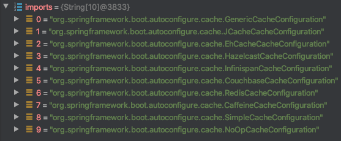
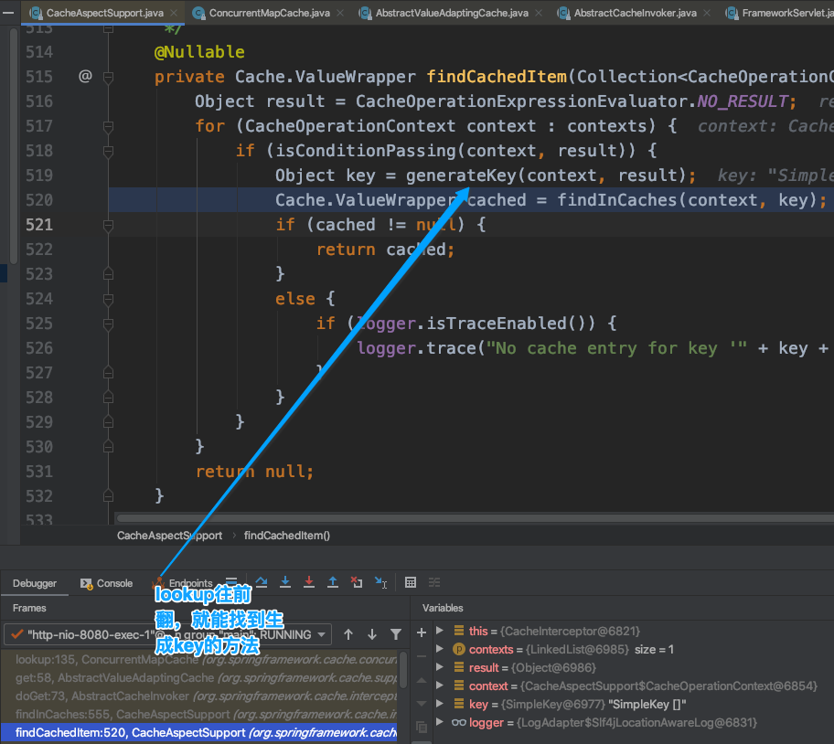

# Spring 缓存开发

## 1. 快速入门

```java
// 如果缓存中没有该user，则通过数据库查询，并将查询到的结果放入缓存中，如果缓存中已经有该缓存，则直接返回缓存，跳过本方法
@Cacheable //主要针对方法进行配置
public User selectUserByUserId(Integer userId);

@CacheEvict //删除用户之后一并删除该缓存
public void deleteUserByUserId(int userId);

//@CatchePut修饰的方法一定会被调用，方法执行后的结果放入缓存中
@CachePut //更新缓存，数据库更新之后，一并更新用户
public void updateUser(User user);

//开启基于注解的缓存
@EnableCaching

keyGenerator //缓存数据时key生成策略
  
serialize //缓存数据时value序列化策略，是将查询到的User序列化放入缓存中，还是转为json再放入缓存中  
```

| 名字        | 位置               | 描述                                                         | 实例                 |
| ----------- | ------------------ | ------------------------------------------------------------ | -------------------- |
| methodName  | root object        | 当前被调用的方法名字                                         | #root.methodName     |
| method      | root object        | 当前被调用的方法                                             | #root.method.name    |
| target      | root object        | 当前被调用的目标对象                                         | #root.target         |
| targetClass | root object        | 当前被调用的目标对象类                                       | #root.targetClass    |
| args        | root object        | 当前被调用方法的参数列表                                     | #root.args[0]        |
| chches      | root object        | 当前方法调用使用缓存的列表。如@Cacheable(value={"cache1","cache2"})），则有两个cache | #root.caches[0].name |
| argument    | evaluation context | 方法参数的名字，可以直接#参数名,也可以使用#p0或者#a0形式，0代表参数的索引 | #iban,#a0,#p0        |
| result      | evaluation context | 方法执行后的返回值（仅当方法执行之后的判断有效）。如：'unless','cache put'的表达式'cache evict' 的表达式 beforeInvocation=false | #result              |


## 2. 缓存自动配置原理

```java
@Configuration(proxyBeanMethods = false)
@ConditionalOnClass(CacheManager.class)
@ConditionalOnBean(CacheAspectSupport.class)
@ConditionalOnMissingBean(value = CacheManager.class, name = "cacheResolver")
@EnableConfigurationProperties(CacheProperties.class)
@AutoConfigureAfter({ CouchbaseAutoConfiguration.class, HazelcastAutoConfiguration.class,
		HibernateJpaAutoConfiguration.class, RedisAutoConfiguration.class })
// 会自动导入其内部的静态类 CacheConfigurationImportSelector
@Import({ CacheConfigurationImportSelector.class, CacheManagerEntityManagerFactoryDependsOnPostProcessor.class })
public class CacheAutoConfiguration {
  
  	/**
	 * {@link ImportSelector} to add {@link CacheType} configuration classes.
	 */
	static class CacheConfigurationImportSelector implements ImportSelector {

		@Override
		public String[] selectImports(AnnotationMetadata importingClassMetadata) {
			CacheType[] types = CacheType.values();
			String[] imports = new String[types.length];
			for (int i = 0; i < types.length; i++) {
				imports[i] = CacheConfigurations.getConfigurationClass(types[i]);
			}
      // 导入Cache的配置类
			return imports;
		}

	}
}
```

导入的缓存配置类



可以在application.properties中添加debug=true可以查看哪一个缓存配置类生效
默认是Cache org.springframework.boot.autoconfigure.cache.SimpleCacheConfiguration 生效

```java
@Configuration(proxyBeanMethods = false)
@ConditionalOnMissingBean(CacheManager.class)
@Conditional(CacheCondition.class)
class SimpleCacheConfiguration {
	
  // 给容器中注册了一个缓存管理器 ConcurrentMapCacheManager
  // ConcurrentMapCacheManager 实现了 CacheManager 接口
  // 可以用于获取 ConcurrentMapCache 类型的缓存组件，将缓存的数据保存在ConcurrentMap中
	@Bean
	ConcurrentMapCacheManager cacheManager(CacheProperties cacheProperties,
			CacheManagerCustomizers cacheManagerCustomizers) {
		ConcurrentMapCacheManager cacheManager = new ConcurrentMapCacheManager();
		List<String> cacheNames = cacheProperties.getCacheNames();
		if (!cacheNames.isEmpty()) {
			cacheManager.setCacheNames(cacheNames);
		}
		return cacheManagerCustomizers.customize(cacheManager);
	}

}
```

缓存管理器

```java
public class ConcurrentMapCacheManager implements CacheManager, BeanClassLoaderAware {
		// 映射 缓存名字和缓存
  	private final ConcurrentMap<String, Cache> cacheMap = new ConcurrentHashMap<>(16);
		
  
	// 获取缓存的时候执行
	@Override
	@Nullable
	public Cache getCache(String name) {
		Cache cache = this.cacheMap.get(name);
		if (cache == null && this.dynamic) {
			synchronized (this.cacheMap) { //锁一下
				cache = this.cacheMap.get(name);
				if (cache == null) {
          // 缓存为null，则创建缓存
					cache = createConcurrentMapCache(name);
					this.cacheMap.put(name, cache);
				}
			}
		}
		return cache;
	}
}
```

缓存

```java
public class ConcurrentMapCache extends AbstractValueAdaptingCache {
	//	将换粗你的数据保存在ConcurrentMap中
  private final ConcurrentMap<Object, Object> store;
	
  
  	@Override
	@Nullable
	public <T> T get(Object key, Callable<T> valueLoader) {
		return (T) fromStoreValue(this.store.computeIfAbsent(key, k -> {
			try {
				return toStoreValue(valueLoader.call());
			}
			catch (Throwable ex) {
				throw new ValueRetrievalException(key, valueLoader, ex);
			}
		}));
	}
  
}
```

## 3. 运行流程

### （1）@Cacheable

**@Cacheable标注的方法在执行之前先来检查缓存中有没有这个数据，默认按照方法参数的值作为key去查询数据，否则使用SimpleKeyGenerator生成key。如果缓存中没有该key对应的数据，就运行该方法并将结果放入缓存**

SimpleKeyGenerator的生成策略：


#### 1. 查询缓存组件

   @Cacheable注解标注的方法运行之前，缓存管理器先去查询cache（缓存组件），按照cacheNames指定的名字获取。（cacheManager先获取相应的缓存）。第一次获取缓存，如果没有cache组件，会自动创建

   ```java
   // 缓存管理器类
   public class ConcurrentMapCacheManager implements CacheManager, BeanClassLoaderAware {
   
     	private final ConcurrentMap<String, Cache> cacheMap = new ConcurrentHashMap<>(16);
   
     
     @Override
   	@Nullable
   	public Cache getCache(String name) {	// 先执行查询cache组件
   		Cache cache = this.cacheMap.get(name);
   		if (cache == null && this.dynamic) {
   			synchronized (this.cacheMap) {
   				cache = this.cacheMap.get(name);
   				if (cache == null) {
   					cache = createConcurrentMapCache(name); // 没有缓存，则自己创建缓存
   					this.cacheMap.put(name, cache);	// 将缓存放入map
   				}
   			}
   		}
   		return cache;
   	}
   }
   ```

#### 2. 在缓存组件中查找cache缓存

   ```java
   public class ConcurrentMapCache extends AbstractValueAdaptingCache {
   
   	private final String name;
   
   	private final ConcurrentMap<Object, Object> store;
     
     	@Override
   	@Nullable
   	protected Object lookup(Object key) {
   		return this.store.get(key);
   	}
   }  
   ```

   key是按照某种生成策略生成的



   ```java
   public abstract class CacheAspectSupport extends AbstractCacheInvoker
   		implements BeanFactoryAware, InitializingBean, SmartInitializingSingleton {	
   @Nullable
   	private Cache.ValueWrapper findCachedItem(Collection<CacheOperationContext> contexts) {
   		Object result = CacheOperationExpressionEvaluator.NO_RESULT;
   		for (CacheOperationContext context : contexts) {
   			if (isConditionPassing(context, result)) {
   				Object key = generateKey(context, result); // 调用生成key的方法
   				Cache.ValueWrapper cached = findInCaches(context, key);
   				if (cached != null) {
   					return cached;
   				}
   				else {
   					if (logger.isTraceEnabled()) {
   						logger.trace("No cache entry for key '" + key + "' in cache(s) " + context.getCacheNames());
   					}
   				}
   			}
   		}
   		return null;
   	}
     	// 调用生成key的方法
     	private Object generateKey(CacheOperationContext context, @Nullable Object result) {
   		Object key = context.generateKey(result);
   		if (key == null) {
   			throw new IllegalArgumentException("Null key returned for cache operation (maybe you are " +
   					"using named params on classes without debug info?) " + context.metadata.operation);
   		}
   		if (logger.isTraceEnabled()) {
   			logger.trace("Computed cache key '" + key + "' for operation " + context.metadata.operation);
   		}
   		return key;
   	}
     	// 调用内部类的生成key的方法
     	protected class CacheOperationContext implements CacheOperationInvocationContext<CacheOperation> {
   
         protected Object generateKey(@Nullable Object result) {
             if (StringUtils.hasText(this.metadata.operation.getKey())) {
               EvaluationContext evaluationContext = createEvaluationContext(result);
               return evaluator.key(this.metadata.operation.getKey(), this.metadata.methodKey, evaluationContext);
             }
           // 调用keyGenerator生成key
             return this.metadata.keyGenerator.generate(this.target, this.metadata.method, this.args);
           }
       }
   }
   ```

#### 3. 如果没有查询到目标缓存

调用目标方法（数据库操作的方法）

```java
    @Cacheable(cacheNames = "emp",unless = "#result == null")
    @Override
    public List<Employee> findAllEmployees() {

        logger.info("进入数据库查询所有雇员信息");

        List<Employee> employees = this.employeeMapper.selectByExample(new EmployeeExample());

        for (Employee employee : employees) {
            Department department = this.departmentMapper.selectByPrimaryKey(employee.getDepartmentId());
            employee.setDepartment(department);
        }

        return employees;
    }
```

生成key的策略

```java
public class SimpleKeyGenerator implements KeyGenerator {

public static Object generateKey(Object... params) {
		if (params.length == 0) {
      //	public static final SimpleKey EMPTY = new SimpleKey();
			return SimpleKey.EMPTY; // 如果这个方法（数据库操作方法findAll()）没有参数，则返回一个对象作为key
		}
		if (params.length == 1) { // 如果有一个参数，就把这个参数作为key，返回
			Object param = params[0];
			if (param != null && !param.getClass().isArray()) {
				return param;
			}
		}
  // 如果有多个参数，把多个参数封装好了再作为key返回
		return new SimpleKey(params);
	}
}
```


#### 4. 将目标方法返回的结果，放进缓存中

```java
public class ConcurrentMapCache extends AbstractValueAdaptingCache {

	private final String name;

	private final ConcurrentMap<Object, Object> store;
  
	// key
  // value 就是数据库操作方法，返回的结果
  @Override
	public void put(Object key, @Nullable Object value) {
		this.store.put(key, toStoreValue(value));
	}
}
```

#### 5. 核心

1）使用CacheManager（默认使用ConcurrentMapCacheManager）根据key得到Cache组件（ConcurrentHashMap）

2）key是通过keyGenerator生成的，默认是SimpleKeyGenerator

## 4. Redis缓存配置

**一定要记得使用 @EnableCaching 注解**

### （1）Redis自动配置类

```java
@Configuration(proxyBeanMethods = false)
@ConditionalOnClass(RedisOperations.class)  // 只要引入的RedisOperations就创建RedisAutoConfiguration对象
@EnableConfigurationProperties(RedisProperties.class)
@Import({ LettuceConnectionConfiguration.class, JedisConnectionConfiguration.class })
public class RedisAutoConfiguration {

	@Bean
	@ConditionalOnMissingBean(name = "redisTemplate")
	public RedisTemplate<Object, Object> redisTemplate(RedisConnectionFactory redisConnectionFactory)
			throws UnknownHostException {
		RedisTemplate<Object, Object> template = new RedisTemplate<>();
		template.setConnectionFactory(redisConnectionFactory);
		return template;
	}

	@Bean
	@ConditionalOnMissingBean
	public StringRedisTemplate stringRedisTemplate(RedisConnectionFactory redisConnectionFactory)
			throws UnknownHostException {
		StringRedisTemplate template = new StringRedisTemplate();
		template.setConnectionFactory(redisConnectionFactory);
		return template;
	}

}
```

### （2）SimpleCacheConfiguration 自动配置类

```java
@Configuration(proxyBeanMethods = false)
@ConditionalOnMissingBean(CacheManager.class) //IOC中没有CacheManager对象的时候，才创建SimpleCacheConfiguration
@Conditional(CacheCondition.class)
class SimpleCacheConfiguration {

	@Bean
	ConcurrentMapCacheManager cacheManager(CacheProperties cacheProperties,
			CacheManagerCustomizers cacheManagerCustomizers) {
		ConcurrentMapCacheManager cacheManager = new ConcurrentMapCacheManager();
		List<String> cacheNames = cacheProperties.getCacheNames();
		if (!cacheNames.isEmpty()) {
			cacheManager.setCacheNames(cacheNames);
		}
		return cacheManagerCustomizers.customize(cacheManager);
	}

}
```

因为RedisAutoConfiguration 也实现了CacheManager接口，所以 RedisAutoConfiguration创建的时候，SimpleCacheConfiguration就不会创建了

```java
public class RedisTemplate<K, V> extends RedisAccessor implements RedisOperations<K, V>, BeanClassLoaderAware {
	
  // RedisTemplate 默认使用的序列化器
	private RedisSerializer<String> stringSerializer = RedisSerializer.string();
}
```

### （3）Redis 缓存管理器配置类

```java
@Configuration(proxyBeanMethods = false)
@ConditionalOnClass(RedisConnectionFactory.class)
@AutoConfigureAfter(RedisAutoConfiguration.class)
@ConditionalOnBean(RedisConnectionFactory.class)
@ConditionalOnMissingBean(CacheManager.class)
@Conditional(CacheCondition.class)
class RedisCacheConfiguration {
  
  @Bean
	RedisCacheManager cacheManager(CacheProperties cacheProperties, CacheManagerCustomizers cacheManagerCustomizers,
			ObjectProvider<org.springframework.data.redis.cache.RedisCacheConfiguration> redisCacheConfiguration,
			ObjectProvider<RedisCacheManagerBuilderCustomizer> redisCacheManagerBuilderCustomizers,
			RedisConnectionFactory redisConnectionFactory, ResourceLoader resourceLoader) {
		RedisCacheManagerBuilder builder = RedisCacheManager.builder(redisConnectionFactory).cacheDefaults(
				determineConfiguration(cacheProperties, redisCacheConfiguration, resourceLoader.getClassLoader()));
		List<String> cacheNames = cacheProperties.getCacheNames();
		if (!cacheNames.isEmpty()) {
			builder.initialCacheNames(new LinkedHashSet<>(cacheNames));
		}
		redisCacheManagerBuilderCustomizers.orderedStream().forEach((customizer) -> customizer.customize(builder));
		return cacheManagerCustomizers.customize(builder.build());
	}
  
}
```

### （4）Redis缓存管理器

redis缓存管理器RedisCacheConfiguration 帮我们创建 RedisCache 作为缓存

RedisCache 通过操作redis来缓存数据

```java
@Configuration(proxyBeanMethods = false)
@ConditionalOnClass(RedisConnectionFactory.class)
@AutoConfigureAfter(RedisAutoConfiguration.class)
@ConditionalOnBean(RedisConnectionFactory.class)
@ConditionalOnMissingBean(CacheManager.class)
@Conditional(CacheCondition.class)
class RedisCacheConfiguration {
  	
  // 创建缓存的方法
  	protected RedisCache createRedisCache(String name, @Nullable RedisCacheConfiguration cacheConfig) {
		return new RedisCache(name, cacheWriter, cacheConfig != null ? cacheConfig : defaultCacheConfig);
	}

  
}
```

### （5）序列化方式

```java
// 此时，即使设置了序列化器，对象存储到redis中，依然使用的是jdk序列化的方式（效率低）
        Jackson2JsonRedisSerializer<Employee> employeeSerializer = new Jackson2JsonRedisSerializer<Employee>(Employee.class);
template.setDefaultSerializer(employeeSerializer);
```

1. 引入了 redis-starter 之后，就默认创建RedisCacheManager作为默认的缓存管理器

```java
@Configuration(proxyBeanMethods = false)
@ConditionalOnClass(RedisConnectionFactory.class)
@AutoConfigureAfter(RedisAutoConfiguration.class)
@ConditionalOnBean(RedisConnectionFactory.class)
@ConditionalOnMissingBean(CacheManager.class) // 可以定义自己的RedisCacheManager
@Conditional(CacheCondition.class)
class RedisCacheConfiguration {
	
  // 默认创建 RedisCacheManager 作为缓存管理器
  // 参数 CacheProperties cacheProperties
	@Bean
	RedisCacheManager cacheManager(CacheProperties cacheProperties, CacheManagerCustomizers cacheManagerCustomizers,
			ObjectProvider<org.springframework.data.redis.cache.RedisCacheConfiguration> redisCacheConfiguration,
			ObjectProvider<RedisCacheManagerBuilderCustomizer> redisCacheManagerBuilderCustomizers,
			RedisConnectionFactory redisConnectionFactory, ResourceLoader resourceLoader) {
		RedisCacheManagerBuilder builder = RedisCacheManager.builder(redisConnectionFactory).cacheDefaults(
				determineConfiguration(cacheProperties, redisCacheConfiguration, resourceLoader.getClassLoader()));
		List<String> cacheNames = cacheProperties.getCacheNames();
		if (!cacheNames.isEmpty()) {
			builder.initialCacheNames(new LinkedHashSet<>(cacheNames));
		}
		redisCacheManagerBuilderCustomizers.orderedStream().forEach((customizer) -> customizer.customize(builder));
		return cacheManagerCustomizers.customize(builder.build());
	}
}
```

#### 1.springBoot 1.x 版本的RedisCacheManger配置

```java
  @Bean
    public RedisTemplate<Object,Object> redisTemplate(
            RedisConnectionFactory redisConnectionFactory
    ){
        RedisTemplate<Object , Object> redis = new RedisTemplate<Object, Object>();
        redis.setConnectionFactory(redisConnectionFactory);
        //获取jackson序列化器
        Jackson2JsonRedisSerializer<Object> serializer = new Jackson2JsonRedisSerializer<Object>(Object.class);
        //设置序列化器
        redis.setDefaultSerializer(serializer);
        return redis;
    };

//这里可以拓展使用自定义的RedisTemplate<Object , Object > 自定义缓存
@Bean
public CacheManager cacheManager(RedisTemplate<Object,Object> redisTemplate) {
    RedisCacheManager cacheManager= new RedisCacheManager(redisTemplate);
    cacheManager.setUsePrefix(true);
  
/*   
自定义重写的话可以不用写这一段
 Map<String,Long> expiresMap=new HashMap<>();
    expiresMap.put("Product",5L);
    cacheManager.setExpires(expiresMap);
*/
    return cacheManager; //直接返回即可
}
————————————————
版权声明：本文为CSDN博主「Adorable_Rocy」的原创文章，遵循CC 4.0 BY-SA版权协议，转载请附上原文出处链接及本声明。
原文链接：https://blog.csdn.net/weixin_43409994/java/article/details/106312041
```

#### 2. springBoot 2.x 版本的CacheManger配置

```java
// 配置后500的清空一下redis里面的数据 
@Bean
    public CacheManager cacheManager(RedisConnectionFactory factory) {
        RedisCacheConfiguration cacheConfiguration =
                RedisCacheConfiguration.defaultCacheConfig()
                        .entryTtl(Duration.ofDays(1))
                        .disableCachingNullValues()
                        .serializeValuesWith(RedisSerializationContext.SerializationPair.fromSerializer(new
                                GenericJackson2JsonRedisSerializer()));
        return RedisCacheManager.builder(factory).cacheDefaults(cacheConfiguration).build();
    }
————————————————
版权声明：本文为CSDN博主「Adorable_Rocy」的原创文章，遵循CC 4.0 BY-SA版权协议，转载请附上原文出处链接及本声明。
原文链接：https://blog.csdn.net/weixin_43409994/java/article/details/106312041
```

#### 3. 在jackson读取缓存时出现异常解决

```java
at [Source: (byte[])"{"@class":"org.framwork.springbootcatchs.domain.Employee","id":1,"lastName":"aa","email":null,"gender":null,"d_id":null}"; line: 1, column: 59]; nested exception is com.fasterxml.jackson.databind.exc.InvalidDefinitionException: Cannot construct instance of `org.framwork.springbootcatchs.domain.Employee` (no Creators, like default constructor, exist): cannot deserialize from Object value (no delegate- or property-based Creator)
 at [Source: (byte[])"{"@class":"org.framwork.springbootcatchs.domain.Employee","id":1,"lastName":"aa","email":null,"gender":null,"d_id":null}"; line: 1, column: 59]] with root cause

com.fasterxml.jackson.databind.exc.InvalidDefinitionException: Cannot construct instance of `org.framwork.springbootcatchs.domain.Employee` (no Creators, like default constructor, exist): cannot deserialize from Object value (no delegate- or property-based Creator)
 at [Source: (byte[])"{"@class":"org.framwork.springbootcatchs.domain.Employee","id":1,"lastName":"aa","email":null,"gender":null,"d_id":null}"; line: 1, column: 59]
	at com.fasterxml.jackson.databind.exc.InvalidDefinitionException.from(InvalidDefinitionException.java:67) ~[jackson-databind-2.11.0.jar:2.11.0]
	

```

原因：**在该实体类中添加了一个为了方便实例化该类用的构造函数，导致JVM不会添加默认的无参构造函数，而jackson的反序列化需要无参构造函数，因此报错。**

解决：**在实体类中补上一个无参构造器即可**

