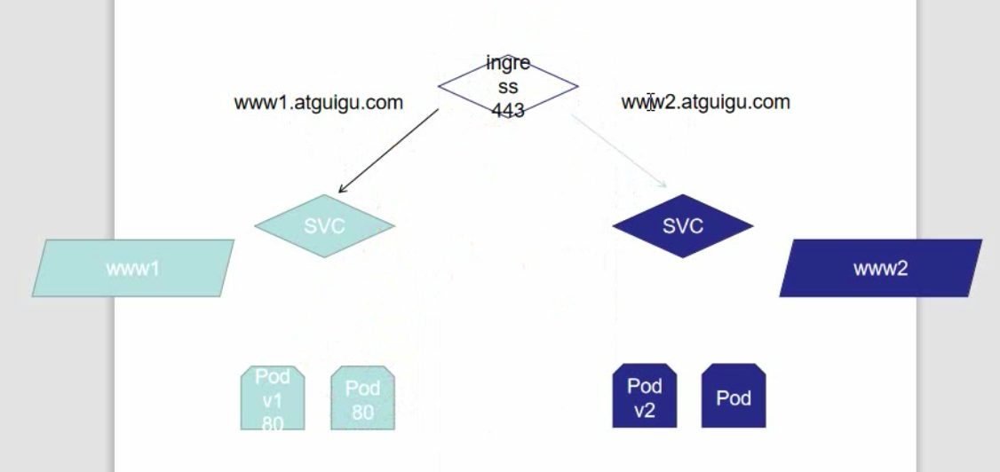
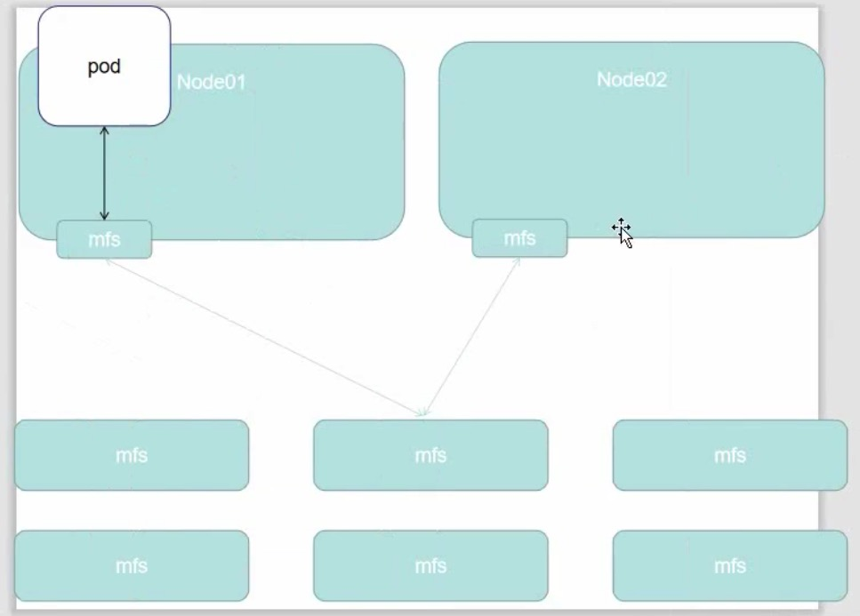
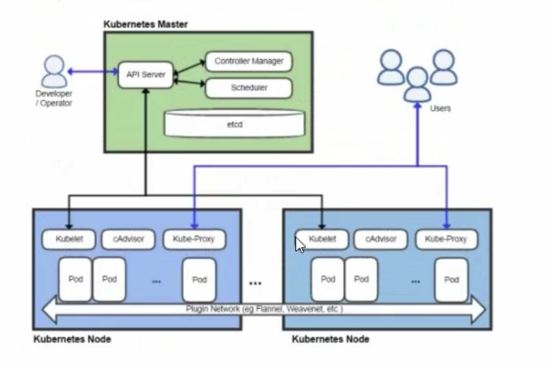
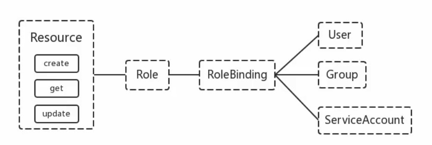

arm 版 archlinux 下载国内镜像源：`https://mirrors.ustc.edu.cn/`

查看可用的块设备

```shell
apt install -y util-linux
lsblk
```


```shell
# 使用带图形界面的分区工具
cfdisk 

# 分区之后，发现只有 root 分区是 ext4 的文件格式，
# 如果要挂载一个分区，就必须先将这个分区格式化
# efi 分区没有被格式化，所以不能挂载
# 以下命令将 efi 分区格式化为 ext4 格式
# mkfs.ext4 /dev/sda1
mkfs.fat -F32 /dev/sda1

# 将根分区挂载到 /mnt 我这里的根分区是 /dev/sda3
mount /dev/root_partition（根分区） /mnt

# 然后使用 mkdir(1) 创建其他剩余的挂载点（比如 /mnt/efi）并挂载其相应的磁盘卷。
# 创建 efi 文件夹
# 注意： 挂载分区一定要遵循顺序，先挂载根（root）分区（到 /mnt），再挂载引导（boot）分区（到 /mnt/boot 或 /mnt/efi，如果单独分出来了的话），最后再挂载其他分区。否则您可能遇到安装完成后无法启动系统的问题。

mkdir /mnt/efi

# 挂载 efi分区
mount /dev/sda1 /mnt/efi

# 如果创建了 swap 交换空间卷，请使用 swapon(8) 启用它：


```


> 遇到不能将引导写入efi分区的问题
>
> `https://superuser.com/questions/1053388/grub2-install-error-boot-efi-doesnt-look-like-an-efi-partition-on-a-fresh-ge/1053435`
>
> 官方安装教程
>
> `https://wiki.archlinux.org/title/GRUB_(%E7%AE%80%E4%BD%93%E4%B8%AD%E6%96%87)`
>
> The answer is simple. EFI System Partition (ESP) should be FAT32 (FAT16 or even FAT12 will also do for most proper UEFI; they are mostly shown as `vfat` in Linux) instead of ext2:
>
> 将efi分区转为 fat 格式即可

```shell
pacman -Sy grub efibootmgr


grub-install --target=x86_64-efi --efi-directory=/efi --bootloader-id=GRUB
# grub2-install: error: /boot/efi doesn't look like an EFI partition on a fresh Gentoo install

# 此时 efibootmgr 被 安装到了 /efi/EFI/GRUB/grubx64.efi 下

#使用 grub-mkconfig 工具来生成 /boot/grub/grub.cfg：

grub-mkconfig -o /boot/grub/grub.cfg
```

### 修改fat文件系统的卷标

安装

$ sudo apt-get install mtools

新建配置文件

$ cp /etc/mtools.conf ~/.mtoolsrc

编辑刚复制的”~/.mtoolsrc”文件,在最後一行加入如下命令行：

drive i: file="/dev/sda2" //里面的”/devsda2”应根据实际情况更改为你要改的盘

更改命令提示符路径到”i:”盘：

$ mcd i:

查看”i:”当前的卷标

$ sudo mlabel -s i:

更改”i:”盘原始卷标为你喜欢的新卷标名：


```csharp
$ sudo mlabel i: 
 Volume label is XXX
Enter the new volume label :  newLabelName
```

为网卡设置ip

### 设备驱动

默认的 Arch Linux 内核是**模块化**的，，硬件的设备驱动作为[内核模块](https://wiki.archlinux.org/title/Kernel_modules)保存在硬盘上。启动时 [udev](https://wiki.archlinux.org/title/Udev) 会根据硬件加载不同的驱动模块，这就创建了需要的网络接口。

有些无线芯片需要额外的固件，默认安装的 [linux-firmware](https://archlinux.org/packages/?name=linux-firmware) 提供了很多固件。如果缺失需要的固件，请查看 [#安装 driver/firmware](https://wiki.archlinux.org/title/Network_configuration_(简体中文)/Wireless_(简体中文)#安装_driver/firmware).

Udev 不是完美的，有些内核模块需要[手动安装](https://wiki.archlinux.org/title/Kernel_modules#Manual_module_handling). 有些时候 Udev 会同时加载相互冲突的多个模块，就需要[屏蔽](https://wiki.archlinux.org/title/Kernel_modules#Blacklisting) 不需要的模块。

### 检查设备状态

根据设备是 PCI 还是 USB 连接，执行 `lspci -k` 或 `lsusb -v` 检查设备驱动是否已经加载：

```
$ lspci -k
06:00.0 Network controller: Intel Corporation WiFi Link 5100
	Subsystem: Intel Corporation WiFi Link 5100 AGN
	Kernel driver in use: iwlwifi
	Kernel modules: iwlwifi
```

如果是 USB 设备，执行 `dmesg | grep usbcore` 可以看到类似下面的输出 `usbcore: registered new interface driver rtl8187`。

通过 `ip link` 查看无线 ([设备名](https://wiki.archlinux.org/title/Network_configuration#Device_names)[[断开的链接](https://wiki.archlinux.org/title/ArchWiki:Requests#Broken_section_links)：无效的部分]，通常是类似 `wlp2s1`) 的设备。启用设备：

```
# ip link set <设备名> up
```

如果设备加载，接口正常启用，说明不需要安装额外的驱动和固件。

```shell
ip address add 192.168.50.150/24 dev ens33
ip link set ens33 up 

# 添加路由表
# 添加到本网段的路由
ip route add 192.168.50.0/24 dev ens33

# 添加到网关的路由
ip route add default via 192.168.50.1 dev ens33
```

### 设置dns服务器

`https://wiki.archlinux.org/title/Domain_name_resolution_(%E7%AE%80%E4%BD%93%E4%B8%AD%E6%96%87)`

```shell
#选择其它 DNS 服务器
#要使用 DNS 服务器，请编辑 /etc/resolv.conf，把要使用的服务器放到文件的开头，修改是立即生效的。

vi /etc/resolv.conf
# OpenNIC IPv4 nameservers (US)
nameserver 8.8.8.8
```

安装桌面


```shell
pacman -Syy openssh
systemctl enable --now sshd

# 使用 root 账户登录不上
useradd luo
passwd luo

pacman -S xorg plasma plasma-wayland-session kde-applications

```

`https://www.linuxprobe.com/arch-linux-kde.html`


### 设置国内镜像源

1. `sudo vim /etc/pacman.d/mirrorlist`
2. 添加`arch linux`官方包的国内镜像源

```shell
Server = http://mirrors.cqu.edu.cn/archlinux/$repo/os/$arch

Server = http://mirrors.dgut.edu.cn/archlinux/$repo/os/$arch

Server = http://mirrors.zju.edu.cn/archlinux/$repo/os/$arch

Server = http://mirrors.ustc.edu.cn/archlinux/$repo/os/$arch

Server = http://mirrors.tuna.tsinghua.edu.cn/archlinux/$repo/os/$arch

Server = http://mirrors.bfsu.edu.cn/archlinux/$repo/os/$arch

Server = http://mirror.lzu.edu.cn/archlinux/$repo/os/$arch
```


3. `sudo pacman -Syy`

4. 添加国内包的镜像源

   `sudo vim /etc/pacman.conf`

```shell
# 最后一行加上
[archlinuxcn]
SigLevel = Never
Server = https://mirrors.ustc.edu.cn/archlinuxcn/$arch
```

5. 更新软件列表，并且下载`Arch Linux CN PGP keyring`

```shell 
sudo pacman -Syy
sudo pacman archlinuxcn-keyring
```


### luo 不在 sudoers 文件中。此事将被报告

```shell
# 出现这个提示，就是这个用户没法得到超级用户权限。怎么办？变成超级用户：

vi /etc/sudoers

#增加    
ALL=(ALL:ALL) ALL
#某账号 
ALL=(ALL:ALL) ALL

#如果想不输入密码：

ALL=(ALL) NOPASSWD: ALL
```

我的`/etc/sudoers`

```shell
root ALL=(ALL) ALL

## Uncomment to allow members of group wheel to execute any command
%wheel ALL=(ALL) ALL

## Same thing without a password
%wheel ALL=(ALL) NOPASSWD: ALL
```


### 安装输入法

1. 编辑 `sudo nano /etc/pacman.conf `文件

```shell
[archlinuxcn]

SigLevel = Optional TrustedOnly

Server = https://mirrors.ustc.edu.cn/archlinuxcn/$arch
```

2. 让`pacman`的配置生效

```shell
sudo pacman -Syy && sudo pacman -S archlinuxcn-keyring
```

3. 安装谷歌浏览器

```shell
sudo pacman -S google-chrome
```

4. 安装输入法

```shell
sudo pacman -S fcitx-im #默认全部安装

sudo pacman -S fcitx-configtool

sudo pacman -S fcitx-sunpinyin

#为了保险起见，也可以使用下面的安装个谷歌拼音备用
sudo pacman -S fcitx-googlepinyin
```

5. 配置输入法：

编辑 `sudo nano ~/.xprofile `文件

```shell
export LC_ALL=zh_CN.UTF-8

export GTK_IM_MODULE=fcitx

export QT_IM_MODULE=fcitx

export XMODIFIERS=“@im=fcitx”
```

最后重启查看效果


### [linux 修改home目录下的中文目录名为英文](https://www.cnblogs.com/mysic/p/5955388.html)

1. 编辑`/home/luo/.config/user-dirs.dirs`，把所有的中文名称修改为英文名称
2. 在`home`目录下创建对应的英文名称路径
3. 运行 `xdg-user-dirs-update`
4. 重启机器

### 安装驱动

```shell
# 安装xorg驱动
pacman -S xorg

# 安装显卡驱动
#通用:
pacman -S xf86-video-vesa
#英伟达:
pacman -S xf86-video-nv
#ATI:
pacman -S xf86-video-ati

# 安装笔记本触摸板驱动
pacman -S xf86-input-synaptics

# 安装声卡驱动
pacman -S alsa-utils
pacman -Sy alsa-lib alsa-utils
systemctl --user enable pulseaudio

```

### 安装网易云

1、去网易云音乐官网下载一个deb包

2、`pacman -S dpkg`

3、`dpkg -i xxx.deb`

### 安装`windows`微信

```shell
sudo pacman -S yay

yay -S deepin-wine-wechat
yay -S deepin-wine-qq

```

### 安装上网利器

```shell
sudo pacman -S shadowsocks-qt5
```

### 安装虚拟机

```shell
yay -S --noconfirm virtualbox virtualbox-host-modules-arch virtualbox-ext-oracle

# 解决 vmware 无法打开虚拟机
#Ubuntu系统打开Vmware虚拟机出现：could not open /dev/vmmon:?????? please make sure that the kernel moduel vmmon is load

#解决方法，在终端执行命令：
sudo /etc/init.d/vmware start
```

### 安装unzip

```shell
# 搜索
pacman -Ss zip

pacman -Sy extra/unzip


sudo mkfs.ext4 /dev/sdb1

# 改变磁盘的 label
sudo e2label /dev/sdb1 UNRAID
```


## ubuntu 安装 k8s

设置 apt 源

```shell
# vi /etc/apt/source.list
deb http://mirrors.aliyun.com/ubuntu/ vivid main restricted universe multiverse
deb http://mirrors.aliyun.com/ubuntu/ vivid-security main restricted universe multiverse
deb http://mirrors.aliyun.com/ubuntu/ vivid-updates main restricted universe multiverse
deb http://mirrors.aliyun.com/ubuntu/ vivid-proposed main restricted universe multiverse
deb http://mirrors.aliyun.com/ubuntu/ vivid-backports main restricted universe multiverse
deb-src http://mirrors.aliyun.com/ubuntu/ vivid main restricted universe multiverse
deb-src http://mirrors.aliyun.com/ubuntu/ vivid-security main restricted universe multiverse
deb-src http://mirrors.aliyun.com/ubuntu/ vivid-updates main restricted universe multiverse
deb-src http://mirrors.aliyun.com/ubuntu/ vivid-proposed main restricted universe multiverse
deb-src http://mirrors.aliyun.com/ubuntu/ vivid-backports main restricted universe multiverse12345678910
```

安装`openssh-server`

```shell
sudo apt remove openssh-client
sudo apt install openssh-server

systemctl enable sshd
systemctl start sshd
```

Vim 编辑器乱码

> 由于ubuntu预安装的是tiny版本，所以会导致我们在使用上的产生上述的不便。但是，我们安装了vim的full版本之后，键盘的所有键在vi下就很正常了。

```shell
# 首先，要先卸掉旧版的vi
sudo apt-get remove vim-common

sudo apt-get install vim
```


#### 0.关闭`SeLinux`

```shell
sudo setenforce 0

sudo vi /etc/selinux/config
# 设置为 disabled
SELINUX=disabled
```


#### 1.关闭`swap`分区

> 如果不关闭
>
> ```shell
> [ERROR Swap]: running with swap on is not supported. Please disable swap
> ```
>
> 

```shell
sudo swapoff -a

luo@kuber-master:~$ cat /etc/fstab
# /etc/fstab: static file system information.
#
# Use 'blkid' to print the universally unique identifier for a
# device; this may be used with UUID= as a more robust way to name devices
# that works even if disks are added and removed. See fstab(5).
#
# <file system> <mount point>   <type>  <options>       <dump>  <pass>
# / was on /dev/sda5 during installation
UUID=77b9a79e-3e05-469c-b047-559b28180729 /               ext4    errors=remount-ro 0       1
# /boot/efi was on /dev/sda1 during installation
UUID=0DD4-FFAE  /boot/efi       vfat    umask=0077      0       1
# 注释这一行
#/swapfile                                 none            swap    sw              0       0
/dev/fd0        /media/floppy0  auto    rw,user,noauto,exec,utf8 0       0

```


#### 2.配置每一台物理机的`hosts`

```shell

# 设置host的名字
hostnamectl set-hostname master

sudo vi /etc/hosts

# 每台都添加以下
192.168.80.100 kuber-m
192.168.80.101 node1
192.168.80.102 node2
```

#### 3.将桥接的`ipv4`流量传递到`iptables`的链

确保 `br_netfilter` 模块被加载。这一操作可以通过运行 `lsmod | grep br_netfilter` 来完成。若要显式加载该模块，可执行 `sudo modprobe br_netfilter`。

为了让你的 Linux 节点上的 `iptables` 能够正确地查看桥接流量，你需要确保在你的 `sysctl` 配置中将 `net.bridge.bridge-nf-call-iptables` 设置为 1。例如：


```shell
# 我实际运行的
sudo chmod 775 /etc/sysctl.d

sudo vi /etc/sysctl.d/k8s.conf
# 内容
net.bridge.bridge-nf-call-ipv6tables=1
net.bridge.bridge-nf-call-iptables=1

# 应用
sudo sysctl --system
```

```shell
# 官方的例子
cat <<EOF | sudo tee /etc/modules-load.d/k8s.conf
br_netfilter
EOF

cat <<EOF | sudo tee /etc/sysctl.d/k8s.conf
net.bridge.bridge-nf-call-ip6tables = 1
net.bridge.bridge-nf-call-iptables = 1
EOF
sudo sysctl --system
```


#### 4.安装`kubercli`

> https://kubernetes.io/zh/docs/tasks/tools/install-kubectl-linux/

```shell
# 下载（不要在没有写入权限的路径下下载）
curl -LO https://dl.k8s.io/release/v1.17.3/bin/linux/amd64/kubectl


# 安装
sudo install -o root -g root -m 0755 kubectl /usr/local/bin/kubectl
```

#### 5.安装`kubeadm`

> https://kubernetes.io/zh/docs/setup/production-environment/tools/kubeadm/install-kubeadm/

安装 `kubeadm`、`kubelet` 和 `kubectl`

你需要在每台机器上安装以下的软件包：

- `kubeadm`：用来初始化集群的指令。
- `kubelet`：在集群中的每个节点上用来启动 Pod 和容器等。
- `kubectl`：用来与集群通信的命令行工具。

`kubeadm` **不能** 帮你安装或者管理 `kubelet` 或 `kubectl`，所以你需要 确保它们与通过 `kubeadm` 安装的控制平面的版本相匹配。 如果不这样做，则存在发生版本偏差的风险，可能会导致一些预料之外的错误和问题。 然而，控制平面与 `kubelet` 间的相差一个次要版本不一致是支持的，但 `kubelet` 的版本不可以超过 `API` 服务器的版本。 例如，1.7.0 版本的 `kubelet` 可以完全兼容 1.8.0 版本的 `API` 服务器，反之则不可以。

```shell
apt-get update && apt-get install -y apt-transport-https

# 添加key的时候报错，可以将两个命令拆开，先把key保存到本地，然后再导入apt
sudo curl -s https://mirrors.aliyun.com/kubernetes/apt/doc/apt-key.gpg | sudo apt-key add -
# 1.保存apt key到本地
curl https://mirrors.aliyun.com/kubernetes/apt/doc/apt-key.gpg --output key

# 2.下载成功
luo@node-1:~/Downloads$ ls -l
total 4
-rw-rw-r-- 1 luo luo 1974 Feb 12 07:33 key

# 3.将key添加到apt
luo@node-1:~/Downloads$ sudo apt-key add key 


# 添加kubernetes的apt源（建议使用vi命令来添加）
cat <<EOF >/etc/apt/sources.list.d/kubernetes.list
deb https://mirrors.aliyun.com/kubernetes/apt/ kubernetes-xenial main
EOF


sudo apt update
# 这样安装的是最新版本的，不建议使用
sudo apt install -y kubelet kubeadm kubectl
# 依赖冲突
kubelet : Depends: ebtables but it is not going to be installed
E: Unable to correct problems, you have held broken packages.
sudo apt remove ebtables
# 清除依赖
sudo apt autoremove ebtables

# 查看可以安装那些版本
sudo apt-cache madison kubeadm
# 安装时指定版本（在现在的apt源，只写1.17.3 没用）
apt-get install -y kubelet=1.17.3-00 kubeadm=1.17.3-00 kubectl=1.17.3-00
```

小心即使上面的都配置好了，但是还是依然会去找`google`下载的原因

```shell
vi /etc/apt/sources.list
```


```shell
# deb-src [arch=amd64] https://download.docker.com/linux/ubuntu focal stable
# 发现这一行没有被注释，导致优先使用这一行
deb http://apt.kubernetes.io/ kubernetes-xenial main
# deb-src http://apt.kubernetes.io/ kubernetes-xenial main

```


```shell
# CentOS/RHEL/Fedora
cat <<EOF > /etc/yum.repos.d/kubernetes.repo
[kubernetes]
name=Kubernetes
baseurl=https://mirrors.aliyun.com/kubernetes/yum/repos/kubernetes-el7-x86_64/
enabled=1
gpgcheck=1
repo_gpgcheck=1
gpgkey=https://mirrors.aliyun.com/kubernetes/yum/doc/yum-key.gpg https://mirrors.aliyun.com/kubernetes/yum/doc/rpm-package-key.gpg
EOF
setenforce 0
yum install -y kubelet kubeadm kubectl
```

#### 6.启动`kubelet`

```shell
systemctl enable kubelet
systemctl start kubelet
```

#### 7.下载`kube-master`的节点

```shell
kubeVersion=v1.17.3
images=(
  kube-apiserver:$kubeVersion
  kube-proxy:$kubeVersion
  kube-scheduler:$kubeVersion
  kube-controller-manager:$kubeVersion
  coredns:1.6.5
  etcd:3.4.3-0
  pause:3.1
)

for imageName in ${images[@]};
do
  sudo docker pull registry.cn-hangzhou.aliyuncs.com/google_containers/$imageName
done
```

`api-server`可能会下载失败

```shell
# 手动再下载一遍
sudo docker pull registry.cn-hangzhou.aliyuncs.com/google_containers/kube-apiserver:v1.17.3
```

#### 8.在`master`节点使用`kubeadm`初始化

```shell
luo@kuber-master:~$ sudo kubeadm init --apiserver-advertise-address=10.0.2.1 --image-repository registry.cn-hangzhou.aliyuncs.com/google_containers --kubernetes-version v1.17.3 --service-cidr=10.10.0.0/16 --pod-network-cidr=10.20.0.0/16
```

解决警告

```shell
# 使用 kubeadm init 之后的警告
[WARNING IsDockerSystemdCheck]: detected "cgroupfs" as the Docker cgroup driver. The recommended driver is "systemd". Please follow the guide at https://kubernetes.io/docs/setup/cri/

```

原因

kubeadm初始化时默认采用cgroupfs作为驱动，推荐使用systemd

解决办法

解决方法：在`/etc/docker/daemon.json`中添加以下内容（不能加注释，不然docker无法启动）

```shell
{
  "registry-mirrors": ["https://kf4h4ucx.mirror.aliyuncs.com"],# 镜像加速地址

  "exec-opts": ["native.cgroupdriver=systemd"], # 设置使用systemd驱动
  "log-driver": "json-file", # 存储类型为json
  "log-opts": {
    "max-size": "100m"
  },
  "storage-driver": "overlay2",
  "storage-opts": [
    "overlay2.override_kernel_check=true"
  ]
}


```

## CentOS 8 部署k8s

Linux中普通用户用sudo执行命令时报”xxx is not in the sudoers file.This incident will be reported”错误，解决方法就是在/etc/sudoers文件里给该用户添加权限。如下：

1.切换到root用户下
　　方法为直接在命令行输入：su，然后输入密码（即你的登录密码，且密码默认不可见）。

2./etc/sudoers文件默认是只读的，对root来说也是，因此需先添加sudoers文件的写权限,命令是:
即执行操作：

```shell
chmod u+w /etc/sudoers
```

3.编辑sudoers文件
即执行：vi /etc/sudoers
找到这行 root ALL=(ALL) ALL,在他下面添加xxx ALL=(ALL) ALL (这里的xxx是你的用户名)

```shell
luo  ALL=(ALL)  NOPASSWD: ALL
```


ps:这里说下你可以sudoers添加下面四行中任意一条
youuser ALL=(ALL) ALL
%youuser ALL=(ALL) ALL
youuser ALL=(ALL) NOPASSWD: ALL
%youuser ALL=(ALL) NOPASSWD: ALL

第一行:允许用户youuser执行sudo命令(需要输入密码).
第二行:允许用户组youuser里面的用户执行sudo命令(需要输入密码).
第三行:允许用户youuser执行sudo命令,并且在执行的时候不输入密码.
第四行:允许用户组youuser里面的用户执行sudo命令,并且在执行的时候不输入密码.

4.撤销sudoers文件写权限,命令:
chmod u-w /etc/sudoers


> 将用户`luo`变更到`wheel`用户组中
>
> usermod -g wheel luo 

### 1、调整内核参数，关闭selinux，swap，更改hosts文件，设置主机名

```shell
sudo cat > /etc/sysctl.d/kuberneter.conf << EOF
net.bridge.bridge-nf-call-iptables=1
net.bridge.bridge-nf-call-ip6tables=1
net.ipv4.ip_forward=1
net.ipv4.tcp_tw_recycle=0
vm.swappiness=0 # 禁用 swap 空间，只有系统 OOM 时才允许使用它
vm.overcommit_memory=1 # 不检查物理内存是否够使用
vm.panic_on_oom=0 # 开启 OOM
fs.inotify.max_user_instance=8192
fs.inotify.max_user_watches=1048574
fs.file-max=52706963
fs.nr_open=527006963
net.ipv6.conf.all.disable=1 # 关闭 ipv6
net.netfilter.nf_conntrack_max=2310720
EOF

# 应用当前文件
sudo sysctl -p /etc/sysctl.d/kuberneter.conf
```

### 2、设置时区

```shell
timedatectl set-timezone Asia/Shanghai
# 将当前的UTC时间写入硬件的时钟
timedatectl set-local-rtc 0
# 重启依赖于系统时间的服务
systemctl restart rsyslog
systemctl restart crond
```

### 3、设置系统默认日志记录方式

使用 `Systemd journal`方式记录日志，而不是`Syslog`

```shell
# 持久化保存日志的目录
sudo mkdir /var/log/journal

sudo mkdir /etc/systemd/journald.conf.d

sudo cat > /etc/systemd/journald.conf.d/99-prophet.conf << EOF
[journal]
# 持久化保存到磁盘
Storage=persistent

# 压缩历史日志
Compress=yes

SyncIntervalSec=5m
RateLimitInterval=30s
RateLimitBurst=1000

# 最大占用空间
SystemMaxUse=10G

# 单日志文件最大 200m
SystemMaxFileSize=200m

# 日志保存时间
MaxRatentionSec=2week

# 不将日志转发到 syslog
ForwardToSyslog=no

EOF

# 重启
systemctl restart systemd-journal
```

### 4、升级centOS 8内核

> 香港镜像: http://hkg.mirror.rackspace.com/

```shell
# 查看当前内核版本
cat /etc/redhat-release 
CentOS Linux release 8.2.2004 (Core)
# 查看当前系统内核版本
uname -r
4.18.0-193.6.3.el8_2.x86_64
# 1、使用ELRepo仓库
# 这里使用ELRepo仓库，ELRepo 仓库是基于社区的用于企业级 Linux 仓库，提供对 RedHat Enterprise（RHEL）和其他基于 RHEL的 Linux 发行版（CentOS、Scientific、Fedora 等）的支持。ELRepo 聚焦于和硬件相关的软件包，包括文件系统驱动、显卡驱动、网络驱动、声卡驱动和摄像头驱动等。网址：http://elrepo.org/tiki/tiki-index.php 
# 导入ELRepo仓库的公共密钥： 这步必须要执行的，要得到Key。
sudo rpm --import https://www.elrepo.org/RPM-GPG-KEY-elrepo.org
# 2、安装ELRepo仓库的yum源
sudo yum install -y https://www.elrepo.org/elrepo-release-8.el8.elrepo.noarch.rpm
# 3、查看可用的系统内核安装包
yum --disablerepo="*" --enablerepo="elrepo-kernel" list available
    bpftool.x86_64 5.7.7-1.el8.elrepo elrepo-kernel
    kernel-ml-devel.x86_64 5.7.7-1.el8.elrepo elrepo-kernel
    kernel-ml-doc.noarch 5.7.7-1.el8.elrepo elrepo-kernel
    kernel-ml-headers.x86_64 5.7.7-1.el8.elrepo elrepo-kernel
    kernel-ml-modules-extra.x86_64 5.7.7-1.el8.elrepo elrepo-kernel
    kernel-ml-tools.x86_64 5.7.7-1.el8.elrepo elrepo-kernel
    kernel-ml-tools-libs.x86_64 5.7.7-1.el8.elrepo elrepo-kernel
    kernel-ml-tools-libs-devel.x86_64 5.7.7-1.el8.elrepo elrepo-kernel
    perf.x86_64 5.7.7-1.el8.elrepo elrepo-kernel
    python3-perf.x86_64 5.7.7-1.el8.elrepo elrepo-kernel
# 4、安装最新版内核
sudo yum --enablerepo=elrepo-kernel install -y kernel-ml

# 香港镜像，最新版本会比官网延迟1、2天，更新的有点快，注意版本
sudo yum install -y http://hkg.mirror.rackspace.com/elrepo/kernel/el8/x86_64/RPMS/kernel-ml-5.11.6-1.el8.elrepo.x86_64.rpm  http://hkg.mirror.rackspace.com/elrepo/kernel/el8/x86_64/RPMS/kernel-ml-core-5.11.6-1.el8.elrepo.x86_64.rpm http://hkg.mirror.rackspace.com/elrepo/kernel/el8/x86_64/RPMS/kernel-ml-modules-5.11.6-1.el8.elrepo.x86_64.rpm

# 5、设置以新的内核启动：0 表示最新安装的内核，设置为 0 表示以新版本内核启动：
sudo grub2-set-default 0
# 6、生成grub配置文件并重启系统
# 以后不需要第6步，直接使用这条指定不同数字设置不同内核版本启动。
sudo grub2-mkconfig -o /boot/grub2/grub.cfg
# 7、重启
reboot
# 8、验证新内核
uname -r
5.7.7-1.el8.elrepo.x86_64
# 9、查看系统中已安装的内核
 rpm -qa | grep kernel
kernel-devel-4.18.0-193.6.3.el8_2.x86_64
kernel-ml-modules-5.11.3-1.el8.elrepo.x86_64
kernel-tools-libs-4.18.0-147.el8.x86_64
kernel-ml-5.11.3-1.el8.elrepo.x86_64
kernel-modules-4.18.0-147.el8.x86_64
kernel-tools-4.18.0-147.el8.x86_64
kernel-headers-4.18.0-193.6.3.el8_2.x86_64
kernel-4.18.0-147.el8.x86_64
kernel-ml-core-5.11.3-1.el8.elrepo.x86_64
kernel-core-4.18.0-147.el8.x86_64
# 10、删除旧内核(版本号要写全 4.18.0 不然匹配不上)
sudo yum remove kernel-devel-4.18.0  kernel-tools-libs-4.18.0 kernel-modules-4.18.0 kernel-tools-4.18.0  kernel-headers-4.18.0 kernel-4.18.0 kernel-core-4.18.0 -y
# 11、再查看系统已安装的内核，确认旧内核版本已经全部删除：
 rpm -qa | grep kernel
kernel-ml-modules-5.11.3-1.el8.elrepo.x86_64
kernel-ml-5.11.3-1.el8.elrepo.x86_64
kernel-ml-core-5.11.3-1.el8.elrepo.x86_64
# 12、也可以安装 yum-utils 工具，当系统安装的内核大于3个时，会自动删除旧的内核版本
yum install yum-utils
# 删除旧的版本使用 package-cleanup 命令。
```

### 5、配置软路由

```shell
# 配置网卡
vi /etc/config/network

config interface 'lan'
        option ifname 'eth0'
        option proto 'static'
        option netmask '255.255.255.0'
        option ip6assign '60'
        option multipath 'off'
        option ipaddr '192.168.50.40'
# 配置锐捷认证
root@Openwrt:~# minieap --fake-dns1 222.197.198.33
MiniEAP 0.91
Hamster Tian, 2016

[2021/3/6 18:15:09][E] 无法打开配置文件: No such file or directory (2)

# 查看帮助
minieap -h
--conf-file <...>       配置文件路径 [默认/etc/minieap.conf]
# 创建配置文件
touch /etc/minieap.conf
```

### 6、kube-proxyx开启itvs的前置条件

```shell
sudo modprobe br_netfilter

cat > /etc/sysconfig/modules/ipvs.modules << EOF
#!/bin/bash
modprobe -- ip_vs
modprobe -- ip_vs_rr
modprobe -- ip_vs_wrr
modprobe -- ip_vs_sh
modprobe -- nf_conntrack_ipv4
EOF

sudo chmod 775 /etc/sysconfig/modules/ipvs.modules && bash
sudo /etc/sysconfig/modules/ipvs.modules && lsmod. | grep -e ipvs -e nf_conntrack_ipv4
```

### 7、安装docker

```shell
# 设置 yum 代理
sudo vi /etc/yum.conf

[main]
gpgcheck=1
installonly_limit=3
clean_requirements_on_remove=True
best=True
skip_if_unavailable=False
proxy="192.168.50.20:808"
```

```shell
# 设置系统代理
export http_proxy="http://192.168.50.10:808"

# 添加 docker 的yum 源
sudo yum install -y yum-utils device-mapper-persistent-data lvm2
sudo yum-config-manager --add-repo http://mirrors.aliyun.com/docker-ce/linux/centos/docker-ce.repo

# 安装 docker
# sudo yum install docker-ce docker-ce-cli containerd.io  --allowerasing
```

```shell
# 安装指定版本的docker
sudo yum list docker-ce --showduplicates|sort -r
docker-ce.x86_64                3:20.10.5-3.el8                 docker-ce-stable
docker-ce.x86_64                3:20.10.4-3.el8                 docker-ce-stable
docker-ce.x86_64                3:20.10.3-3.el8                 docker-ce-stable
docker-ce.x86_64                3:20.10.2-3.el8                 docker-ce-stable
docker-ce.x86_64                3:20.10.1-3.el8                 docker-ce-stable
docker-ce.x86_64                3:20.10.0-3.el8                 docker-ce-stable
docker-ce.x86_64                3:19.03.15-3.el8                docker-ce-stable
docker-ce.x86_64                3:19.03.14-3.el8                docker-ce-stable
docker-ce.x86_64                3:19.03.13-3.el8                docker-ce-stable

sudo yum install -y docker-ce-19.03.15 docker-ce-cli-19.03.15
```


在`/etc/docker/daemon.json`中添加以下内容（不能加注释，不然docker无法启动）

```shell
{
  "registry-mirrors": ["https://kf4h4ucx.mirror.aliyuncs.com"],# 镜像加速地址

  "exec-opts": ["native.cgroupdriver=systemd"], # 设置使用systemd驱动
  "log-driver": "json-file", # 存储类型为json
  "log-opts": {
    "max-size": "100m"
  },
  "storage-driver": "overlay2",
  "storage-opts": [
    "overlay2.override_kernel_check=true"
  ],
  "insecure-registries":["https://hub.luo.com"]
}
```

```shell
sudo mkdir -p /etc/systemd/system/docker.service.d

systemctl daemon-reload && systemctl restart docker && systemctl enable docker
```

### 8、安装kubeAdmin

```shell
sudo cat <<EOF | sudo tee /etc/yum.repos.d/kubernetes.repo
[kubernetes]
name=Kubernetes
baseurl=https://mirrors.aliyun.com/kubernetes/yum/repos/kubernetes-el7-x86_64/
enabled=1
gpgcheck=1
repo_gpgcheck=1
gpgkey=https://mirrors.aliyun.com/kubernetes/yum/doc/yum-key.gpg https://mirrors.aliyun.com/kubernetes/yum/doc/rpm-package-key.gpg
EOF

# 将 SELinux 设置为 permissive 模式（相当于将其禁用）
setenforce 0
sed -i 's/^SELINUX=enforcing$/SELINUX=permissive/' /etc/selinux/config

# yum install -y kubelet kubeadm kubectl --disableexcludes=kubernetes
# 下载指定版本的kubeAdmin
sudo yum install -y kubelet-1.17.3 kubeadm-1.17.3 kubectl-1.17.3 --disableexcludes=kubernetes

systemctl enable --now kubelet
```

### 9、下载 kube-master 容器节点

> https://www.cnblogs.com/yinzhengjie/p/12258215.html


```shell
kubeVersion=v1.17.3
images=(
  kube-apiserver:$kubeVersion
  kube-proxy:$kubeVersion
  kube-scheduler:$kubeVersion
  kube-controller-manager:$kubeVersion
  coredns:1.6.5
  etcd:3.4.3-0
  pause:3.1
)

for imageName in ${images[@]};
do
	# 从阿里云下载google的k8s容器
  sudo docker pull registry.cn-hangzhou.aliyuncs.com/google_containers/$imageName
  # 阿里云下下来的容器，名字是阿里云开头，kubeAdm不认识，必须重新设置tag，虽然可以在使用kubeadm初始化的时候使用 kubeadm --image-repository registry.cn-hangzhou.aliyuncs.com/google_containers 来指定注册中心，但是 --image-repository 不能和 --config 参数同时使用，所以在这里重新设置一下tag，让kubeAdm初始化的时候，以为这些景象是从google下载的
  sudo docker tag registry.cn-hangzhou.aliyuncs.com/google_containers/$imageName k8s.gcr.io/$imageName
  # 删除从阿里云下载的镜像
  # sudo docker rmi registry.cn-hangzhou.aliyuncs.com/google_containers/$imageName
done
```

```shell
#  --config 和 --image-repository  不能同时使用
[luo@master ~]$ sudo sudo kubeadm init --config=kubeadm-config.yml --image-repository registry.cn-hangzhou.aliyuncs.com/google_containers  | tee kubeadm-init.log
can not mix '--config' with arguments [image-repository]
```

#### （1）将从阿里云下载的k8s镜像上传到harbor

```shell
kubeVersion=v1.17.3
images=(
  kube-apiserver:$kubeVersion
  kube-proxy:$kubeVersion
  kube-scheduler:$kubeVersion
  kube-controller-manager:$kubeVersion
  coredns:1.6.5
  etcd:3.4.3-0
  pause:3.1
)

for imageName in ${images[@]};
do
  # 打包为仓库的tag/注意要在harbor仓库中创建名为kubernetes-library的项目
  sudo docker tag registry.cn-hangzhou.aliyuncs.com/google_containers/$imageName hub.luo.com/kubernetes-library/$imageName
  # 执行上传
 sudo docker push hub.luo.com/kubernetes-library/$imageName

done
```

#### （2）从harhor下载k8s镜像

```shell
kubeVersion=v1.17.3
images=(
  kube-apiserver:$kubeVersion
  kube-proxy:$kubeVersion
  kube-scheduler:$kubeVersion
  kube-controller-manager:$kubeVersion
  coredns:1.6.5
  etcd:3.4.3-0
  pause:3.1
)

echo "准备从仓库中下载kubernetes镜像"

for imageName in ${images[@]};
do
  # 从仓库中拉取 kubernetes 镜像
  sudo docker pull hub.luo.com/kubernetes-library/$imageName

  # 为镜像添加tag
  sudo docker tag  hub.luo.com/kubernetes-library/$imageName k8s.gcr.io/$imageName

done
```

#### （3）mac下载k8s镜像

> 重要：查看`dockerDashbord`所需要的`kubernetes`版本
>
> 也要关闭`dockerDashbord`的`proxies`代理
>
> 

下载`docker`对应版本的`kubernetes`容器

上传到`harbor`和从`harbor`下载到`mac`就都是一样的，这里就不展示详细细节了

```shell
kubeVersion=v1.19.3  # 注意版本号
images=(
  kube-apiserver:$kubeVersion
  kube-proxy:$kubeVersion
  kube-scheduler:$kubeVersion
  kube-controller-manager:$kubeVersion
  coredns:1.7.0  # 版本号要对应 kubeVersion
  etcd:3.4.13-0
  pause:3.2
)

for imageName in ${images[@]};
do
        # 从阿里云下载google的k8s容器
  sudo docker pull registry.cn-hangzhou.aliyuncs.com/google_containers/$imageName
  # 阿里云下下来的容器，名字是阿里云开头，kubeAdm不认识，必须重新设置tag，虽然可以在使用kubeadm初始化的时候使用 kubeadm --image-repository registry.cn-hangzhou.aliyuncs.com/google_containers 来指定注册中心，但是 --image-repository 不能和 --config 参数同时使用，所以在这里重新设置一下tag，让kubeAdm初始化的时候，以为这些景象是从google下载的
  sudo docker tag registry.cn-hangzhou.aliyuncs.com/google_containers/$imageName k8s.gcr.io/$imageName
  # 删除从阿里云下载的镜像
  # sudo docker rmi registry.cn-hangzhou.aliyuncs.com/google_containers/$imageName
done

# 特别要用到的，不然不能完全启动（如果不是docker不能访问网络，没必要添加以下内容，因为会自动下载。出现下面的拉取镜像失败，再添加这些内容）
sudo docker pull docker/desktop-storage-provisioner:v1.1
sudo docker pull  docker/desktop-vpnkit-controller:v1.0

sudo docker tag docker/desktop-vpnkit-controller:v1.0  hub.luo.com/kubernetes-library/docker/desktop-vpnkit-controller:v1.0

sudo docker tag  docker/desktop-storage-provisioner:v1.1 hub.luo.com/kubernetes-library/docker/desktop-storage-provisioner:v1.1

sudo docker push hub.luo.com/kubernetes-library/docker/desktop-vpnkit-controller:v1.0

sudo docker push hub.luo.com/kubernetes-library/docker/desktop-storage-provisioner:v1.1
```

```shell
# 拉取镜像失败
kubectl get pod -n kube-system
NAME                                     READY   STATUS             RESTARTS   AGE
coredns-f9fd979d6-l5t98                  1/1     Running            0          13m
coredns-f9fd979d6-nklsl                  1/1     Running            0          13m
etcd-docker-desktop                      1/1     Running            0          12m
kube-apiserver-docker-desktop            1/1     Running            0          12m
kube-controller-manager-docker-desktop   1/1     Running            0          12m
kube-proxy-mvbbn                         1/1     Running            0          13m
kube-scheduler-docker-desktop            1/1     Running            0          12m
storage-provisioner                      0/1     ImagePullBackOff   0          12m
vpnkit-controller                        0/1     ImagePullBackOff   0          12m
```

`mac`从`harbor`下载额外所需的镜像

```shell
# mac 上执行
docker pull  hub.luo.com/kubernetes-library/docker/desktop-vpnkit-controller:v1.0

docker pull  hub.luo.com/kubernetes-library/docker/desktop-storage-provisioner:v1.1

docker tag hub.luo.com/kubernetes-library/docker/desktop-vpnkit-controller:v1.0 docker/desktop-vpnkit-controller:v1.0

docker tag hub.luo.com/kubernetes-library/docker/desktop-storage-provisioner:v1.1 docker/desktop-storage-provisioner:v1.1
```


### 10、初始化master节点

```shell
# 获取 kuberadmin 的默认初始化配置
kubeadm config print init-defaults > kubeadm-config.yml

[luo@master ~]$ cat kubeadm-config.yml 
apiVersion: kubeadm.k8s.io/v1beta2
bootstrapTokens:
- groups:
  - system:bootstrappers:kubeadm:default-node-token
  token: abcdef.0123456789abcdef
  ttl: 24h0m0s
  usages:
  - signing
  - authentication
kind: InitConfiguration
localAPIEndpoint:
  advertiseAddress: 192.168.50.200 # api server 服务器地址
  bindPort: 6443
nodeRegistration:
  criSocket: /var/run/dockershim.sock
  name: master
  taints:
  - effect: NoSchedule
    key: node-role.kubernetes.io/master
---
apiServer:
  timeoutForControlPlane: 4m0s
apiVersion: kubeadm.k8s.io/v1beta2
certificatesDir: /etc/kubernetes/pki
clusterName: kubernetes
controllerManager: {}
dns:
  type: CoreDNS
etcd:
  local:
    dataDir: /var/lib/etcd  # etcd 数据库存储路径
imageRepository: k8s.gcr.io # 如果是从阿里云下载的，直接把这里改为阿里云docker镜像仓库的地址，就不用为docker重新打tag了
# imageRepository: registry.cn-hangzhou.aliyuncs.com/google_containers 像这样
kind: ClusterConfiguration
kubernetesVersion: v1.17.3  # 设置 k8s 版本，一定要和 docker 镜像中的版本号对应，不然kubeadm还会去下载对应版本的 docker
networking:
  dnsDomain: cluster.local
  serviceSubnet: 10.0.0.0/8
    podSubnet: 10.244.0.0/16 # flannel 网络插件默认的pod网段就是这个，在 kube-flannel.yml 中可进行配置
scheduler: {}
---
# 以下内容为新增
apiVersion: kubeproxy.config.k8s.io/v1alpha1
kind: KubeProxyConfiguration
featureGates:
  SupportIPVSProxyMode: true
mode: ipvs 
```

```shell
# 1、--experimental-upload-certs 为自动颁发证书（kube 1.15可以使用）
# --v=5 调整日志的级别
sudo kubeadm init --config=kubeadm-config.yml --v=5 | tee kubeadm-init.log

# 日志中有两个kubelet的配置文件
[kubelet-start] Writing kubelet environment file with flags to file "/var/lib/kubelet/kubeadm-flags.env"
[kubelet-start] Writing kubelet configuration to file "/var/lib/kubelet/config.yaml"

Your Kubernetes control-plane has initialized successfully!

To start using your cluster, you need to run the following as a regular user:

# 2、创建目录，该目录下保存 kubelet kubectl 的连接配置信息
# [luo@master ~]$ kubectl get node 如果不执行在home目录创建对应文件，就会出现以下错误
# The connection to the server localhost:8080 was refused - did you specify the right host or port?
  mkdir -p $HOME/.kube
  sudo cp -i /etc/kubernetes/admin.conf $HOME/.kube/config
  sudo chown $(id -u):$(id -g) $HOME/.kube/config

kubeadm join 192.168.50.200:6443 --token abcdef.0123456789abcdef --discovery-token-ca-cert-hash sha256:3c686a4bd6b93e2d703e5f4bf2dc0bd6ae46513be1f617f5e82c36c2bf2448df

# 3、配置完成之后就能正常使用了
kubectl get node
NAME     STATUS     ROLES    AGE   VERSION
master   NotReady   master   86m   v1.17.3 # 注意状态是 NotReady
 

# 查看端口占用情况
netstat -tunlp |grep 端口号

# 4、查看 kubelet 日志
journalctl -xeu kubelet

# 上面的 token 会失效，如果失效了，还想加入集群，可以在 在 master 节点上生成一个 token
[luo@master ~]$ kubeadm token create
W0404 08:05:59.309298    7138 validation.go:28] Cannot validate kube-proxy config - no validator is available
W0404 08:05:59.309380    7138 validation.go:28] Cannot validate kubelet config - no validator is available
a9iyhx.2myg65ircxvn4eru   # 使用此 token 替换上面的 kubeadm join 中的token
```

### 11、如果失败、重置kubelet

```shell
# 因为之前装过一个运行成功的k8s，现在删了重新安装，出现以下错误
I0307 09:32:13.487996   52200 patchnode.go:30] [patchnode] Uploading the CRI Socket information "/var/run/dockershim.sock" to the Node API object "master" as an annotation
```

官方的一键重置

> https://stackoverflow.com/questions/53525975/kubernetes-error-uploading-crisocket-timed-out-waiting-for-the-condition

```shell
systemctl stop kubelet

sudo kubeadm reset
[reset] Reading configuration from the cluster...
[reset] FYI: You can look at this config file with 'kubectl -n kube-system get cm kubeadm-config -oyaml'
W0307 09:43:02.450840   60873 config.go:72] Warning: No kube-proxy config is loaded. Continuing without it: configmaps "kube-proxy" not found
W0307 09:43:02.453064   60873 reset.go:99] [reset] Unable to fetch the kubeadm-config ConfigMap from cluster: failed to get node registration: failed to get corresponding node: nodes "master" not found
[reset] WARNING: Changes made to this host by 'kubeadm init' or 'kubeadm join' will be reverted.
[reset] Are you sure you want to proceed? [y/N]: y
[preflight] Running pre-flight checks
W0307 09:43:19.247988   60873 removeetcdmember.go:79] [reset] No kubeadm config, using etcd pod spec to get data directory
[reset] Stopping the kubelet service
[reset] Unmounting mounted directories in "/var/lib/kubelet"
[reset] Deleting contents of config directories: [/etc/kubernetes/manifests /etc/kubernetes/pki]
[reset] Deleting files: [/etc/kubernetes/admin.conf /etc/kubernetes/kubelet.conf /etc/kubernetes/bootstrap-kubelet.conf /etc/kubernetes/controller-manager.conf /etc/kubernetes/scheduler.conf]
[reset] Deleting contents of stateful directories: [/var/lib/etcd /var/lib/kubelet /var/lib/dockershim /var/run/kubernetes /var/lib/cni]

The reset process does not clean CNI configuration. To do so, you must remove /etc/cni/net.d

The reset process does not reset or clean up iptables rules or IPVS tables.
If you wish to reset iptables, you must do so manually by using the "iptables" command.

If your cluster was setup to utilize IPVS, run ipvsadm --clear (or similar)
to reset your system's IPVS tables.

The reset process does not clean your kubeconfig files and you must remove them manually.
Please, check the contents of the $HOME/.kube/config file.

sudo rm -rf /etc/cni/net.d

systemctl daemon-reload

systemctl start kubelet

rm -rf ~/.kube

rm -rf /etc/cni
```

我的手动重置方法-无效

```shell
# 先停止kubelet，如果不停止kubelet，就去停止容器，kubelet会一直尝试创建容器与运行容器
systemctl stop kubelet

sudo rm -rf /var/run/dockershim.sock

# 删除 kubelet 的配置文件与etcd数据库文件，如果不删除这些就去删除docker容器，kubelet还是可以根据这些配置文件再次运行docker容器
# 路径可以使用 systemctl status kubelet 中可以看到，也可以去看 kubeadm 的配置文件yml，上面有写
sudo rm -rf /var/lib/etcd

# 删除 k8s配置文件
sudo rm -rf /etc/kubernetes/

# 删除所有运行中的容器
sudo docker ps -qa | xargs sudo docker stop
sudo docker ps -qa | xargs sudo docker rm

systemctl daemon-reload

# 然后再启动kubelet
systemctl start kubelet

# 发现状态不是 active ，说明重置成功
systemctl status kubelet
● kubelet.service - kubelet: The Kubernetes Node Agent
   Loaded: loaded (/usr/lib/systemd/system/kubelet.service; enabled; vendor preset: disabled)
```

#### （1）可能出现的错误

```shell
# 注意当前是 [root@k8snode1]
[root@k8snode1 kubernetes]# kubectl get pod
The connection to the server localhost:8080 was refused - did you specify the right host or port?
```

> 原因可能是设置了主机名之后没用注销`hostnamectl set-hostname master`，

### 12、安装 flannel 网络插件

> https://github.com/flannel-io/flannel/tree/master/Documentation
>
> 对应：https://github.com/flannel-io/flannel/blob/master/Documentation/kube-flannel.yml

```shell
# 从 github 下载 flannel 插件
wget https://raw.githubusercontent.com/flannel-io/flannel/master/Documentation/kube-flannel.yml

# 设置 flanel 网段与 kubeadm 中的一致
vi kube-flannel.yml
```

```shell
  net-conf.json: |
    {
      "Network": "10.244.0.0/16",
      "Backend": {
        "Type": "vxlan"
      }
    }
```

```shell
# 创建时不能加sudo，不然他会去 /root 下面找   
# sudo cp -i /etc/kubernetes/admin.conf $HOME/.kube/config 
# 这条命令所指定的 kubeadm 配置文件，没有找到这个配置文件就默认使用 localhost:8080 作为 api-server 的地址，而我们的api-server 地址在 ~/.kube/config 中指定了
kubectl create -f kube-flannel.yml

# 如果加了 sudo 就会是这样的报错
# The connection to the server localhost:8080 was refused - did you specify the right host or port?

# 查看创建出来的pod
# -n 代表命名空间，k8s系统组件会安装在 kube-system 这个命名空间中，如果不指定命名空间，则默认使用default
# 创建完 flannel 之后需要过一会儿再查看，不然后还没有运行起来
kubectl get pod -n kube-system
NAME                             READY   STATUS    RESTARTS   AGE
coredns-6955765f44-7qnp8         0/1     Running   0          14m
coredns-6955765f44-mxmvq         0/1     Running   0          14m
etcd-master                      1/1     Running   0          14m
kube-apiserver-master            1/1     Running   0          14m
kube-controller-manager-master   1/1     Running   0          14m
# flannel 已创建
kube-flannel-ds-jznkg            1/1     Running   0          4m42s
kube-proxy-h5pz9                 1/1     Running   0          14m
kube-scheduler-master            1/1     Running   0          14m

# 此时 k8s 为 ready 状态
kubectl get node
NAME     STATUS   ROLES    AGE    VERSION
master   Ready    master   106m   v1.17.3

ifconfig 
flannel.1: flags=4163<UP,BROADCAST,RUNNING,MULTICAST>  mtu 1450
        inet 10.244.0.0  netmask 255.255.255.255  broadcast 10.244.0.0
        inet6 fe80::481c:caff:feac:117b  prefixlen 64  scopeid 0x20<link>
        ether 4a:1c:ca:ac:11:7b  txqueuelen 0  (Ethernet)
        RX packets 0  bytes 0 (0.0 B)
        RX errors 0  dropped 0  overruns 0  frame 0
        TX packets 0  bytes 0 (0.0 B)
        TX errors 0  dropped 35 overruns 0  carrier 0  collisions 0
```

### 13、将从节点添加到master集群中

```shell
# 关闭 master 节点的防火墙，至少也要开启 6443 端口
systemctl disable firewalld & systemctl stop firewalld

# 从节点不需要使用 kubeadm init 进行初始化
kubeadm join 192.168.50.200:6443 --token abcdef.0123456789abcdef \
    --discovery-token-ca-cert-hash sha256:3c686a4bd6b93e2d703e5f4bf2dc0bd6ae46513be1f617f5e82c36c2bf2448df --v=5
  
# 添加到集群成功  
# his node has joined the cluster:
# Certificate signing request was sent to apiserver and a response was received.
# The Kubelet was informed of the new secure connection details.

# Run 'kubectl get nodes' on the control-plane to see this node join the cluster.
```

```shell
# 此时在 node 节点上执行 kubectl 命令，出现以下错误
# 原因是此时从节点没有主节点的 kubeadm 的配置文件，需要将主节点的配置文件拷贝到从节点
# 从节点的 kubectl 才能连接到 api-server
[luo@node2 ~]$ kubectl get nodeThe connection to the server localhost:8080 was refused - did you specify the right host or port?

# 压缩主节点上的 kubeadm 配置文件
[luo@master ~]$ tar -cz ./.kube -f kube.tar.gz
scp kube.tar.gz luo@node1:/home/luo

# 将主节点上的 kubeadm.tar.gz 拷贝到从节点
[luo@master ~]$ scp kube.tar.gz luo@node1:/home/luo
[luo@master ~]$ scp kube.tar.gz luo@node2:/home/luo

# 在从节点上将主节点的 kubeadm.tar.gz 解压到 /home/luo 下
[luo@node2 ~]$ tar -zxf kube.tar.gz 

# 此时从节点也能根据主节点 kubeadm 的配置文件连接上集群的 api-server 了
[luo@node2 ~]$ kubectl get node
NAME     STATUS   ROLES    AGE   VERSION
master   Ready    master   57m   v1.17.3
node1    Ready    <none>   15m   v1.17.3
node2    Ready    <none>   15m   v1.17.3


#
[luo@master ~]$ kubectl get pod -n kube-system -o wide
NAME                             READY   STATUS    RESTARTS   AGE   IP               NODE     NOMINATED NODE   READINESS GATES
coredns-6955765f44-7qnp8         1/1     Running   0          80m   10.244.0.3       master   <none>           <none>
coredns-6955765f44-mxmvq         1/1     Running   0          80m   10.244.0.2       master   <none>           <none>
etcd-master                      1/1     Running   0          80m   192.168.50.200   master   <none>           <none>
kube-apiserver-master            1/1     Running   0          80m   192.168.50.200   master   <none>           <none>
kube-controller-manager-master   1/1     Running   0          80m   192.168.50.200   master   <none>           <none>
# 可以看到 node1
kube-flannel-ds-fxcz8            1/1     Running   0          38m   192.168.50.220   node2    <none>           <none>
# 可以看到 node2
kube-flannel-ds-jcbvk            1/1     Running   0          38m   192.168.50.210   node1    <none>           <none>
kube-flannel-ds-jznkg            1/1     Running   0          70m   192.168.50.200   master   <none>           <none>
kube-proxy-h5pz9                 1/1     Running   0          80m   192.168.50.200   master   <none>           <none>
kube-proxy-nsfbm                 1/1     Running   0          38m   192.168.50.220   node2    <none>           <none>
kube-proxy-vgd8b                 1/1     Running   0          38m   192.168.50.210   node1    <none>           <none>
kube-scheduler-master            1/1     Running   0          80m   192.168.50.200   master   <none>           <none>
```

### 14、搭建docker 镜像仓库

> Harbor 地址 https://github.com/goharbor/harbor
>
> docker-compose 地址 https://github.com/docker/compose/releases/tag/1.28.5
>
> 油猴`github`下载加速插件 https://greasyfork.org/zh-CN/scripts/412245-github-增强-高速下载
>
> Transmit https://xclient.info/s/transmit.html#versions

从节点要使用私有的docker仓库，但是私有的仓库没有官方认证的证书，会报警告，需要将私有仓库设置为信任的

```shell

sudo mkdir /etc/docker/
sudo vi /etc/docker/daemon.json
```


```json
{
  "registry-mirrors": ["https://kf4h4ucx.mirror.aliyuncs.com"],

  "exec-opts": ["native.cgroupdriver=systemd"],
  "log-driver": "json-file",
  "log-opts": {
    "max-size": "100m"
  },
  "storage-driver": "overlay2",
  "storage-opts": [
    "overlay2.override_kernel_check=true"
  ],
  "insecure-registries":["https://hub.luo.com"] // 设置不安全的本地镜像仓库，本地仓库没有https证书，对于k8s集群来说是危险的，这里的目的是告诉k8s集群这个没有https证书的仓库其实是安全的
}
```

```shell
systemctl daemon-reload 
  systemctl restart docker
```


#### （1）安装`docker-compose`

```shell
# 从上面的github链接，下载docker-compose-Linux-x86_64
# 注意没有扩展名的那个，这个可以直接运行，是二进制可执行程序
chmod 775 docker-compose-Linux-x86_64

# 可以直接执行
[luo@localhost ~]$ ./docker-compose-Linux-x86_64
Commands:
  build              Build or rebuild services
  config             Validate and view the Compose file
  create             Create services
  down               Stop and remove resources
  events             Receive real time events from containers
  exec               Execute a command in a running container
  help               Get help on a command
  images             List images

# 移动到 bin 目录
[luo@localhost ~]$ sudo mv ./docker-compose-Linux-x86_64 /usr/local/bin/docker-compose


# 也可以安装 docker 版本的
sudo docker pull docker/compose:1.28.5
```

#### （2）安装`harbor`

> Linux下为sudo命令定义PATH环境变量
> 有时候安装了一个程序到/usr/local/bin目录下，这个程序需要root权限执行。但是用sudo去执行的时候，又收到”sudo: XXXXX: command not found“的错误提示。
>
> 这是因为当你使用sudo去执行一个程序时，出于安全的考虑，这个程序将在新的、最小化的环境中执行。也就是说，诸如PATH这样的环境变量，在sudo命令下已经被重置成默认的状态了。所以当一个刚初始化的PATH变量中不会包含你所要运行的程序所在的目录，用sudo去执行，你就会得到“command not found”的错误。
>
> 要改变PATH在sudo会话中的初始值，打开/etc/sudoers文件，找到“secure_path”一行。当值执行sudo命令时，”secure_path“中包含的路径将被当做默认PATH变量使用。比如加入/usr/local/bin到其中：
>
> ```shell
> Defaults    secure_path = /sbin:/bin:/usr/sbin:/usr/bin:/usr/local/bin
> ```
>
> ————————————————
> 版权声明：本文为CSDN博主「weijian001」的原创文章，遵循CC 4.0 BY-SA版权协议，转载请附上原文出处链接及本声明。
> 原文链接：https://blog.csdn.net/wj1066/article/details/72453613

```shell
tar -zxf harbor-offline-installer-v2.1.4-rc1.tgz

cd harbor/

cp harbor.yml.tmpl harbor.yml

# 编辑 harbor 安装配置文件
vi harbor.yml

hostname: 192.168.50.190
harbor_admin_password: 1234

# 此外还需要把 https 相关的配置给注释掉
# https related config
# https:
  # https port for harbor, default is 443
  # port: 443
  # The path of cert and key files for nginx
  #certificate: /your/certificate/path
  #private_key: /your/private/key/path
  
  
# 安装（注意至少分配2GB内存给虚拟机，不然跑不起来）
sudo ./install.sh

✔ ----Harbor has been installed and started successfully.----
```

#### （3）重装带证书的版本

```shell
# 先生成私钥
[luo@harbor harbor]$ openssl genrsa -des3 -out server.key 2048
Generating RSA private key, 2048 bit long modulus (2 primes)
...............+++++
...............................................+++++
e is 65537 (0x010001)
Enter pass phrase for server.key: 1234
Verifying - Enter pass phrase for server.key: 1234

# 创建证书请求 csr
[luo@harbor harbor]$ openssl req -new -key server.key -out server.csr
Enter pass phrase for server.key:
You are about to be asked to enter information that will be incorporated
into your certificate request.
What you are about to enter is what is called a Distinguished Name or a DN.
There are quite a few fields but you can leave some blank
For some fields there will be a default value,
If you enter '.', the field will be left blank.
-----
Country Name (2 letter code) [XX]:CN  
State or Province Name (full name) []:YunNan
Locality Name (eg, city) [Default City]:KunMing
Organization Name (eg, company) [Default Company Ltd]:luo
Organizational Unit Name (eg, section) []:luoJunHua  
Common Name (eg, your name or your server's hostname) []:hub.luo.com
Email Address []:1007052116@qq.com

Please enter the following 'extra' attributes
to be sent with your certificate request
A challenge password []:
An optional company name []:罗俊华

# 备份一下私钥
[luo@harbor app]$ cp server.key server.key.origin

# 因为 harbor 的前端是部署在nginx上，如果证书私钥上有密码的话就会引导不成功
# 让私钥不包含密码
[luo@harbor app]$ openssl rsa -in server.key.origin -out server.key 
Enter pass phrase for server.key.origin: # 输入私钥的密码 1234
writing RSA key

# 用私钥给证书签名
[luo@harbor app]$ openssl x509 -req -days 365 -in server.csr -signkey server.key -out server.csr 
Signature ok
subject=C = CN, ST = YunNan, L = KunMing, O = luo, OU = luoJunHua, CN = hub.luo.com, emailAddress = 1007052116@qq.com
Getting Private key

# 给证书和私钥都赋予上执行权限
chmod a+x server.csr  server.key
```

`harbor`的安装配置文件

```shell
vi harbor/harbor.yml

hostname: hub.luo.com

# http related config
http:
  # port for http, default is 80. If https enabled, this port will redirect to https port
  port: 80

# https related config
https:
  # https port for harbor, default is 443
  port: 443
  # The path of cert and key files for nginx
  certificate: /home/luo/app/server.csr
  private_key: /home/luo/app/server.key

```

#### （4）设置`harbor`的所有容器为开机自启

> 登陆`harbor`时，显示核心服务不可用，是容器没有启动全的原因

```shell
sudo docker ps -q | xargs sudo   docker update --restart=always

sudo docker start harbor-jobservice nginx  harbor-core  redis registry harbor-db harbor-portal registryctl harbor-log

# 手动启动 harbor，需要在 harbor 安装路径下执行
sudo docker-compose start
Starting log         ... done
Starting registry    ... done
Starting registryctl ... done
Starting postgresql  ... done
Starting portal      ... done
Starting redis       ... done
Starting core        ... done
Starting jobservice  ... done
Starting proxy       ... done
```


### 15、为每个节点添加dockerHub的dns

```shell
# 不一定有效，需要手动配置 hosts文件
echo "192.168.50.190 hub.luo.com" >> /etc/hosts

# 登陆私有仓库
sudo docker login https://hub.luo.com
```

### 16、推送镜像到私有仓库

```shell
# 从 阿里云镜像仓库 下载nginx作为测试
sudo docker pull nginx 

# 登陆到私有仓库，需要配置dns
sudo docker login https://hub.luo.com

# 把从 阿里云镜像仓库里下载下来的 nginx 打上一个标签，前缀必须是私有仓库的地址
# library 是 harbor 中的项目名称
sudo docker tag nginx hub.luo.com/library/my_nginx:v1.0

# 然后再将已经打好标签的镜像推送到私有仓库
sudo docker push hub.luo.com/library/my_nginx:v1.0
```

### 17、运行一个pod

```shell
# --image 自己拼命干的  @sha 可以省略
# --port 可以省略，因为k8s处于一个扁平化的网络中
# --replicas 副本的数量
kubectl run nginx-deployment --image=hub.luo.com/library/my_nginx@sha256:0b159cd1ee1203dad901967ac55eee18c24da84ba3be384690304be93538bea8 --port=80 --replicas=1

# 发现 pod 已经运行
kubectl get pod
NAME                                READY   STATUS    RESTARTS   AGE
nginx-deployment-555964868b-rzzpg   1/1     Running   0          98s

# 或者使用
kubectl get deployment
NAME               READY   UP-TO-DATE   AVAILABLE   AGE
nginx-deployment   1/1     1            1           3m7s

# 还可以
kubectl get rs
NAME                          DESIRED   CURRENT   READY   AGE
nginx-deployment-555964868b   1         1         1       3m42s


# 加上 -o wide 可以查看更多详细的参数
kubectl get pod -o wide
NAME                                READY   STATUS    RESTARTS   AGE     IP           NODE    NOMINATED NODE   READINESS GATES
nginx-deployment-555964868b-rzzpg   1/1     Running   0          4m24s   10.244.2.2   node2   <none>           <none>

# 任意节点使用 curl 都能访问到，因为是扁平化的网络
# 如果访问不到，请关闭防火墙 systemctl disable --now firewalld
[luo@master ~]$ curl 10.244.2.2
<!DOCTYPE html>
<html>
```

#### （1）删除一个pod

```shell
[luo@master ~]$ kubectl get pod -o wide
NAME                                READY   STATUS    RESTARTS   AGE   IP           NODE    NOMINATED NODE   READINESS GATES
nginx-deployment-555964868b-csnfj   1/1     Running   0          16s   10.244.1.2   node1   <none>           <none>

# 删除pod
[luo@master ~]$ kubectl delete pod nginx-deployment-555964868b-csnfj
pod "nginx-deployment-555964868b-csnfj" deleted

# 发现k8s帮我们又运行了一个新的pod，因为创建pod的时候指定了 --replicas=1，所以副本一定会有一个
[luo@master ~]$ kubectl get pod
NAME                                READY   STATUS    RESTARTS   AGE
nginx-deployment-555964868b-cq64b   1/1     Running   0          9s
[luo@master ~]$ kubectl get pod -o wide
NAME                                READY   STATUS    RESTARTS   AGE   IP           NODE    NOMINATED NODE   READINESS GATES
nginx-deployment-555964868b-cq64b   1/1     Running   0          14s   10.244.2.3   node2   <none>           <none>
```

#### （2）扩容pod的数量

```shell
kubectl scale --replicas=3 deployment/nginx-deployment
deployment.apps/nginx-deployment scaled

[luo@master ~]$ kubectl get pod -o wide
NAME                                READY   STATUS    RESTARTS   AGE     IP           NODE    NOMINATED NODE   READINESS GATES
nginx-deployment-555964868b-4kxvb   1/1     Running   0          13s     10.244.1.3   node1   <none>           <none>
nginx-deployment-555964868b-cq64b   1/1     Running   0          7m38s   10.244.2.3   node2   <none>           <none>
nginx-deployment-555964868b-s29q6   1/1     Running   0          13s     10.244.1.4   node1   <none>           <none>
```

#### （3）使用k8s自带的负载均衡器

```shell
# svc 是 service 的简写， kubectl expose -h 里面有各种简写
kubectl get svc
NAME         TYPE        CLUSTER-IP   EXTERNAL-IP   PORT(S)   AGE
kubernetes   ClusterIP   10.96.0.1    <none>        443/TCP   36h

# --target-port 创建pod时指定的端口
# --port client 访问pod，需要指定的端口
kubectl expose deployment nginx-deployment --port=8000 --target-port=80
service/nginx-deployment exposed

# 此时已实现对外暴露整个 nginx-deployment 服务
kubectl get service
NAME               TYPE        CLUSTER-IP      EXTERNAL-IP   PORT(S)    AGE
kubernetes         ClusterIP   10.96.0.1       <none>        443/TCP    36h
nginx-deployment   ClusterIP   10.106.57.189   <none>        8000/TCP   82s

# 可以正常访问到 nginx，并且自带轮询
[luo@master ~]$ curl 10.106.57.189:8000
<!DOCTYPE html>
<html>
<head>
<title>Welcome to nginx!</title>


[luo@master ~]$ sudo ipvsadm -Ln 
IP Virtual Server version 1.2.1 (size=4096)
Prot LocalAddress:Port Scheduler Flags
  -> RemoteAddress:Port           Forward Weight ActiveConn InActConn
TCP  10.96.0.1:443 rr
  -> 192.168.50.200:6443          Masq    1      3          0         
TCP  10.96.0.10:53 rr
  -> 10.244.0.6:53                Masq    1      0          0         
  -> 10.244.0.7:53                Masq    1      0          0         
TCP  10.96.0.10:9153 rr
  -> 10.244.0.6:9153              Masq    1      0          0         
  -> 10.244.0.7:9153              Masq    1      0          0      
  # 这里有三个规则，对应负载到三个pod
TCP  10.106.57.189:8000 rr
  -> 10.244.1.3:80                Masq    1      0          0         
  -> 10.244.1.4:80                Masq    1      0          0         
  -> 10.244.2.3:80                Masq    1      0          0         
UDP  10.96.0.10:53 rr
  -> 10.244.0.6:53                Masq    1      0          0         
  -> 10.244.0.7:53                Masq    1      0          0 
```

#### （4）对外暴露负载均衡器

```shell
[luo@master ~]$ kubectl get svc
NAME               TYPE        CLUSTER-IP      EXTERNAL-IP   PORT(S)    AGE
kubernetes         ClusterIP   10.96.0.1       <none>        443/TCP    37h
# 默认的模式是ClusterIP
nginx-deployment   ClusterIP   10.106.57.189   <none>        8000/TCP   15m


```

```shell
apiVersion: v1
kind: Service
metadata:
  creationTimestamp: "2021-03-14T14:18:48Z"
  labels:
    run: nginx-deployment
  name: nginx-deployment
  namespace: default
  resourceVersion: "50988"
  selfLink: /api/v1/namespaces/default/services/nginx-deployment
  uid: 2cb5f187-c3c5-4cc1-b85b-ff32045bc88f
spec:
  clusterIP: 10.106.57.189
  ports:
  - port: 8000
    protocol: TCP
    targetPort: 80
  selector:
    run: nginx-deployment
  sessionAffinity: None
  type: NodePort #原来是：ClusterIP
status:
  loadBalancer: {}
```

```shell
# 编辑并保存了之后
kubectl get svc
NAME               TYPE        CLUSTER-IP      EXTERNAL-IP   PORT(S)          AGE
kubernetes         ClusterIP   10.96.0.1       <none>        443/TCP          37h
# 类型变为了 NodePort ，并且对外暴露了 30176 端口
nginx-deployment   NodePort    10.106.57.189   <none>        8000:30176/TCP   18m

# 外网可以访问得通，并且每个节点都可以访问得通
curl 192.168.50.200:30176/
curl 192.168.50.210:30176/
curl 192.168.50.220:30176/
<!DOCTYPE html>
<html>
<head>
<title>Welcome to nginx!</title>
```

### 18、资源

#### （1）命名空间级别

* 工作负载型资源（workload）：Pod	ReplicaSet	Deployment	StatefulSet	DamonSet	Job	CronJob	( ReplicationController 在 v1.11 版本中被抛弃)
  * ReplicaSet：通过标签去控制pod副本的数量
  * Deployment：通过控制ReplicaSet来创建pod
  * StatefulSet：为了有状态服务而创建的一个管理器
  * DamonSet：在每一个节点都运行一个pod组件
* 服务发现以及负载均衡型资源（ ServiceDiscovery LoadBalance ）：service    Ingress ...
  * Service、ingress 为了将配置好的服务给暴露出去
* 配置与存储型资源：Vloume （存储卷）、CSI（container storage interface  容器存储接口，可以扩展各种各式各样的第三方存储卷）
* 特殊类型的存储卷：ConfigMap（当配置中心来使用的资源类型）、Secret（保存铭感数据）、DownwardAPI（把外部环境中的信息输出给容器）

#### （2）集群级的资源

NameSpace、Node、Role、ClusterRole、RoleBinding、ClusterRoleBinding、

#### （3）元数据型资源

HPA、PodTemplate、LimitRange、

### 19、资源清单

> 查看详细的资源清单
>
> ```shell
> kubectl explain pod 
> 
> # 查看更详细的信息
> kubectl explain pod.apiVersion
> ```
>
> 

| 参数名                                     | 字段类型 | 说明                                                         |
| ------------------------------------------ | -------- | ------------------------------------------------------------ |
| version                                    | String   | 这里指的是`k8s Api`的版本，目前基本上是`v1`可以使用`kubectl api-version`查询 |
| kind                                       | String   | 这里指的是`yaml`文件定义的资源类型和角色，比如`Pod`,`service`,`deployment` |
| metadata                                   | Object   | 元数据对象，固定值就写`metadata`                             |
| Metadata.name                              | String   | 元数据对象的名字，这里由我们编写，比如命名`pod`的名字        |
| Metadata.namespace                         | String   | 元数据对象的命名空间，由我们自身定义                         |
| Spec                                       | Object   | 详细定义对象，固定值就写`Spec`                               |
| Spec.containers[]                          | List     | 这里是`Spec`对象的容器列表定义，是个列表                     |
| Spec.containers[].name                     | String   | 定义容器的名字                                               |
| Spec.containers[].image                    | String   | 这里定义要用到的镜像的名称                                   |
| Spec.containers[].imagePullPolicy          | String   | 定义镜像的拉取策略，有`always`,`never`，`ifNotPresent`三个值可选。（1）`always`：每次都尝试重新拉取新镜像。（2）`Never`：表示仅使用本地镜像。（3）`ifNotPresent`：如果本地有镜像就使用本地镜像，如果没有就拉取在线镜像。上面三个都没有设置的话，默认是`always` |
| Spec.containers[].command[]                | List     | 指定容器的启动命令，因为是数组，可以指定多个，不指定则使用镜像打包时使用的启动命令 |
| Spec.containers[].args[]                   | List     | 指定容器启动命令参数，因为是数组，可以指定多个               |
| Spec.containers[].workingDir               | String   | 指定容器的工作目录                                           |
| Spec.containers[].volumeMounts[]           | List     | 指定容器内部的存储卷配置                                     |
| Spec.containers[].volumeMounts[].name      | String   | 指定可以被容器挂在的存储卷的名称                             |
| Spec.containers[].volumeMounts[].mountPath | String   | 指定可以被容器挂载的存储卷的路径                             |
| Spec.containers[].volumeMounts[].readOnly  | Boolean  | 设置存储卷的读写模式                                         |
| Spec.containers[].ports[]                  | List     | 指定容器需要用到的端口列表                                   |
| Spec.containers[].ports[].name             | String   | 指定端口的名称                                               |
| Spec.containers[].ports[].containerPort    | String   | 指定容器需要监听的端口号                                     |
| Spec.containers[].ports[].hostPort         | String   | 指定容器所在主机需要监听的端口号，默认和上面的`containerPort`相同，注意设置了`hostPort`的同一台主机无法启动该容器的相同副本（因为主机的端口号不能相同，会造成端口冲突） |
| Spec.containers[].ports[].protocol         | String   | 指定端口协议，支持`TCP`,`UDP`默认是`TCP`                     |
| Spec.containers[].env[]                    | List     | 指定容器运行需要设置的环境列表                               |
| Spec.containers[].env[].name               | String   | 指定环境变量名称                                             |
| Spec.containers[].env[].value              | String   | 指定环境变量值                                               |
| Spec.containers[].resources                | Object   | 指定资源限制和资源请求的值（这里开始就是设置容器资源的上限） |
| Spec.containers[].resources.limits         | Object   | 指定容器运行时资源运行的上限                                 |
| Spec.containers[].resources.limits.cpu     | String   | 指定`cpu`的限制，单位为核心数`core`，将用于`docker run --cpu-shares`参数，这里前面文章`pod`资源限制有讲过 |
| Spec.containers[].resources.limits.memory  | String   | 指定`memory`内存的限制，单位为`MIB`,`GIB`                    |
| Spec.containers[].resources.requests       | Object   | 指定容器启动和调度时的限制设置                               |
| Spec.containers[].resources.requests.cpu   | String   | `CPU`请求，单位为核心数`core`，容器启动时初始化可用数量      |
| Spec.containers[].resource.requests.memory | String   | 内存请求，单位为`MIB`,`GIB`，容器启动时的初始化可用数量      |
| Spec.restartPolicy                         | String   | 定义`pod`的重启策略，可选值为`Always`,`OnFailure`,`Never`，默认值为`Always`。1、`Always`：`pod`一旦终止运行，则无论容器时如何终止的，`kubelet`服务都将重启他，当然不是无限重启。2、`OnFailure`：只有`pod`以非零退出码终止时，`kubelet`才会重启该容器。如果容器正常结束（退出码为0），则`kubelet`将不会重启它。3、`Never`：`pod`终止后，`kubelet`将推出码报告给`master`，不会重启该`pod` |
| Spec.nodeSelector                          | Object   | 定义`Node`的`Label`过滤标签，指定哪一个`node`节点去运行本`pod`，以`key:value`格式指定 |
| Spec.imagePullSecrets                      | Object   | 定义`pull`镜像时使用`secret`名称，以`name:secret`格式指定    |
| Spec.hostNetwork                           | Boolean  | 定义是否使用主机网络模式，默认为`false`。1、`true`：使用宿主机网络，不使用`docker`网桥，设置为`true`之后，无法在同一台宿主机上启动第二个副本 |
|                                            |          |                                                              |

#### （1）第一个实例资源清单

> 同一个镜像不能放在同一个`pod`中，因为会端口冲突

```yaml
apiVersion: v1
kind: Pod
metadata:
  name: my-first-nginx-pod-metadata-name
  labels:
    app: my-nginx-pod-label
spec:
  containers:
    - name: nginx-pod-1
      image: hub.luo.com/library/my_nginx@sha256:0b159cd1ee1203dad901967ac55eee18c24da84ba3be384690304be93538bea8
    - name: nginx-pod-2
      image: hub.luo.com/library/my_nginx@sha256:0b159cd1ee1203dad901967ac55eee18c24da84ba3be384690304be93538bea8
~   
```

#### （2）查看`pod`详细信息

```shell
# 其中 my-first-nginx-pod-metadata-name 是上面定义的 metadata.name
kubectl describe pod my-first-nginx-pod-metadata-name

# -c 指定查看pod 中的哪一个容器
# -c, --container='': Print the logs of this container
kubectl log my-first-nginx-pod-metadata-name -c nginx-pod-2

# 同一个 pod 共享网络栈，端口冲突
2021/03/20 01:49:23 [emerg] 1#1: bind() to [::]:80 failed (98: Address already in use)
```

### 20、pod生命周期


#### （1）init c

`pod`能够具有多个容器，应用运行在容器里面，但是他也有可能有一个或多个先于应用容器启动的`Init`容器

`Init`容器与普通容器非常像，除了以下几点

* `Init`容器总是运行到成功完成为止
* 每个`Init`容器都必须在下一个`Init`容器启动之前成功完成
* `Init`结束，`pod`依然正常运行
* 所有`init C`没有全部正常结束，`main C`不会启动，`init c`会一直重启

如果`Pod`的`Init`容器失败，`Kubernetes`会不断的重启该`pod`，直到全部的`Init c`成功为止。然而，如果`Pod`对应的`restartPolicy`为`Never`，它不会重新启动

##### 1. Init c 的作用

因为`init`容器具有与应用程序容器分离的单独镜像，所以它们的启动相关代码具有以下优势

* 它们可以包含并运行实用工具，但是出于安全考虑，是不建议在应用程序容器镜像中包含这些实用工具的，例如：`ifconfig`,`vim`
* 它们可以包含使用工具和定制化代码来安装，但是不能出现在应用程序容器镜像中。例如：创建镜像没必要`FROM`另外一个镜像，只需要在安装过程中使用类似`sed`,`awk`,`python`,`dig`这样的工具。启动时要执行一下`python`脚本，但是容器中又用不到`python`
* 应用程序镜像可以分理出创建和部署的角色，而没有必要联合他们构建一个单独的镜像
* `Init`容器使用`Linux Namespace`，所以相对应用程序容器来说具有不同的文件系统视图。因此，它们能够具有访问`Secret`的权限，而应用程序容器则不能
* 它们必须在应用程序容器启动之前运行完成，而应用程序容器是允许并行运行的，所以`Init`容器能够提供了一种简单的阻塞或延迟e应用容器启动的方法，直到满足了一组先决条件

##### 2. 特殊说明

* 在`pod`启动过程中，`Init`容器会按照顺序在网络和数据卷初始化之后启动（在`pause`中完成），每个容器必须在下一个容器启动之前退出
* 如果由于运行时或失败退出，将导致容器启动失败，它会根据`pod`的`restartPolicy`指定的策略进行重试。然而，如果`pod`的`restartPolicy`设置为`always`，`Init`容器失败时会使用`restartPolicy`策略
* 在所有的`Init`容器没有成功之前，`pod`将不会变成`Ready`状态。`init`容器的端口将不会在`Service`中进行聚集。正在初始化中的`pod`处于`pending`状态，但应该会将`Initializing`状态设置为`true`
* 如果`pod`重启，所有`init`容器必须重新执行，**init c 必须是幂等**
* 对`init`容器`spec`的修改被限制在容器`image`字段，修改其他字段都不会生效，更改`Init`容器的`image`字段，等价于重启该`pod`，在`kubectl edit pod xxx`
* `init`容器具有应用容器的所有字段（`yaml`中`initContainers`能用`containers`中的所有字段），除了`readinessProbe`，因为`init`容器无法定义不同于完成`completion`的就绪`readiness`之外的其他状态。这会在验证过程中强制执行
* 在`pod`中的每个`initContainers`和`containers`容器的名称`name`必须唯一，与任何其他容器共享同一个名称，会在验证时抛出错误，所有`initContainers`可以使用相同的端口号，因为同一时刻只有一个`initContainers`会被运行

##### 3. 举例

```yaml
apiVersion: v1
kind: Pod
metadata:
        name: my-init-template-pod
        labels:
                app: init-template-pod-label
spec:
  containers:
    - name: my-container
      image: busybox # 封装了很多init c 所需要的实用工具
      # 只要pod中还有 container 在执行 command 中的命令，那么他就是 Running，而不是 Ready
      command: ['sh','-c','echo the app is running! && sleep 3600']
  initContainers:
    - name: init-my-service
      image: busybox
      # 只有解析到 dns my-service 才会跳出本 init 容器
      command: ['sh','-c','until nslookup my-service; do echo waiting for my-service; sleep 2;done;']
    - name: init-my-db
      image: busybox
      # 只有解析到 dns my-db 才会跳出本 inti 容器
      command: ['sh','-c','until nslookup my-db;do echo waiting for my-db; sleep 2; done;']
~                                                                                                    
```


```shell
# 查看刚创建的 pod 的运行状态，等待初始化
[luo@master kube]$ kubectl get pod
NAME                   READY   STATUS     RESTARTS   AGE
my-init-template-pod   0/1     Init:0/2   0          15m

# 查看pod相信描述（等待inti c 初始化完成）
[luo@master kube]$ kubectl describe pod my-init-template-pod
Events:
  Type    Reason     Age        From               Message
  ----    ------     ----       ----               -------
  Normal  Scheduled  <unknown>  default-scheduler  Successfully assigned default/my-init-template-pod to node2
  Normal  Pulling    17m        kubelet, node2     Pulling image "busybox"
  Normal  Pulled     16m        kubelet, node2     Successfully pulled image "busybox"
  Normal  Created    16m        kubelet, node2     Created container init-my-service
  Normal  Started    16m        kubelet, node2     Started container init-my-service

# 该pod 中的 其中一个 init c 日志 （等待解析dns my-service）
[luo@master kube]$ kubectl logs my-init-template-pod  -c init-my-service
waiting for my-service
Server:         10.96.0.10
Address:        10.96.0.10:53

** server can't find my-service.default.svc.cluster.local: NXDOMAIN

*** Can't find my-service.svc.cluster.local: No answer
*** Can't find my-service.cluster.local: No answer
*** Can't find my-service.default.svc.cluster.local: No answer
*** Can't find my-service.svc.cluster.local: No answer
*** Can't find my-service.cluster.local: No answer

waiting for my-service

```

创建一个`my-service`

```yaml
apiVersion: v1
kind: Service
metadata:
  name: my-service
spec:
  ports:
    - protocol: TCP
      port: 80
      targetPort: 9376
```

所有`service`会注册到`coredns`

```shell
[luo@master ~]$ kubectl get pod -n kube-system
NAME                             READY   STATUS    RESTARTS   AGE
coredns-6955765f44-7qnp8         1/1     Running   4          7d3h
coredns-6955765f44-mxmvq         1/1     Running   4          7d3h
```

`my-service` 服务`service`启动并注册到`coreDns`之后，`init c`  中的 `init-my-service` 就能解析到 dns ，这个 init c 退出

```shell
kubectl logs  my-init-template-pod -c init-my-service -f

waiting for my-service
Server:         10.96.0.10
Address:        10.96.0.10:53

Name:   my-service.default.svc.cluster.local
Address: 10.100.166.212 # 解析到  my-service 的 IP地址，之后这个 init c 会自动退出

*** Can't find my-service.svc.cluster.local: No answer
*** Can't find my-service.cluster.local: No answer
*** Can't find my-service.default.svc.cluster.local: No answer
*** Can't find my-service.svc.cluster.local: No answer
*** Can't find my-service.cluster.local: No answer

```

继续创建`my-db`

```yaml
apiVersion: v1
kind: Service
metadata:
  name: my-db    
spec:
  ports:
    - protocol: TCP
      port: 80
      targetPort: 9376  
```

```shell
  [luo@master kube]$ kubectl describe pod my-init-template-pod
  Normal   BackOff                 28m                kubelet, node2     Back-off pulling image "busybox"
  Warning  Failed                  28m                kubelet, node2     Error: ImagePullBackOff
  Normal   Pulling                 28m (x2 over 29m)  kubelet, node2     Pulling image "busybox"
  Normal   Pulled                  28m                kubelet, node2     Successfully pulled image "busybox"
  Normal   Created                 28m                kubelet, node2     Created container init-my-service
  Normal   Started                 28m                kubelet, node2     Started container init-my-service
  Normal   Pulling                 27m                kubelet, node2     Pulling image "busybox"
  Normal   Pulled                  27m                kubelet, node2     Successfully pulled image "busybox"
  Normal   Created                 27m                kubelet, node2     Created container init-my-db
  Normal   Started                 27m                kubelet, node2     Started container init-my-db
  Normal   Pulling                 45s                kubelet, node2     Pulling image "busybox"
  Normal   Pulled                  17s                kubelet, node2     Successfully pulled image "busybox"
  Normal   Created                 17s                kubelet, node2     Created container my-container
  Normal   Started                 17s                kubelet, node2     Started container my-container


[luo@master kube]$ kubectl get pod
NAME                   READY   STATUS            RESTARTS   AGE
my-init-template-pod   0/1     PodInitializing   0          143m

[luo@master kube]$ kubectl get pod
NAME                   READY   STATUS    RESTARTS   AGE
my-init-template-pod   1/1     Running   0          145m
```

#### （2）探针

> 在`initContainers`中顺序启动`containers`存在的问题：
>
> 虽然可以做到顺序启动，但是如果某一时刻`mysql`挂了，但是`java`容器并不知道`mysql`挂了，会一直重启

探针是由`kubelet`对容器执行的定期诊断。要执行诊断，`kubelet`调用由容器实现的`Handler`，有三种类型的处理程序

* `ExecAction`：在容器内执行指定命令。如果命令退出时返回0，则认为诊断成功
* `TCPSocketAction`：对指定端口上的容器`IP`进行`TCP`检查，如果端口打开，则诊断被认为是成功的
* `HTTPGetAction`：对指定的端口和路径上的容器的`IP`地址执行`Http Get`请求，如果响应的状态码`>=200`且`<400`，则诊断被认为是成功的

每次探测都将获得以下三种结果之一

* 成功：容器通过了诊断
* 失败：容器未通过诊断
* 未知：诊断失败，因此不会采取任何行动

探测方案

* `livenessProbe`：指示容器是否正在运行，如果存活探测失败，则`kubelet`会杀死容器，并且容器将受到其重启策略的影响。如果容器不提供存活指针，则默认状态为`success`
* `readinessProbe`：指示容器是否准备好服务请求。如果就绪探测失败，端点控制器将从与`pod`匹配的所有`service`的端点中删除该`pod`的`IP`地址。初始延迟之前的就绪状态默认为`Failure`，如果容器不提供就绪指针，则默认状态为`Success`

##### 1. 就绪检测readinessProbe-httpGet

```yaml
apiVersion: v1
kind: Pod
metadata:
  name: readiness-http-get-pod
  namespace: default
spec:
  containers:
    - name: readiness-httpget-container
      image: hub.luo.com/library/my_nginx@sha256:0b159cd1ee1203dad901967ac55eee18c24da84ba3be384690304be93538bea8
      imagePullPolicy: IfNotPresent
      readinessProbe:
        httpGet:
          port: 80
          path: /index1.html  # 这个路径不存在，所以探针请求到的将一直是404的状态码
        initialDelaySeconds: 1
        periodSeconds: 3 
```


```shell
# 可以看出永远未就绪
kubectl get pod
NAME                     READY   STATUS    RESTARTS   AGE
readiness-http-get-pod   0/1     Running   0          44s

# 查看详细描述
[luo@master kube]$ kubectl describe pod readiness-http-get-pod
Events:
  Type     Reason     Age                   From               Message
  ----     ------     ----                  ----               -------
  Normal   Scheduled  <unknown>             default-scheduler  Successfully assigned default/readiness-http-get-pod to node1
  Normal   Pulled     2m16s                 kubelet, node1     Container image "hub.luo.com/library/my_nginx@sha256:0b159cd1ee1203dad901967ac55eee18c24da84ba3be384690304be93538bea8" already present on machine
  Normal   Created    2m15s                 kubelet, node1     Created container readiness-httpget-container
  Normal   Started    2m15s                 kubelet, node1     Started container readiness-httpget-container
  Warning  Unhealthy  71s (x22 over 2m14s)  kubelet, node1     Readiness probe failed: HTTP probe failed with statuscode: 404

```

进入容器内部进行交互

```shell
# readiness-http-get-pod 为 pod 的名称，当pod中只有一个容器的时候，可以不用指定容器的名字
# 不然要加 -c 指定容器的名字
kubectl exec readiness-http-get-pod -it -- /bin/bash

# 在容器中拷贝一个网页
root@readiness-http-get-pod:/usr/share/nginx/html# cp index.html index1.html 

# 此时探针访问成功，pod变为已就绪状态
kubectl get pod
NAME                     READY   STATUS    RESTARTS   AGE
readiness-http-get-pod   1/1     Running   0          10m

# 但是查看 pod 的详细描述，发现事件还是失败的（不影响）
[luo@master ~]$ kubectl describe pod readiness-http-get-pod 
  Warning  Unhealthy  6m34s (x101 over 11m)  kubelet, node1     Readiness probe failed: HTTP probe failed with statuscode: 404

```

##### 2. 存活检测livenessProbe

```yaml
apiVersion: v1
kind: Pod
metadata:
  name: liveness-exec-pod
  namespace: default
spec:
  containers:
    - name: liveness-exec-container
      image: hub.luo.com/library/my_nginx:v1.0
      imagePullPolicy: IfNotPresent
      # 创建一个文件，一分钟之后将会删除这个文件
      command: ['/bin/sh','-c','touch /temp/live; sleep 60; rm -rf /temp/live ;  sleep 3600']
      # 存活检测是绑定在容器的下面的
      livenessProbe:
        exec:
          command: ['test','-e','/temp/live'] # 检测这个文件是否存在
        initialDelaySeconds: 1
        periodSeconds: 3
```

```shell
kubectl get pod
NAME                READY   STATUS    RESTARTS   AGE
liveness-exec-pod   1/1     Running   0          3s

# 过了60秒， kubelet的存活检测失败，就重启pod
kubectl get pod
NAME                READY   STATUS    RESTARTS   AGE
liveness-exec-pod   1/1     Running   2          106s

# 查看相信信息，存活检测失败
[luo@master kube]$ kubectl describe pod liveness-exec-pod
  Warning  Unhealthy  29s (x10 over 2m38s)  kubelet, node2     Liveness probe failed:

```

##### 3.存活检测livenessprobe-httpGet

```yaml
apiVersion: v1
kind: Pod
metadata:
  name: liveness-probe-pod
  namespace: default
spec:
  containers:
    - name: liveness-probe-http-get-container
      image: hub.luo.com/library/my_nginx:v1.0
      imagePullPolicy: IfNotPresent
      ports:
        - name: http
          containerPort: 80
      livenessProbe:
        httpGet:
          port: http
          path: /index.html
        initialDelaySeconds: 1
        periodSeconds: 3
        timeoutSeconds: 10
```

```shell
# 存活检测通过
kubectl get pod
NAME                 READY   STATUS    RESTARTS   AGE
liveness-probe-pod   1/1     Running   0          2m22s

# 连接容器
kubectl exec readiness-http-get-pod -it -- /bin/bash

# 删除存活检测
rm -rf /usr/share/nginx/html/index.html

# 查看pod 事件
[luo@master kube]$ kubectl describe pod liveness-probe-pod
Events:
  Type     Reason     Age                  From               Message
  ----     ------     ----                 ----               -------
  Normal   Scheduled  <unknown>            default-scheduler  Successfully assigned default/liveness-probe-pod to node2
  Normal   Pulled     18s (x2 over 3m51s)  kubelet, node2     Container image "hub.luo.com/library/my_nginx:v1.0" already present on machine
  Normal   Created    18s (x2 over 3m51s)  kubelet, node2     Created container liveness-probe-http-get-container
  Normal   Started    18s (x2 over 3m51s)  kubelet, node2     Started container liveness-probe-http-get-container
  Warning  Unhealthy  18s (x3 over 24s)    kubelet, node2     Liveness probe failed: HTTP probe failed with statuscode: 404 # 存活检测失败，因为 index.html 被删除
  Normal   Killing    18s                  kubelet, node2     Container liveness-probe-http-get-container failed liveness probe, will be restarted


# kubectl 已经重启一次
kubectl get pod
NAME                 READY   STATUS    RESTARTS   AGE
liveness-probe-pod   1/1     Running   1          5m2s
```

##### 4. 存活检测livenessProbe-tcp

```yaml
apiVersion: v1
kind: Pod
metadata:
  name: liveness-probe-tcp-pod
spec:
  containers:
    - name: liveness-probe-tcp-container
      image: hub.luo.com/library/my_nginx:v1.0
      livenessProbe:
        tcpSocket:
          port: 9090 # 因为 nginx 只监听 80 端口，kubelet 访问 9090 端口，nginx 不会搭理他，然后存活检测失败，会一直重启
        initialDelaySeconds: 5
        timeoutSeconds: 1      
        periodSeconds: 3
```

```shell
kubectl get pod
NAME                     READY   STATUS    RESTARTS   AGE
liveness-probe-tcp-pod   1/1     Running   3          36s
```

5.存活检测与就绪检测的组合

> `initC`也是可以和`livenessProbe`和`readinessProbe`组合的

```yaml
apiVersion: v1
kind: Pod
metadata:
  name: readiness-probe-liveness-probe-pod
spec:
  containers:
    - name: liveness-probe-readiness-probe-container
      ports:
        - name : nginx-port
          containerPort: 80
      image: hub.luo.com/library/my_nginx:v1.0
      imagePullPolicy: IfNotPresent
      readinessProbe:
        httpGet:
          port: 80
          path: /index1.html
        initialDelaySeconds: 1
        periodSeconds: 3
      livenessProbe:
        httpGet:
          port: 80
          path: /index.html
        initialDelaySeconds: 1
        periodSeconds: 3
        timeoutSeconds: 10
```

```shell
# 创建之后未就绪
kubectl get pod
NAME                                 READY   STATUS    RESTARTS   AGE
readiness-probe-liveness-probe-pod   0/1     Running   0          62s

# 进入容器
kubectl exec -it readiness-probe-liveness-probe-pod -- /bin/bash

# 容器内复制 index.html 为 index1.html
root@readiness-probe-liveness-probe-pod:/# cp /usr/share/nginx/html/index.html /usr/share/nginx/html/index1.html

# pod 已就绪
kubectl get pod
NAME                                 READY   STATUS    RESTARTS   AGE
readiness-probe-liveness-probe-pod   1/1     Running   0          3m56s

# 在容器内删除存活检测依赖的文件
root@readiness-probe-liveness-probe-pod:/# rm -rf /usr/share/nginx/html/index.html 

# 删除 index.html ，之后容器存活检测失败，pod 重启
kubectl get pod
NAME                                 READY   STATUS    RESTARTS   AGE
readiness-probe-liveness-probe-pod   0/1     Running   1          5m46s
```

#### （3）启动、退出动作

```shell
apiVersion: v1
kind: Pod
metadata:
  name: lifecycle-demo
spec:
  containers:
    - name: livecycle-container
      image: hub.luo.com/library/my_nginx:v1.0
      lifecycle:
        postStart:
          exec:
            command: ['bin/bash','-c','echo hello nihao ya>/usr/share/nginx/html/message.html']
        preStop:
          exec:
            command: ['/usr/sbin/nginx','-s','quit']
```


```shell
[luo@master kube]$ kubectl get pod -o wide
NAME             READY   STATUS    RESTARTS   AGE   IP            NODE    NOMINATED NODE   READINESS GATES
lifecycle-demo   1/1     Running   0          11s   10.244.2.15   node2   <none>           <none>
[luo@master kube]$ curl 10.244.2.15/message.html
hello nihao ya
```

#### （4）pod 可能存在的状态

* 挂起`pending`：`pod`已被`kubernetes`系统接受，但有一个或多个容器镜像尚未创建。等待时间包括调度`pod`的时间和通过网络下载镜像的时间，这可能要花点时间
* 运行中`running`：该`pod`已经绑定到了一个节点上，`pod`中的所有容器都已被创建。至少有一个容器正在运行，或者正在处于启动或重启状态
* 成功`succeeded`：`pod`中所有容器都被成功终止，并且不会再重启
* 失败`failed`：`pod`中的所有容器都已终止了，并且至少有一个容器是因为失败终止。也就是说，容器以非0状态退出或者被系统终止
* 未知`Unknown`：因为某些原因无法取得`pod`的状态，通常是因为与`pod`所在的主机通信失败

### 21、控制器

> pod 的分类
>
> * 自助式`pod`：`pod`自己正常退出了，此类型的`pod`不会被再次创建
>
> * 控制器管理的`pod`：在控制器的生命周期里，始终要维持`pod`的副本数目
>
> 什么是控制器？
>
> `kubernetes`中内建了很多`controller`，这些相当于一个状态机，用来控制`pod`的具体状态和行为

#### （1）`ReplicaSet`&`ReplicationController`

> 过去的`ReplicaSet`叫做`ReplicationController`

`ReplicationController`（`RC`）用来容器应用副本数始终保持在用户定义的副本数，即如果有**容器**异常退出，会自动创建新的`pod`来代替，而如果异常多出来的容器也会被回收

在新版本的`Kubernetes`中建议使用`ReplicaSet`来取代`ReplicationController`，`ReplicaSet`和`ReplicationController`没有本质的不同，只是名字不一样，并且`ReplicaSet`支持集合式的`selector`，可以通过标签`labels`来选择和控制

```yaml
apiVersion: apps/v1
kind: ReplicaSet
metadata:
  name: frontend # 匹配到这个标签的 pod ，属于该 rs 的管理范围之内
spec:
  replicas: 3
  selector:
    matchLabels:
      tier: frontend
  template:    # template 后面是创建 pod 的时候用到的一些详细字段，template 之前为 RS 的属性
    metadata:
      labels:
        tier: frontend  # 和上面的 tier 唯一匹配     
    spec:
      containers:
        - name: my-nginx-container
          image: hub.luo.com/library/my_nginx:v1.0
          imagePullPolicy: IfNotPresent
          env:
            - name: GET_HOSTS_FROM
              value: dns
          ports:
            - containerPort: 80
```


```shell
kubectl get pod
NAME             READY   STATUS    RESTARTS   AGE
frontend-jrrlb   1/1     Running   0          3s
frontend-kz28s   1/1     Running   0          3s
frontend-pkr8l   1/1     Running   0          3s
[luo@master controller]$ vi rs-rc-deployment.yaml 
[luo@master controller]$ kubectl delete pod --all
pod "frontend-jrrlb" deleted
pod "frontend-kz28s" deleted
pod "frontend-pkr8l" deleted
# 删除 pod 之后，由于期望值小于 3 ， rs 会启动新的 pod
[luo@master controller]$ kubectl get pod
NAME             READY   STATUS    RESTARTS   AGE
frontend-4cg52   1/1     Running   0          17s # 新的 pod name 和之前的不同
frontend-9mgx7   1/1     Running   0          17s
frontend-9x2cp   1/1     Running   0          17s

# 加 --show-labels 参数可以显示 rs yaml 中定义的标签
kubectl get pod --show-labels
NAME             READY   STATUS    RESTARTS   AGE    LABELS
frontend-4cg52   1/1     Running   0          110s   tier=frontend
frontend-9mgx7   1/1     Running   0          110s   tier=frontend
frontend-9x2cp   1/1     Running   0          110s   tier=frontend

# 试图更改标签
[luo@master controller]$ kubectl label  pod frontend-4cg52 tier=hello-label
error: 'tier' already has a value (frontend), and --overwrite is false
# 标签 tier 已存在，现将其覆盖
[luo@master controller]$ kubectl label  pod frontend-4cg52 tier=hello-label --overwrite=true
pod/frontend-4cg52 labeled

# 再展示一下 labels，发现比之前多了一个，原因是：
# rs 是依据 labels 来匹配自己管理的pod，我刚刚把其中一个 pod 的label给改掉了，新 label 的pod 已经不再被 rs 管理
# 而此时 rs 的副本数期望值是3，但是能匹配上 labels 的只有两个，所以 rs 会再创建一个 label 相同的 pod 
[luo@master controller]$ kubectl get pod --show-labels
NAME             READY   STATUS    RESTARTS   AGE    LABELS
frontend-4cg52   1/1     Running   0          4m7s   tier=hello-label
frontend-9mgx7   1/1     Running   0          4m7s   tier=frontend
frontend-9x2cp   1/1     Running   0          4m7s   tier=frontend
frontend-nbrkx   1/1     Running   0          13s    tier=frontend

# 删除所有的 rs
[luo@master controller]$ kubectl delete rs --all
replicaset.apps "frontend" deleted

# 发现 label 能被 rs 匹配上的pod，对应都被删除了，但是没匹配上 rs label 的 pod 却未受其影响
[luo@master controller]$ kubectl get pod
NAME             READY   STATUS        RESTARTS   AGE
frontend-4cg52   1/1     Running       0          11m
frontend-9mgx7   0/1     Terminating   0          11m
frontend-nbrkx   0/1     Terminating   0          7m19s
```


#### （2）`Deployment`

> 声明式编程：它侧重于定义想要什么，然后告诉计算机、引擎，让他们帮你去实现。**幂等性**
>
> ​						（`Deployment`） apply（优）,create（也可以）
>
> 命令式编程：它侧重于如何实现程序，就像我们刚接触编程的时候那样，我们需要把程序的实现过程按照逻辑结果一步步写下来
>
> ​							（`ReplicaSet`） create（优）, apply（也可以）
>
> `rs`与`deployment`的关联
>
> 

`Deployment`为`pod`和`ReplicaSet`提供了一个声明式定义（`declarative`）方法，用来替代以前的`ReplicationController`来方便的管理应用。典型的应用场景包括：

* 定义`Deployment`来创建`pod`和`ReplicaSet`

  

  `deployment`通过创建`replicaSet`，`replicaSet`再来创建`pod`

* 滚动升级和回滚应用（`deployment`通过控制`replicaSet`的`pod`副本数目、版本来实现）

* 扩容和缩容（`replicaSet`已经支持，但是`deplyment`管理`ReplicaSet`，所以`deployment`也支持扩容缩容）

* 暂停和继续`Deployment`（比如说，`deployment`控制`replicaSet`挂起`pod`）

```yaml
apiVersion: apps/v1
kind: Deployment
metadata:
  name: nginx-deployment
spec:
  replicas: 3
  selector:
    matchLabels:
      app: my-nginx-label
  template:
    metadata:
      labels:
        app: my-nginx-label
    spec:
      containers:
        - name: my-nginx-container
          image: hub.luo.com/library/my_nginx:v1.0
          ports:
            - containerPort: 80
```


```shell
# --record参数可以记录命令，我们可以很方便的查看每次 reversion 的变化
kubectl create -f deployment.yaml --record

[luo@master controller]$ kubectl get deployment
NAME               READY   UP-TO-DATE   AVAILABLE   AGE
nginx-deployment   3/3     3            3           68s

# rs 的名字是 deployment 的基础上加上一个随机值
[luo@master controller]$ kubectl get rs
NAME                          DESIRED   CURRENT   READY   AGE
nginx-deployment-7b4f5c7fbd   3         3         3       71s

# pod 的名字是 rs 的基础上再加上一个随机值
[luo@master controller]$ kubectl get pod
NAME                                READY   STATUS    RESTARTS   AGE
nginx-deployment-7b4f5c7fbd-788zr   1/1     Running   0          75s
nginx-deployment-7b4f5c7fbd-rq6q5   1/1     Running   0          75s
nginx-deployment-7b4f5c7fbd-tgdbt   1/1     Running   0          75s
```

##### 1. 扩容

```shell
[luo@master controller]$ kubectl scale deployment nginx-deployment --replicas 10
deployment.apps/nginx-deployment scaled
[luo@master controller]$ kubectl get deployment
NAME               READY   UP-TO-DATE   AVAILABLE   AGE
nginx-deployment   10/10   10           10          4m12s

# 扩容并不会更新 rs 
[luo@master controller]$ kubectl get rs
NAME                          DESIRED   CURRENT   READY   AGE
nginx-deployment-7b4f5c7fbd   10        10        10      4m21s
[luo@master controller]$ kubectl get pod
NAME                                READY   STATUS    RESTARTS   AGE
nginx-deployment-7b4f5c7fbd-5c9vw   1/1     Running   0          16s
nginx-deployment-7b4f5c7fbd-788zr   1/1     Running   0          4m23s
nginx-deployment-7b4f5c7fbd-8988x   1/1     Running   0          16s
nginx-deployment-7b4f5c7fbd-gk5vd   1/1     Running   0          16s
nginx-deployment-7b4f5c7fbd-rq6q5   1/1     Running   0          4m23s
nginx-deployment-7b4f5c7fbd-tgdbt   1/1     Running   0          4m23s
nginx-deployment-7b4f5c7fbd-v49g9   1/1     Running   0          16s
nginx-deployment-7b4f5c7fbd-v9j2c   1/1     Running   0          17s
nginx-deployment-7b4f5c7fbd-xzjcq   1/1     Running   0          16s
nginx-deployment-7b4f5c7fbd-z95m8   1/1     Running   0          16s
```

##### 2.更新镜像（更新策略）

`deployment`可以保证在升级时只有一定数量的`pod`时`down`的。默认的，他会确保至少有此期望的`pod`数量少一个是`up`状态（即最多有一个不可用）

`deployment`同时也可以确保只创建出超过期望数量一定数量的`pod`。默认的，它会确保最多比期望的`pod`数量多一个`pod`是`up`状态的（即最多一个`surge`）

未来的`kubernetes`版本中，将从`1-1`变成`25%-25%`，比如在更新镜像的时候，期望为`100`，一次从老版本的`rs`中删除`25%`的`pod`，再去新版本的`rs`中创建`25%`的`pod`，不再是删一个旧的，创建一个新的

```shell
kubectl describe deployments
```

`Rollover`多个`rollout`并行

加入您创建了一个有`5`个`nginx:1.7.9` `replica`的`deployment`，但是当还只有`3`个`nginx:1.7.9`的`replica`创建出来的时候您就开始更新含有`5`个`nginx:1.9.1` `replica`的`deployment`。在这种情况下，`deployment`会立即杀掉已经创建的`3`个`nginx:1.7.9`的`pod`，并开始创建`nginx:1.9.1`的`pod`。他**不会**等到所有`5`个`nginx:1.7.9`的`pod`都创建完成之后才开始改变航道。

```shell
# 本地推送一个新镜像到 docker 仓库
[luo@node1 ~]$ sudo docker tag hub.luo.com/library/my_nginx:v1.0 hub.luo.com/library/my_nginx:v2.0
[luo@node1 ~]$ sudo docker push hub.luo.com/library/my_nginx:v2.0
The push refers to repository [hub.luo.com/library/my_nginx]
85fcec7ef3ef: Layer already exists 
3e5288f7a70f: Layer already exists 
56bc37de0858: Layer already exists 
1c91bf69a08b: Layer already exists 
cb42413394c4: Layer already exists 
v2.0: digest: sha256:0b159cd1ee1203dad901967ac55eee18c24da84ba3be384690304be93538bea8 size: 1362

# 其中 nginx-deployment 是要更新的deployment的名字，
# my-nginx-container 是 这个 deployment 里要更新的 container 的名字
[luo@master controller]$ kubectl set image deployment/nginx-deployment my-nginx-container=hub.luo.com/library/my_nginx:v2.0
deployment.apps/nginx-deployment image updated
[luo@master controller]$ kubectl get deployment
NAME               READY   UP-TO-DATE   AVAILABLE   AGE
nginx-deployment   10/10   10           10          14m

# 镜像的更新会触发 rs 的创建
[luo@master controller]$ kubectl get rs
NAME                          DESIRED   CURRENT   READY   AGE
nginx-deployment-5579546669   10        10        10      11s # 新
nginx-deployment-7b4f5c7fbd   0         0         0       14m # 老
```

##### 3.自动扩展

如果集群支持`horizontal pod autoscaling`的话，还可以为`deployment`设置为自动扩展

```shell
kubectl autoscale deployment nginx-deployment --min=10 --max=15 --cpu-persent=80
```

##### 4.回滚

只要`Deployment`的`rollout`被触发就会创建一个`reversion`。也就是说当且仅当`Deployment`的`pod template`，如（`spec.tempate`）被更改，例如更新`template`中的`label`和容器镜像时，就会创建出一个新的`reversion`。其他的更新，比如扩容`Deployment`不会创建`reversion`，因此我们可以很方便的手动或者自动扩容。这意味着当您会退到历史`reversion`时，只有`deployment`中的`pod template`部分才会会退。

```shell
[luo@master controller]$ kubectl rollout undo deployment/nginx-deployment
deployment.apps/nginx-deployment rolled back
[luo@master controller]$ kubectl get rs
NAME                          DESIRED   CURRENT   READY   AGE
nginx-deployment-5579546669   6         6         6       10m   # 新版本的 rs 期望逐渐减少
nginx-deployment-7b4f5c7fbd   7         7         2       24m   # 老版本的期望逐渐增加

# 回滚成功 
[luo@master controller]$ kubectl get rs
NAME                          DESIRED   CURRENT   READY   AGE
nginx-deployment-5579546669   0         0         0       10m    # 新版本期望归零
nginx-deployment-7b4f5c7fbd   10        10        9       24m

# 查看回滚的状态，如果 rollout 成功完成，那么 kubectl rollout status 将返回一个为 0 的 exit code
kubectl rollout status deployment/nginx-deployment
deployment "nginx-deployment" successfully rolled out
[luo@master controller]$ echo $?
0

# 查看历史版本
kubectl rollout history deployment/nginx-deployment
deployment.apps/nginx-deployment 
REVISION  CHANGE-CAUSE
2         kubectl create --filename=deployment.yaml --record=true
3         kubectl create --filename=deployment.yaml --record=true

```

```shell
sudo docker tag hub.luo.com/library/my_nginx:v2.0 
hub.luo.com/library/my_nginx:v3.1

# 推送一个新版本的 镜像到仓库 
[luo@node1 ~]$ sudo docker push hub.luo.com/library/my_nginx:v3.1
The push refers to repository [hub.luo.com/library/my_nginx]
85fcec7ef3ef: Layer already exists 
3e5288f7a70f: Layer already exists 
56bc37de0858: Layer already exists 
1c91bf69a08b: Layer already exists 
cb42413394c4: Layer already exists 
v3.1: digest: sha256:0b159cd1ee1203dad901967ac55eee18c24da84ba3be384690304be93538bea8 size: 1362
```

```shell
# 升级到 3.1 版本的 nginx 镜像
[luo@master controller]$ kubectl set image deployment/nginx-deployment my-nginx-container=hub.luo.com/library/my_nginx:v3.1
deployment.apps/nginx-deployment image updated
[luo@master controller]$ kubectl get rs
NAME                          DESIRED   CURRENT   READY   AGE
nginx-deployment-5579546669   0         0         0       41m
nginx-deployment-756dbb9d6f   10        10        10      14s
nginx-deployment-7b4f5c7fbd   0         0         0       56m

# 查看更新历史信息
[luo@master controller]$ kubectl rollout history deployment/nginx-deployment
deployment.apps/nginx-deployment 
REVISION  CHANGE-CAUSE
2         kubectl create --filename=deployment.yaml --record=true
3         kubectl create --filename=deployment.yaml --record=true
4         kubectl create --filename=deployment.yaml --record=true

# 回滚到指定版本
[luo@master controller]$ kubectl rollout undo deployment/nginx-deployment --to-revision=2
deployment.apps/nginx-deployment rolled back

kubectl get rs -o wide
NAME                          DESIRED   CURRENT   READY   AGE     CONTAINERS           IMAGES                              SELECTOR
nginx-deployment-5579546669   10        10        10      46m     my-nginx-container   hub.luo.com/library/my_nginx:v2.0   app=my-nginx-label,pod-template-hash=5579546669
nginx-deployment-756dbb9d6f   0         0         0       5m11s   my-nginx-container   hub.luo.com/library/my_nginx:v3.1   app=my-nginx-label,pod-template-hash=756dbb9d6f
nginx-deployment-7b4f5c7fbd   0         0         0       61m     my-nginx-container   hub.luo.com/library/my_nginx:v1.0   app=my-nginx-label,pod-template-hash=7b4f5c7fbd
```

##### 5. 清理策略

可以通过设置`spec.reversionHistoryLimit`项来指定`deployment`最多保留多少`reversion`历史记录。默认的会保留所有的`reversion`：如果将该项设置为`0`，`deployment`就不允许回退了

#### （3）DaemonSet

`DaemonSet`确保全部（或者一些）`Node`上运行一个`pod`副本，当有`node`加入集群时，也会为他们新增一个`pod`。当有`node`从集群中移除的时候，这些`pod`也会被回收。删除`DaemonSet`将会删除它创建的所有`pod`

使用`DemonSet`的一些典型用法

* 运行集群存储`daemon`，例如在每个`Node`上运行`gluserd`，`ceph`
* 在每个`node`上运行日志收集`daemon`，例如`fluentd`，`logstash`
* 在每个`node`上运行监控`daemon`，例如`Prometheus Node Exporter`，`collectd`，`Datalog代理`,`New Relic 代理`,`Ganglia`，`gmond`

```yaml
apiVersion: apps/v1
kind: DaemonSet
metadata:
  name: deamonset-example # deamonset 中的 name 必须匹配上 spec.selector.matchLabels 
  labels:
    app: deamonset-label 
spec:
  selector:
    matchLabels:
      name: deamonset-example
  template:
    metadata:
      labels:
        name: deamonset-example # 必须和 deamonset 的name 一样
    spec:
      containers:
        - name: daemonset-example-container-name
          image: hub.luo.com/library/my_nginx:v3.1
```

```shell
# 创建之后发现每一个 node 上都有一个 deamonSet
kubectl get pod -o wide
NAME                      READY   STATUS    RESTARTS   AGE     IP            NODE    NOMINATED NODE   READINESS GATES
deamonset-example-2mj76   1/1     Running   0          4m41s   10.244.2.52   node2   <none>           <none>
deamonset-example-llghz   1/1     Running   0          4m41s   10.244.1.50   node1   <none>  
```


#### （4）job

`job`负责批量处理任务，即仅执行一次任务，它保证处理任务的一个`pod`或多个`pod`成功结束

特殊说明

* `spec.template`格式同`pod`
* `restartPolicy`仅支持`Never`或`OnFilure`，不能是`always`，因为`always`容器退出之后会不断重启
* 单个`pod`时，默认`pod`成功运行后，`job`就结束
* `.spec.completions`标志`job`结束需要成功运行的`pod`个数，默认为`1`，如果这个值为`2`那么就意味着需要两个`pod`的返回码为`0`才标志`job`结束
* `.spec.parallelism`标志并行运行的`pod`的个数，默认为`1`
* `.spec.activeDeadlineSeconds`标志失败`pod`的重试最大时间，超过这个时间不会继续再重试

```shell
# 使用perl计算圆周率
# 查看日志，可以显示对应的 2000 位的值
apiVersion: batch/v1
kind: Job
metadata:
  name: pi
spec:
  template:
    metadata:
      name: pi-pod
    spec:
      containers:
        - name: pi-container
          image: perl
          command: ['perl','-Mbignum=bpi','-wle','print bpi(2000)']
      restartPolicy: Never
```


```shell
# 此时发现job已经完成
kubectl get job
NAME   COMPLETIONS   DURATION   AGE
pi     1/1           5m18s      9m12s

# pod 也显示为完成状态
kubectl get pod
NAME                      READY   STATUS      RESTARTS   AGE
pi-hgsgg                  0/1     Completed   0          16m

# 查看日志
[luo@master controller]$ kubectl logs pi-hgsgg
3.14159265..省略..275901
```


#### （5）cronJob

> 在特定的时间循环创建`job`来实现
>
> 创建`job`的操作应该是幂等的，否则，后续的`pod`运行时可能会影响上一个`pod`的结果
>
> `cron job`无法查看`job`的运行状态，`cron job`只会定期的创建`job`，仅此而已

`CronJob`管理基于时间的`job`，即

* 在给定的时间点只运行一次

* 周期性的在给定时间点运行

* `spec.schedule`：调度，必填字段，指定任务运行周期，格式同`cron`表达式

* `spec.jobTemplate`：`job`模版，必填字段，指定需要运行的任务，格式同`job`

* `spec.startingDeadlineSeconds`：启动`job`的期限（秒级），该字段可选，如果因为任何原因而错过了被调度的时间，那么错过执行时间的`job`将被认为是失败的，如果没有指定则代表没有期限

* `spec.concurrencyPolicy`：并发策略，可选，它指定了如何处理被`cron job`创建的`job`的并发执行，只允许执行下面策略中的一种

  * `Allow`：默认，允许并发运行`job`，第一个`job`还没有完成，第二个`job`就启动了，现在允许这两个`job`同时运行

  * `Forbid`：禁止并发运行，如果前一个还没有完成，则直接跳过下一。第一个`job`还没有完成，现在到时间了，该创建第二个`job`了，此时会跳过创建第二个`job`

  * `Replace`：取消当前正在运行的`job`，用一个新的来替换，第一个`job`还没有完成，到点了，该创建第二个`job`，此时取消第一个`job`，创建第二个`job`

    > 注意：当前策略只能应用于同一个`cron job`创建的`job`。如果存在于多个`cronJob`，他们创建的`job`之间总是允许并发运行

* `spec.suspend`：挂起，该字段也是可选的。如果设置为`true`，后续所有执行都会被挂起。他对已经开始执行的`job`不起作用，默认为`false`
* `spec.successfulJobHistoryLimit`和`spec.failedJobHistoryLimit`：历史限制，可选，他们指定了可以保留多少完成和失败的`job`。默认情况下，他们分别设置为`3`和`1`，设置限制的值为`0`，相关类型的`job`完成后将不会被保留

> 使用前提条件：当前使用的`kubernetes`集群，版本 >=1.8 （对`cronJob`）。对于先前版本的集群，版本 < 1.8 ，启动`apiServer`时，通过传递选项`--runtime-config=batch/v2alpha1=true`可以开启`batch/v2alpha1` api

典型的用法

* 在给定的时间点调度`job`运行
* 创建周期性运行的`job`，例如：数据库备份、发送邮件

```yaml
apiVersion: batch/v1beta1
kind: CronJob
metadata:
  name: cron-job-name
spec:
  schedule: "*/1 * * * *"
  jobTemplate:
    spec:
      template:
        spec:
          containers:
            - name: cron-job-container
              image: busybox
              args:
                - /bin/sh
                - -c
                - date; echo hello from the kubernetes cluster cron job
          restartPolicy: OnFailure
```


```shell
kubectl get cj
NAME            SCHEDULE      SUSPEND   ACTIVE   LAST SCHEDULE   AGE
cron-job-name   */1 * * * *   False     0        <none>          5s

# 过了一分钟之后，才可以看到 job
kubectl get job
NAME                       COMPLETIONS   DURATION   AGE
cron-job-name-1616589240   1/1           5s         5s

# pod 已经完成
[luo@master controller]$ kubectl get pod
NAME                             READY   STATUS      RESTARTS   AGE
cron-job-name-1616589240-zh84x   0/1     Completed   0          9s

# 一分钟之后
kubectl get job
NAME                       COMPLETIONS   DURATION   AGE
cron-job-name-1616589240   1/1           5s         119s
cron-job-name-1616589300   1/1           20s        59s

# 一分钟后，又生成了一个 job
kubectl get job
NAME                       COMPLETIONS   DURATION   AGE
cron-job-name-1616589240   1/1           5s         2m49s
cron-job-name-1616589300   1/1           20s        109s
cron-job-name-1616589360   1/1           18s        49s

# job又创建了pod
[luo@master controller]$ kubectl get pod
NAME                             READY   STATUS      RESTARTS   AGE
cron-job-name-1616589240-zh84x   0/1     Completed   0          2m52s
cron-job-name-1616589300-hcw6k   0/1     Completed   0          112s
cron-job-name-1616589360-xb7fv   0/1     Completed   0          52s

# 查看 pod 对应打印的时间
[luo@master controller]$ kubectl logs cron-job-name-1616589360-xb7fv
Wed Mar 24 12:36:26 UTC 2021
hello from the kubernetes cluster cron job
[luo@master controller]$ kubectl logs cron-job-name-1616589420-gpppf
Wed Mar 24 12:37:36 UTC 2021
hello from the kubernetes cluster cron job
[luo@master controller]$ kubectl logs cron-job-name-1616589480-hm5bj
Wed Mar 24 12:38:21 UTC 2021
hello from the kubernetes cluster cron job
```


#### （6）StatefulSet

`StatefulSet`作为`controller`为`pod`提供唯一标识。他可以保证部署和`scale`的顺序

`StatefulSet`是为了解决有状态服务的问题。对应`Deployment`和`ReplicaSet`是为无状态服务而设计，其应用场景包括

* 稳定的持久化存储，即`pod`重新调度后还是能访问到相同的持久化数据，基于`pvc`来实现
* 稳定的网络标志，即`pod`重新调度后其`PodName`和`HostName`不变，基于`Headless Service`，即没有`Cluster IP`的`Service`来实现，没有`ip`地址和端口号的`cluster ip`
* 有序部署，有序扩展，即`pod`是有顺序的，在部署或者扩展的时候依赖定义的顺序依次进行（即从`0`到`n-1`，在下一个`pod`运行之前，所有之前的`pod`必须都是`running`或者`ready`状态），基于`init Containers`来实现
* 有序收缩，有序删除（即从`n-1` 到`0`）

### 22、service

#### （1）概念

`kubernetes`的`service`定义了这样一种抽象：一个`pod`的逻辑分组，一种可以访问他们的策略，通常称为微服务。这一组`pod`能够被`service`访问到，通常是通过`label selector`


`service`能够提供负载均衡能力，但是在使用上有以下限制：

> 只提供`4`层负均衡能力，而没有七层功能，但是有时我们可能需要更多的匹配规则来转发请求，这点上`4`层的负载均衡是不支持的

#### （2）service的类型

##### 1. ClusterIp

默认类型，自动分配一个仅`cluster`内部可以访问的虚拟`ip`

`clusterIP`主要在每个`node`节点使用`iptables/ipvs`，将发向`clusterIp`对应端口的数据，转发到`kube-proxy`中。然后`kube-proxy`自己内部实现有负载均衡的方法，并可以查询到这个`service`下对应`pod`的地址和端口，进而把数据转发给`pod`的地址端口


为了实现图上的功能，主要需要以下几个组件协调工作

* `apiServer`：用户通过`kubectl`命令向`apiServer`发送创建`service`的命令，`apiServer`接受到请求以后将数据存储到`etcd`中
* `kube-proxy` ：`kubernetes`的每个节点中都有一个叫做`kube-proxy`的进程，每个进程负责感知`service`，`pod`的变化，将变化信息写入本地的`iptables`规则中
* `iptables/ipvs`：使用`NAT`等技术将`virtualIp`的流量转至`endpoint`中

##### 2. NodePort

在`ClusterIp`基础上为`service`在每台机器上绑定一个端口，这样就可以通过`NodeIp:NodePort`来访问该服务

每一个`node`都会对应开启这个对外端口，包括`master`节点，注意不要使用`https`访问

`userspace`：原理是在`node`上开了一个端口，将向该端口的流量导入到`kube-proxy`，然后由`kube-proxy`进一步的给到对应的`pod`


```yaml
apiVersion: v1
kind: Service
metadata:
  name: nodeport-service
  namespace: default
spec:
  type: NodePort
  selector:
    app: my-app-nginx
    env: dev
  ports:
    - name: nodeport-service-http
      port: 80
      targetPort: 80
```


```shell
# 已创建
kubectl get svc
NAME               TYPE        CLUSTER-IP     EXTERNAL-IP   PORT(S)        AGE
kubernetes         ClusterIP   10.96.0.1      <none>        443/TCP        5m36s
nodeport-service   NodePort    10.96.114.94   <none>        80:30716/TCP   5m5s

# 查看 ipvs 映射
[luo@master service]$ sudo ipvsadm -Ln
IP Virtual Server version 1.2.1 (size=4096)
Prot LocalAddress:Port Scheduler Flags
  -> RemoteAddress:Port           Forward Weight ActiveConn InActConn
TCP  172.17.0.1:30716 rr
  -> 10.244.1.200:80              Masq    1      0          0
  -> 10.244.2.197:80              Masq    1      0          0
  -> 10.244.2.198:80              Masq    1      0          0
TCP  192.168.50.200:30716 rr  # 外部访问端口
  -> 10.244.1.200:80              Masq    1      0          3
  -> 10.244.2.197:80              Masq    1      0          3
  -> 10.244.2.198:80              Masq    1      0          2
TCP  192.168.122.1:30716 rr
  -> 10.244.1.200:80              Masq    1      0          0
  -> 10.244.2.197:80              Masq    1      0          0
  -> 10.244.2.198:80              Masq    1      0          0
TCP  10.96.0.1:443 rr
  -> 192.168.50.200:6443          Masq    1      3          0
TCP  10.96.0.10:53 rr
  -> 10.244.0.22:53               Masq    1      0          0
  -> 10.244.0.23:53               Masq    1      0          0
TCP  10.96.0.10:9153 rr
  -> 10.244.0.22:9153             Masq    1      0          0
  -> 10.244.0.23:9153             Masq    1      0          0
TCP  10.96.114.94:80 rr
  -> 10.244.1.200:80              Masq    1      0          0
  -> 10.244.2.197:80              Masq    1      0          0
  -> 10.244.2.198:80              Masq    1      0          0
TCP  10.244.0.0:30716 rr
  -> 10.244.1.200:80              Masq    1      0          0
  -> 10.244.2.197:80              Masq    1      0          0
  -> 10.244.2.198:80              Masq    1      0          0
TCP  10.244.0.1:30716 rr
  -> 10.244.1.200:80              Masq    1      0          0
  -> 10.244.2.197:80              Masq    1      0          0
  -> 10.244.2.198:80              Masq    1      0          0
TCP  127.0.0.1:30716 rr
  -> 10.244.1.200:80              Masq    1      0          0
  -> 10.244.2.197:80              Masq    1      0          0
  -> 10.244.2.198:80              Masq    1      0          0
UDP  10.96.0.10:53 rr
  -> 10.244.0.22:53               Masq    1      0          0
  -> 10.244.0.23:53               Masq    1      0          0

# 进程 kube-proxy 在监听端口，然后 kube-proxy 和 netlink 也就是 ipvs 接口进行交互，创建出对应的规则，然后进行负载均衡 
sudo netstat -anpt | grep 30716
tcp6       0      0 :::30716                :::*                    LISTEN      2994/kube-proxy
  
http://192.168.50.220:30716/
```


##### 3. LoadBalance

在`NodePort`的基础上，借助`Cloud Provider`创建一个外部负载均衡器，并将请求转发到`NodeIp:NodePort`


##### 4. ExternalName

把集群外部的服务引入到集群内部来，在集群内部直接使用。没有任何类型代理被创建，这里只有`kubernetes 1.7`或更高版本的`kube-dns`才支持


这种类型的`Service`通过返回`CNAME`和它的值，可以将服务映射到`externalName`字段的内容（例如：hub.luo.com）。`ExternalName Service`是`Service`的特例，它没有`selector`，也没有定义任何的端口和`Endpoint`。相反的，对于运行在集群外部的服务，它通过返回该外部服务的别名这种方式来提供服务

```yaml
apiVersion: v1
kind: Service
metadata:
  name: my-external-service
  namespace: default
spec:
  type: ExternalName
  externalName: hub.luo.com
```


当查询主机`my-external-service.default.svc.cluster.local (SVC_NAME.nameSpace.svc.cluster.local)`时，集群的`Dns`服务将返回一个值`hub.luo.com`的`CNAME`记录，访问这个服务的工作方式和其他服务相同，唯一不同的是重定向发生在`Dns`层而且不会进行代理和转发

```shell
kubectl get svc
NAME                  TYPE           CLUSTER-IP     EXTERNAL-IP   PORT(S)        AGE
kubernetes            ClusterIP      10.96.0.1      <none>        443/TCP        21h
my-external-service   ExternalName   <none>         hub.luo.com   <none>         9s	

# 查看 coreDns 容器地址
kubectl get pod -n kube-system -o wide
NAME                             READY   STATUS    RESTARTS   AGE   IP               NODE     NOMINATED NODE   READINESS GATES
coredns-6955765f44-7qnp8         1/1     Running   11         12d   10.244.0.24      master   <none>           <none>
coredns-6955765f44-mxmvq         1/1     Running   11         12d   10.244.0.25      master   <none>           <none>

# 解析 dns成功
[luo@master service]$ dig -t A my-external-service.default.svc.cluster.local @10.244.0.24

; <<>> DiG 9.11.20-RedHat-9.11.20-5.el8_3.1 <<>> -t A my-external-service.default.svc.cluster.local @10.244.0.24
;; global options: +cmd
;; Got answer:
;; WARNING: .local is reserved for Multicast DNS
;; You are currently testing what happens when an mDNS query is leaked to DNS
;; ->>HEADER<<- opcode: QUERY, status: NOERROR, id: 37951
;; flags: qr aa rd; QUERY: 1, ANSWER: 1, AUTHORITY: 0, ADDITIONAL: 1
;; WARNING: recursion requested but not available

;; OPT PSEUDOSECTION:
; EDNS: version: 0, flags:; udp: 4096
; COOKIE: cfbc83ec6dab9d99 (echoed)
;; QUESTION SECTION:
;my-external-service.default.svc.cluster.local. IN A

;; ANSWER SECTION:
my-external-service.default.svc.cluster.local. 30 IN CNAME hub.luo.com.

;; Query time: 331 msec
;; SERVER: 10.244.0.24#53(10.244.0.24)
;; WHEN: Thu Mar 25 20:33:28 CST 2021
;; MSG SIZE  rcvd: 156
```


#### （3）实现方式

1. `cleint`要访问`node`中的`pods`，是通过`iptables`来实现的
2. `iptables`的规则是通过`kube-proxy`来写入的
3. `api-server`通过监控`kube-proxy`来进行服务和端点信息的发现
4. `kube-proxy`通过`pod`的标签来判断是否将这个`pod`写入到`service`的端点信息中去


#### （4）`vip`和`service`代理

在`kubernetes`集群中，每个`node`运行一个`kube-proxy`进程。`kube-proxy`负责为`service`实现了一种`vip`（虚拟`ip`）的形式，而不是以`externalName`的形式。在`kubernetes v1.0`版本中，代理完全在`userspace`。在`kubernetes v1.1`版本，新增了`iptables`代理，但并不是默认的运行模式。从`kubernetes v1.2`起，默认就是`iptables`代理，在`kubernetes v1.8.0-beta.0`版本，添加了`ipvs`代理

在`kubernetes v1.14`版本开始默认使用`ipvs`代理

在`kubernetes v1.0`版本，`service`是`4层`（`tcp/udp over ip`概念）。在`kubernetes v1.1`版本，新增了`Ingress Api beta`版本，用来表示`7层` `http`服务

> 为什么不使用`round-robin dns`？
>
> `client`会对`dns`进行缓存，这样负载均衡就失效了，`client`老是访问缓存的同一个`nodeIp`

##### 1. Userspace 代理模式


##### 2. Iptables 代理模式


##### 3. ipvs 代理模式

这种模式，`kube-proxy`会监视`kubernetes service`对象和`Endpoints`，调用`netlink`接口以相应地创建`ipvs`规则并定期与`kubernetes service`对象和`Endpoints`对象同步`ipvs`规则，以确保`ipvs`的状态与期望一致。访问服务时，流量将被重定向到其中一个后端`pod`

与`iptables`类似，`ipvs`与`netfilter`的`hook`功能，但使用哈希表作为底层数据结构并在内核空间中工作。这意味着`ipvs`可以更快的重定向流量，并且同步代理规则时具有更好的性能。此外，`ipvs`为负载均衡算法提供了更多的选项

* `rr`：轮询调度
* `lc`：最小连接数
* `dh`：目标哈希
* `sh`：源哈希
* `sed`：最短期望延迟
* `nq`：不排队调度

> 注意：`ipvs`模式假定在`kube-proxy`之前在节点上都已经安装了`ipvs`内核模块。当`kube-proxy`以`ipvs`代理模式启动时，`kube-proxy`将验证节点上是否安装了`ipvs`模块，如果未安装，则`kube-proxy`将回退到`iptables`代理模式

##### 4. 查看是否以ipvs运行

```shell
sudo ipvsadm -Ln
IP Virtual Server version 1.2.1 (size=4096)
Prot LocalAddress:Port Scheduler Flags
  -> RemoteAddress:Port           Forward Weight ActiveConn InActConn
TCP  10.96.0.1:443 rr
  -> 192.168.50.200:6443          Masq    1      3          0
TCP  10.96.0.10:53 rr
  -> 10.244.0.20:53               Masq    1      0          0
  -> 10.244.0.21:53               Masq    1      0          0
TCP  10.96.0.10:9153 rr
  -> 10.244.0.20:9153             Masq    1      0          0
  -> 10.244.0.21:9153             Masq    1      0          0
TCP  10.100.166.212:80 rr
TCP  10.104.143.103:80 rr
UDP  10.96.0.10:53 rr
  -> 10.244.0.20:53               Masq    1      0          0
  -> 10.244.0.21:53               Masq    1      0          0
```


#### （5）实例

```yaml
apiVersion: apps/v1
kind: Deployment
metadata:
  name: demo-service-deployment
  namespace: default
spec:
  replicas: 3
  selector:
    matchLabels:
      app: my-app-nginx
      version: release
  template:
    metadata:
      labels:
        app: my-app-nginx
        version: release
        env: dev
    spec:
      containers:
        - name: my-app-nginx-container
          image: hub.luo.com/library/my_nginx:v1.0
          imagePullPolicy: IfNotPresent
          ports:
            - name: http
              containerPort: 80
```

```yaml

apiVersion: v1
kind: Service
metadata:
  name: demo-service
  namespace: default
spec:
  type: ClusterIP
  selector:
  		# service 的selector标签需要和 要匹配的pods 的标签一致，而不是和 deployment 或者 rs 的 labels匹配
    app: my-app-nginx
    version: release
  ports:
    - name: http
      port: 80
      targetPort: 80
```

```shell
# 注意 service 是通过 apply 来创建
kubectl apply -f service.yaml

# 创建完成
kubectl get service
NAME           TYPE        CLUSTER-IP     EXTERNAL-IP   PORT(S)   AGE
demo-service   ClusterIP   10.96.157.23   <none>        80/TCP    97s
kubernetes     ClusterIP   10.96.0.1      <none>        443/TCP   11d

sudo ipvsadm -Ln
IP Virtual Server version 1.2.1 (size=4096)
Prot LocalAddress:Port Scheduler Flags
  -> RemoteAddress:Port           Forward Weight ActiveConn InActConn
TCP  10.96.0.1:443 rr
  -> 192.168.50.200:6443          Masq    1      3          0
TCP  10.96.0.10:53 rr
  -> 10.244.0.22:53               Masq    1      0          0
  -> 10.244.0.23:53               Masq    1      0          0
TCP  10.96.0.10:9153 rr
  -> 10.244.0.22:9153             Masq    1      0          0
  -> 10.244.0.23:9153             Masq    1      0          0
TCP  10.96.157.23:80 rr  # ipvs 也对应创建
  -> 10.244.1.200:80              Masq    1      0          0
  -> 10.244.2.197:80              Masq    1      0          0
  -> 10.244.2.198:80              Masq    1      0          1
UDP  10.96.0.10:53 rr
  -> 10.244.0.22:53               Masq    1      0          0
  -> 10.244.0.23:53               Masq    1      0          0

# 访问 service 成功
curl 10.96.157.23
<!DOCTYPE html>
<html>
<head>
<title>Welcome to nginx!</title>
```

#### （6）Headless Service

有时不需要或不想要负载均衡，以及单独的`service ip`，遇到这种情况，可以通过指定`cluster ip (spec.clusterIP)`，的值为`Node`，即`spec.clusterIP:None`，来创建`headless service`。这类`service`并不会分配`cluster ip`，`kube-proxy`不会处理他们，而且平台也不会为他们进行负载均衡和路由

> 用于解决`hostName`和`podName`变化的问题
>
> 是一种特殊特殊的`clusterIP`

```yaml
apiVersion: v1
kind: Service
metadata:
  name: my-headless-service
  namespace: default
spec:
  # type: ClusterIP 可以省略，因为是默认
  clusterIP: None
  selector:
    app: my-app-nginx
    env: dev
  ports:
    - name: headless-http-port
      port: 80
      targetPort: 80

```


```shell
kubectl get svc
NAME                  TYPE        CLUSTER-IP     EXTERNAL-IP   PORT(S)   AGE
demo-service          ClusterIP   10.96.157.23   <none>        80/TCP    15m
kubernetes            ClusterIP   10.96.0.1      <none>        443/TCP   11d
my-headless-service   ClusterIP   None           <none>        80/TCP    6s

# headless-service 不会出现在 ipvs 中
sudo ipvsadm -Ln
IP Virtual Server version 1.2.1 (size=4096)
Prot LocalAddress:Port Scheduler Flags
  -> RemoteAddress:Port           Forward Weight ActiveConn InActConn
TCP  10.96.0.1:443 rr
  -> 192.168.50.200:6443          Masq    1      3          0
TCP  10.96.0.10:53 rr
  -> 10.244.0.22:53               Masq    1      0          0
  -> 10.244.0.23:53               Masq    1      0          0
TCP  10.96.0.10:9153 rr
  -> 10.244.0.22:9153             Masq    1      0          0
  -> 10.244.0.23:9153             Masq    1      0          0
TCP  10.96.157.23:80 rr
  -> 10.244.1.200:80              Masq    1      0          0
  -> 10.244.2.197:80              Masq    1      0          0
  -> 10.244.2.198:80              Masq    1      0          0
UDP  10.96.0.10:53 rr
  -> 10.244.0.22:53               Masq    1      0          0
  -> 10.244.0.23:53               Masq    1      0          0
```

#### （7）coreDns

对于所有`service`，包括`headless-service`，一旦创建，都会被写入到`coreDns`这个`kubernetes docker 容器`中

> `dns`名称格式：`service名称.svc 所在命名空间名称.当前集群的域名`

```shell
[luo@master service]$ kubectl get pod -n kube-system -o wide
NAME                             READY   STATUS    RESTARTS   AGE   IP               NODE     NOMINATED NODE   READINESS GATES
coredns-6955765f44-7qnp8         1/1     Running   10         11d   10.244.0.23      master   <none>           <none>
coredns-6955765f44-mxmvq         1/1     Running   10         11d   10.244.0.22      master   <none>           <none>
etcd-master                      1/1     Running   11         11d   192.168.50.200   master   <none>           <none>
kube-apiserver-master            1/1     Running   13         11d   192.168.50.200   master   <none>           <none>
kube-controller-manager-master   1/1     Running   15         11d   192.168.50.200   master   <none>           <none>
kube-flannel-ds-fxcz8            1/1     Running   11         11d   192.168.50.220   node2    <none>           <none>
kube-flannel-ds-jcbvk            1/1     Running   12         11d   192.168.50.210   node1    <none>           <none>
kube-flannel-ds-jznkg            1/1     Running   10         11d   192.168.50.200   master   <none>           <none>
kube-proxy-h5pz9                 1/1     Running   10         11d   192.168.50.200   master   <none>           <none>
kube-proxy-nsfbm                 1/1     Running   11         11d   192.168.50.220   node2    <none>           <none>
kube-proxy-vgd8b                 1/1     Running   12         11d   192.168.50.210   node1    <none>           <none>
kube-scheduler-master            1/1     Running   17         11d   192.168.50.200   master   <none>           <none>

# 安装 dig 命令
sudo yum -y install bind-utils

# -t 解析一条 A 记录
# @10.244.0.23 指定哪一个dns来解析
dig -t A my-headless-service.default.svc.cluster.local @10.244.0.23

; <<>> DiG 9.11.20-RedHat-9.11.20-5.el8_3.1 <<>> -t A my-headless-service.default.svc.cluster.local @10.244.0.23
;; global options: +cmd
;; Got answer:
;; WARNING: .local is reserved for Multicast DNS
;; You are currently testing what happens when an mDNS query is leaked to DNS
;; ->>HEADER<<- opcode: QUERY, status: NOERROR, id: 56438
;; flags: qr aa rd; QUERY: 1, ANSWER: 3, AUTHORITY: 0, ADDITIONAL: 1
;; WARNING: recursion requested but not available

;; OPT PSEUDOSECTION:
; EDNS: version: 0, flags:; udp: 4096
; COOKIE: 10a48ca1e3f6a580 (echoed)
;; QUESTION SECTION:
;my-headless-service.default.svc.cluster.local. IN A

;; ANSWER SECTION:
my-headless-service.default.svc.cluster.local. 30 IN A 10.244.2.197
my-headless-service.default.svc.cluster.local. 30 IN A 10.244.1.200
my-headless-service.default.svc.cluster.local. 30 IN A 10.244.2.198

;; Query time: 9 msec
;; SERVER: 10.244.0.23#53(10.244.0.23)
;; WHEN: Wed Mar 24 22:58:56 CST 2021
;; MSG SIZE  rcvd: 269

```

#### （8）ingress-nginx

> https://kubernetes.github.io/ingress-nginx/

##### 1.传统nginx


##### 2.ingress-nginx 架构


##### 3.拉取镜像

> 配置文件的下载地址：https://kubernetes.github.io/ingress-nginx/deploy/#provider-specific-steps
>
> 选择 Bare-metal https://kubernetes.github.io/ingress-nginx/deploy/#bare-metal
>
> Using [NodePort](https://kubernetes.io/docs/concepts/services-networking/service/#type-nodeport):版本

```shell
# 下载配置文件
wget  
kubectl apply -f https://raw.githubusercontent.com/kubernetes/ingress-nginx/controller-v0.44.0/deploy/static/provider/baremetal/deploy.yaml


# 它实际上要这个镜像 k8s.gcr.io/ingress-nginx/controller:v0.44.0@sha256:3dd0fac48073beaca2d67a78c746c7593f9c575168a17139a9955a82c63c4b9a 

# 阿里云上找到一个长得像的镜像
sudo docker pull registry.cn-shanghai.aliyuncs.com/pollyduan/ingress-nginx-controller:v0.40.0

# 打上 tag
sudo docker tag registry.cn-shanghai.aliyuncs.com/pollyduan/ingress-nginx-controller:v0.40.0 hub.luo.com/library/ingress-nginx/controller:v0.44.0

sudo docker push hub.luo.com/library/ingress-nginx/controller:v0.44.0

# 它还要这个镜像
sudo docker pull jettech/kube-webhook-certgen:v1.5.1
v1.5.1: Pulling from jettech/kube-webhook-certgen
Digest: sha256:950833e19ade18cd389d647efb88992a7cc077abedef343fa59e012d376d79b7
Status: Image is up to date for jettech/kube-webhook-certgen:v1.5.1
docker.io/jettech/kube-webhook-certgen:v1.5.1

# 如果创建失败了，可以根据 下载的配置文件来将容器删除
kubectl delete -f deploy.yaml
```

```yaml
# 修改 wget 下载到的配置文件 deploy.yaml 的镜像为本地仓库
image: hub.luo.com/library/ingress-nginx/controller@sha256:d396ee26b5fcd2233840ae7f9340b569de17ebc507adc6c7e56b2bee5721c531
# image: k8s.gcr.io/ingress-nginx/controller:v0.44.0@sha256:3dd0fac48073beaca2d67a78c746c7593f9c575168a17139a9955a82c63c4b9ag
```

```shell
# 搭建成功，这个名称空间下仅有 service，还有 rs，deployment，job 等
# 以后通过 ingress-nginx 访问 service 都是通过这两个端口来访问
kubectl get svc -n ingress-nginx
NAME                                 TYPE        CLUSTER-IP     EXTERNAL-IP   PORT(S)                      AGE
ingress-nginx-controller             NodePort    10.98.114.96   <none>        80:30151/TCP,443:32350/TCP   3m9s
ingress-nginx-controller-admission   ClusterIP   10.102.67.69   <none>        443/TCP                      3m9s
```


##### 4.创建svc deployment ingress

```yaml
apiVersion: apps/v1
kind: Deployment
metadata:
  name: nginx-deployment
spec:
  replicas: 2
  selector:
    matchLabels:
      app: nginx-container-label
  template:
    metadata:
      labels:
        app: nginx-container-label
    spec:
      initContainers: # 不知道为什么这些命令不会生效
        - command:
          - sh
          - -c
          - sudo mkdir -p /usr/html3/ ; cd /usr/html3/ ; echo this is www.luo.com >>
            luo.html;
          image: busybox
          imagePullPolicy: IfNotPresent
      containers:
        - name: nginx-container
          image: hub.luo.com/library/my_nginx:v3.1
          imagePullPolicy: IfNotPresent
          ports:
            - containerPort: 80
---
apiVersion: v1
kind: Service
metadata:
  name: nginx-service
spec:
  selector:
    app: nginx-container-label
  ports:
    - name: nginx-service-port
      port: 80
      targetPort: 80
      protocol: TCP
---
apiVersion: extensions/v1beta1
kind: Ingress
metadata:
  name: ingress-name
spec:
  rules:
    - host: www.luo.com   # ingress-nginx 监听的域名
      http:
        paths:
          - path: /       # 所匹配的路径
            backend:
              serviceName: nginx-service  # 要调用的 service
              servicePort: 80             # 要调用的 service 的端口，注意：如果目标service是 NodePort 类型，则 这里应该是普通的 port: 80
              														# 与 kubectl get svc 显示出来的一致


```

```shell
# 通过域名访问成功
curl http://www.luo.com:32350/
<html>
<head><title>400 The plain HTTP request was sent to HTTPS port</title></head>
<body>
<center><h1>400 Bad Request</h1></center>
<center>The plain HTTP request was sent to HTTPS port</center>
<hr><center>nginx</center>
</body>
</html>
```

##### 5.再创建一个



```yaml
apiVersion: apps/v1
kind: Deployment
metadata:
  name: nginx-deployment-2
spec:
  replicas: 2
  selector:
    matchLabels:
      app: nginx-container-label-2
  template:
    metadata:
      labels:
        app: nginx-container-label-2
    spec:
      containers:
        - name: nginx-container
          image: hub.luo.com/library/my_nginx:v4.0
          imagePullPolicy: IfNotPresent
          ports:
            - containerPort: 80
---
apiVersion: v1
kind: Service
metadata:
  name: nginx-service-2
spec:
  selector:
    app: nginx-container-label-2
  ports:
    - name: nginx-service-port
      port: 80
      targetPort: 80
      protocol: TCP
---
apiVersion: extensions/v1beta1 # 使用 kubectl edit Ingress 将一个 rules 下的 host 增加为两个可能会出问题，所以这里再创建一个
kind: Ingress
metadata:
  name: ingress-name-2
spec:
  rules:
    - host: www.luo.com-2
      http:
        paths:
          - path: /
            backend:
              serviceName: nginx-service-2
              servicePort: 80


```

```shell
# 访问成功
curl www.luo.com-2:30151/luo.html
this is created by luo v4.0
```

##### 6.查看ingress对nginx所做的配置

```shell
kubectl get pod -n ingress-nginx
NAME                                        READY   STATUS      RESTARTS   AGE
ingress-nginx-admission-create-vh45b        0/1     Completed   0          43h
ingress-nginx-admission-patch-qmfsp         0/1     Completed   1          43h
ingress-nginx-controller-745d579dd5-wssjr   1/1     Running     3          43h
[luo@master service]$ kubectl exec -it ingress-nginx-controller-745d579dd5-wssjr -n ingress-nginx -- /bin/bash
bash-5.0$ pwd
/etc/nginx
bash-5.0$ vi nginx.conf
```


```shell
  location / {

                        set $namespace      "";
                        set $ingress_name   "";
                        set $service_name   "";
                        set $service_port   "";
                        set $location_path  "/";

                        rewrite_by_lua_block {
                                lua_ingress.rewrite({
                                        force_ssl_redirect = false,
                                        ssl_redirect = false,
                                        force_no_ssl_redirect = false,
                                        use_port_in_redirects = false,
                                })
                                balancer.rewrite()
                                plugins.run()
                        }
```

##### 7.查看ingress的规则

```shell
kubectl get ingress
NAME             HOSTS           ADDRESS          PORTS   AGE
ingress-name     www.luo.com     192.168.50.210   80      9h
ingress-name-2   www.luo.com-2   192.168.50.210   80      14m
```

##### 8.配置https

创建证书，并将证书导入到`kube`

```shell
openssl req -x509 -sha256 -nodes -days 365 -newkey rsa:2048 -keyout tls.key -out tls.crt  -subj "/CN=nginxsvc/O=nginxsvc"
Generating a RSA private key
.....................................................+++++
.+++++
writing new private key to 'tls.key'
-----
# tls 保存了 tls.key
# tls-secret 保存了 tls.crt
kubectl create secret tls tls-secret --key tls.key --cert tls.crt
secret/tls-secret created
```


```yaml
apiVersion: apps/v1
kind: Deployment
metadata:
  name: nginx-deployment-5
spec:
  replicas: 2
  selector:
    matchLabels:
      app: nginx-container-label-5
  template:
    metadata:
      labels:
        app: nginx-container-label-5
    spec:
      containers:
        - name: nginx-container
          image: hub.luo.com/library/my_nginx:v5
          imagePullPolicy: IfNotPresent
          ports:
            - containerPort: 80
---
apiVersion: v1
kind: Service
metadata:
  name: nginx-service-5
spec:
  selector:
    app: nginx-container-label-5
  ports:
    - name: nginx-service-port
      port: 80
      targetPort: 80
      protocol: TCP
---
apiVersion: extensions/v1beta1
kind: Ingress
metadata:
  name: ingress-name-5
spec:
  tls:
    - hosts:
        - www.luo.com-5    
      secretName: tls-secret  # 指定证书的名字，就是上一步 kubectl create secret 中的名字
  rules:
    - host: www.luo.com-5
      http:
        paths:
          - path: /
            backend:
              serviceName: nginx-service-5
              servicePort: 80
```


```shell
kubectl apply -f https-ingress.yaml
deployment.apps/nginx-deployment-5 unchanged
service/nginx-service-5 unchanged
ingress.extensions/ingress-name-5 created

# 注意需要访问 https 端口，而不是 http 端口
[luo@master service]$ kubectl get svc -n ingress-nginx
NAME                                 TYPE        CLUSTER-IP     EXTERNAL-IP   PORT(S)                      AGE
ingress-nginx-controller             NodePort    10.98.114.96   <none>        80:30151/TCP,443:32350/TCP   46h
ingress-nginx-controller-admission   ClusterIP   10.102.67.69   <none>        443/TCP                      46h
```

> https://www.luo.com-5:32350/luo.html

##### 9.nginx 进行 BasicAuth 基本的账户名密码登陆认证

```shell
sudo yum -y install httpd
# 创建 auth 文件 ，用户名为 luo ，密码为1234
htpasswd -c auth luo
New password:
Re-type new password:
Adding password for user luo
# 导入到 kube 的 secret
kubectl create secret generic basic-auth --from-file=auth
secret/basic-auth created
```

```yaml
apiVersion: extensions/v1beta1
kind: Ingress
metadata:
  name: ingress-with-auth
  annotations:
    nginx.ingress.kubernetes.io/auth-type: basic
    nginx.ingress.kubernetes.io/auth-secret: basic-auth # 对应上面 kubectl create secret 所创建的 basic-auth
    nginx.ingress.kubernetes.io/auth-realm: "Authentication Required - luo"
spec:
  rules:
    - host: auth.luo.com
      http:
        paths:
          - path: /
            backend:
              serviceName: nginx-service-5
              servicePort: 80
```

> http://auth.luo.com:30151/

##### 10. Nginx 进行重写（重定向）

| 名称                                           | 描述                                                         | 值      |
| ---------------------------------------------- | ------------------------------------------------------------ | ------- |
| Nginx.ingress.kubernetes.io/rewrite-target     | 必须重定向流量的目标`URL`                                    | 串      |
| Nginx.ingress.kubernetes.io/ssl-redirect       | 指示位置部分是否仅可访问`SSL`（当`ingress`包含证书的时，默认为`true`） | boolean |
| Nginx.ingress.kubernetes.io/force-ssl-redirect | 即使`ingress`未启用`TLS`，也强制重定向到`https`              | boolean |
| Nginx.ingress.kubernetes.io/app-root           | 定义`controller`必须重定向的应用程序根，如果它在`/`上下文中  | 字符串  |
| nginx.ingress.kubernetes.io/use-regex          | 指示`ingress`上定义的路径是否使用正则表达式                  | boolean |

```yaml
apiVersion: extensions/v1beta1
kind: Ingress
metadata:
  name: nginx-redirect-ingress
  annotations:
    nginx.ingress.kubernetes.io/rewrite-target: https://www.luo.com-5:32350/luo.html
spec:
  rules:
    - host: redirect.luo.com
			# 都可以省略了，毕竟重定向之后就不需要调用 service 了
```


> http://redirect.luo.com:30151/

### 23、存储卷

#### 1.configMap

`ConfigMap`功能在`kubernetes v1.2`时引入，许多应用程序会从配置文件、命令行参数或者环境变量中读取配置信息。`ConfigMap` `Api`给我们提供了向容器中注入配置信息的机制，`configMap`可以用来保存单个属性，也可以用来保存整个配置文件或者`json`二进制大对象

##### （1）--from-file 指定文件夹方式创建

> `--from-file`指定在目录下的所有文件都会被用在`ConfigMap`里面创建一个键值对，`key`就是文件名，`value`就是文件的内容

```shell
# 其中 ./configMap 是一个文件夹
[luo@master kube]$ kubectl create configmap floder-configmap  --from-file=./configMap
configmap/floder-configmap created
[luo@master kube]$ kubectl get cm floder-configmap
NAME               DATA   AGE
floder-configmap   2      21s
[luo@master kube]$ kubectl describe cm floder-configmap
Name:         floder-configmap
Namespace:    default
Labels:       <none>
Annotations:  <none>

Data
====
game.yaml:
----
userName: luo
passwrod: 1234

ui.yaml:
----
color:
  good: purple
  bad: red

Events:  <none>
```

##### （2）--from-file 指定文件名方式创建

> `--from-file`这个参数可以使用多次

```shell
[luo@master configMap]$ ll
total 8
-rw-rw-r-- 1 luo luo 29 Mar 27 22:34 game.yaml
-rw-rw-r-- 1 luo luo 39 Mar 27 22:35 ui.yaml
[luo@master configMap]$ cat game.yaml
userName: luo
passwrod: 1234
[luo@master configMap]$ cat ui.yaml
color:
  good: purple
  bad: red
  
# 创建 configMap
[luo@master configMap]$ kubectl create configmap game-config --from-file=./game.yaml
configmap/game-config created

[luo@master configMap]$ kubectl create configmap ui-config --from-file=./ui.yaml
configmap/ui-config created

# 列出所有 的 configMap
[luo@master configMap]$ kubectl get configmap
NAME          DATA   AGE
game-config   1      2m7s
ui-config     1      3s

#  获取单个 configMap 的详细内容
[luo@master configMap]$ kubectl get configmap game-config -o yaml
apiVersion: v1
data:
  game.yaml: |
    userName: luo
    passwrod: 1234
kind: ConfigMap
metadata:
  creationTimestamp: "2021-03-27T14:36:42Z"
  name: game-config
  namespace: default
  resourceVersion: "286113"
  selfLink: /api/v1/namespaces/default/configmaps/game-config
  uid: bfdfe388-12d6-43b0-992c-26db9af22299
  
  # 获取所有的 configMap 配置信息
  [luo@master configMap]$ kubectl get configmap  -o yaml
apiVersion: v1
items:
- apiVersion: v1
  data:
    game.yaml: |
      userName: luo
      passwrod: 1234
  kind: ConfigMap
  metadata:
    creationTimestamp: "2021-03-27T14:36:42Z"
    name: game-config
    namespace: default
    resourceVersion: "286113"
    selfLink: /api/v1/namespaces/default/configmaps/game-config
    uid: bfdfe388-12d6-43b0-992c-26db9af22299
- apiVersion: v1
  data:
    ui.yaml: "color:\n  good: purple    \n  bad: red  \n"
  kind: ConfigMap
  metadata:
    creationTimestamp: "2021-03-27T14:38:46Z"
    name: ui-config
    namespace: default
    resourceVersion: "286413"
    selfLink: /api/v1/namespaces/default/configmaps/ui-config
    uid: 0f7183ab-9673-49b4-ae60-b0621e052a5f
kind: List
metadata:
  resourceVersion: ""
  selfLink: ""
  
# 使用 describe 查看单个 configMap
  [luo@master configMap]$ kubectl describe  configmap game-config
Name:         game-config
Namespace:    default
Labels:       <none>
Annotations:  <none>

Data
====
game.yaml:
----
userName: luo
passwrod: 1234

Events:  <none>

# 使用 describe 查看所有的 configMap信息
[luo@master configMap]$ kubectl describe  configmap
Name:         game-config
Namespace:    default
Labels:       <none>
Annotations:  <none>

Data
====
game.yaml:
----
userName: luo
passwrod: 1234

Events:  <none>


Name:         ui-config
Namespace:    default
Labels:       <none>
Annotations:  <none>

Data
====
ui.yaml:
----
color:
  good: purple
  bad: red

Events:  <none>
```

##### （3）--from-literal 使用字面值创建

> 使用文字值创建，利用`--from-literal`参数传递配置信息，该参数可以使用多次

```shell
[luo@master kube]$  kubectl create configmap special-configmap  --from-literal=special.how=very --from-literal=special.type=charm
configmap/special-configmap created
[luo@master kube]$ kubectl get configmap special-configmap
NAME                DATA   AGE
special-configmap   2      13s
[luo@master kube]$ kubectl get configmap special-configmap -o yaml
apiVersion: v1
data:
  special.how: very
  special.type: charm
kind: ConfigMap
metadata:
  creationTimestamp: "2021-03-27T14:57:14Z"
  name: special-configmap
  namespace: default
  resourceVersion: "288989"
  selfLink: /api/v1/namespaces/default/configmaps/special-configmap
  uid: 260665da-9ad8-4d48-b69b-dcb47484e2ed
```

##### （4）使用yaml配置文件创建

```yaml
apiVersion: v1
kind: ConfigMap
metadata:
  name: env-config
  namespace: default
data:
  name: luo
  email: 1007052116@qq.com
~
```


```shell
[luo@master env]$ kubectl create -f env.yaml
configmap/env-config created

[luo@master env]$ kubectl get configmap env-config -o yaml
apiVersion: v1
data:
  email: 1007052116@qq.com
  name: luo
kind: ConfigMap
metadata:
  creationTimestamp: "2021-03-27T15:05:49Z"
  name: env-config
  namespace: default
  resourceVersion: "290000"
  selfLink: /api/v1/namespaces/default/configmaps/env-config
  uid: 28a96b64-a471-4d3b-a0f8-7ac53e6bc056
```

##### （5）容器中使用configmap中的配置

> `configmap`的数据在上面

```yaml
apiVersion: v1
kind: Pod
metadata:
  name: env-config-map-pod
spec:
  restartPolicy: Never
  containers:
    - name: normal-pod
      image: hub.luo.com/library/my_nginx:v5
      imagePullPolicy: IfNotPresent
      command: ['sh','-c','env']  # 打印出环境变量
      envFrom:
        - configMapRef:
            name: env-config # 要导入这个 configMap中的所有属性，不改变 key-val 
      env:
        - name: SPECIAL_LEVEL_KEY  # 这个属性在容器的环境变量中的key的名字
          valueFrom:
            configMapKeyRef:
              name: special-configmap  # 来源于哪一个 configMap
              key: special.how         # 使用 configMap 中的哪一个值
        - name: SPECIAL_TYPE_KEY
          valueFrom:
            configMapKeyRef:
              name: special-configmap
              key: special.type
```


```shell


[luo@master env]$ kubectl logs env-config-map-pod
KUBERNETES_SERVICE_PORT=443
KUBERNETES_PORT=tcp://10.96.0.1:443
HOSTNAME=env-config-map-pod
HOME=/root
PKG_RELEASE=1~buster
SPECIAL_TYPE_KEY=charm  # configMap 中的 key-value
KUBERNETES_PORT_443_TCP_ADDR=10.96.0.1
NGINX_VERSION=1.19.6
PATH=/usr/local/sbin:/usr/local/bin:/usr/sbin:/usr/bin:/sbin:/bin
KUBERNETES_PORT_443_TCP_PORT=443
NJS_VERSION=0.5.0
KUBERNETES_PORT_443_TCP_PROTO=tcp
SPECIAL_LEVEL_KEY=very   # configMap 中的 key-value
email=1007052116@qq.com  # 导入的整个 configMap 中的所有属性中的一个
KUBERNETES_SERVICE_PORT_HTTPS=443
KUBERNETES_PORT_443_TCP=tcp://10.96.0.1:443
name=luo									 # 导入的整个 configMap 中的所有属性中的一个
KUBERNETES_SERVICE_HOST=10.96.0.1
PWD=/
```

错误示范

```yaml
apiVersion: v1
kind: Pod
metadata:
  name: env-config-map-pod
spec:
  restartPolicy: Never
  containers:
    - name: normal-pod
      image: hub.luo.com/library/my_nginx:v5
      imagePullPolicy: IfNotPresent
      command: ['sh','-c','env']
  initContainers:   # initC 和 containers 之间环境变量不共享
    - name: init-container
      image: busybox
      imagePullPolicy: IfNotPresent
      envFrom:
        - configMapRef:
            name: special-configmap
      env:
        - name: SPECIAL_LEVEL_KEY
          valueFrom:
            configMapKeyRef:
              name: special-configmap
              key: special.how
        - name: SPECIAL_TYPE_KEY
          valueFrom:
            configMapKeyRef:
              name: special-configmap
              key: special.type
```

##### （6）数据卷中使用configmap

```yaml
apiVersion: v1
kind: Pod
metadata:
  name: volume-config-map-pod
spec:
  restartPolicy: Never
  containers:
    - name: normal-container
      image: hub.luo.com/library/my_nginx:v5
      imagePullPolicy: IfNotPresent
      command: ['/bin/bash','-c','cat /etc/config/special.how']
      volumeMounts:
        - name: config-volume-name  # 在容器中使用数据卷
          mountPath: /etc/config    # 数据卷的挂载目录
  volumes:   
    - name: config-volume-name   # 这个数据卷的名字是
      configMap:
        name: special-configmap   # 为整一个 pod 导入 名为 special-configmap 的数据卷
```

```shell
[luo@master env]$ kubectl logs volume-config-map-pod
very
```

##### （7）configmap中的热更新

```yaml
apiVersion: v1
kind: ConfigMap
metadata:
  name: log-config-volume-config-map
  namespace: default
data:
  log_level: INFO

---

apiVersion: apps/v1
kind: Deployment
metadata:
  name: my-nginx-deployment
spec:
  replicas: 2
  selector:
    matchLabels:
      run: my-nginx
  template:
    metadata:
      labels:
        run: my-nginx
    spec:
      volumes:
        - name: log-level-volume
          configMap:
            name: log-config-volume-config-map # 挂载卷导入 configMap
      containers:
        - name: my-nginx
          image: hub.luo.com/library/my_nginx:v1.0
          imagePullPolicy: IfNotPresent
          ports:
            - name: http
              containerPort: 80
          volumeMounts:
            - mountPath: /etc/log_level
              name: log-level-volume    # 容器引入挂载卷
```

```shell
kubectl exec -it my-nginx-deployment-748fc8bdd4-xfqkm -- /bin/bash
# 挂载成功
root@my-nginx-deployment-748fc8bdd4-xfqkm:/etc/log_level# cat log_level
INFO

# 现在编辑 configMap
 kubectl edit configmap log-config-volume-config-map
 
# 再次进入容器
kubectl exec -it my-nginx-deployment-748fc8bdd4-czpxv -- /bin/bash

# 查看挂载的卷
root@my-nginx-deployment-748fc8bdd4-czpxv:/etc/log_level# cat log_level
ERROR # 挂载的数据已经更新
```

> 注意：大部分程序配置文件只会在启动的时候加载一次，在更新`configMap`之后，一般需要重启`pod`才能使得刚更新的配置文件生效

### 24、Secret

`secret`解决了密码、`token`等敏感数据的配置问题，而不需要把这些敏感数据暴露到镜像或者`pod spec`中。`secret`可以以`Volume`或者环境变量方式使用

`secret`有三种类型

#### 1.Service Account

用来访问`kube API`，由`kubernetes`自主创建，并且会自动挂载到`pod`的`/run/secrets/kubernetes.io/serviceaccount`中

```shell
root@my-nginx-deployment-748fc8bdd4-czpxv:/run/secrets/kubernetes.io/serviceaccount# ls -al
total 0
drwxrwxrwt 3 root root 140 Mar 28 13:25 .
drwxr-xr-x 3 root root  28 Mar 28 13:25 ..
drwxr-xr-x 2 root root 100 Mar 28 13:25 ..2021_03_28_13_25_06.946972350
lrwxrwxrwx 1 root root  31 Mar 28 13:25 ..data -> ..2021_03_28_13_25_06.946972350
lrwxrwxrwx 1 root root  13 Mar 28 13:25 ca.crt -> ..data/ca.crt
lrwxrwxrwx 1 root root  16 Mar 28 13:25 namespace -> ..data/namespace
lrwxrwxrwx 1 root root  12 Mar 28 13:25 token -> ..data/token
root@my-nginx-deployment-748fc8bdd4-czpxv:/run/secrets/kubernetes.io/serviceaccount#
```


#### 2.`Opaque`

`Opaque`类型的数据是一个`map`类型，要求`value`是`base64`编码格式的`secret`，用来存储密码，密钥等

```shell
# base64 加密
echo admin | base64
YWRtaW4K
# base64解密
echo YWRtaW4K | base64 -d
admin

echo 1234 | base64
MTIzNAo=
```

```yaml
apiVersion: v1
kind: Secret
metadata:
  name: my-test-secret
type: Opaque
data:
  userName: YWRtaW4K # admin
  password: MTIzNAo= # 1234%
```


```shell
# k8s 默认会给每一个命名空间下都创建一个SA，用于pod的挂载
kubectl get secret
NAME                  TYPE                                  DATA   AGE
default-token-j4n4n   kubernetes.io/service-account-token   3      15d # 由k8s创建	
my-test-secret        Opaque                                2      5s
```

##### （1）挂载`secret`为`volume`

```yaml
apiVersion: v1
kind: Pod
metadata:
  name: pod-of-mounting-secret-volume
  labels:
    name: pod-for-test-mounting-secret
spec:
  volumes:
    - name: secret-volume
      secret:
        secretName: my-test-secret # 要挂载的 secret 的名字
  containers:
    - name: secret-container
      image: hub.luo.com/library/my_nginx:v5
      imagePullPolicy: IfNotPresent
      volumeMounts:
        - mountPath: /etc/container-secret/
          name: secret-volume
          readOnly: true

```

查看挂载的内容

```shell
kubectl exec -it pod-of-mounting-secret-volume -- /bin/bash

root@pod-of-mounting-secret-volume:/etc/container-secret# ls -l

lrwxrwxrwx 1 root root 15 Mar 28 14:02 password -> ..data/password
lrwxrwxrwx 1 root root 15 Mar 28 14:02 userName -> ..data/userName
root@pod-of-mounting-secret-volume:/etc/container-secret# cat password
1234 # secret 的内容
root@pod-of-mounting-secret-volume:/etc/container-secret# cat userName
admin  # secret 的内容
```


##### （2）设置`secret`为环境变量

```yaml
apiVersion: apps/v1
kind: Deployment
metadata:
  name: set-secret-as-environment-var
spec:
  replicas: 2
  selector:
    matchLabels:
      name: mount-secret-as-env
  template:
    metadata:
      labels:
        name: mount-secret-as-env
    spec:
      containers:
        - name: pod-env
          image: hub.luo.com/library/my_nginx:v5
          imagePullPolicy: IfNotPresent
          ports:
            - containerPort: 80
          env:
            - name: USER_ACCOUNT
              valueFrom:
                secretKeyRef:
                  key: userName        # 要用 secret  的哪一个属性（map中的key，secret以map方式存储）
                  name: my-test-secret # 要导入的 secret 对象
            - name: USER_PASSWORD
              valueFrom:
                secretKeyRef:
                  key: password
                  name: my-test-secret
```


```shell
kubectl exec -it set-secret-as-environment-var-5c9df88699-t6n6r -- env
USER_PASSWORD=1234   
USER_ACCOUNT=admin
# 省略
```


#### 3.`kubernetes.io/dockerconfigjson`

用来存储私有`docker registry`的认证信息

```shell
# 密钥的类型为 docker-registry 
# 密钥的名称是 my-registry-secret-key
kubectl create secret docker-registry  my-registry-secret-key --docker-server=hub.luo.com --docker-username=admin --docker-password=1234 --docker-email=1007052116@qq.com
```


```shell
# 在node节点退出登陆 harhor
sudo docker logout hub.luo.com
Removing login credentials for hub.luo.com

# 手动下载镜像失败（需要登陆授权）
[luo@node1 ~]$ sudo docker pull hub.luo.com/private/private-nginx:v6
Error response from daemon: unauthorized: unauthorized to access repository: private/private-nginx, action: pull: unauthorized to access repository: private/private-nginx, action: pull
```

```yaml
apiVersion: v1
kind: Pod
metadata:
  name: docker-config-json-pod
spec:
  containers:
    - name: docker-config-json-container
      image: docker pull hub.luo.com/private/private-nginx:v6
      imagePullPolicy: Always
  imagePullSecrets:
    - name: my-registry-secret-key # 要使用 secret 中的哪一个，要求 secret 是 docker-registry 类型
```

```shell
# 已经成功启动
kubectl get pod
NAME                                             READY   STATUS             RESTARTS   AGE
docker-config-json-pod                           0/1     InvalidImageName   0          89s
```

### 25、Volume

容器磁盘上的文件的生命周期是短暂的，这就使得在容器中运行重要的应用时会出现一些问题。首先，当容器崩溃时，`kubelet`会重启它，但是容器中的文件将丢失--容器以干净的状态（镜像最初的状态）重新启动。其次，在`pod`中同时运行多个容器时，这些容器之间通常需要共享文件，`kubernetes`中的`volume`抽象就很好的解决了这些问题

`kubernetes`中的卷有明确的寿命--与封装它的`pod`相同。所以，卷的生命比`pod`中的所有容器都要长，当这个容器重启时数据仍然得以保存。当然，当`pod`不再存在时，卷也不复存在，更重要的是，`kubernetes`支持多种类型的卷，`pod`可以同时使用任意数量的卷

> 在`docker`中，普通的`docker` 容器重启数据不会丢失，但是`pod`重启将丢失所有数据
>
> 但卷中的数据能得以保存

#### 1.emptyDir

当`pod`被分配给节点时，首先创建`enptyDir`卷，并且只要该`pod`在该节点上运行，该卷就会存在。正如卷的名字所述，它最初是空的。`pod`中的容器可以读取和写入`emptyDir`卷中的相同文件，尽管该卷可以挂载到每个容器中的相同或者不同路径上。当出于任何原因从节点中删除`pod`时，`emptyDir`中的数据将被永久删除

> 注意：容器崩溃不会从节点中移除`pod`，因此，`emptyDir`卷中的数据在容器崩溃时是安全的

`emptyDir`的用法

* 暂存空间，例如用于基于磁盘的合并和排序
* 用作长时间计算崩溃恢复时的检查点
* `Web`服务器容器提供数据时，保存内容管理器容器提取文件

```yaml
apiVersion: v1
kind: Pod
metadata:
  name: volume-empty-dirpod
spec:
  volumes:
    - name: empty-directory
      emptyDir: {}
  containers:
    - name: empty-dir-container
      image: hub.luo.com/library/my_nginx:v5
      imagePullPolicy: IfNotPresent
      volumeMounts:
        - mountPath: /usr/local/empty-dir-volume
          name: empty-directory
```


```shell
# 发现空的目录已经创建
kubectl exec -it volume-empty-dirpod -- ls -al /usr/local/
drwxrwxrwx 2 root root  6 Mar 30 11:01 empty-dir-volume
```

进阶

```yaml
apiVersion: v1
kind: Pod
metadata:
  name: volume-empty-directory-pod
spec:
  volumes:
    - name: empty-directory
      emptyDir: {}
  containers:
    - name: empty-dir-container
      image: hub.luo.com/library/my_nginx:v5
      imagePullPolicy: IfNotPresent
      volumeMounts:
        - mountPath: /usr/share/nginx/html
          name: empty-directory   # 容器和 initC 挂载同一个卷
  initContainers:
    - name: init-by-busybox
      imagePullPolicy: IfNotPresent
      image: busybox
      # initC 在挂载的卷中创建一个文件，这样在主容器中也能访问到
      command: ['/bin/sh','-c','echo hello-mac > /usr/nginx-html/mac.html']
      volumeMounts:
        - mountPath: /usr/nginx-html  # 但是 容器和 initC 实际挂载的卷位置不同
          name: empty-directory   # 容器和 initC 挂载同一个卷
```


```shell
 kubectl get pod -o wide
NAME                         READY   STATUS    RESTARTS   AGE   IP            NODE    NOMINATED NODE   READINESS GATES
volume-empty-directory-pod   1/1     Running   0          21s   10.244.1.18   node1   <none>           <none>

[luo@master ~]$ curl 10.244.1.18/mac.html
hello-mac
```

#### 2.hostPath

`hostPath`卷将主机节点的文件系统中的文件或目录挂载到集群中

需要在物理机本机直接访问`docker`容器中的内容时采用

`hostPath`的用途如下：

* 运行需要访问`Docker`内部的容器：使用`/var/lib/docker`的`hostPath`

* 在容器中运行`cAdvisor`；使用`/dev/cgroups`的`hostPath`

  容器需要使用到物理机`/dev/cgroups`下的文件

> `cAdvisor`：google`给`docker`设计的一个监控服务

* 只要能想办法把文件共享到物理机，就能使用`hostPath`映射到任意路径

  

除了用户所需的`path`属性之外，用户还可以为`hostPath`卷指定`type`

| 值                  | 行为                                                         |
| ------------------- | ------------------------------------------------------------ |
| 空字符串            | 空字符串（默认）用于向后兼容，这意味着在挂载`hostPath`卷之前不会执行任何检查 |
| `DirectoryOrCreate` | 如果在给定的路径上没有任何东西存在，那么将根据需要在哪里创建一个空目录，权限设置为`0755`，与`kubelet`具有相同的组和所有权 |
| `Directory`         | 给定路径下必须存在目录，也就是说，启动时如果物理机上不存在这个目录，`pod`是无法启动的 |
| `FileOrCreate`      | 如果在给定的路径上没有任何东西存在，那么会根据需要创建一个空文件，权限设置为`0644`，与`kubelet`具有相同的组和所有权 |
| `File`              | 给定的路径下必须存在文件                                     |
| `Socket`            | 给定的路径下必须存在`Unix`套接字                             |
| `CharDevice`        | 给定的路径下必须存在字符设备                                 |
| `BlockDevice`       | 给定的路径下必须存在块设备                                   |

>  使用这种卷类型时请注意
>
> * 由于每个节点上的文件都不同，具有相同配置（例如从`PodTemplate`创建的）的`pod`在不同节点上的行为可能有所不同。希望是所有节点的该`hostPath`下内容都一样
> * 当`kubernetes`按照计划添加资源感知度时，将无法考虑`hostPath`使用的资源
> * 在底层主机上创建的文件或目录如果是由`root`写入。需要在特权容器中以`root`身份运行进程，或修改主机上的文件权限以便写入`hostPath`卷。最好这个`hostPath`的所有父级目录都是`kubelet`的组内权限

```yaml
apiVersion: v1
kind: Pod
metadata:
  name: volume-host-path-pod
spec:
  volumes:
    - name: host-path-volume
      hostPath:
        path: /data/nginx
        type: DirectoryOrCreate
  containers:
    - name: volume-host-path-container
      image: hub.luo.com/library/my_nginx:v5
      imagePullPolicy: IfNotPresent
      volumeMounts:
        - mountPath: /usr/share/nginx/html/
          name: host-path-volume

```

```shell
# 发现目录已创建
[luo@node1 ~]$ cd /data/nginx/
[luo@node1 nginx]$

# 但是权限都是 root，注意
ll /data/
total 0
drwxr-xr-x 2 root root 22 Mar 30 20:14 nginx

# 往物理机的 hostPath 下写入文件（sudo）
ll /data/nginx/
total 4
-rw-r--r-- 1 root root 13 Mar 30 20:13 yan.html

kubectl get pod -o wide
NAME                   READY   STATUS    RESTARTS   AGE     IP            NODE    NOMINATED NODE   READINESS GATES
volume-host-path-pod   1/1     Running   0          7m14s   10.244.1.19   node1   <none>           <none>

# 发现能访问通过
[luo@master /]$ curl  10.244.1.19/yan.html

# 连接容器
kubectl exec -it volume-host-path-pod -- /bin/bash

# 在容器中往物理机中写入数据
root@volume-host-path-pod:/# echo written by container > /usr/share/nginx/html/write.html

# 在物理机上查看被挂载到容器的目录，发现是以 root 创建的
[luo@node1 nginx]$ ll
total 8
-rw-r--r-- 1 root root 21 Mar 30 22:37 write.html
-rw-r--r-- 1 root root 13 Mar 30 20:13 yan.html
```

### 26、pvc


#### 1. 核心概念

##### （1）PersistentVolume ( PV ) 

是由管理员设置的存储，它是集群的一部分。就像节点是集群中的资源一样，`PV`也是集群中的资源。`PV`是`Volume`之类的卷插件，但具有独立于使用`PV`的`Pod`生命周期。此`Api`对象包含存储实现的细节，即`NFS`,`iSCSI`或特定于云供应商的存储系统

##### （2）PersistentVolumeClaim ( PVC )

是用户的存储请求。它与`Pod`相似。`Pod`消耗节点资源，`Pvc`消耗`PV`资源。`Pod`可以请求特定级别的资源（`cpu`和内存）。声明可以请求特定的大小和访问模式（例如：可以读/写一次、只读多次模式挂载）

##### （3）静态PV

集群管理员创建一些`PV`。他们带有可供集群用户使用的实际存储细节。他们存储在`kubernetes Api`中，可用于消费

##### （4）动态PV

当管理员创建的静态`PV`都不匹配用户的`PersistentVolumeClaim`时，集群可能会尝试动态地为`PVC`创建卷，此配置基于`StorageClasses`：`PVC`必须请求`存储类`，并且管理员必须创建并配置该类才能进行动态创建。声明该类为`""`可以有效地禁用其动态配置

要启用基于存储级别的动态存储配置集群管理员需要启用`Api Server`上的`DefaultStorageClass`（准入控制器）。例如：通过确保`DefaultStorageClass`位于`Api Server`组件的`--admision-control`标志，使用逗号分

##### （5）绑定

`master`中的控制器环路监视新的`PVC`，寻找匹配的`PV`（如果可能），并将他们绑定在一起。如果为新的`PVC`动态掉配`PV`，则该环路将始终将该`PV`绑定到该`PVC`。否则，用户总会得到他们所请求的存储，但是容量可能超出要求的数量。一旦`PV`和`PVC`绑定之后，`PersistentVloumeClaim`绑定是排他性的，不管他们是如何绑定的。`PV`和`PVC`绑定是一一对应的。

#### 2. 持久化卷声明的保护

`PVC`保护的目的是确保由`pod`正在使用的`PVC`不会从系统中移除，因为如果被移除的话可能导致数据丢失

> 注意：当`pod`状态为`Pending`并且`pod`已经分配给节点或`pod`为`Running`状态时，`PVC`出于活动状态

当启用`PVC`保护`alpha`功能时，如果用户删除了一个`pod`正在使用的`pvc`，则该`pvc`不会被立即删除，`pvc`的删除将被推迟，直到`pvc`不再被任何`pod`使用

#### 3. 持久化卷的类型

`PersistentVolume`类型以插件形式实现。`Kubernetes`目前支持以下插件类型

#### 4. PV访问模式

`PersistentVolume`可以以资源提供者支持的任何方式挂载到主机上。如下表所示，供应商具有不同的功能，每个`PV`的访问模式都将被设置为该卷支持的特定模式。例如：`NFS`可以支持多个`读/写`客户端，但特定的`NFS PV`可能以只读方式导出到服务器上。每个`PV`都有一套自己的用来描述特定功能的访问模式

* `ReadWriteOnce`：该卷可以被单个节点以`读/写`模式挂载
* `ReadOnlyMany`：该卷可以被多个节点以`只读`模式挂载
* `ReadWriteMany`：该卷可以被多个节点以`读/写`模式挂载

在命令行中，访问模式缩写为

* `RWO`-`ReadWriteOnce`
* `ROX`-`ReadOnlyMany`
* `RWX`-`ReadWriteMany`

> 一个卷一次只能使用一种访问模式被挂载，即使它支持很多访问模式。例如：`GCEPersistentDisk`可以由单个节点作为`ReadWriteOnce`模式挂载，或由多个节点以`ReadOnlyMany`模式挂载，但是不能同时挂载

| `Volume`插件 | ReadWriteOnce | ReadOnlyMany | ReadWriteMany |
| ------------ | ------------- | ------------ | ------------- |
| iSCSI        | Yes           | Yes          |               |
| HostPath     | Yes           |              |               |
| NFS          | Yes           | Yes          | Yes           |
| Glusterfs    | Yes           | Yes          | Yes           |
|              |               |              |               |

#### 5. 回收策略

* `Retain`（保留）：手动回收，当有一天这个`PV`不再使用了，那么这个`PV`也不允许别人使用，一直保留
* `Recycle`（回收）：基本擦除(`rm -rf /thevolume/*`)
* `Delete`（删除）：关联的存储资源（例如：`AWS EBS`,`Azure Disk`,`GCE PD`,`OpenStack Cinder`等）将被删除

当前，只有`NFS`和`HostPath`支持回收策略，`AWS EBS`,`Azure Disk`,`GCE PD`,`OpenStack Cinder`卷支持删除策略

#### 6. 状态

卷可以处于以下的某种状态

* `Available`（可用）：一块空闲资源还没有被任何声明绑定
* `Bound`（已绑定）：卷已经被声明绑定，已经有`Pod`在占用这个`PV`，根据`访问模式`的不同决定是否能继续被绑定
* `Released`（已释放）：声明被删除，但是资源还未被集群重新声明（需要等待`k8s`重新声明）
* `Failed`（失败）：该卷的自动回收失败

命令行会显示绑定到`PV`的`PVC`名称

#### 7. 安装NFS

```shell
 sudo yum install -y   nfs-utils rpcbind
 
sudo mkdir -p /data/nfs
sudo chmod 777 /data/nfs  # 如果是 666 权限，client将无法进入目录，提示没有权限
vi /etc/exports
# 目录/data/nfs共享给192.168.50.0/24网段，允许读写，同步写入
# 可以共享给所有 *(rw,no_root_squash,no_all_squash,sync)
/data/nfs 192.168.50.0/24(rw,insecure,no_root_squash,no_all_squash,sync)
# 注：
# 第一列代表共享哪个目录
# 第二列代表允许哪个客户端去访问
# 第三列共享目录的一些权限设置

# 所有人
# ro 只读
# rw 允许读写
# sync 同步写入
# insecure 加上了之后mac的find才能访问到。 finder -> "前往" -> "连接服务器..." 
# 					输入： nfs://192.168.50.200/data/nfs
#           或者      sudo mount -t nfs 192.168.50.200:/data/nfs ~/temp/nfs
# no_root_squash 当客户机以root身份访问时，赋予root权限（即超级用户保留权限）
# 否则，root用户所有请求映射成anonymous用户一样的权限（默认）

# 注意启动的先后顺序不能颠倒
systemctl start rpcbind
systemctl  start nfs-server

# 如果是老系统，使用这个启动服务
systemctl start nfs

```


```shell
sudo netstat -anp | grep rpcbind
unix  2      [ ACC ]     STREAM     LISTENING     19893    1/systemd            /run/rpcbind.sock
unix  3      [ ]         STREAM     CONNECTED     42482    828/rpcbind          /run/rpcbind.sock
unix  3      [ ]         STREAM     CONNECTED     23241    828/rpcbind
rpm -ql nfs-utils | grep show
/usr/sbin/showmount
/usr/share/man/man8/showmount.8.gz

# 查看发布的NFS共享目录
[luo@node1 nfs]$ showmount -e 192.168.50.230
Export list for 192.168.50.230:
/data/nfs *

# 在另外一台服务器上连接nfs服务器
sudo mkdir -p ~/temp/nfs

[luo@localhost ~]$ sudo mount -t nfs 192.168.50.230:/data/nfs ~/temp/nfs
[luo@localhost ~]$ cd ~/temp/nfs      # 如果目录的权限是666，就会出现这红情况
-bash: cd: /usr/local/nfs: Permission denied
[luo@localhost ~]$ cd ~/temp/nfs
[luo@localhost local]$ ll
drw-rw-rw-. 2 root root  6 Mar 30 19:46 nfs  # 挂载成功，没有777权限将无法进入这个目录，权限的修改应该修改 nfs-server 中文件夹的权限

# 正确的挂载结果
[luo@node1 temp]$ ll
total 4
drwxrwxrwx 2 root root 4096 Mar 31 22:38 nfs

# 取消挂载
umount ~/temp/nfs
```

#### 8. 创建PV

```yaml
apiVersion: v1
kind: PersistentVolume
metadata:
  name: pv-nfs
spec:
  capacity:
    storage: 1Gi
  volumeMode: Filesystem
  accessModes:
    - ReadWriteOnce # 同一时刻只有一个线程能读写该资源
  persistentVolumeReclaimPolicy: Recycle
  storageClassName: slow
  mountOptions:
    - hard
    - nfsvers=4.1
  nfs:
    path: /data/nfs  # nfs 路径
    server: 192.168.50.230 # nfs 服务器所在地址
```


```shell
kubectl get pv
NAME     CAPACITY   ACCESS MODES   RECLAIM POLICY   STATUS      CLAIM   STORAGECLASS   REASON   AGE
pv-nfs   1Gi        RWO            Recycle          Available           slow                    19s
```


#### 9. 创建 statefulSet

先创建更多可供选择的`pv`资源

```yaml
apiVersion: v1
kind: PersistentVolume
metadata:
  name: pv-nfs-read-write-many-1
spec:
  capacity:
    storage: 2Gi
  volumeMode: Filesystem
  accessModes:
    - ReadWriteMany
  persistentVolumeReclaimPolicy: Retain
  storageClassName: nfs-pv1
  mountOptions:
    - hard
    - nfsvers=4.1
  nfs:
    path: /data/nfs1
    server: 192.168.50.230

---

apiVersion: v1
kind: PersistentVolume
metadata:
  name: pv-nfs-read-only-many-2
spec:
  capacity:
    storage: 3Gi
  volumeMode: Filesystem
  accessModes:
    - ReadOnlyMany
  persistentVolumeReclaimPolicy: Retain
  storageClassName: nfs-pv2
  mountOptions:
    - hard
    - nfsvers=4.1
  nfs:
    path: /data/nfs2
    server: 192.168.50.230

---


apiVersion: v1
kind: PersistentVolume
metadata:
  name: pv-nfs-read-only-many-3
spec:
  capacity:
    storage: 4Gi
  volumeMode: Filesystem
  accessModes:
    - ReadWriteOnce
  persistentVolumeReclaimPolicy: Retain
  storageClassName: nfs-pv3
  mountOptions:
    - hard
    - nfsvers=4.1
  nfs:
    path: /data/nfs3
    server: 192.168.50.230
```


```yaml
apiVersion: v1
kind: Service
metadata:
  name: nginx-service
  labels:
    name: nginx-service
spec:
  ports:
    - port: 80
      name: http
  clusterIP: None  # headless 服务
  selector:
    app: nginx-pod

---

apiVersion: apps/v1
kind: StatefulSet
metadata:
  name: stateful-set-web
spec:
  selector:
    matchLabels:
      app: nginx-pod
  serviceName: nginx-service  # 指定上面的nginx服务，建立 StatefulSet 的话，一定要先建立一个 headless 服务
  replicas: 3
  volumeClaimTemplates:
    - metadata:
        name: nginx-pv
      spec:
        accessModes:
          - ReadWriteOnce      # 访问模式(accessModes)，存储空间(storage)和存储类名(storageClassName)完全匹配上才能绑定到 PV 
        storageClassName: slow
        resources:
          requests:
            storage: 1Gi  # 资源大小必须满足 1G
  template:
    metadata:
      labels:
        app: nginx-pod

    spec:

      containers:
        - name: nginx-container
          imagePullPolicy: IfNotPresent
          image: hub.luo.com/library/my_nginx:v5
          ports:
            - containerPort: 80
              name: http
          volumeMounts:
            - mountPath: /usr/share/nginx/html
              name: nginx-pv                      # 指定挂载上面的 pv

```


```shell
# 查看 pv 资源使用情况
kubectl get pv
NAME                       CAPACITY   ACCESS MODES   RECLAIM POLICY   STATUS      CLAIM                                 STORAGECLASS   REASON   AGE
pv-nfs                     1Gi        RWO            Recycle          Bound       default/nginx-pv-stateful-set-web-0   slow                    79m
pv-nfs-read-only-many-2    3Gi        ROX            Retain           Available                                         nfs-pv2                 7m35s
pv-nfs-read-only-many-3    4Gi        RWO            Retain           Available                                         nfs-pv3                 7m35s
pv-nfs-read-write-many-1   2Gi        RWX            Retain           Available                                         nfs-pv1                 7m35s

# 查看 pod， statefulSet 的期望是 3 个pod，但是现在 第二个 pod 都还没有创建完成，因为 statefulSet 是按序创建的，所以第三个也就还没有创建
kubectl get pod -o wide
NAME                   READY   STATUS    RESTARTS   AGE    IP            NODE     NOMINATED NODE   READINESS GATES
stateful-set-web-0     1/1     Running   0          34s    10.244.1.26   node1    <none>           <none>
stateful-set-web-1     0/1     Pending   0          33s    <none>        <none>   <none>           <none>  # 因为没有类名能匹配到 slow 的pv了，所以这个pod无法就绪， storageClass 是硬性指标，必须一致

# 查看被绑定的 pv
kubectl describe pv pv-nfs
Name:            pv-nfs
Labels:          <none>
Annotations:     pv.kubernetes.io/bound-by-controller: yes
Finalizers:      [kubernetes.io/pv-protection]
StorageClass:    slow
Status:          Bound
Claim:           default/nginx-pv-stateful-set-web-0
Reclaim Policy:  Recycle
Access Modes:    RWO
VolumeMode:      Filesystem
Capacity:        1Gi
Node Affinity:   <none>
Message:
Source:
    Type:      NFS (an NFS mount that lasts the lifetime of a pod)
    Server:    192.168.50.230
    Path:      /data/nfs
    ReadOnly:  false
Events:        <none>

# 能正常访问 statefulSet 中 nginx 的文件，文件存储在 nfs 上
curl 10.244.1.26/a.html
hello nihao
```

现在继续创建`pv`资源

```yaml
apiVersion: v1
kind: PersistentVolume
metadata:
  name: pv-nfs-read-write-many-4
spec:
  capacity:
    storage: 2Gi
  volumeMode: Filesystem
  accessModes:
    - ReadWriteOnce
  persistentVolumeReclaimPolicy: Retain
  storageClassName: slow
  mountOptions:
    - hard
    - nfsvers=4.1
  nfs:
    path: /data/nfs4
    server: 192.168.50.230

---

apiVersion: v1
kind: PersistentVolume
metadata:
  name: pv-nfs-read-only-many-5
spec:
  capacity:
    storage: 3Gi
  volumeMode: Filesystem
  accessModes:
    - ReadWriteOnce
  persistentVolumeReclaimPolicy: Retain
  storageClassName: slow
  mountOptions:
    - hard
    - nfsvers=4.1
  nfs:
    path: /data/nfs5
    server: 192.168.50.230
```

```shell
# 注意，这次新建的pv也要设置 777 的授权

# 发现pv资源已经被绑定
kubectl get pv
NAME                       CAPACITY   ACCESS MODES   RECLAIM POLICY   STATUS      CLAIM                                 STORAGECLASS   REASON   AGE
pv-nfs                     1Gi        RWO            Recycle          Bound       default/nginx-pv-stateful-set-web-0   slow                    96m
pv-nfs-read-only-many-2    3Gi        ROX            Retain           Available                                         nfs-pv2                 24m
pv-nfs-read-only-many-3    4Gi        RWO            Retain           Available                                         nfs-pv3                 24m
pv-nfs-read-only-many-5    3Gi        RWO            Retain           Bound       default/nginx-pv-stateful-set-web-2   slow                    57s
pv-nfs-read-write-many-1   2Gi        RWX            Retain           Available                                         nfs-pv1                 24m
pv-nfs-read-write-many-4   2Gi        RWO            Retain           Bound       default/nginx-pv-stateful-set-web-1   slow     57s

# statefulSet 的 pod 也已经完成启动
kubectl get pod
NAME                   READY   STATUS    RESTARTS   AGE
stateful-set-web-0     1/1     Running   0          18m
stateful-set-web-1     1/1     Running   0          18m
stateful-set-web-2     1/1     Running   0          34s
volume-host-path-pod   1/1     Running   3          2d3h

```

#### 10. 查看pv与pod的绑定

```shell
# 查看所有 statefulSet 下管理的 pod
kubectl get pod -o wide
NAME                   READY   STATUS    RESTARTS   AGE     IP            NODE    NOMINATED NODE   READINESS GATES
stateful-set-web-0     1/1     Running   1          33h     10.244.1.33   node1   <none>           <none>
stateful-set-web-1     1/1     Running   1          33h     10.244.1.29   node1   <none>           <none>
stateful-set-web-2     1/1     Running   1          32h     10.244.1.30   node1   <none>           <none>
volume-host-path-pod   1/1     Running   4          3d12h   10.244.1.31   node1   <none>           <none>

# 查看其中一个pod
kubectl get pod stateful-set-web-2  -o yaml
apiVersion: v1
kind: Pod
metadata:
  creationTimestamp: "2021-04-01T15:22:50Z"
  generateName: stateful-set-web-
  labels:
    app: nginx-pod
    controller-revision-hash: stateful-set-web-777658d896
    statefulset.kubernetes.io/pod-name: stateful-set-web-2
  name: stateful-set-web-2
  namespace: default
  ownerReferences:
  - apiVersion: apps/v1
    blockOwnerDeletion: true
    controller: true
    kind: StatefulSet
    name: stateful-set-web
    uid: d5d57a1e-b7df-4d36-bf7a-2e3ab9d13104
  resourceVersion: "417012"
  selfLink: /api/v1/namespaces/default/pods/stateful-set-web-2
  uid: e3c76f73-dfe1-4d15-9ffc-f8648908aac1
spec:
  containers:
  - image: hub.luo.com/library/my_nginx:v5
    imagePullPolicy: IfNotPresent
    name: nginx-container
    ports:
    - containerPort: 80
      name: http
      protocol: TCP
    resources: {}
    terminationMessagePath: /dev/termination-log
    terminationMessagePolicy: File
    volumeMounts:
    - mountPath: /usr/share/nginx/html
      name: nginx-pv
    - mountPath: /var/run/secrets/kubernetes.io/serviceaccount
      name: default-token-j4n4n
      readOnly: true
  dnsPolicy: ClusterFirst
  enableServiceLinks: true
  hostname: stateful-set-web-2
  nodeName: node1
  priority: 0
  restartPolicy: Always
  schedulerName: default-scheduler
  securityContext: {}
  serviceAccount: default
  serviceAccountName: default
  subdomain: nginx-service
  terminationGracePeriodSeconds: 30
  tolerations:
  - effect: NoExecute
    key: node.kubernetes.io/not-ready
    operator: Exists
    tolerationSeconds: 300
  - effect: NoExecute
    key: node.kubernetes.io/unreachable
    operator: Exists
    tolerationSeconds: 300
  volumes:
  - name: nginx-pv
    persistentVolumeClaim:
      claimName: nginx-pv-stateful-set-web-2  # 该 pod 绑定的 pvc
  - name: default-token-j4n4n
    secret:
      defaultMode: 420
      secretName: default-token-j4n4n
status:
  conditions:
  - lastProbeTime: null
    lastTransitionTime: "2021-04-01T15:22:52Z"
    status: "True"
    type: Initialized
  - lastProbeTime: null
    lastTransitionTime: "2021-04-02T23:49:21Z"
    status: "True"
    type: Ready
  - lastProbeTime: null
    lastTransitionTime: "2021-04-02T23:49:21Z"
    status: "True"
    type: ContainersReady
  - lastProbeTime: null
    lastTransitionTime: "2021-04-01T15:22:52Z"
    status: "True"
    type: PodScheduled
  containerStatuses:
  - containerID: docker://f25e39d52dde397addc9f84c6cf170d08d28e7c9eb8a76859a69df2af017bc3c
    image: hub.luo.com/library/my_nginx:v5
    imageID: docker-pullable://hub.luo.com/library/my_nginx@sha256:e45e07eb4d0e432ac7f05f6d973269b22738a6e55ee47ab44c99264e3fc2ec99
    lastState:
      terminated:
        containerID: docker://e1fa5dcb441525b85ecf1a1b8286d98d4ef3664432f9761b0aeac0093afd2a42
        exitCode: 0
        finishedAt: "2021-04-01T15:24:32Z"
        reason: Completed
        startedAt: "2021-04-01T15:22:53Z"
    name: nginx-container
    ready: true
    restartCount: 1
    started: true
    state:
      running:
        startedAt: "2021-04-02T23:49:20Z"
  hostIP: 192.168.50.210
  phase: Running
  podIP: 10.244.1.30
  podIPs:
  - ip: 10.244.1.30
  qosClass: BestEffort
  startTime: "2021-04-01T15:22:52Z"
  
# 查看所有 pvc （只用 pod 和 pv 绑定了才会有pvc）  
kubectl get pvc -o wide
NAME                          STATUS   VOLUME                     CAPACITY   ACCESS MODES   STORAGECLASS   AGE   VOLUMEMODE
nginx-pv-stateful-set-web-0   Bound    pv-nfs                     1Gi        RWO            slow           33h   Filesystem
nginx-pv-stateful-set-web-1   Bound    pv-nfs-read-write-many-4   2Gi        RWO            slow           33h   Filesystem
nginx-pv-stateful-set-web-2   Bound    pv-nfs-read-only-many-5    3Gi        RWO            slow           32h   Filesystem


# 查看上面的那个pod与之绑定的pvc
 luo@luojunhuadeiMac  ~  kubectl get pvc nginx-pv-stateful-set-web-2 -o yaml
apiVersion: v1
kind: PersistentVolumeClaim
metadata:
  annotations:
    pv.kubernetes.io/bind-completed: "yes"
    pv.kubernetes.io/bound-by-controller: "yes"
  creationTimestamp: "2021-04-01T15:22:50Z"
  finalizers:
  - kubernetes.io/pvc-protection
  labels:
    app: nginx-pod
  name: nginx-pv-stateful-set-web-2
  namespace: default
  resourceVersion: "416495"
  selfLink: /api/v1/namespaces/default/persistentvolumeclaims/nginx-pv-stateful-set-web-2
  uid: 71fa02fc-544f-431d-8b52-7f24f0d65e49
spec:
  accessModes:
  - ReadWriteOnce
  resources:
    requests:
      storage: 1Gi
  storageClassName: slow
  volumeMode: Filesystem
  volumeName: pv-nfs-read-only-many-5
status:
  accessModes:
  - ReadWriteOnce
  capacity:
    storage: 3Gi
  phase: Bound 
  
  # 查看所有的 pv，到此其时不用那么麻烦，这里的 Claim 列就指明了这个 pv 绑定在了哪一个 pod 上，前提是去除 nginx-pv- 这个 service 前缀
kubectl get pv -o wide
NAME                       CAPACITY   ACCESS MODES   RECLAIM POLICY   STATUS      CLAIM                                 STORAGECLASS   REASON   AGE   VOLUMEMODE
pv-nfs                     1Gi        RWO            Recycle          Bound       default/nginx-pv-stateful-set-web-0   slow                    34h   Filesystem
pv-nfs-read-only-many-2    3Gi        ROX            Retain           Available                                         nfs-pv2                 33h   Filesystem
pv-nfs-read-only-many-3    4Gi        RWO            Retain           Available                                         nfs-pv3                 33h   Filesystem
pv-nfs-read-only-many-5    3Gi        RWO            Retain           Bound       default/nginx-pv-stateful-set-web-2   slow                    32h   Filesystem
pv-nfs-read-write-many-1   2Gi        RWX            Retain           Available                                         nfs-pv1                 33h   Filesystem
pv-nfs-read-write-many-4   2Gi        RWO            Retain           Bound       default/nginx-pv-stateful-set-web-1   slow                    32h   Filesystem  

# 查看 pvc 绑定的 pv
kubectl get pv pv-nfs-read-only-many-5 -o yaml
apiVersion: v1
kind: PersistentVolume
metadata:
  annotations:
    pv.kubernetes.io/bound-by-controller: "yes"
  creationTimestamp: "2021-04-01T15:22:25Z"
  finalizers:
  - kubernetes.io/pv-protection
  name: pv-nfs-read-only-many-5
  resourceVersion: "416493"
  selfLink: /api/v1/persistentvolumes/pv-nfs-read-only-many-5
  uid: e0a9f828-113a-49d2-b9b9-ee01f1858ad3
spec:
  accessModes:
  - ReadWriteOnce
  capacity:
    storage: 3Gi
  claimRef:
    apiVersion: v1
    kind: PersistentVolumeClaim
    name: nginx-pv-stateful-set-web-2
    namespace: default
    resourceVersion: "416482"
    uid: 71fa02fc-544f-431d-8b52-7f24f0d65e49
  mountOptions:
  - hard
  - nfsvers=4.1
  nfs:
    path: /data/nfs5  # 可以得知 pv 所使用的 nfs 位置
    server: 192.168.50.230
  persistentVolumeReclaimPolicy: Retain
  storageClassName: slow
  volumeMode: Filesystem
status:
  phase: Bound
```


```shell
# 现在往 nfs 节点上写入数据
luo@node1:/data/nfs5$ sudo echo i am nfs5 , hello > hi.html


# 写入成功
luo@node1:/data/nfs5$ cat hi.html
i am nfs5 , hello
```


```shell
[luo@master ~]$ kubectl get pod -o wide
NAME                   READY   STATUS    RESTARTS   AGE     IP            NODE    NOMINATED NODE   READINESS GATES
stateful-set-web-0     1/1     Running   1          33h     10.244.1.33   node1   <none>           <none>
stateful-set-web-1     1/1     Running   1          33h     10.244.1.29   node1   <none>           <none>
stateful-set-web-2     1/1     Running   1          32h     10.244.1.30   node1   <none>           <none>
volume-host-path-pod   1/1     Running   4          3d12h   10.244.1.31   node1   <none>           <none>
# 使用 pod 访问，成功
[luo@master ~]$ curl 10.244.1.30/hi.html
i am nfs5 , hello
```

#### 11. pv存储持久化实验

```shell
# 查看目前所有的 pod
kubectl get pod -o wide
NAME                   READY   STATUS    RESTARTS   AGE     IP            NODE    NOMINATED NODE   READINESS GATES
stateful-set-web-0     1/1     Running   1          33h     10.244.1.33   node1   <none>           <none>
stateful-set-web-1     1/1     Running   1          33h     10.244.1.29   node1   <none>           <none>
stateful-set-web-2     1/1     Running   1          33h     10.244.1.30   node1   <none>           <none>
volume-host-path-pod   1/1     Running   4          3d12h   10.244.1.31   node1   <none>           <none>

# 访问其中一个 pod
[luo@master ~]$ curl 10.244.1.30/hi.html
i am nfs5 , hello
# 现在删除这个刚访问的 pod
[luo@master ~]$ kubectl delete pod stateful-set-web-2
pod "stateful-set-web-2" deleted

# statefulSet 控制器为了满足期望3，重新创建了一个 pod
[luo@master ~]$ kubectl get pod -o wide
NAME                   READY   STATUS    RESTARTS   AGE     IP            NODE    NOMINATED NODE   READINESS GATES
stateful-set-web-0     1/1     Running   1          33h     10.244.1.33   node1   <none>           <none>
stateful-set-web-1     1/1     Running   1          33h     10.244.1.29   node1   <none>           <none>
stateful-set-web-2     1/1     Running   0          20s     10.244.1.34   node1   <none>           <none>
volume-host-path-pod   1/1     Running   4          3d12h   10.244.1.31   node1   <none>           <none>

# 访问这个新创建的pod，发现上一个已经被删除了数据的pod，数据还在
[luo@master ~]$ curl 10.244.1.34/hi.html
i am nfs5 , hello
```

### 27、statefulSet

#### 1. 匹配网络标识

匹配`pod name`（网络标识）的模式为`$(statefulSet名称)-$(序号)`

```shell
# 比如上面的实例： stateful-set-web-0 , stateful-set-web-1 , stateful-set-web-2

[luo@master ~]$ kubectl get statefulset
NAME               READY   AGE
stateful-set-web   3/3     35h

[luo@master ~]$ kubectl get pod
NAME                   READY   STATUS    RESTARTS   AGE
normal-busybox         1/1     Running   1          58m
stateful-set-web-0     1/1     Running   2          35h
stateful-set-web-1     1/1     Running   2          35h
stateful-set-web-2     1/1     Running   0          28m
volume-host-path-pod   1/1     Running   5          3d14h
```

#### 2. pod之间相互解析dns

`StatefulSet`为每个`pod`副本创建了一个`dns`域名，这个域名的格式为`$(podName)-$(headless server name)`，也就意味着服务间是通过`pod`域名来通信而非`pod IP`，因为当`pod`所在的`node`发生故障时，`pod`会被转移到其他`node`上，`pod Ip`会发生变化，但是`pod`域名绝对不会发生变化

```shell

# 查看 service-name
kubectl get service
NAME            TYPE        CLUSTER-IP   EXTERNAL-IP   PORT(S)   AGE
kubernetes      ClusterIP   10.96.0.1    <none>        443/TCP   6d10h
nginx-service   ClusterIP   None         <none>        80/TCP    34h

```
```shell
# 随便进入任何一个pod中的容器
kubectl exec -it normal-busybox -- /bin/sh

# 使用 ping 解析 dns
ping stateful-set-web-2.nginx-service
PING stateful-set-web-2.nginx-service (10.244.1.40): 56 data bytes
64 bytes from 10.244.1.40: seq=0 ttl=64 time=0.151 ms
64 bytes from 10.244.1.40: seq=1 ttl=64 time=0.067 ms
```
```shell
# 对比 pod 的ip地址，发现 dns 解析正确
kubectl get pod -o wide
NAME                   READY   STATUS    RESTARTS   AGE     IP            NODE    NOMINATED NODE   READINESS GATES
normal-busybox         1/1     Running   1          27m     10.244.1.39   node1   <none>           <none>
stateful-set-web-0     1/1     Running   2          34h     10.244.1.41   node1   <none>           <none>
stateful-set-web-1     1/1     Running   2          34h     10.244.1.37   node1   <none>           <none>
stateful-set-web-2     1/1     Running   1          63m     10.244.1.40   node1   <none>           <none>
volume-host-path-pod   1/1     Running   5          3d13h   10.244.1.38   node1   <none>           <none>

# 现在执行删除这个pod
[luo@master ~]$ kubectl delete pod stateful-set-web-2
pod "stateful-set-web-2" deleted

# 删除之后， 新 pod 的ip也随之更新 （从 10.244.1.40 变为了 10.244.1.42）
[luo@master ~]$ kubectl get pod -o wide
NAME                   READY   STATUS    RESTARTS   AGE     IP            NODE    NOMINATED NODE   READINESS GATES
normal-busybox         1/1     Running   1          31m     10.244.1.39   node1   <none>           <none>
stateful-set-web-0     1/1     Running   2          34h     10.244.1.41   node1   <none>           <none>
stateful-set-web-1     1/1     Running   2          34h     10.244.1.37   node1   <none>           <none>
stateful-set-web-2     1/1     Running   0          60s     10.244.1.42   node1   <none>           <none>
volume-host-path-pod   1/1     Running   5          3d13h   10.244.1.38   node1   <none>           <none>
```

```shell
# 随便进入任何一个pod中的容器
kubectl exec -it normal-busybox -- /bin/sh

# 发现 dns 解析到的 pod ip 也随之更新
/ # ping stateful-set-web-2.nginx-service
PING stateful-set-web-2.nginx-service (10.244.1.42): 56 data bytes
64 bytes from 10.244.1.42: seq=0 ttl=64 time=0.083 ms
64 bytes from 10.244.1.42: seq=1 ttl=64 time=0.069 ms
```

#### 3.外部通过dns访问pod

`StatefulSet`使用`headless`服务来控制`pod`域名，这个域名的`FQDN`为`$(serviceName)-$(nameSpace).svc.cluster.local`，其中`cluster.local`指的是集群的域名

```shell
kubectl get svc
NAME            TYPE        CLUSTER-IP   EXTERNAL-IP   PORT(S)   AGE
kubernetes      ClusterIP   10.96.0.1    <none>        443/TCP   6d11h
nginx-service   ClusterIP   None         <none>        80/TCP    35h

# 使用 coreDNS 解析域名
[luo@master ~]$ dig -t A nginx-service.default.svc.cluster.local   @10.244.0.55
ANSWER SECTION:
nginx-service.default.svc.cluster.local. 30 IN A 10.244.1.42
nginx-service.default.svc.cluster.local. 30 IN A 10.244.1.41
nginx-service.default.svc.cluster.local. 30 IN A 10.244.1.37

;; Query time: 5 msec
;; SERVER: 10.244.0.55#53(10.244.0.55)
;; WHEN: Sat Apr 03 10:22:10 CST 2021
;; MSG SIZE  rcvd: 245

# 域名解析能对应上 pod 的 IP地址
kubectl get pod -o wide
NAME                   READY   STATUS    RESTARTS   AGE     IP            NODE    NOMINATED NODE   READINESS GATES
normal-busybox         1/1     Running   1          55m     10.244.1.39   node1   <none>           <none>
stateful-set-web-0     1/1     Running   2          35h     10.244.1.41   node1   <none>           <none>
stateful-set-web-1     1/1     Running   2          35h     10.244.1.37   node1   <none>           <none>
stateful-set-web-2     1/1     Running   0          25m     10.244.1.42   node1   <none>           <none>
```


#### 4. pvc 命名规则

根据`VolumeClaimTemplates`，为每个`pod`创建一个`pvc`，`pvc`的命名规则匹配模式：`$(volumeClaimTemplates.name)-$(podName)-$(序号)`，比如上面的`nginx-pv-stateful-set-web-0 `,其中`nginx-pv`就是`spec.containers.volumeMounts[?].name`

```yaml
spec:
  containers:
  - image: hub.luo.com/library/my_nginx:v5
    imagePullPolicy: IfNotPresent
    name: nginx-container
    ports:
    - containerPort: 80
      name: http
      protocol: TCP
    resources: {}
    terminationMessagePath: /dev/termination-log
    terminationMessagePolicy: File
    volumeMounts:
    # 容器中挂载的 pv 的名字
    - mountPath: /usr/share/nginx/html
      name: nginx-pv   #  这里会作为 pvc 的前缀
```

```yaml
apiVersion: v1
items:
- apiVersion: apps/v1
  kind: StatefulSet
  metadata:
    name: stateful-set-web    # statefulSet 的名字
```

```shell
# 因此创建出来的 pvc 名字就分别是 nginx-pv-stateful-set-web-0 , nginx-pv-stateful-set-web-1 , nginx-pv-stateful-set-web-2
kubectl get pvc
NAME                          STATUS   VOLUME                     CAPACITY   ACCESS MODES   STORAGECLASS   AGE
nginx-pv-stateful-set-web-0   Bound    pv-nfs                     1Gi        RWO            slow           34h
nginx-pv-stateful-set-web-1   Bound    pv-nfs-read-write-many-4   2Gi        RWO            slow           34h
nginx-pv-stateful-set-web-2   Bound    pv-nfs-read-only-many-5    3Gi        RWO            slow           33h
```

#### 5. 删除`pod`不会删除其`pvc`，手动删除`pvc`将释放`pv`

#### 6.statefulSet 的启动顺序

（1）有序部署：部署`StatefulSet`时，如果有多个`pod`副本，它们会被顺序的创建（从需要`0-> n-1`），并且在下一个`pod`运行之前，所有之前的`pod`的运行状态都是`Running`或`Ready`状态

（2）有序删除：当`pod`被删除时，它们被删除的顺序是从（`n-1 -> 0`）

（3）有序扩展：当`pod`执行扩展操作时，与部署一样，它前面的`pod`必须都处于`Running`或`Ready`状态

#### 7. 使用场景

（1）稳定的持久化存储，即`pod`重新调度后还是能访问到相同的持久化数据，基于`pvc`来实现

（2）稳定的网络标识符，即`pod`重新调度之后其`podName`和`HostName`不变

（3）有序部署，有序扩展，基于`init containers`来实现

（4）有序收缩

#### 8. 删除操作

```shell
# 删除 service
kubectl delete service --all
service "kubernetes" deleted
service "nginx-service" deleted

# 删除 statefulset
[luo@master ~]$ kubectl delete statefulset --all
statefulset.apps "stateful-set-web" deleted

#  statefulSet 对应的 pod 也随之被删除
kubectl get pod
NAME                   READY   STATUS    RESTARTS   AGE
normal-busybox         1/1     Running   1          74m
volume-host-path-pod   1/1     Running   5          3d14h

# 但是 这些被删除的 pod 曾经绑定的 pv 却依然存在，即使去 nfs 中将这些 pv 绑定的文件夹下的所有文件都删除，pvc 与 pv 也依然存在
kubectl get pv
NAME                       CAPACITY   ACCESS MODES   RECLAIM POLICY   STATUS      CLAIM                                 STORAGECLASS   REASON   AGE
pv-nfs                     1Gi        RWO            Recycle          Bound       default/nginx-pv-stateful-set-web-0   slow                    36h
pv-nfs-read-only-many-2    3Gi        ROX            Retain           Available                                         nfs-pv2                 35h
pv-nfs-read-only-many-3    4Gi        RWO            Retain           Available                                         nfs-pv3                 35h
pv-nfs-read-only-many-5    3Gi        RWO            Retain           Bound       default/nginx-pv-stateful-set-web-2   slow                    35h
pv-nfs-read-write-many-1   2Gi        RWX            Retain           Available                                         nfs-pv1                 35h
pv-nfs-read-write-many-4   2Gi        RWO            Retain           Bound       default/nginx-pv-stateful-set-web-1   slow                    35h
[luo@master ~]$ kubectl get pvc
NAME                          STATUS   VOLUME                     CAPACITY   ACCESS MODES   STORAGECLASS   AGE
nginx-pv-stateful-set-web-0   Bound    pv-nfs                     1Gi        RWO            slow           35h
nginx-pv-stateful-set-web-1   Bound    pv-nfs-read-write-many-4   2Gi        RWO            slow           35h
nginx-pv-stateful-set-web-2   Bound    pv-nfs-read-only-many-5    3Gi        RWO            slow           35h

# 现在手动删除 所有 pvc
kubectl delete pvc --all
persistentvolumeclaim "nginx-pv-stateful-set-web-0" deleted
persistentvolumeclaim "nginx-pv-stateful-set-web-1" deleted
persistentvolumeclaim "nginx-pv-stateful-set-web-2" deleted

# 发现 pv 的状态从 Bound 变为了 Released
[luo@master ~]$ kubectl get pv
NAME                       CAPACITY   ACCESS MODES   RECLAIM POLICY   STATUS      CLAIM                                 STORAGECLASS   REASON   AGE
pv-nfs                     1Gi        RWO            Recycle          Released    default/nginx-pv-stateful-set-web-0   slow                    37h
pv-nfs-read-only-many-2    3Gi        ROX            Retain           Available                                         nfs-pv2                 35h
pv-nfs-read-only-many-3    4Gi        RWO            Retain           Available                                         nfs-pv3                 35h
pv-nfs-read-only-many-5    3Gi        RWO            Retain           Released    default/nginx-pv-stateful-set-web-2   slow                    35h
pv-nfs-read-write-many-1   2Gi        RWX            Retain           Available                                         nfs-pv1                 35h
pv-nfs-read-write-many-4   2Gi        RWO            Retain           Released    default/nginx-pv-stateful-set-web-1   slow                    35h

# 查看其中一个 pv 的 yaml
 kubectl get pv pv-nfs-read-write-many-4 -o yaml
apiVersion: v1
kind: PersistentVolume
metadata:
  annotations:
    pv.kubernetes.io/bound-by-controller: "yes"
  creationTimestamp: "2021-04-01T15:22:25Z"
  finalizers:
  - kubernetes.io/pv-protection
  name: pv-nfs-read-write-many-4
  resourceVersion: "441156"
  selfLink: /api/v1/persistentvolumes/pv-nfs-read-write-many-4
  uid: b7e8989a-bb38-47b5-9fa6-6885054cbf2b
spec:
  accessModes:
  - ReadWriteOnce
  capacity:
    storage: 2Gi
  claimRef:
    apiVersion: v1
    kind: PersistentVolumeClaim
    name: nginx-pv-stateful-set-web-1   # 发现这个pv 中还是存在一个绑定到 statefulSet pod 的一个描述
    namespace: default
    resourceVersion: "413877"
    uid: a2c6eecb-986e-424f-8223-1e7856c7d029
  mountOptions:
  - hard
  - nfsvers=4.1
  nfs:
    path: /data/nfs4
    server: 192.168.50.230
  persistentVolumeReclaimPolicy: Retain
  storageClassName: slow
  volumeMode: Filesystem
status:
  phase: Released
  
  # 进入编辑模式，手动将 claimRef 以及其下的所有内容删除
 kubectl edit pv pv-nfs-read-write-many-4
 apiVersion: v1
kind: PersistentVolume
metadata:
  annotations:
    pv.kubernetes.io/bound-by-controller: "yes"
  creationTimestamp: "2021-04-01T15:22:25Z"
  finalizers:
  - kubernetes.io/pv-protection
  name: pv-nfs-read-write-many-4
  resourceVersion: "442045"
  selfLink: /api/v1/persistentvolumes/pv-nfs-read-write-many-4
  uid: b7e8989a-bb38-47b5-9fa6-6885054cbf2b
spec:
  accessModes:
  - ReadWriteOnce
  capacity:
    storage: 2Gi
  # claimRef  曾经在这里的绑定 pod 的信息被删除了
  mountOptions:
  - hard
  - nfsvers=4.1
  nfs:
    path: /data/nfs4
    server: 192.168.50.230
  persistentVolumeReclaimPolicy: Retain
  storageClassName: slow
  volumeMode: Filesystem
status:
  phase: Available
  
  # 发现 pv-nfs-read-write-many-4 已经重新处于 Available      状态
   kubectl get pv
NAME                       CAPACITY   ACCESS MODES   RECLAIM POLICY   STATUS      CLAIM                                 STORAGECLASS   REASON   AGE
pv-nfs                     1Gi        RWO            Recycle          Available                                         slow                    37h
pv-nfs-read-only-many-2    3Gi        ROX            Retain           Available                                         nfs-pv2                 35h
pv-nfs-read-only-many-3    4Gi        RWO            Retain           Available                                         nfs-pv3                 35h
pv-nfs-read-only-many-5    3Gi        RWO            Retain           Released    default/nginx-pv-stateful-set-web-2   slow                    35h
pv-nfs-read-write-many-1   2Gi        RWX            Retain           Available                                         nfs-pv1                 35h
pv-nfs-read-write-many-4   2Gi        RWO            Retain           Available                                         slow                    35h
```


### 28、Scheduler

#### 1. 简介

`scheduler`是`kubernetes`的调度器，主要的任务是把定义的`pod`分配到集群的节点上，听起来很简单但是有很多需要考虑的问题

（1）公平：如何保证每个节点都能被分配资源

（2）资源高效利用：集群所有资源的最大化利用

（3）效率：调度性能要好，能够尽快地对大批量的`pod`完成调度工作

（4）灵活：允许用户根据自己的需求控制调度的逻辑

`scheduler`是作为单独的程序运行的，启动后会一直监听`Api server`，获取`Pod.Spec.nodeName`为空的`pod`，对每一个`pod`都会创建一个`binding`，表明该`pod`应该放到哪个节点上

> 如果`pod.spec.nodeName`有值，则指定了这个`pod`要在哪一个`node`上运行

#### 2. 调度过程

调度分为几个部分：首先是过滤掉不满足条件的节点，这个过程称为`predicate`，然后对通过的节点按照优先级排序，这个是`priority`：最后从中选择优先级最高的节点。如果中间有任何一步有误，就直接返回错误

`predicate`有一系列的算法可供使用，如果任何一个不满足条件，就拒绝

* `PodFitsResources`：节点上剩余的资源是否大于`pod`请求的资源
* `PodFitsHost`：如果`pod`指定了`NodeName`，检查节点名称是否和`NodeName`相匹配
* `PodFitsHostPort`：节点上已经使用的`port`是否和`pod`申请的`port`冲突
* `PodSelectorMatches`：过滤掉和`pod`指定的`label`不匹配的节点
* `NoDiskConflict`：已经`mount`的`volume`和`pod`指定的`volume`不冲突，除非它们都是只读

如果在`predicate`过程中没有合适的节点，`pod`会一直在`pending`状态，不断的重试调度，直到有节点满足条件。经过这个步骤，如果有多个节点满足条件，就继续`priorities`过程，按照优先级大小对节点排序

优先级由一系列`key-value-pairs`组成，`key`是该优先级项的名称，值是他的权重（该项的优先级），这些优先级选项包括

* `LastRequestedPriority`：通过计算`cpu`和`memory`使用率来决定权重，使用率越低权重越高。换句话说，这个优先级指标倾向于资源使用比例更低的节点

* `BlancedResourceAllocation`：节点上的`cpu`和`memory`使用比率越接近，权重越高，这个应该和上面的一起使用，不应该单独使用。

  > 例如：
  >
  > `node1`：`cpu`使用率是`20%`，`memory`使用率`50%`
  >
  > `node2`：`cpu`使用率`50%`，`memory`使用率`50%`
  >
  > 这时会调度`node2`，因为`cpu`和`memory`的使用率相对接近

* `ImageLocalityPriority`：倾向于已经有要使用镜像的节点，镜像总大小值越大，权重越高

通过算法对所有的优先级项目的权重进行计算，得出最终结果

#### 3. 自定义 scheduler

除了`kubernetes`自带的调度器，也可以编写自己的调度器，通过`spec.schedulername`参数指定调度器的名字，可以为`pod`选择某个调度器进行调度。比如下面的`pod`选择`my-customized-scheduler`进行调度，而不是`default-scheduler`

```yaml
apiVersion: v1
kind: Pod
metadata:
  name: special-scheduler-pod
  labels:
    name: customized-scheduler-example
spec:
  schedulerName: my-customized-scheduler # 使用自定义的调度器进行调度
  containers:
    - name: normal-container
      imagePullPolicy: IfNotPresent
      image: hub.luo.com/library/my_nginx:v5
```

#### 4. 调度的亲和性

##### （1）node与pod之间的亲和性

`pod.spec.nodeAffinity`

* `preferredDuringSechedulingIgnoredDuringExecution`：软策略
* `requiredDuringSchedulingIgnoredDuringExecution`：硬策略

> 可以同时匹配软策略与硬策略，但是只有满足了硬策略才会选择软策略

```shell
# 每个节点上都会有一个默认的 
# kubernetes.io/hostname=master
# kubernetes.io/hostname=node1
# kubernetes.io/hostname=node2
kubectl get node --show-labels
NAME     STATUS   ROLES    AGE     VERSION   LABELS
master   Ready    master   21d     v1.17.3   beta.kubernetes.io/arch=amd64,beta.kubernetes.io/os=linux,kubernetes.io/arch=amd64,kubernetes.io/hostname=master,kubernetes.io/os=linux,node-role.kubernetes.io/master=
node1    Ready    <none>   21d     v1.17.3   beta.kubernetes.io/arch=amd64,beta.kubernetes.io/os=linux,kubernetes.io/arch=amd64,kubernetes.io/hostname=node1,kubernetes.io/os=linux
node2    Ready    <none>   3d10h   v1.17.3   beta.kubernetes.io/arch=amd64,beta.kubernetes.io/os=linux,kubernetes.io/arch=amd64,kubernetes.io/hostname=node2,kubernetes.io/os=linux
```

键值运算关系

* `In`：`label`的值在某个列表中
* `NotIn`：`label`的值不在某个列表中
* `Gt`：`label`的值大于某个值
* `Lt`：`label`的值小于某个值
* `Exist`：某个`label`存在
* `DoesNotExist`：某个`label`不存在

【1】`requiredDuringSchedulingIgnoredDuringExecution`：硬策略

```yaml
apiVersion: v1
kind: Pod
metadata:
  name: affinity-pod
  labels:
    app: node-affinity-pod
spec:
  containers:
    - name: with-node-affinity
      imagePullPolicy: IfNotPresent
      image: hub.luo.com/library/my_nginx:v5
  affinity:        # 亲和性
    nodeAffinity:  # 节点亲和性
      requiredDuringSchedulingIgnoredDuringExecution: # 硬策略
        nodeSelectorTerms:
          - matchExpressions:
              - key:  kubernetes.io/hostname # node 的 标签中的其中一个 keu
                operator: NotIn
                values:
                  - node2   # 除了在 node2 上，其他节点都可以运行
```

> 如果`nodeSelectorTerms`下面有多个选项的话，满足任何一个条件就可以了
>
> 如果`matchExpressions`有多个选项的话，则必须同时满足这些条件才能正常调度

```shell
# 可以看到，即使node已经有2个pod，node2没有任何pod，新的pod也依然被分配到了node1
kubectl get pod -o wide
NAME                   READY   STATUS    RESTARTS   AGE     IP            NODE    NOMINATED NODE   READINESS GATES
affinity-pod           1/1     Running   0          5s      10.244.1.47   node1   <none>           <none>
normal-busybox         1/1     Running   2          23h     10.244.1.44   node1   <none>           <none>
volume-host-path-pod   1/1     Running   6          4d12h   10.244.1.45   node1   <none>           <none>
```

【2】`preferredDuringSechedulingIgnoredDuringExecution`：软策略

```yaml
apiVersion: v1
kind: Pod
metadata:
  name: affinity-preferred
  labels:
    app: node-affinity-preferred-pod
spec:
  containers:
    - name: node-affinity-preferred-container
      imagePullPolicy: IfNotPresent
      image: hub.luo.com/library/my_nginx:v5
  affinity:
    nodeAffinity:
      preferredDuringSchedulingIgnoredDuringExecution: # 软册类
        - weight: 1    # 权重为 1 ，如果这里有多个软策略，软策略之间的优先级
          preference:
            matchExpressions:
              - key: kubernetes.io/hostname
                operator: In
                values:
                  - node10  # 最好时在 node10 上创建这个 pod ，没有 pode10 就算了，在其他节点上创建也不是不可以

```


```shell
# node3 不能存在，不存在就算了，那就选个别的来创建
kubectl get pod -o wide
NAME                   READY   STATUS    RESTARTS   AGE     IP            NODE    NOMINATED NODE   READINESS GATES
affinity-pod           1/1     Running   0          37m     10.244.1.47   node1   <none>           <none>
affinity-preferred     1/1     Running   0          11s     10.244.2.2    node2   <none>           <none>
normal-busybox         1/1     Running   2          24h     10.244.1.44   node1   <none>           <none>
volume-host-path-pod   1/1     Running   6          4d13h   10.244.1.45   node1   <none>           <none>
```

##### （2）pod与pod 之间的亲和性

`pod.spec.affinity.podAffinity/podAntiAffinity`

亲和性/反亲和性 调度策略比较如下

| 调度策略        | 匹配标签 | 操作符                              | 拓扑域支持 | 调度目标                         |
| --------------- | -------- | ----------------------------------- | ---------- | -------------------------------- |
| nodeAffinity    | 主机     | In,NotIn,Exists,DoesNotExists,Gt,Lt | 否         | 指定主机                         |
| podAffinity     | pod      | In,NotIn,Exists,DoesNotExists       | 是         | `pod`与指定`pod`同一拓扑域       |
| podAnitAffinity | pod      | In,NotIn,Exists,DoesNotExists       | 是         | `pod`与指定`pod`不在同一个拓扑域 |

【1】`requiredDuringSchedulingIgnoredDuringExecution`：硬策略

```yaml
apiVersion: v1
kind: Pod
metadata:
  name: pod-pod-affinity-pod
  labels:
    app: pod-01
spec:
  containers:
    - name: pod-01-container
      imagePullPolicy: IfNotPresent
      image: hub.luo.com/library/my_nginx:v5
```

```shell
# 查看创建的 pod
kubectl get pod -o wide
NAME                   READY   STATUS    RESTARTS   AGE   IP           NODE    NOMINATED NODE   READINESS GATES
pod-pod-affinity-pod   1/1     Running   0          6s    10.244.2.3   node2   <none>           <none>

# 查看该 pod 的标签
kubectl get pod --show-labels
NAME                   READY   STATUS    RESTARTS   AGE   LABELS
pod-pod-affinity-pod   1/1     Running   0          57s   app=pod-01
```


```yaml
apiVersion: v1
kind: Pod
metadata:
  name: pod-pod-affinity-required-pod
  labels:
    app: pod-affinity-app
spec:
  containers:
    - name: pod-pod-affinity-998
      imagePullPolicy: IfNotPresent
      image: hub.luo.com/library/my_nginx:v5
  affinity:
    podAffinity:                                        # pod 亲和性，可以使两个 pod 运行在同一个node上
      requiredDuringSchedulingIgnoredDuringExecution:   # 硬策略
        - topologyKey: kubernetes.io/hostname           # 使用 hostname 这个 键名来判断，是否在同一个pod之上，因为这个 hostname是唯一的
          labelSelector:
            matchExpressions:
              - key: app
                operator: In
                values:
                  - pod-01  # 如果在一个 hostname 中 pod 的标签 存在 app in ( pod-01 ) 时，就选中，这个 hostname，
                            # 当前创建的pod（podName=pod-pod-affinity-required-pod）就必须 和 标签  app in ( pod-01 ) 的 pod 放在同一个 hostname上（同一个 node）

```

```shell
# 因为使用了 pod 亲和性，新要创建的 pod 在 hostname=node2 的 node 上发现了标签为 app in ( pod-01 ) 的 pod
# 所以 新创建的 pod 就和 标签为 app in ( pod-01 ) 的 pod 放在同一个 node 上了
# 即使把 pod pod-pod-affinity-required-pod 删除再创建，这两个pod 也依然一定会在同一个 node 上运行（因为是硬策略）
kubectl get pod -o wide
NAME                            READY   STATUS              RESTARTS   AGE    IP           NODE    NOMINATED NODE   READINESS GATES
pod-pod-affinity-pod            1/1     Running             0          5m5s   10.244.2.3   node2   <none>           <none>
pod-pod-affinity-required-pod   0/1     ContainerCreating   0          5s     <none>       node2   <none>
```


【2】`preferredDuringSchedulingIgnoredDuringExecution`：软策略

参考`pod`

```yaml
apiVersion: v1
kind: Pod
metadata:
  name: pod-pod-affinity-pod
  labels:
    app: pod-01
spec:
  containers:
    - name: pod-01-container
      imagePullPolicy: IfNotPresent
      image: hub.luo.com/library/my_nginx:v5
```


```yaml
apiVersion: v1
kind: Pod
metadata:
  name: pod-pod-affinity-preferred-pod
  labels:
    app: pod-affinity-app
spec:
  containers:
    - name: pod-pod-affinity-998
      imagePullPolicy: IfNotPresent
      image: hub.luo.com/library/my_nginx:v5
  affinity:
    podAntiAffinity:                                    # 不想让两个 pod 运行在同一个 node 上
      preferredDuringSchedulingIgnoredDuringExecution:
        - weight: 1
          podAffinityTerm:
            topologyKey: kubernetes.io/hostname # 判断条件是根据 hostname 来判断的
            labelSelector:
              matchExpressions:
                - key: app
                  operator: In
                  values:
                    - pod-01  # 如果有哪一个 hostname 上没有标签 app in (pod-01) 的 pod ，那么就倾向于（软策略）在这个 hostname（node）上创建本pod
                             

```

```yaml
apiVersion: v1
kind: Pod
metadata:
  name: pod-pod-affinity-preferred-pod-2
  labels:
    app: pod-affinity-app
spec:
  containers:
    - name: pod-pod-affinity-998
      imagePullPolicy: IfNotPresent
      image: hub.luo.com/library/my_nginx:v5
  affinity:
    podAntiAffinity:                                    # 不想让两个 pod 运行在同一个 node 上
      preferredDuringSchedulingIgnoredDuringExecution:
        - weight: 1
          podAffinityTerm:
            topologyKey: kubernetes.io/hostname # 判断条件是根据 hostname 来判断的
            labelSelector:
              matchExpressions:
                - key: app
                  operator: NotIn
                  values:
                    - pod-01  # 如果有哪一个 hostname 上没有标签 app not in (pod-01) 的 pod ，那么就倾向于（软策略）在这个 hostname（node）上创建本pod
                              # 双重否定表肯定：也就是本 pod 更倾向于想要和  app in (pod-01)的 pod 在同一个 hostname(node)上运行
```

```shell
kubectl get pod -o wide --show-labels
NAME                               READY   STATUS    RESTARTS   AGE     IP            NODE    NOMINATED NODE   READINESS GATES   LABELS
# 参考 pod
pod-pod-affinity-pod               1/1     Running   0          3m26s   10.244.2.5    node2   <none>           <none>            app=pod-01

pod-pod-affinity-preferred-pod     1/1     Running   0          2m59s   10.244.1.50   node1   <none>           <none>            app=pod-affinity-app  # 不倾向于 和 标签为 app=pod-01 的pod 在一起
pod-pod-affinity-preferred-pod-2   1/1     Running   0          6s      10.244.2.6    node2   <none>           <none>            app=pod-affinity-app  # 不倾向于 和 标签为 app not in (pod-01) 的 pod 在一起，双重否定表肯定，要在一起
```

#### 5. Taint 和 Toleration

节点亲和性，是`pod`的一种属性（偏好或硬性要求），它使得`pod`被**吸引**到一类特定的`node`。

`Taint`则相反，它使得节点能够**排斥**一类特定的`pod`

`Taint`和`Toleration`相互配合，可以用来避免`pod`被分配到不合适的节点上。每个节点上都可以应用一个或多个`Taint`，这表示对于那些不能容忍这些`taint`的`pod`，是不会被该节点接受的。如果将`tolreation`应用于`pod`上，则表示这些`pod`可以（但不要求）被调度到具有匹配`taint`的节点上

##### （1）Taint 污点

【1】污点`Taint`的组成

使用`kubectl taint`命令可以给某个`node`节点设置污点，`node`被设置上污点之后，就和`pod`之间存在了一种**互斥**的关系，可以让`node`拒绝`pod`的调度执行，甚至将`node`已经存在的`pod`驱逐出去

每个污点的组成如下

```shell
key=value:effect
```

每个污点都有一个`key`和`value`作为污点的标签，其中`value`可以为`null`，`effect`描述污点的作用。当前`taint effect`支持如下三个选项

* `NoSchedule`：表示`k8s`将不会将`pod`调度到具有该污点的`node`上

* `PreferNoSchedule`：表示`k8s`将尽量避免将`pod`调度到具有该污点的`node`上

* `NoExecute`：表示`k8s`将不会把`pod`调度到具有该污点的`node`上，同时会把`node`上已经存在的`pod`驱逐出去

  > `NoExecute`使用场景，当某一天需要维护一个`node`时，先给该`node`打一个`taint=NoExecute`的污点，将所有的`pod`从本`node`上驱逐出去，前提是这些`pod`都是由`deployment`控制器所控制，然后再开始维护该`node`

```shell
# 查看节点的污点策略
kubectl describe node node1 | grep Taints
Taints:             <none>

# 查看 master 节点的污点策略
kubectl describe node master | grep Taints
Taints:             node-role.kubernetes.io/master:NoSchedule # 因为 master 上设置了 污点，所以不会把 pod 调度在 master 节点上运行

# 设置 taint effect
kubectl taint nodes node2 luo=val:NoExecute

# 删除 taint effect
kubectl taint nodes node2 luo=val:NoExecute-

# 试图在 master 节点运行 容器
 kubectl taint node ubuntu node-role.kubernetes.io/master:NoSchedule-
```

```shell
kubectl get pod -o wide
NAME                               READY   STATUS    RESTARTS   AGE   IP            NODE    NOMINATED NODE   READINESS GATES
pod-pod-affinity-pod               1/1     Running   0          39m   10.244.2.5    node2   <none>           <none>
pod-pod-affinity-preferred-pod     1/1     Running   0          39m   10.244.1.50   node1   <none>           <none>
pod-pod-affinity-preferred-pod-2   1/1     Running   0          36m   10.244.2.6    node2   <none>           <none>

# 设置 taint effect
kubectl taint nodes node2 luo=val:NoExecute
node/node2 tainted

# 发现 node2 上的 pod 被驱逐了（Terminating）
kubectl get pod -o wide
NAME                               READY   STATUS        RESTARTS   AGE   IP            NODE    NOMINATED NODE   READINESS GATES
pod-pod-affinity-pod               0/1     Terminating   0          40m   <none>        node2   <none>           <none>
pod-pod-affinity-preferred-pod     1/1     Running       0          40m   10.244.1.50   node1   <none>           <none>
pod-pod-affinity-preferred-pod-2   0/1     Terminating   0          37m   10.244.2.6    node2   <none>           <none>

# 因为 没有deployment ，被驱逐的pod不会再生
 kubectl get pod -o wide
NAME                             READY   STATUS    RESTARTS   AGE   IP            NODE    NOMINATED NODE   READINESS GATES
pod-pod-affinity-preferred-pod   1/1     Running   0          40m   10.244.1.50   node1   <none>           <none>
```

##### （2）磁盘空间不足时的报警

```shell
# 发现 master 节点上有污点
kubectl describe node ubuntu | grep Taints                                                          
Taints:             node.kubernetes.io/disk-pressure:NoSchedule

# 试图删除污点
kubectl taint node ubuntu node.kubernetes.io/disk-pressure:NoSchedule-                               
node/ubuntu untainted  # 提示删除成功

# 再次查询主节点上的污点，发现污点又自动恢复了
kubectl describe node ubuntu | grep Taints                                                             
Taints:             node.kubernetes.io/disk-pressure:NoSchedule

```

解决方法

```shell
luo@ubuntu:~$ cat /etc/docker/daemon.json
{
 "insecure-registries": ["harbor.luo.com"],
  "registry-mirrors": [
    "https://kf4h4ucx.mirror.aliyuncs.com"
  ],
   "data-root": "/mnt/docker-home"  // 更改 docker 的数据目录到新的 磁盘中
}
// 即使是 master 节点，直接更改docker的数据目录即可，不用手动移动文件，因为 kubelet 会替我们自动生成 kubernetes 的整个容器集群
```


##### （3）tolerations 容忍

设置了污点的`node`将根据`taint effect: NoSchedule,PreferNoSchedule,NoExecute`和`pod`之间产生互斥的关系，`pod`将在一定程度上不会被调度到该`node`上，但我们可以在`pod`上设置`toleration`容忍，意思是设置了容忍的`pod`将可以容忍`taint`污点的存在，可以被调度到存在污点`taint`的`node`上

```shell
# 设置所有的 node 有taint
 kubectl taint nodes node1 yan=val:NoExecute
 
kubectl describe node node1 | grep Taint
Taints:             yan=val:NoExecute
kubectl describe node node2 | grep Taint
Taints:             luo=val:NoExecute

kubectl get pod
No resources found in default namespace.

# 此时创建一个 pod
kubectl create -f normal-pod.yaml
pod/pod-pod-affinity-pod created

# 此时发现三个节点 (master,node1,node2)上都有 taint，所以 新的 pod 无法启动
kubectl get pod -o wide
NAME                   READY   STATUS    RESTARTS   AGE   IP       NODE     NOMINATED NODE   READINESS GATES
pod-pod-affinity-pod   0/1     Pending   0          43s   <none>   <none>   <none>           <none>
```


* 其中`key`,`value`,`effect`要与`node`上设置的`taint`保持一致
* `operator`的值为`Exists`将会忽略`value`的值
* `tolerationSeconds`用于描述当`pod`需要被驱逐时可以在`pod`上继续保留运行的时间

【1】当不指定`key`值时，表示容忍所有污点的`key`

> ```yaml
> tolerations:
>   - operator: Exists
> ```

```yaml
apiVersion: v1
kind: Pod
metadata:
  name: tolerate-no-execute-pod
  labels:
    app: pod-01
spec:
  containers:
    - name: pod-01-container
      imagePullPolicy: IfNotPresent
      image: hub.luo.com/library/my_nginx:v5
  tolerations:
    - key: luo
      operator: Equal
      value: val
      effect: NoExecute
      tolerationSeconds: 3600
```

```shell
# 使用 toleration ，能启动成功
kubectl get pod -o wide
NAME                      READY   STATUS    RESTARTS   AGE   IP           NODE    NOMINATED NODE   READINESS GATES
tolerate-no-execute-pod   1/1     Running   0          13s   10.244.2.7   node2   <none>           <none>
```


【2】当不指定`effect`值时，表示容忍所有污点的作用

> ```yaml
> tolerations:
>   - key: key
>     operator: Exists
> ```

* 有多个`master`村子时，防止资源浪费，可以如下设置

  ```shell
  kubectl taint nodes Node-Name node-role.kubernetes.io/master=:PreferNoScheduler
  ```

  

#### 6. 指定调度节点

【1】通过节点的名称选择

`pod.spec.nodeName`将`pod`直接调度到指定的`node`节点上，会跳过`scheduler`的调度策略，该匹配规则是最强匹配


```yaml
apiVersion: apps/v1
kind: Deployment
metadata:
  name: node-name-point-out-deployment
spec:
  replicas: 7
  selector:
    matchLabels:
      app: my-nginx-container
  template:
    metadata:
      labels:
        app: my-nginx-container
    spec:
      nodeName: node2   # 指定在哪一个 node 上运行
      containers:
        - name: nginx-container
          imagePullPolicy: IfNotPresent
          image: hub.luo.com/library/my_nginx:v1.0
```

```shell
# 发现全部都运行在了指定的 node 节点上
kubectl get pod -o wide
NAME                                              READY   STATUS    RESTARTS   AGE   IP            NODE    NOMINATED NODE   READINESS GATES
node-name-point-out-deployment-58dbb6686f-95kd9   1/1     Running   0          8s    10.244.2.9    node2   <none>           <none>
node-name-point-out-deployment-58dbb6686f-hvffr   1/1     Running   0          8s    10.244.2.14   node2   <none>           <none>
node-name-point-out-deployment-58dbb6686f-k4l9f   1/1     Running   0          8s    10.244.2.10   node2   <none>           <none>
node-name-point-out-deployment-58dbb6686f-l5564   1/1     Running   0          8s    10.244.2.12   node2   <none>           <none>
node-name-point-out-deployment-58dbb6686f-qnwgv   1/1     Running   0          8s    10.244.2.8    node2   <none>           <none>
node-name-point-out-deployment-58dbb6686f-txkd8   1/1     Running   0          8s    10.244.2.11   node2   <none>           <none>
node-name-point-out-deployment-58dbb6686f-w7h7l   1/1     Running   0          8s    10.244.2.13   node2   <none>           <none>
```

【2】通过节点标签选择

`pod.spec.nodeSelector`：通过`kubernetes`的`label-selector`机制选择节点，由调度器的调度策略匹配`labels`，然后调度`pod`到目标节点`node`运行，该规则属于强制约束

```yaml
apiVersion: apps/v1
kind: Deployment
metadata:
  name: node-selector-deployment
spec:
  replicas: 3
  selector:
    matchLabels:
      app: my-nginx-container-node-selector
  template:
    metadata:
      labels:
        app: my-nginx-container-node-selector  
    spec:
      nodeSelector:
        type: ssd  # 只能运行到能匹配此标签的 node 上
      containers:
        - name: nginx-container
          imagePullPolicy: IfNotPresent
          image: hub.luo.com/library/my_nginx:v1.0

```


```shell
# 创建之后等待标签能匹配 type=ssd 的 node 出现
kubectl get pod
NAME                                        READY   STATUS    RESTARTS   AGE
node-selector-deployment-55f7d98fc9-bzt5l   0/1     Pending   0          4s
node-selector-deployment-55f7d98fc9-f7nvc   0/1     Pending   0          4s
node-selector-deployment-55f7d98fc9-qxpk8   0/1     Pending   0          4s

# 为 node 打上标签
kubectl label node node1 type=ssd
node/node1 labeled

# 此时发现 pod 已经启动
kubectl get pod
NAME                                        READY   STATUS    RESTARTS   AGE
node-selector-deployment-55f7d98fc9-bzt5l   1/1     Running   0          4m7s
node-selector-deployment-55f7d98fc9-f7nvc   1/1     Running   0          4m7s
node-selector-deployment-55f7d98fc9-qxpk8   1/1     Running   0          4m7s
```

### 29、安全

#### 1. 机制说明 

`kubernetes`作为一个分布式集群的管理工具，保证集群的安全性是其中一个重要的任务。`api server`是集群内部的各个组件通信的中介，也是外部控制器的入口。所以`kubernetes`的安全机制基本是围绕保护`api server`来设计的。`kubernetes`使用了认证（`Authentication`）、鉴权（`Authorization`）、准入控制（`Admission Control`）三步来保证`api server`的安全

#### 2. Authentication

【1】`Http Token`认证：通过一个`Token`来识别合法用户

​			`Http Token`的认证是用一个很长的特殊编码方式的并且难以被模仿的字符串-`token`来表达客户的一种方式，`token`是一个很长很复杂的字符串，每一个`token`对应一个用户名存储在`api server`能访问的文件夹中。当客户端发起`api`调用请求时，需要在`Http Header`里放入`token`

【2】`Http Base`认证：通过用户名+密码的方式认证

​			用户名+密码用`Base64`进行编码后的字符串放在`Http Request`中`Header`的`Authenorization`域里发送给服务端，服务端收到后进行解码，获取用户名以及密码

【3】最严格的`Https`证书认证：基于`CA`根证书签名的客户端身份认证方式

1. 基于双向`Https`加密认证的方式


2. 需要认证的节点



3. 两种类型

`kubernetes`组件对`Api Server`的访问：`kubectl`,`controller manager`,`scheduler`,`kubelet`,`kube-proxy`

`kubernetes`管理的`pod`对容器的访问：`pod`（`dashborad`也是以`pod`形式运行的）

4. 安全性说明

`Controller Manager`,`Scheduler`与`api Server`在同一台机器，所以直接使用`api server`的非安全端口访问，`--insecure-bind-address=127.0.0.1`

`kubectl`,`kubelet`,`kube-proxy`访问`api server`就需要证书进行`https`双向认证

5. 证书颁发

手动签发：通过`k8s`集群的根`CA`进行签发`https`证书

自动签发：`kubelet`首次访问`api server`时，使用`token`做认证，通过后`controller manager`会为`kubelet`生成一个证书，以后的访问都是用证书做认证了

6. kubeconfig

`kubeconfig`文件包含集群参数（`CA`证书，`api server`地址），客户端参数（上面生成的证书和私钥），集群`context`信息（集群名称、用户名）。`kubenetes`组件通过启动时指定不同的`kubeconfig`文件可以切换到不同的集群

7. ServiceAccount：`pod`中的容器与`api server` 交互的一个指标

`pod`中的容器访问`api server`。因为`pod`的创建、销毁是动态的，所以要为它手动生成证书不可行了，`kubernetes`使用了`Service Account`解决`pod`访问`api server`的认证问题

`service account`同时也是一个文件，包含私钥，命名空间等信息

8. `Secret`与`Service Account`的关系

`kubernetes`设计了一种资源对象叫做`Secret`，分为两类，一种是用于`Service Account`的`Service-Account-token`，另外一种是用于保存用户自定义保密信息的`Opaque`。`Service Account`中用到包含三个部分：`token`、`ca.crt`，`namespace`

* `token`是使用`api server`私钥签名的`jwt`。用于访问`api server`时，`server`端认证
* `ca.crt`：根证书，用于`Client`端验证`api server`发送的证书
* `namespace`：标识这个`service-account-token`的作用域名空间

> `Json Web Token (JWT)`，是为了在网络应用环境间传递声明而执行的一种基于`json`的开放标准，该`token`被设计为紧凑且安全的，特别适用于分布式站点的单点登录（`sso`）场景。`jwt`声明一般被用来在身份提供者和服务提供者间传递被认证的用户身份信息，以便于从资源服务器获取资源，也可以增加一些额外的其他业务逻辑所必须的声明信息，该`token`也可以直接被用于认证，也可被加密

默认情况下，每个`namespace`都会有一个`ServiceAccount`，如果`pod`在创建时没有指定`Service Account`，就会使用`pod`所属的`namespace`的`ServiceAccount`

> 默认挂载目录`/run/secrets/kubernetes.io/serviceaccount`
>
> ```shell
> kubectl exec -it node-selector-deployment-55f7d98fc9-bzt5l -- ls -l /run/secrets/kubernetes.io/serviceaccount
> total 0
> lrwxrwxrwx 1 root root 13 Apr  6 14:19 ca.crt -> ..data/ca.crt
> lrwxrwxrwx 1 root root 16 Apr  6 14:19 namespace -> ..data/namespace
> lrwxrwxrwx 1 root root 12 Apr  6 14:19 token -> ..data/token
> ```
>
> 

9. 总结


#### 3. Authorization

上面认证过程，只是确认通信的双方都确认了双方都是可信的，可以相互相信。而鉴权是确定请求方有哪些资源的权限。`api server`目前支持以下几种授权策略（通过`api server`的启动参数`--authorization-mode`设置）

【1】`AlwaysDeny`：标识拒绝所有的请求，一般用于测试

【2】`AlwaysAllow`：允许接受所有请求，如果集群不需要授权流程，则可以采用该策略

【3】`ABAC (Attribute-Based Access Control)`：基于属性的访问控制，表示使用用户配置的授权规则对用户请求进行匹配和控制

【4】`Webbook`：通过调用外部的`Rest`服务对用户进行授权

【5】`RBAC (Role-Based Access Control)`：基于角色的访问控制，现行默认规则

`RBAC (Role-Based Access Control)`基于角色的访问控制，有以下优势

*  对集群中的资源和非资源均拥有完善的覆盖
* 整个`RBAC`完全由几个`Api`对象完成，同其他`Api`对象一样，可以用`kubectl`或`api`进行操作
* 可以在运行时进行调整，无需重启`api server`

##### （1）RBAC`的`api`资源对象说明

`RBAC`引入了`4`个新的顶级资源对象：`Role`,`ClusterRole`,`RoleBinding`,`ClusterRoleBinding`，`4`种对象类型均可以通过`kubectl`与`api`操作

`ClusterRole`：可以读取集群下的所有命名空间的`pod`信息，然后再把`ClusterRole`使用`RoleBinding`绑定到普通的用户上，如果是使用`ClusterRoleBinding`绑定`ClusterRole`到用户上，那么这个用户就可以在这个集群的所有命名空间下手对应的`ClusterRole`角色




> 需要注意的是`kubernetes`并不会提供用户管理，那么`User`,`Group`,`ServiceAccount`指定的用户又是从哪里来的呢？`kubernetes`组件（`kubectl`,`kube-proxy`）或者其他自定义的用户在向`CA`申请证书时，需要提供一个证书请求文件
>
> `kubernetes`中没有创建用户的命令


```json
{
  {
  "CN":"luo", // name
  "hosts":[], // 可以使用此证书的主机，不写默认为所有
  "key":{
    "algo":"rsa",
    "size":2048
  },
	"names":[
    {
      "C":"CN",
      "ST":"HangZhou",
      "L":"XS",
      "O":"system.masters", // group 
      "OU":"System"
    }
  ]
}
```

`api server`会把客户端证书的`CN`字段作为`User`，把`names.o`字段作为`group`

`kubelet`使用`TLS BootStaping`认证时，`api server`可以使用`BootStrap Token`或者`Token Authentication file`验证`== token`，无论哪一种，`kubernetes`都会作为`token`绑定一个默认`User`和`Group`

`Pod`使用`ServiceAccount`认证时，`service-account-token`中的`Jwt`会保存`User`信息

有了用户信息，再创建一对`Role`,`RoleBinding`（`ClusterRole`,`ClusterRoleBinding`）资源对象，就可以完成权限绑定了

##### （2）Role ClusterRole

在`RBAC Api`中，`Role`表示一组规则权限，权限只会增加（累加权限），不存在一个资源一开始就有很多权限而通过`RBAC`对其进行减少的操作；`Role`可以定义在一个`namespace`中，如果想要跨`namespace`则可以创建`ClusterRole`

```yaml
apiVersion: rbac.authorization.k8s.io/v1beta1
kind: Role
metadata:
  namespace: default
  name: pod-reader-role
rules:
  - apiGroups: [''] # pod-reader-role 的时候要赋予哪一个api的组和版本，如果不写的话，代表的的是 core 核心组
    resources:
      - pods  #
    verbs:    # 操作的动作
      - get
      - watch
      - list
```

`ClusterRole`具有与`Role`相同的权限角色控制能力，不同的是`ClusterRole`是集群级别的，`ClusterRole`可以用于：

* 集群级别的资源控制（例如`node`访问权限）
* 非资源型`endpoints`（例如`/healthz`访问）
* 所有命名空间资源控制（例如：`pods`）

```yaml
apiVersion: rbac.authorization.k8s.io/v1beta1
kind: ClusterRole
metadata:
  # namespace: '' clusterRole 针对的是集群级别的操作，无需指定命名空间
  name: secret-role-cluster-role
rules:
  - verbs:
      - get
      - watch
      - list
    resources:
      - secrets
    apiGroups:
      - ''
```


##### （3）RoleBinding 和 ClusterRoleBinding

`RoleBinding`可以将角色中定义的权限授予用户或者用户组，`RoleBinding`包含一组权限列表（`subjects`），权限列表中包含有不同形式的待授予权限资源类型（`user`,`groups`,`service acount`）。`RoleBinding`同样包含对被绑定的`Role`的引用；`RoleBinding`适用于某个命名空间内授权，而`ClusterRoleBinding`适用于集群范围内的授权

> `RoleBinding`可以绑定`Role`和`ClusterRole`，而`ClusterRole`只能绑定`ClusterRoleBinding`
>
> 将`default`命名空间的`pod-reader-role`授予`java`用户，此后`java`用户在`default`命名空间中将具有`pod-reader-role`的权限

```yaml
apiVersion: rbac.authorization.k8s.io/v1beta1
kind: RoleBinding
metadata:
  name: read-pod-role-binding
subjects:
  - kind: User # 要绑定到什么上
    name: java # 要绑定给哪一个用户
    apiGroup: rbac.authorization.k8s.io
roleRef:
  apiGroup: rbac.authorization.k8s.io
  kind: Role            # 要绑定到什么上
  name: pod-reader-role  # 要绑定到哪一个角色上
```


`RoleBinding`同样可以引用`ClusterRole`来对当前`namespace`内`user`,`group`,`service account`进行授权，但这种操作允许集群管理员在整个集群内定义一些通用的`ClusterRole`，然后在不用的`namespace`中使用`RoleBinding`来引用

例如，如下`RoleBinding`引用了一个`ClusterRole`，这个`ClusterRole`具有对整个集群内`secret`的访问权限；但是其授权用户`luo`只能访问`development`空间中的`secret`，因为`RoleBinding`定义在`development`命名空间下

```yaml
apiVersion: rbac.authorization.k8s.io/v1beta1
kind: RoleBinding
metadata:
  name: cluster-role-role-binding-in-development-ns
  namespace: development  # 这个 RoleBinding 属于哪一个 命名空间，那么被绑定的 Role 只能在这个命名空间里有这个角色
subjects:
  - kind: User
    name: luo
    apiGroup: rbac.authorization.k8s.io
roleRef:
  apiGroup: rbac.authorization.k8s.io
  kind: ClusterRole
  name: secret-role-cluster-role

```

使用`ClusterRoleBinding`可以对整个集群中的所有命名空间资源权限进行授权；以下`ClusterRoleBinding`样例展示了授权`manager`组内所有用户在全部命名空间中对`secret`的访问

```yaml
apiVersion: rbac.authorization.k8s.io/v1beta1
kind: ClusterRoleBinding
metadata:
  namespace: cluster-role-binding-bind-cluster-role
subjects:
  - kind: Group
    name: manager
    apiGroup: rbac.authorization.k8s.io
roleRef:
  apiGroup: rbac.authorization.k8s.io
  kind: ClusterRole
  name: secret-role-cluster-role  
```

##### （4）Resource

`kubernetes`集群内一些资源一般以其名称字符串来表示，这些字符串一般会在`Api`的 `url`地址中出现；同时某些资源也会包含子资源，例如`logs`资源就属于`pods`的子资源，`api`中`url`样例如下

```shell
GET /api/v1/namespace/{namespace}/pods/{pod_name}/log
# {namespace} 例如可以取 default / kube-system
# {pod_name} 为 pod 的名称
```

如果要在`rbac`授权模型中控制这些子资源的访问权限可以通过`/`分隔符来实现，以下是一个定义`pod`资源`logs`访问权限的`Role`定义样例

```yaml
apiVersion: rbac.authorization.k8s.io/v1beta1
kind: Role
metadata:
  namespace: default
  name: pod-and-pod-logs-reader-role
rules:
  - verbs:
      - get
      - list
    resources:
      - pods      # 可以查看 pod
      - pods/log  # 可以看 pod 的日志信息
    apiGroups:
      - ''
```

##### （5）to Subject

`RoleBinding`和`ClusterRoleBinding`可以将`Role`绑定到`Subjects`，`subject`可以是`user`,`group`,`service account`

`subjects`中`Users`使用字符串表示，它可以是一个普通的名字字符串，如`alice`，也可以是`email`格式的邮箱地址，如`1007052116@qq.com`，甚至是一组字符串形式的数字`ID`。但是`Users`的前缀`system`，是系统保留的，集群管理员应该确保普通用户不会使用这个前缀格式

`groups`书写格式与`Users`相同，都为一个字符串，并且没有特定的格式要求；同样`system`的前缀为系统保留

> https://www.cnblogs.com/fanqisoft/p/10765038.html

```shell
wget https://pkg.cfssl.org/R1.2/cfssl-certinfo_linux-amd64
wget https://pkg.cfssl.org/R1.2/cfssl_linux-amd64
wget https://pkg.cfssl.org/R1.2/cfssljson_linux-amd64
mv cfssl-certinfo_linux-amd64 /usr/local/bin/cfssl-certinfo
mv cfssl_linux-amd64 /usr/local/bin/cfssl
mv cfssljson_linux-amd64 /usr/local/bin/cfssljson
chmod +x /usr/local/bin/cfssl /usr/local/bin/cfssl-certinfo /usr/local/bin/cfssljson
```

`/home/luo/cert/cert-json.json`

```json
{
  "CN":"luo",
  "hosts":[],
  "key":{
    "algo":"rsa",
    "size":2048
  },
	"names":[
    {
      "C":"CN",
      "ST":"HangZhou",
      "L":"XS",
      "O":"system.masters",
      "OU":"System"
    }
  ]
}
```


```shell
# 需要先进入到 kubernetes 的证书目录下
cd /etc/kubernetes/pki/

sudo chmod 7 ca.crt ca.key

# 下面的 ca.crt 和 ca.key 用到的是 kubernetes  master的证书
sudo /usr/local/bin/cfssl gencert -ca=ca.crt -ca-key=ca.key -profile=kubernetes  /home/luo/cert/cert-json.json | sudo /usr/local/bin/cfssljson -bare luojunhua

 ll
total 68
-rw-r--r-- 1 root root 1090 Mar 13 09:24 apiserver-etcd-client.crt
-rw------- 1 root root 1675 Mar 13 09:24 apiserver-etcd-client.key
-rw-r--r-- 1 root root 1099 Mar 13 09:24 apiserver-kubelet-client.crt
-rw------- 1 root root 1675 Mar 13 09:24 apiserver-kubelet-client.key
-rw-r--r-- 1 root root 1216 Mar 13 09:24 apiserver.crt
-rw------- 1 root root 1679 Mar 13 09:24 apiserver.key
-------rwx 1 root root 1025 Mar 13 09:24 ca.crt
-------rwx 1 root root 1675 Mar 13 09:24 ca.key
drwxr-xr-x 2 root root  162 Mar 13 09:24 etcd
-rw-r--r-- 1 root root 1038 Mar 13 09:24 front-proxy-ca.crt
-rw------- 1 root root 1675 Mar 13 09:24 front-proxy-ca.key
-rw-r--r-- 1 root root 1058 Mar 13 09:24 front-proxy-client.crt
-rw------- 1 root root 1675 Mar 13 09:24 front-proxy-client.key
-rw------- 1 root root 1675 Apr  9 20:55 luojunhua-key.pem  # 新创建的
-rw-r--r-- 1 root root 1001 Apr  9 20:55 luojunhua.csr
-rw-r--r-- 1 root root 1241 Apr  9 20:55 luojunhua.pem
-rw------- 1 root root 1679 Mar 13 09:24 sa.key
-rw------- 1 root root  451 Mar 13 09:24 sa.pub


# 其中 kubernetes 为 集群的名字
# --certificate-authority 指定 ca 的证书
# --embed-certs 指定是否要加密认证
# --server 指定服务器
# --kubeconfig 创建出的配置文件的名字
 kubectl config set-cluster kubernetes --certificate-authority=/etc/kubernetes/pki/ca.crt --embed-certs=true --server=192.168.50.200:6433 --kubeconfig=devuser.kubeconfig
Cluster "kubernetes" set.

ll
-rw------- 1 luo luo 3044 Apr  9 21:01 devuser.kubeconfig # 文件已创建
```


```shell
# 设置客户端认证参数
# --client-certificate 客户端证书
# --client-key 客户端私钥
sudo  kubectl config set-credentials luojunhua 
--client-certificate=/etc/kubernetes/pki/luojunhua.pem 
--client-key=/etc/kubernetes/pki/luojunhua-key.pem   
--embed-certs=true 
--kubeconfig=devuser.kubeconfig

User "luojunhua" set.

# 
ll
-rw------- 1 luo luo 7009 Apr  9 21:10 devuser.kubeconfig
```


```shell
# 创建命名空间
kubectl create namespace dev
namespace/dev created

# 设置上下文参数
kubectl config set-context kubernetes \
--cluster=kubernetes \
--user=luojunhua \
--namespace=dev \   # 可以指定devuser.kubeconfig配置文件中的 namespace 
--kubeconfig=devuser.kubeconfig
Context "kubernetes" created.

# 配置文件 devuser.kubeconfig 后续可以放到 ~/.kube/config 下，就作为当前用户的默认登录

# 先帮定角色
kubectl create rolebinding luojunhua-admin-binding --clusterrole=admin --user=luojunhua --namespace=dev
rolebinding.rbac.authorization.k8s.io/luojunhua-admin-binding created

# 切换上下文
kubectl config use-context kubernetes --kubeconfig=devuser.kubeconfig
Switched to context "kubernetes".
```

#### 4. 准入控制

准入控制是`api server`的插件集合，通过添加不同的插件，实现额外的准入控制规则。甚至基于`api server`的一些主要功能都需要通过`Admission Controller`，比如`service account`

### 30、Helm

#### 1. 简介

在没使用`Helm`之前，向`kubernetes`部署应用，我们要依次部署`deployment`,`svc`等，步骤比较繁琐。况且随着很多项目的微服务化，复杂的应用在容器中的部署以及管理显得较为复杂，`Helm`通过打包的方式，支持发布的版本控制和管理，很大程度上简化了`kubernetes`应用的部署和管理

`Helm`本质就是让`k8s`的应用管理（`Deployment`,`Service`等）可配置，能动态生成。通过动态生成`k8s`资源清单文件（`deployment.yaml`,`serivce.yaml`），然后调用`kubectl`自动执行`k8s`资源部署

`Helm`是官方提供类似于`yum`的包管理器，是部署环境的流程封装。`Helm`有两个重要的概念：`chart`和`release`

* `chart`：是创建一个应用的信息集合，包括各种`kubernetes`对象的配置模版、参数定义、依赖关系、文档说明等。`chart`是应用部署的自包含逻辑单元。可以将`chart`想象成`apt`,`yum`中的软件安装包
* `release`：是`chart`的运行实例，代表了一个正在运行的应用。当`chart`被安装到`kubernetes`集群，就生成一个`release`。`chart`能够多次安装到同一个集群，每次安装都是一个`release`

`Helm`包含两个组件：`Helm`客户端和`Tiller`服务器


`Helm`客户端负责`chart`和`release`的创建和管理以及和`Tiller`的交互。`Tiller`服务器运行在`kubernetes`集群中，他会处理`Helm`客户端的请求，它与`kubernetes api server`交互

#### 2. 部署

`Helm`由客户端命令行工具和服务端`tiller`组成，下载`helm`命令行工具到`master`节点的`/usr/local/bin`下，这里下载`2.13.1`版本

> `https://github.com/helm/helm/releases/tag/v3.5.3`

因为`kubernetes api server`开启了`RBAC` 访问控制，所以需要创建`tiller`使用的`service account:tiller`，并分配合适的角色给他。详细内容可以查看`helm`文档。这里简单起见直接分配`cluster-admin`这个集群内置的`ClusterRole`给它。创建`rbac-config.yaml`文件

```shell
 tar -zxvf helm-v3.5.3-linux-amd64.tar.gz
chmod a+x helm
sudo mv helm /usr/local/bin
```

```yaml
apiVersion: v1
kind: ServiceAccount
metadata:
  namespace: kube-system
  name: tiller-service-account
---
apiVersion: rbac.authorization.k8s.io/v1
kind: ClusterRoleBinding
metadata:
  name: tiller-role-binding
roleRef:
  apiGroup: rbac.authorization.k8s.io
  kind: ClusterRole
  name: cluster-admin
subjects:
  - kind: ServiceAccount
    name: tiller-service-account
    namespace: kube-system
```

```shell
helm init --service-account tiller-service-account --skip-refresh
```


## 二、kubesphere 安装

### 1. 需要一个storageClass

> `storageClass`的官方说明
>
> https://kubernetes.io/zh/docs/concepts/storage/storage-classes/
>
> kubernetes 官方的设置 `storageClass` 为默认的`storageClass`
>
> https://kubernetes.io/zh/docs/tasks/administer-cluster/change-default-storage-class/

```shell
kubectl get sc                                               
NAME       PROVISIONER             RECLAIMPOLICY   VOLUMEBINDINGMODE   ALLOWVOLUMEEXPANSION   AGE
standard   kubernetes.io/aws-ebs   Retain          Immediate           true                   7m24s

kubectl patch storageclass standard -p '{"metadata": {"annotations":{"storageclass.kubernetes.io/is-default-class":"true"}}}'

storageclass.storage.k8s.io/standard patched

 kubectl get sc                                                
NAME                 PROVISIONER             RECLAIMPOLICY   VOLUMEBINDINGMODE   ALLOWVOLUMEEXPANSION   AGE
standard (default)   kubernetes.io/aws-ebs   Retain          Immediate           true                   7m48s
```


### 2. 卷和申领的生命周期 

> https://kubernetes.io/zh/docs/concepts/storage/persistent-volumes/

PV 卷是集群中的资源。PVC 申领是对这些资源的请求，也被用来执行对资源的申领检查。 PV 卷和 PVC 申领之间的互动遵循如下生命周期：

#### 供应 

PV 卷的供应有两种方式：静态供应或动态供应。

#### 静态供应 

集群管理员创建若干 PV 卷。这些卷对象带有真实存储的细节信息，并且对集群 用户可用（可见）。PV 卷对象存在于 Kubernetes API 中，可供用户消费（使用）。

#### 动态供应 

如果管理员所创建的所有静态 PV 卷都无法与用户的 PersistentVolumeClaim 匹配， 集群可以尝试为该 PVC 申领动态供应一个存储卷。 这一供应操作是基于 StorageClass 来实现的：PVC 申领必须请求某个 [存储类](https://kubernetes.io/zh/docs/concepts/storage/storage-classes/)，同时集群管理员必须 已经创建并配置了该类，这样动态供应卷的动作才会发生。 如果 PVC 申领指定存储类为 `""`，则相当于为自身禁止使用动态供应的卷。

为了基于存储类完成动态的存储供应，集群管理员需要在 API 服务器上启用 `DefaultStorageClass` [准入控制器](https://kubernetes.io/zh/docs/reference/access-authn-authz/admission-controllers/#defaultstorageclass)。 举例而言，可以通过保证 `DefaultStorageClass` 出现在 API 服务器组件的 `--enable-admission-plugins` 标志值中实现这点；该标志的值可以是逗号 分隔的有序列表。关于 API 服务器标志的更多信息，可以参考 [kube-apiserver](https://kubernetes.io/zh/docs/reference/command-line-tools-reference/kube-apiserver/) 文档。

### 3. 使用准入控制器

> https://kubernetes.io/zh/docs/reference/access-authn-authz/admission-controllers/#defaultstorageclass

此页面概述了准入控制器。

#### 什么是准入控制插件？

准入控制器是一段代码，它会在请求通过认证和授权之后、对象被持久化之前拦截到达 API 服务器的请求。控制器由下面的[列表](https://kubernetes.io/zh/docs/reference/access-authn-authz/admission-controllers/#what-does-each-admission-controller-do)组成， 并编译进 `kube-apiserver` 二进制文件，并且只能由集群管理员配置。 在该列表中，有两个特殊的控制器：MutatingAdmissionWebhook 和 ValidatingAdmissionWebhook。 它们根据 API 中的配置，分别执行变更和验证 [准入控制 webhook](https://kubernetes.io/zh/docs/reference/access-authn-authz/extensible-admission-controllers/#admission-webhooks)。

准入控制器可以执行 “验证（Validating）” 和/或 “变更（Mutating）” 操作。 变更（mutating）控制器可以修改被其接受的对象；验证（validating）控制器则不行。

准入控制过程分为两个阶段。第一阶段，运行变更准入控制器。第二阶段，运行验证准入控制器。 再次提醒，某些控制器既是变更准入控制器又是验证准入控制器。

如果任何一个阶段的任何控制器拒绝了该请求，则整个请求将立即被拒绝，并向终端用户返回一个错误。

最后，除了对对象进行变更外，准入控制器还可以有其它作用：将相关资源作为请求处理的一部分进行变更。 增加使用配额就是一个典型的示例，说明了这样做的必要性。 此类用法都需要相应的回收或回调过程，因为任一准入控制器都无法确定某个请求能否通过所有其它准入控制器。

#### 为什么需要准入控制器？

Kubernetes 的许多高级功能都要求启用一个准入控制器，以便正确地支持该特性。 因此，没有正确配置准入控制器的 Kubernetes API 服务器是不完整的，它无法支持你期望的所有特性。

#### 如何启用一个准入控制器？

Kubernetes API 服务器的 `enable-admission-plugins` 标志接受一个用于在集群修改对象之前 调用的（以逗号分隔的）准入控制插件顺序列表。

例如，下面的命令就启用了 `NamespaceLifecycle` 和 `LimitRanger` 准入控制插件：

```shell
kube-apiserver --enable-admission-plugins=NamespaceLifecycle,LimitRanger ...
```

#### DefaultStorageClass

该准入控制器监测没有请求任何特定存储类的 `PersistentVolumeClaim` 对象的创建， 并自动向其添加默认存储类。 这样，没有任何特殊存储类需求的用户根本不需要关心它们，它们将获得默认存储类。

当未配置默认存储类时，此准入控制器不执行任何操作。如果将多个存储类标记为默认存储类， 它将拒绝任何创建 `PersistentVolumeClaim` 的操作，并显示错误。 要修复此错误，管理员必须重新访问其 `StorageClass` 对象，并仅将其中一个标记为默认。 此准入控制器会忽略所有 `PersistentVolumeClaim` 更新操作，仅响应创建操作。

关于持久化卷和存储类，以及如何将存储类标记为默认，请参见 [持久化卷](https://kubernetes.io/zh/docs/concepts/storage/persistent-volumes/)。
