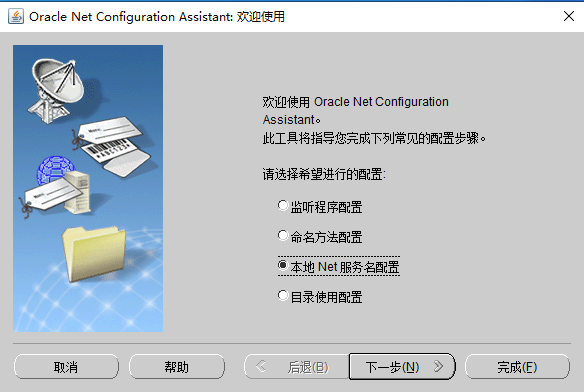
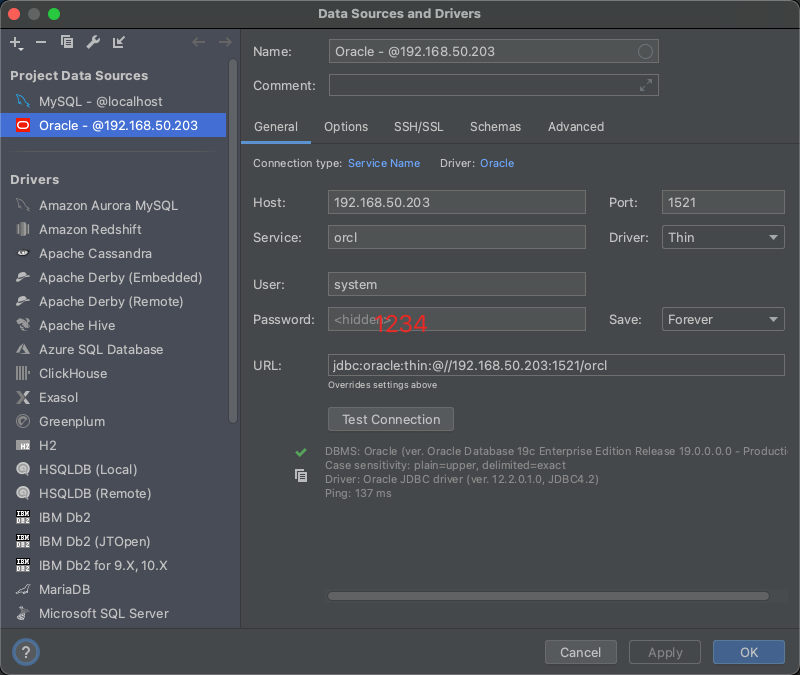

# Oracle 

## 一、centOS 8 安装 LINUX.X64_193000_db_home

### **1. 安装 Oracle Database 19c CentOS 8 系统依赖包**

由于数据库服务器采用静默方式安装，为避免出错，在安装数据库之前，需要把 Oracle 程序依赖包安装至系统。依赖包同样采用 dnf 方式安装：

```shell
sudo dnf install -y bc \
  binutils \
  elfutils-libelf \
  elfutils-libelf-devel \
  fontconfig-devel \
  glibc \
  glibc-devel \
  ksh \
  libaio \
  libaio-devel \
  libXrender \
  libXrender-devel \
  libX11 \
  libXau \
  libXi \
  libXtst \
  libgcc \
  librdmacm-devel \
  libstdc++ \
  libstdc++-devel \
  libxcb \
  make \
  net-tools \
  smartmontools \
  sysstat \
  unzip \
  libnsl \
  libnsl2
```

### **2. 创建 Oracle 19c 使用的用户和属组**

用以下命令创建 Oracle 19c 需要使用的用户及属组：

```shell
sudo groupadd -g 6001 oinstall
sudo groupadd -g 6002 dba
sudo groupadd -g 6003 oper
sudo groupadd -g 6004 backupdba
sudo groupadd -g 6005 dgdba
sudo groupadd -g 6006 kmdba
sudo groupadd -g 6007 racdba
sudo useradd -u 6001 -g oinstall -G dba,oper,backupdba,dgdba,kmdba,racdba oracle
sudo echo "oracle" | sudo passwd oracle --stdin
```

此时，就创建了一个用户 oracle，并设置其密码为”oracle”。

### **3. 设置 Oracle 用户的安全权限**

在”/etc/security/limits.d”目录中创建一个 oracle 用户的权限文件”30-oracle.conf”，文件内容如下：

```shell
oracle   soft   nofile    1024
oracle   hard   nofile    65536
oracle   soft   nproc    16384
oracle   hard   nproc    16384
oracle   soft   stack    10240
oracle   hard   stack    32768
oracle   hard   memlock    134217728
oracle   soft   memlock    134217728
```

### **4. 调整 CentOS 8系统参数**

根据 Oracle 19c 的要求，创建 Oracle 参数文件”/etc/sysctl.d/98-oracle.conf”，内容如下：

```shell
fs.file-max = 6815744
kernel.sem = 250 32000 100 128
kernel.shmmni = 4096
kernel.shmall = 1073741824
kernel.shmmax = 4398046511104
kernel.panic_on_oops = 1
net.core.rmem_default = 262144
net.core.rmem_max = 4194304
net.core.wmem_default = 262144
net.core.wmem_max = 1048576
net.ipv4.conf.all.rp_filter = 2
net.ipv4.conf.default.rp_filter = 2
fs.aio-max-nr = 1048576
net.ipv4.ip_local_port_range = 9000 65500
```

文件创建成功后，使用如下命令让配置立即生效：

```shell
sysctl -p
```

### **5. 配置 SELinux 以及放行防火墙端口**

使用如下命令将 SELinux 设置为”permissive”模式，并放行 Oracle 侦听的 1521 端口：

```shell
sudo sed -i 's/^SELINUX=.*/SELINUX=permissive/g' /etc/sysconfig/selinux
sudo setenforce permissive
sudo firewall-cmd --permanent --add-port=1521/tcp
sudo firewall-cmd --reload
```

### **6. 创建 Oracle 19c 的工作目录以及数据库目录**

为了成功安装 Oracle 数据库，需要创建如下目录并更改目录属主权限：

```shell
sudo mkdir -p /mnt/app/oracle/product/19.3.0/dbhome_1
sudo mkdir -p /mnt/oradata
sudo chown -R oracle:oinstall /mnt 
sudo chmod -R 775 /mnt
```

我们这里创建了两个目录，其中”/mnt/app″用于存放数据库管理系统软件，而”/mnt/oradata″用于存放数据库文件。

### **7. 配置 Oracle 用户环境变量**

切换到 oracle 用户，变修改该用户的环境变量文件”.bash_profile”：

```shell
su - oracle
vi ~/.bash_profile
```

环境变量内容如下：

```shell
# Oracle Settings
export TMP=/tmp
export TMPDIR=$TMP

export ORACLE_HOSTNAME=oracle-db-19c
export ORACLE_UNQNAME=oradb
export ORACLE_BASE=/mnt/app/oracle
export ORACLE_HOME=$ORACLE_BASE/product/19.3.0/dbhome_1
export ORA_INVENTORY=/mnt/app/oraInventory
export ORACLE_SID=oradb
export PDB_NAME=pdb
export DATA_DIR=/mnt/oradata
export PATH=$ORACLE_HOME/bin:$PATH
export LD_LIBRARY_PATH=$ORACLE_HOME/lib:/lib:/usr/lib
export CLASSPATH=$ORACLE_HOME/jlib:$ORACLE_HOME/rdbms/jlib
```

注意环境变量的设置已经包含了 Oracle 数据库的各种基本参数设置，包括”ORACLE_BASE”和”ORACLE_HOME”等，这些设置与之前创建的目录相对应，并且设置了”ORACLE_SID”为”oradb”。

环境变量设置完成后，使用如下命令让配置生效：

```shell
source ~/.bash_profile
```

### **8. 静默安装 Oracle Database 19c 数据库管理系统**

首先从 Oracle 官方网站下载 Oracle Database 19c 的 Linux 版压缩包，下载虽然是免费的，但是需要一个 Oracle 用户帐号，反正注册起来也不麻烦，不妨注册一个，一直有用。

现在， 我们已经将压缩包下载，并放置在 oracle 用户的家目录，然后解压缩安装包：

```shell
# 注意一定要解压到 oracle_home 目录下，不然后续无法执行 lsnrctl dbca 等命令
unzip LINUX.X64_193000_db_home.zip -d $ORACLE_HOME
```

Oracle Database 19c 的安装工具对于识别 CentOS 8 系统存在一些问题，但是我们可以通过设置环境变量加以解决：

```shell
export CV_ASSUME_DISTID=RHEL8.0
```

最后，进入”ORACLE_HOME”目录进入静默安装：

```shell
cd $ORACLE_HOME
./runInstaller -ignorePrereq -waitforcompletion -silent \
 oracle.install.option=INSTALL_DB_SWONLY \
 ORACLE_HOSTNAME=${ORACLE_HOSTNAME} \
 UNIX_GROUP_NAME=oinstall \
 INVENTORY_LOCATION=${ORA_INVENTORY} \
 ORACLE_HOME=${ORACLE_HOME} \
 ORACLE_BASE=${ORACLE_BASE} \
 oracle.install.db.InstallEdition=EE \
 oracle.install.db.OSDBA_GROUP=dba \
 oracle.install.db.OSBACKUPDBA_GROUP=backupdba \
 oracle.install.db.OSDGDBA_GROUP=dgdba \
 oracle.install.db.OSKMDBA_GROUP=kmdba \
 oracle.install.db.OSRACDBA_GROUP=racdba \
 SECURITY_UPDATES_VIA_MYORACLESUPPORT=false \
 DECLINE_SECURITY_UPDATES=true
 
```

命令执行完之后，就进入漫长的等待，直到出现如下提示：

```shell
You can find the log of this install session at:
 /tmp/InstallActions2021-10-11_07-05-48PM/installActions2021-10-11_07-05-48PM.log


As a root user, execute the following script(s):
	1. /mnt/app/oraInventory/orainstRoot.sh
	2. /mnt/installer/root.sh

Execute /mnt/app/oraInventory/orainstRoot.sh on the following nodes:
[localhost]
Execute /mnt/installer/root.sh on the following nodes:
[localhost]


Successfully Setup Software with warning(s).
Moved the install session logs to:
 /mnt/app/oraInventory/logs/InstallActions2021-10-11_07-05-48PM
 
 # 事实上静默安装同可视化安装达到的效果一致，熟悉响应文件或是安装器的同学可以尝试。看到安装成功的信息后，就根据提示内容切换到 root 用户执行两个初始化脚本，生成数据字典：
 # 切换到 root 用户
 [oracle@localhost installer]$ su root
 
 [root@localhost installer]# /mnt/app/oraInventory/orainstRoot.sh
Changing permissions of /mnt/app/oraInventory.
Adding read,write permissions for group.
Removing read,write,execute permissions for world.

Changing groupname of /mnt/app/oraInventory to oinstall.
The execution of the script is complete.
[root@localhost installer]# /mnt/installer/root.sh
Check /mnt/installer/install/root_localhost.localdomain_2021-10-11_19-09-17-118541565.log for the output of root script
```

### **9. 使用 dbca 工具静默创建数据库**

创建数据库前首先启动侦听，以便数据库自动注册：

```shell
# 不建议现在启动，因为会启动失败
[root@localhost dbhome_1]# lsnrctl start

LSNRCTL for Linux: Version 19.0.0.0.0 - Production on 11-OCT-2021 19:46:10

Copyright (c) 1991, 2019, Oracle.  All rights reserved.

Starting /mnt/app/oracle/product/19.3.0/dbhome_1/bin/tnslsnr: please wait...

TNSLSNR for Linux: Version 19.0.0.0.0 - Production
NL-00280: error creating log stream /mnt/app/oracle/product/19.3.0/dbhome_1/network/log/listener.log
 NL-00278: cannot open log file
  SNL-00016: snlfohd: error opening file
   Linux Error: 13: Permission denied

Listener failed to start. See the error message(s) above...

[root@localhost dbhome_1]#
```

之后，就使用如下命令通过 dbca 工具静默创建数据库：

```shell
[oracle@localhost dbhome_1]$ dbca -silent -createDatabase \
>  -templateName General_Purpose.dbc \
>  -gdbname ${ORACLE_SID} -sid  ${ORACLE_SID} \
>  -responseFile NO_VALUE \
>  -characterSet AL32UTF8 \
>  -sysPassword 1qazXSW@ \
>  -systemPassword 1qazXSW@ \
>  -createAsContainerDatabase true \
>  -numberOfPDBs 1 \
>  -pdbName ${PDB_NAME} \
>  -pdbAdminPassword 1qazXSW@ \
>  -databaseType MULTIPURPOSE \
>  -automaticMemoryManagement false \
>  -totalMemory 800 \
>  -storageType FS \
>  -datafileDestination "${DATA_DIR}" \
>  -redoLogFileSize 50 \
>  -emConfiguration NONE \
>  -ignorePreReqs
```


之后同样是漫长的等待，命令的意思就是指定创建数据库的各种选项，可以与可视化安装时的各个步骤相对应。

数据库创建成功后，会看到如下信息：

```shell

Prepare for db operation
8% complete
Copying database files
31% complete
Creating and starting Oracle instance
32% complete
36% complete
40% complete
43% complete
46% complete
Completing Database Creation
51% complete
53% complete
54% complete
Creating Pluggable Databases
58% complete
77% complete
Executing Post Configuration Actions
100% complete
Database creation complete. For details check the logfiles at:
 /mnt/app/oracle/cfgtoollogs/dbca/oradb.
Database Information:
Global Database Name:oradb
System Identifier(SID):oradb
Look at the log file "/mnt/app/oracle/cfgtoollogs/dbca/oradb/oradb.log" for further details.
[oracle@localhost dbhome_1]$
```

至此，一个名为”oradb”的数据库就创建完成了。

登录到数据库，查看数据库实例状态，并查看一下侦听状态，确保数据库服务器可用：

```shell
[oracle@localhost ~]$ sqlplus / as sysdba

SQL*Plus: Release 19.0.0.0.0 - Production on Mon Oct 11 20:15:25 2021
Version 19.3.0.0.0

Copyright (c) 1982, 2019, Oracle.  All rights reserved.


Connected to:
Oracle Database 19c Enterprise Edition Release 19.0.0.0.0 - Production
Version 19.3.0.0.0

SQL> select status from v$instance;

STATUS
------------
OPEN

# 启动数据库
SQL>startup

# 修改用户密码
alter user system identified by system;
alter user sys identified by sys;

SQL> exit
Disconnected from Oracle Database 19c Enterprise Edition Release 19.0.0.0.0 - Production
Version 19.3.0.0.0
[oracle@localhost ~]$
```


### 10. 查看数据库服务器及侦听状态

```shell
[oracle@localhost ~]$ lsnrctl status

LSNRCTL for Linux: Version 19.0.0.0.0 - Production on 11-OCT-2021 20:16:17

Copyright (c) 1991, 2019, Oracle.  All rights reserved.

Connecting to (ADDRESS=(PROTOCOL=tcp)(HOST=)(PORT=1521))
TNS-12541: TNS:no listener
 TNS-12560: TNS:protocol adapter error   # 状态异常
  TNS-00511: No listener
   Linux Error: 111: Connection refused
[oracle@localhost ~]$


[oracle@localhost ~]$ lsnrctl -h

LSNRCTL for Linux: Version 19.0.0.0.0 - Production on 11-OCT-2021 20:44:19

Copyright (c) 1991, 2019, Oracle.  All rights reserved.

Welcome to LSNRCTL, type "help" for information.

LSNRCTL> help
The following operations are available
An asterisk (*) denotes a modifier or extended command:

start           stop            status          services
servacls        version         reload          save_config
trace           spawn           quit            exit
set*            show*

# 先关闭
LSNRCTL> stop
Connecting to (ADDRESS=(PROTOCOL=tcp)(HOST=)(PORT=1521))
TNS-12541: TNS:no listener
 TNS-12560: TNS:protocol adapter error
  TNS-00511: No listener
   Linux Error: 111: Connection refused
   
# 再启动
LSNRCTL> start
Starting /mnt/app/oracle/product/19.3.0/dbhome_1/bin/tnslsnr: please wait...

TNSLSNR for Linux: Version 19.0.0.0.0 - Production
Log messages written to /mnt/app/oracle/diag/tnslsnr/localhost/listener/alert/log.xml
Listening on: (DESCRIPTION=(ADDRESS=(PROTOCOL=tcp)(HOST=localhost)(PORT=1521)))

Connecting to (ADDRESS=(PROTOCOL=tcp)(HOST=)(PORT=1521))
STATUS of the LISTENER
------------------------
Alias                     LISTENER
Version                   TNSLSNR for Linux: Version 19.0.0.0.0 - Production
Start Date                11-OCT-2021 20:45:20
Uptime                    0 days 0 hr. 0 min. 0 sec
Trace Level               off
Security                  ON: Local OS Authentication
SNMP                      OFF
Listener Log File         /mnt/app/oracle/diag/tnslsnr/localhost/listener/alert/log.xml
Listening Endpoints Summary...
  (DESCRIPTION=(ADDRESS=(PROTOCOL=tcp)(HOST=localhost)(PORT=1521)))
The listener supports no services
The command completed successfully

# 再查看状态（已启动成功）
LSNRCTL> status
Connecting to (ADDRESS=(PROTOCOL=tcp)(HOST=)(PORT=1521))
STATUS of the LISTENER
------------------------
Alias                     LISTENER
Version                   TNSLSNR for Linux: Version 19.0.0.0.0 - Production
Start Date                11-OCT-2021 20:45:20
Uptime                    0 days 0 hr. 0 min. 6 sec
Trace Level               off
Security                  ON: Local OS Authentication
SNMP                      OFF
Listener Log File         /mnt/app/oracle/diag/tnslsnr/localhost/listener/alert/log.xml
Listening Endpoints Summary...
  (DESCRIPTION=(ADDRESS=(PROTOCOL=tcp)(HOST=localhost)(PORT=1521)))
The listener supports no services
The command completed successfully
LSNRCTL>
```

### 11. 使用客户端工具连接


### 12. 重启系统之后，如何启动 oracle

```shell
[oracle@localhost ~]$ lsnrctl -h

LSNRCTL> help
The following operations are available
An asterisk (*) denotes a modifier or extended command:

start           stop            status          services
servacls        version         reload          save_config
trace           spawn           quit            exit
set*            show*

LSNRCTL> start
Starting /mnt/app/oracle/product/19.3.0/dbhome_1/bin/tnslsnr: please wait...

TNSLSNR for Linux: Version 19.0.0.0.0 - Production
Log messages written to /mnt/app/oracle/diag/tnslsnr/localhost/listener/alert/log.xml
Listening on: (DESCRIPTION=(ADDRESS=(PROTOCOL=tcp)(HOST=localhost)(PORT=1521)))

Connecting to (ADDRESS=(PROTOCOL=tcp)(HOST=)(PORT=1521))
STATUS of the LISTENER
------------------------
Alias                     LISTENER
Version                   TNSLSNR for Linux: Version 19.0.0.0.0 - Production
Start Date                14-OCT-2021 17:42:17
Uptime                    0 days 0 hr. 0 min. 1 sec
Trace Level               off
Security                  ON: Local OS Authentication
SNMP                      OFF
Listener Log File         /mnt/app/oracle/diag/tnslsnr/localhost/listener/alert/log.xml
Listening Endpoints Summary...
  (DESCRIPTION=(ADDRESS=(PROTOCOL=tcp)(HOST=localhost)(PORT=1521)))
The listener supports no services
The command completed successfully
LSNRCTL> exit
[oracle@localhost ~]$ sqlplus / as sysdba

SQL*Plus: Release 19.0.0.0.0 - Production on Thu Oct 14 17:43:03 2021
Version 19.3.0.0.0

Copyright (c) 1982, 2019, Oracle.  All rights reserved.


Connected to an idle instance.

SQL> SQL> startup
ORACLE instance started.

Total System Global Area  629145352 bytes
Fixed Size		    9137928 bytes
Variable Size		  285212672 bytes
Database Buffers	  331350016 bytes
Redo Buffers		    3444736 bytes
Database mounted.
Database opened.
```

## 二、windows

### 1、安装

### 2、无法使用客户端连接到oracle server

解决方案：重置`oracle`监听程序





配置成功，口令是安装时指定的口令，这里是1234


配置完成之后要重启监听服务

### （1）使用sqlplus测试远程连接

```shell
sqlplus system/OROCHi0208@192.168.1.200:1521/orcl
```


### （2）datagrip 连接oracle




显示连接成功

## 三、oracle 19c 启用 Scott 账号

需要执行sql


```sql
alter user scott identified by tiger;
alter user scott account unlock ;
```

## 四、mac安装sqlPlus

> 下载地址：https://www.oracle.com/database/technologies/instant-client/macos-intel-x86-downloads.html
>
> 参考：https://www.jianshu.com/p/201b9c54e96e

下载这三个压缩包到目录


```shell
# install on MacOS
brew tap InstantClientTap/instantclient
cp ~/Download/instantclient*.zip /usr/local/Homebrew/Library/Taps/instantclienttap/homebrew-instantclient
brew install instantclient-basic
brew install instantclient-sqlplus
brew install instantclient-tools

# 防止乱码
echo export NLS_LANG="AMERICAN_AMERICA.UTF8" >> ~/.zshrc

# 连接数据库
sqlpLUS system/OROCHi0208@192.168.1.200:1521/orcl
# 可以连接上，但是上下键会乱码，需要安装

brew install rlwrap

# 这样就不会再乱码了
rlwrap sqlpLUS system/OROCHi0208@192.168.1.200:1521/orcl

# 为其取一个别名
 cat <<- EOF >> ~/.zshrc
 alias sqlplus='rlwrap sqlplus system/OROCHi0208@192.168.1.200:1521/orcl'
 EOF

# 一键连接
➜  ~ sqlplus

SQL*Plus: Release 19.0.0.0.0 - Production on Thu May 5 11:30:27 2022
Version 19.8.0.0.0

Copyright (c) 1982, 2020, Oracle.  All rights reserved.

Last Successful login time: Thu May 05 2022 11:25:42 +08:00

Connected to:
Oracle Database 19c Standard Edition 2 Release 19.0.0.0.0 - Production
Version 19.3.0.0.0

SQL>
```

## 五、创建用户

```sql
SQL> create user C#luo  identified by 1234;
create user C#luo  identified by 1234
            *
ERROR at line 1:
ORA-65096: invalid common user or role name


```

### 1、错误原因

> 原文链接：https://blog.csdn.net/oscar999/article/details/118012989

Oracle 12C 提出了多租户环境（Multitenant Environment）和容器（Container）的概念, 区分了两个层级：

CDB ， Container Database, 数据库容器
PDB, Pluggable Database, 可插拔数据库
关系如下图：


在数据库中建立的用户对应以上两个层级：

COMMOM USERS ， 普通用户， 一般建立在CDB层， 用户名需要以 C#或C##开头；
LOCAL USERS , 本地用户， 仅建立在PBD层，建立的时候需要指定容器
从上面的错误 “invalid common user or role name” 来看， COMMOM USERS 需要以 C#或C##开头， 所有这里的用户名不合规范。

那如何查看当前环境的所在的容器呢？ 可以通过以下命令查看：
```sql
SQL> select sys_context ('USERENV','CON_NAME') from dual;

SYS_CONTEXT('USERENV','CON_NAME')
--------------------------------------------------------------------------------
CDB$ROOT
```

### 2、创建用户

```sql
SQL> create user C##luo  identified by 1234;

User created.

# 授权
SQL> grant dba to c##luo;

Grant succeeded.
# 注意，此操作要求当前用户以 sysdba 权限登录才能执行
# 否则会报无权限
grant execute on dbms_stats to c##luo;
grant select on V_$STATNAME to c##luo;
grant select on V_$MYSTAT   to c##luo;
grant select on V_$LATCH    to c##luo;
grant select on V_$TIMER    to c##luo;
# 连接成功
SQL> conn c##luo/1234@192.168.1.200:1521/orcl
Connected.
```

### 3、插入数据时，日期格式不正确

```sql
C##LUO> INSERT INTO EMP VALUES (7369, 'SMITH',  'CLERK',     7902,
        TO_DATE('17-DEC-1980', 'DD-MON-YYYY'),  800, NULL, 20)
[2022-05-05 13:45:00] [22008][1843] ORA-01843: 无效的月份
[2022-05-05 13:45:00] Position: 67

# 问题出现的根本原因：数据库安装时的语言与你要插入的数据的语言不一致
# 使用如下命令查看：
select * from V$PARAMETER where name = 'nls_date_language';
# 修改语言： 
alter session  set nls_date_language ='AMERICAN';
# 数据库的语言是简体中文(所以日期也是中文日期)，但是插入的日期是英文日期，所以提示月份无效。

# 插入成功
C##LUO> INSERT INTO EMP VALUES (7369, 'SMITH',  'CLERK',     7902,
        TO_DATE('17-DEC-1980', 'DD-MON-YYYY'),  800, NULL, 20)
[2022-05-05 13:49:02] 1 row affected in 1 ms
```

### 4、解除其他会话的表锁，对资源的占用

> https://blog.csdn.net/u014704612/article/details/122472826


```sql
# 资源被占用
C##LUO> alter table emp add constraint emp_pk primary key(empno)
[2022-05-05 14:01:47] [61000][54] ORA-00054: 资源正忙, 但指定以 NOWAIT 方式获取资源, 或者超时失效


```

#### （1）原因

一般在用户修改记录之前，[悲观锁](https://so.csdn.net/so/search?q=悲观锁&spm=1001.2101.3001.7020)就会发生作用，比如更新语句：

select ..for update

执行这条命令之后，oracle 将会对返回集中的数据建立行级封锁，以防止其他用户修改这些记录。

这时如果对这张表进行 ddl 操作将就会报 ORA-00054 错误。

一张表如果加了表级锁，那么就不允许对该表进行任何的 ddl 操作，否则也会报 ora-00054 错误。


#### （2）解决方案

找出哪个会话锁住了哪张表：

```sql
# session_id 为会话 ID。object_name 表名。
# 找出引发锁的会话：
C##LUO> select l.session_id,o.owner,o.object_name
        from v$locked_object l,dba_objects o
        where l.object_id=o.object_id
[2022-05-05 14:02:45] 1 row retrieved starting from 1 in 42 ms (execution: 32 ms, fetching: 10 ms)

# 其中的 serial# 是我们需要用到的会话序列号
C##LUO> select s.username,s.sid,s.serial#,s.logon_time
        from  v$locked_object l,v$session s
        where l.session_id=s.sid
        order by s.logon_time
[2022-05-05 14:03:13] 1 row retrieved starting from 1 in 48 ms (execution: 15 ms, fetching: 33 ms)
```

#### （3 ）杀掉会话

命令格式为：

```sql
alter system kill session 'sid,serial#'
```

批量解锁语句：

```sql
DECLARE CURSOR mycur IS 
  SELECT B.SID,B.SERIAL# FROM V$LOCKED_OBJECT A,V$SESSION B 
    WHERE A.SESSION_ID = B.SID GROUP BY B.SID,B.SERIAL#;


BEGION
  FOR cur IN mycur
   loop
   EXECUTE IMMEDIATE ('ALTER SYSTEM KILL SESSION '''||cur.sid||','||cur.serial#||''' ');
   end loop;
END;
```

#### （4）增加虚拟列

> 参考：《Oracle编程艺术》p201
>
> 虚拟列不会带来任何存储开销。这一列的值不会计算并存储在硬盘上。相反只是在从数据库获取数据时才会进行计算。
>
> 但是要注意：计算散列或总和是`cpu密集型`操作，计算代价很昂贵

```sql
alter table dept
add hash as (
    ora_hash(DNAME||'/'||LOC)
    )
```

## 六、阻塞

### 1、insert阻塞

#### （1）并发插入相同主键或唯一字段是产生的阻塞

> 只要使用的是序列，`sys_guid()`函数生成的主键id，并发插入情况下就不会有本小节提出的情况。
>
> 参考：《Oracle编程艺术》p203
>
> 为了能成功编译执行触发器，需要给用户授予`dbms_lock`包的执行权限。
>
> ```sql
> grant execute on dbms_lock to c##luo;
> ```

```sql
create table demo ( x int primary key );

create or replace trigger demo_bifer
  before insert on demo
  for each row
  declare
      l_lock_id   number;
      resource_busy   exception;
      pragma exception_init( resource_busy, -54 );
  begin
  # 通过插入的id（x），计算一个散列值
      l_lock_id :=
            dbms_utility.get_hash_value( to_char( :new.x ), 0, 1024 );
  # 把散列值作为锁id，来请求一个锁
  # 散列值的范围在 0~1024 之间，避免了把不同的字符串散列为同一个散列值 而 人为导致的 资源忙
      if ( dbms_lock.request
               (  id                => l_lock_id,
                  lockmode          => dbms_lock.x_mode,
                  timeout           => 0,
                  release_on_commit => TRUE ) not in (0,4) )
      then
      # 锁定失败，抛出异常
      # 说明，并发插入时，主键id重复了。
      # 不用本方法，一般情况下，会话1插入id=1的记录，会话2插入id=1的记录
      # 由于 会话1 还没有提交，所以，会话2会一直阻塞。
      # 但是引入触发器之后，插入之前要先获取锁，会话1（id=1）获取到锁之后，插入了，但是未提交
      # 此时会话2 （id=1） 尝试获取锁，发现锁被会话1占有了，所以会话2，就收到一个资源忙的异常。
      # 会话2 避免了长时间的阻塞
      # 而当 会话1 commit 之后，相关的锁会自动的释放
          raise resource_busy;
      end if;
      # 锁定成功，不用做任何事情
  end;
```

#### （2）测试并发插入相同id主键的记录

会话1

```sql
C##LUO> insert into demo(x) values (1)
[2022-05-05 17:06:51] 1 row affected in 1 ms
```

会话2

```sql
C##LUO> insert into demo(x) values (1)
[2022-05-05 17:06:56] [61000][54]
[2022-05-05 17:06:56] 	ORA-00054: 资源正忙, 但指定以 NOWAIT 方式获取资源, 或者超时失效
[2022-05-05 17:06:56] 	ORA-06512: 在 "C##LUO.DEMO_BIFER", line 14
[2022-05-05 17:06:56] 	ORA-04088: 触发器 'C##LUO.DEMO_BIFER' 执行过程中出错
[2022-05-05 17:06:56] Position: 0
```

可见，会话2没有陷入阻塞，而是立即抛出一个资源繁忙的异常

会话1提交

```sql
C##LUO> commit
[2022-05-05 17:08:28] completed in 1 ms
```

### 2、merge update delete 阻塞

可以使用`select for update nowait`查询来验证行未被修改

## 七、死锁

### 1、导致死锁的原因

#### （1）外键未加索引

#### （2）表上的位图索引遭并发更新

### 2、oracle在修改父表之后会对子表加一个全表锁

#### （1）更新了`父表`的主键

```sql
update dept s
set id = 1,name = '新的名字'
where id = 1
```

`emp`表中持有一个`dept`表的外键，但是没有索引。

即使`dept`表的`id`没有改变，也会导致子表`emp`被锁定

> 解决方法：1、在`update`语句的`set`中不能带`id`
>
> ​				  2、尽量为所有的外键都添加索引

#### （2）删除了`父表`中的一行

删除`dept`表中的一行记录时，锁住子表`emp`，可以避免在此次删除期间，对`emp`表的更新。

如果在删除操作之前，`emp`表有事务操作，那么删除操作就要相应的等待之前的`emp`表的事务操作完成才行

这时就有可能发生死锁、阻塞。

> 锁定整张子表`emp`，导致数据库的性能大幅下降，而且出现死锁的可能性增加了

#### （3）向`父表`中做合并

### 3、DML锁

```sql
-- initcap 函数：将每个单词中的第一个字符设置为大写,其余的设置为小写
update DEPT
set DNAME = initcap(DNAME);

select username,
       v$lock.SID,
       trunc(ID1 / power(2, 16))                  rbs,
       bitand(ID1, to_number('ffff', 'xxxx')) + 0 slot,
       id2                                        seq,
       LMODE,
       REQUEST
from V$lock,
     V$SESSION
where V$LOCK.type = 'TX'
  and v$lock.sid = V$SESSION.SID
  and V$SESSION.USERNAME = USER;
```

> `V$lock`表应该算一个队列表，而不是一个锁表
>
> `update dept`更新了4行数据，但是通过查询`V$lock`，只得到一列数据
>
> `oracle`不会在任何地方存储行级锁的列表，也就是说，不会为每一个锁定的行维护一个列表
>
> 要查看某一行是否被锁定，必须找到这一行
>
> 《oracle编程艺术》p212
>
> `rbs`,`slot`,`seq`的值与`v$transaction`表的信息匹配。这就是我的`事务id`

查询结果

| USERNAME | SID  | RBS  | SLOT | SEQ  | LMODE            | REQUEST                                    |
| :------- | :--- | :--- | :--- | :--- | :--------------- | :----------------------------------------- |
| C##LUO   | 391  | 1    | 32   | 746  | 6 （持有排他锁） | 0 （没有发出的请求，意味着，我拥有这个锁） |

#### （1）新建会话中执行

```sql
update emp set ename = upper(ename);
-- 会话被阻塞
update dept set deptno = DEPTNO-10
```

再次查询

```sql
    select username,
           v$lock.SID,
           trunc(ID1 / power(2, 16))                  rbs,
           bitand(ID1, to_number('ffff', 'xxxx')) + 0 slot,
           id2                                        seq,
           LMODE,
           REQUEST
    from v$lock,
         V$SESSION
    where V$LOCK.type = 'TX'
      and v$lock.sid = V$SESSION.SID
      and V$SESSION.USERNAME = USER;
```

查询结果

| USERNAME | SID  | RBS  | SLOT | SEQ  | LMODE             | REQUEST                  |
| :------- | :--- | :--- | :--- | :--- | :---------------- | :----------------------- |
| C##LUO   | 387  | 7    | 25   | 777  | 6  （持有排他锁） | 0                        |
| C##LUO   | 387  | 1    | 32   | 746  | 0                 | 6 （请求获得一个排他锁） |
| C##LUO   | 391  | 1    | 32   | 746  | 6 （持有排他锁）  | 0                        |

> 其中：`SID`一致的为同一个操作。
>
> 可以看到在操作`sid=387`中，第一行已经持有了一个`排他锁`，第二行还在请求一个`排他锁`，其事务id为`rbs/slot/seq=1/32/746`
>
> 第二行请求的排他锁，现在正在被`第三行 sid=391`的操作持有
>
> 也就是说：`sid=391`的事务阻塞了`sid=387`的事务

```sql
 
 select xidusn,xidslot ,xidsqn from V$TRANSACTION;
```

查询结果

| XIDUSN | XIDSLOT | XIDSQN |
| :----- | :------ | :----- |
| 1      | 32      | 746    |
| 7      | 25      | 777    |

